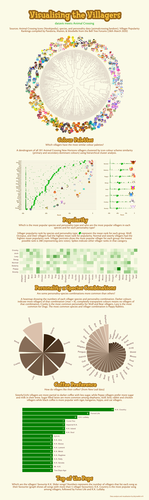

```{r setup, include = FALSE, echo = FALSE}
library(metathis)

meta() %>%
  meta_description(
    "Which animal crossing villagers look most alike? Which villagers are the most popular? What personality types are most common for each species and how do they like their coffee?"
  ) %>% 
  meta_viewport() %>% 
  meta_social(
    title = "Poster: Visualising the Villagers, datavis meets Animal Crossing",
    url = "https://calumwebb.co.uk/posts/2020-04-20-visualising-the-villagers/",
    image = "https://calumwebb.co.uk/posts/2020-04-20-visualising-the-villagers/ac_datavis_plot_preview.png",
    image_alt = "A dendrogram of Animal Crossing characters based on their colour scheme.",
    og_type = "website",
    og_author = "Calum Webb",
    twitter_card_type = "summary_large_image",
    twitter_creator = "@cjrwebb"
  )


```

As many have pointed out, the release of the anticipated Animal Crossing: New Horizons coincided with with the COVID-19 pandemic. Like many others I've been enjoying the experience of building an island paradise for my animal villagers, but I had to find something to do while waiting for my money rock to respawn, my fruits to regrow, and my bridges to be built. 

Over the last week I've been scraping data from various Wikis and fan sources to put together a set of visualisations about the animals that inhabit the many digital islands. You can see the result below ([extra large image available here.](http://calumwebb.uk/ac_datavis_plot.png)) The dendrogram in particular made use of a very interesting package in development called `cuttlefish`. I'll try to write some posts in the near future showing how to create each of the plots in the poster.

