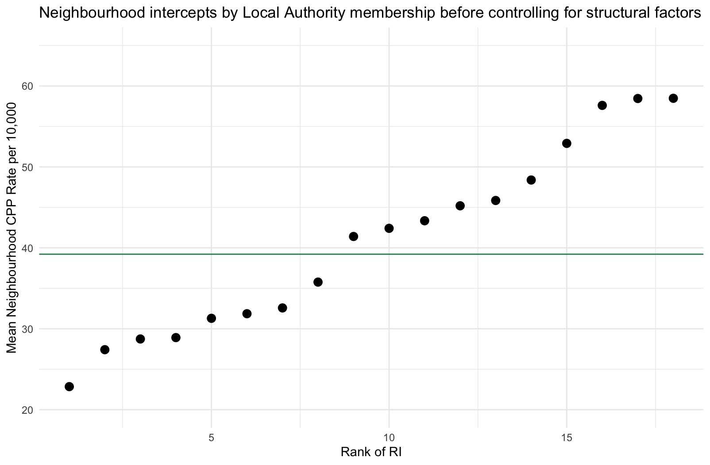
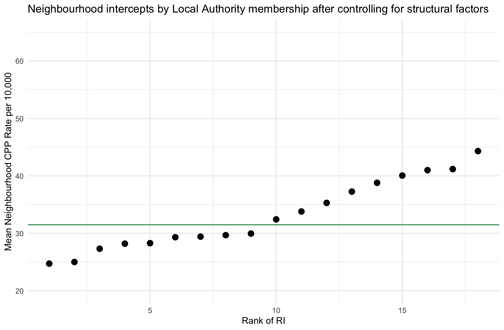
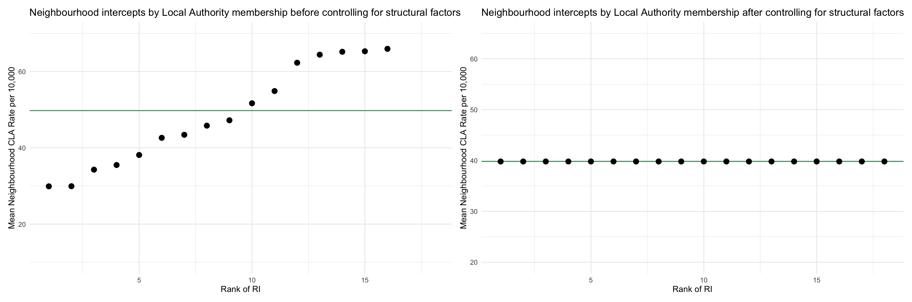

```{r setup, include = FALSE, echo = FALSE}
library(metathis)

meta() %>%
  meta_description(
    "A common myth that seems to stem from interpretations of the NAO's analysis of children's social care is that most differences between local authorities are down to local policy and practice, and that structural disadvantage explains comparatively little. Our research challenges this interpretation."
  ) %>% 
  meta_viewport() %>% 
  meta_social(
    title = "Policy and Practice or Structural Inequality? Challenging the popular interpretation of the NAO's 2019 report on pressures on children's social care.",
    url = "https://calumwebb.co.uk/posts/2020-04-26-policy-and-practice/",
    image = "https://calumwebb.co.uk/posts/2020-04-26-policy-and-practice/big-dog-little-dog.jpg",
    image_alt = "A big dog and a small dog standing next to one another",
    og_type = "website",
    og_author = "Calum Webb",
    twitter_card_type = "summary_large_image",
    twitter_creator = "@cjrwebb"
  )


```

<br>

<br>

Back in January 2019, the [National Audit Office published a report](https://www.nao.org.uk/wp-content/uploads/2019/01/Pressures-on-Childrens-Social-Care.pdf) which claimed that 44 per cent of the variance in Local Authority Child Protection Plans could be explained by 'local authority characteristics' other than deprivation (which could explain 15 per cent). Although they never claimed this, the finding was largely interpreted as evidence that local authority policy and practice was more important than structural disadvantage - by some magnitude. However, an analysis by myself and colleagues of the [Child Welfare Inequalities Project](https://www.coventry.ac.uk/research/research-directories/current-projects/2014/child-welfare-inequality-uk/) recently published in [*Children and Youth Services Review*](https://www.sciencedirect.com/science/article/pii/S0190740919312344?via%3Dihub) found that, once deprivation and other structural factors are accounted for at the neighbourhood level, differences between local authorities shrink dramatically and in some instances practically disappear. 

The [Nuffield Foundation](https://www.nuffieldfoundation.org) funded a modest extension to our original project to use some more complex modelling techniques on the data we had collected from 18 systematically chosen local authorities. These local authorities were chosen to be a representative sample of all local authorities in England, reflecting many different regions and varying levels of deprivation and ethnic makeup. For this analysis we aggregated Childen in Need, Child Protection Plan and Children Looked After records up to the Lower Super Output Area level and joined several LSOA measures onto this data. An LSOA can be thought of as a large 'neighbourhood', with around 1,500 people living in it. This contrasted to the NAO's approach which, although not made transparent, seemed to use far less granular data.

Our paper focused mostly on the magnitude of structural inequalities and the size of the Inverse Intervention Law and the Inequalities Intervention Law, but the technical appendices also contained measures of variance linked to neighbourhood local authority membership and how these changed after controlling for different structural factors. It's these measures that I want to expand upon here, because I believe they are important for the ongoing 'Policy and Practice' versus 'Structural Disadvantage' narrative that appears so frequently.

## How does local authority variation change before and after controlling for structural factors?

Using a multilevel model we were able to get a measure of local authority level variation in average neighbourhood rates of child welfare interventions. A simple explanation of this is that we calculated how much each local authority's average neighbourhood rates of intervention differed. Before we take account of any structural factors, like deprivation or ethnicity, the variation for local authorities comes out as 0.1047. This is a 'raw' amount of variation between local authorities. We can get a sense of what this means if we plot all of these variations around the mean rates.


<br>

<br>

In the plot above we can see our model's predictions for each of our 18 local authorities. The green line represents the average CPP rate across all local authorities (around 39 plans per 10,000 children). The points below the green line are local authorities with average neighbourhood rates below the average, and the points above the green line are those with higher than average rates. As you can see, there is a lot of local authority variance - some have average neighbourhood CPP rates approaching 60 children per 10,000, others have rates lower than 25 per 10,000. Surely we should rush to the local authority with much lower rates in their neighbourhoods to find out how their policies and practice differs, right? 

Before we do so, let's have a look at how our local authority variance changes once we control for structural factors. Structural factors are societal things that influence outcomes - like peoples' health or exposure to risks or advantages. They are unequally distributed across local authorities, so what might look like a difference caused by local authority membership (and something specific about how that local authority does things) might actually be representing differences in structural dis/advantage. Esssentially, if we switched around the structural inequalities in local authorities we would expect the outcomes to switch around too, regardless of the local authority we're switching from/too. The full list of structural inequalities we included in our model were:

* Neighbourhood deprivation
* Local Authority deprivation
* Ethnic density of different ethnic groups
* Unemployment levels
* Infant Mortality
* Population education levels
* Income inequality
* The 'inverse intervention law' and the 'inequalities intervention law'

The last two structural factors require some explanation. [We observed in earlier research](https://onlinelibrary.wiley.com/doi/abs/10.1111/cfs.12383) that deprivation had a different relationship with child welfare interventions depending on how widespread deprivation was in the wider area. We also found that the same thing happened with income inequality. In short, deprivation was more strongly linked to child welfare interventions in less deprived, more unequal local authorities. So what happens to our local authority variance after we control for all of these factors?

<br>


<br>

The variance linked to local authority membership shrinks, from 0.1047 to 0.0039. You can see by comparing the two plots that the differences in the mean neighbourhood CPP rate linked to LA membership reduce quite remarkably after controlling for structural factors. Yes, there are still some  differences we might want to investigate, but these were greatly exaggerated by a lack of structural awareness in our model. The difference between the local authority with the highest intercept is now less than double that of the local authority with the lowest intercept (by contrast, [children in the most deprived 10% of neighbourhoods were over 10 times as likely to be on a child protection plan than children in the least deprived 10%](https://www.coventry.ac.uk/research/research-directories/current-projects/2014/child-welfare-inequality-uk/cwip-project-outputs/))

So far this post has focused on child protection rates, but the differences are more profound when we look at other intervention measures like Children Looked After rates. Looking at the plots below, you can see how local authority variance practically disappears in average neighbourhood Children Looked After rates after we control for the same structural factors. Efforts to reduce local authority differences in Children Looked After rates are doomed to fail if they ignore structural contexts of poverty and ethnic inequality.

<br>


<br>


## Should we ignore local authority differences in policy and practice?

No. Our interpretation of the findings should not be as simplistic as that. There are clearly some differences in certain practice areas, however overstated these may be when we aggregate data up as far as the local authority level. Furthermore, the Inverse Intervention Law and the Inequalities Intervention Law demonstrate that the same structural disadvantage can result in very different child welfare inequalities depending on the local authority context, [which we explored in more detail in our published paper](https://www.sciencedirect.com/science/article/pii/S0190740919312344). 

What the evidence does suggest is that it is misleading and incorrect to claim the majority of differences in child welfare inequalities are down to local authority policy and practice.

Our research shows that what is important is the space where local authority policy and practice meets structural inequality; how well local children's services can respond to, alleviate, and challenge structural disadvantage, and the extent to which structures can support and enable positive local policies and practice. It is not a case of one or the other, structural disadvantage **or** practice and policy, but both in relation to one another. As such, the most effective changes to children's services are likely to be found in those approaches that merge effective child protection policy and practice within a structural inequalities perspective.

*This post was written by me in a personal capacity and does not necessarily represent the views of the wider CWIP team nor of our funders or employers.*


