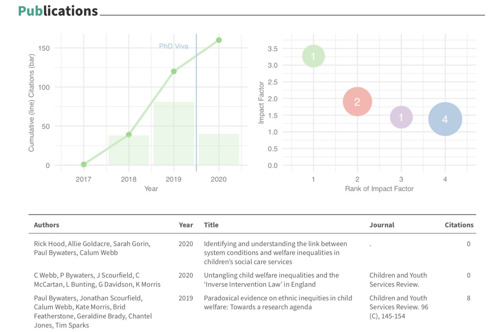
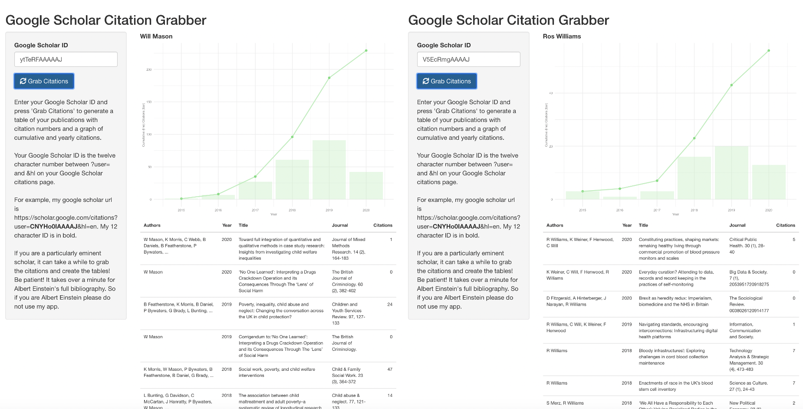

Presumably the anxiety stored somewhere in my unconscious has prompted me to spend this weekend automating the process of adding publications, citation statistics, and employment and education details to my CV, as well as implementing a system where things like teaching, reports not tracked by Google Scholar, and other miscellaneous bobbins can be stored more easily in a database, ready to be updated and sorted. 

I quite like the end result, which you can see using the Resume/CV link above. Such an innocuous project also gave me an excuse to break through the barrier of imposter syndrome with relation to 'being a non-coder just playing at coding' - whose ugly and poorly functional code would be easily torn to pieces - and make a github account. The code for the CV itself can be found [here](https://github.com/cjrwebb/cv-ac-cw). It shouldn't be too difficult to adjust to your own profile by changing the ORCID id and the Google Scholar ID.

In the process, I also created a little gadget to grab the bibliography and cumulative/yearly citation record of anyone with a Google Scholar profile. Unfortunately, Google's ToS mean that I can't host this application online (well, I can, but it doesn't work). However, you can find the source code for it [here](https://github.com/cjrwebb/cites-grabber) and a few screenshots of it in action below. You can download or clone the repository to run it on your machine, in which case you can use it to your heart's content. There is even an easter egg if you enter the Google Scholar ID of my head of department...

