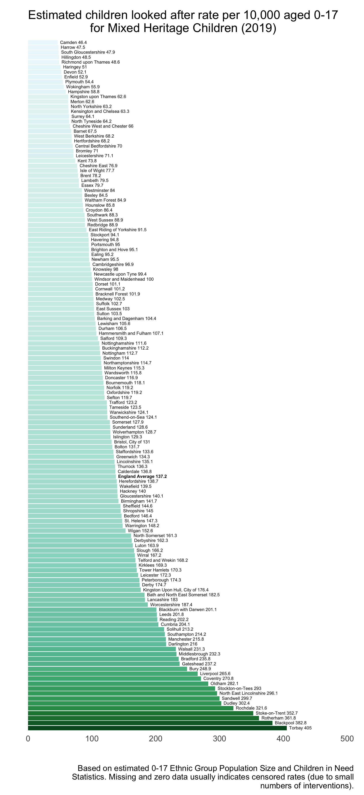

The following are some charts that are created with a function that forms a new part of the Child Welfare Inequalities Project App. You can read our research on ethnic inequalities in intervention rates [here (Open Access)](http://eprints.whiterose.ac.uk/138959/1/Paradoxical%20evidence%20on%20ethnic%20inequities%20in%20child%20welfare%20-%20AFC%202018-11-20.pdf). We have just had a new article accepted in Children and Youth Services Review that extends this work further with intersectional population models, look out for an announcement on Twitter for when this is published.

**Ranges are not set equal across all plots**

----

```{r, layout="l-body-outset", echo=FALSE}


```


*There is a strong relationship between CLA rates and deprivation for White British child populations*

----

```{r, layout = "l-body-outset", echo = FALSE}



```


*Rates for Mixed Heritage child populations are about twice as high in an average LA, and are also strongly associated with deprivation*

----


```{r, layout = "l-body-outset", echo = FALSE}

knitr::include_graphics("img/eth_plots/asian_clarates.png")

```


*Asian population rates are typically much lower, but this is not always the case. Our research has shown that this also differs quite substantially depending on whether you're looking at rates for children with Bangladeshi, Pakistani, or Indian heritage.*

----

```{r, layout = "l-body-outset", echo = FALSE}


```


*Rates for Black children are almost 4 times higher than White children, on average. But there are some huge outliers, which can be seen at the bottom of the chart; these may be outliers related to unaccompanied asylum seekers, or due to poor population projections given the census is so out of date. The rates also seem to be less strongly associated with deprivation than the White British or Mixed Heritage rates.*

----

```{r, layout = "l-body-outset", echo = FALSE}

knitr::include_graphics("img/eth_plots/mixed_clarateratios.png")

```

*The rate ratio plots show how the majority of local authorities have CLA rates for Mixed Heritage child populations that are higher than the rates for their White British population. On average, for every 1 White British child in care per 10,000 White British children we would expect to see around 2.16 Mixed Heritage children in care for every 10,000 Mixed Heritage children.* 

----

```{r, layout = "l-body-outset", echo = FALSE}


```


*The rate ratio plots show how the majority of local authorities have CLA rates for Asian populations that are lower than the rates for their White British population. On average, there are around 0.6 Asian children in care for every 10,000 Asian child population for every 1 White British child in care for every 10,000 White British children.* 

----

```{r, layout = "l-body-outset", echo = FALSE}


```


*Again, we see the strongest ethnic inequalities reflected in the Black child population, where we'd expect a CLA rate for the Black child population around 3.7 times higher than the White British rate per 10,000, on average.*