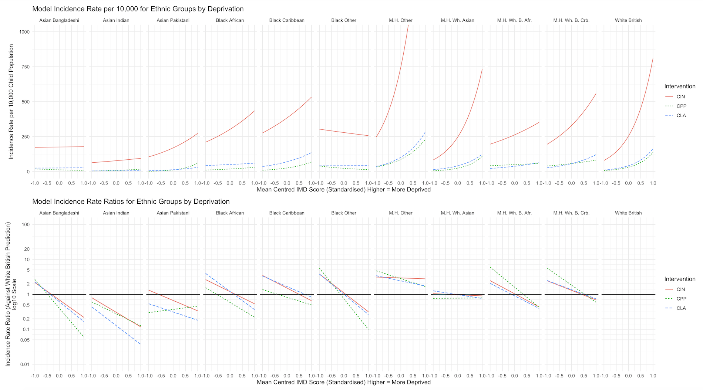

```{r setup, include = FALSE, echo = FALSE}
library(metathis)

meta() %>%
  meta_description(
    "The programming equivalent of a hair's breadth stands between the code required to analyse trends, associations, and inequalities in data and the code required to turn these into contextless, essentialist predictions."
  ) %>% 
  meta_viewport() %>% 
  meta_social(
    title = "A few lines of code separate quantitative analysis from predictive analytics",
    url = "https://calumwebb.co.uk/posts/2020-08-13-a-few-lines-of-code/",
    image = "https://calumwebb.co.uk/posts/2020-08-13-a-few-lines-of-code/img/few-lines/img1_dog.jpeg",
    image_alt = "Dog at a computer",
    og_type = "website",
    og_author = "Calum Webb",
    twitter_card_type = "summary_large_image",
    twitter_creator = "@cjrwebb"
  )


```


<font size = 2>
*An image of a dog wearing glasses, "typing" on a tablet computer.*
</font>
<br>

The programming equivalent of a hair's breadth stands between the code required to analyse trends, associations, and inequalities in data and the code required to turn these into contextless, essentialist predictions. This is, of course, something of a simplification - it may not hold true when talking about very complex machine learning models designed for producing images or sounds - but within the context of the kinds of predictive analytics used in governance, [including the algorithm that caused A-level results chaos today](https://www.theguardian.com/commentisfree/2020/aug/11/the-guardian-view-on-a-level-algorithms-failing-the-test-of-fairness), it is, essentially, true. 

Someone who has experience working with both data analysis and predictive analytics in more general programming languages can probably even name the functions required to get from one to the other. It is pretty much a given. In fact, we use predictions frequently in quantitative analysis to check whether outliers are skewing our model estimates or to visualise the impact of one variable on our outcome of interest. For example, see below how I have visualised the predicted rates of children being taken into care, classed 'in Need' under Section 17 of the Children Act 1989, or placed on a child protection plan, using a complex multilevel negative binomial regression model that controls for many other factors ([see our paper here for full details](https://www.sciencedirect.com/science/article/pii/S0190740920304370?via%3Dihub)).

<br>

```{r, layout="l-page-outset", echo =FALSE, fig.cap="Incidence rate and incidence rate ratio predictions from a set of three negative binomial models."}



```


<br>

The two different applications, despite comprising of probably more than 90 per cent of the same code, tend to be used for polar opposite purposes. Building a model based on good theory, clear hypotheses, and representative data, can tell you about the inequalities that exist in the data, and in the system that produces this data. The goal is to test and understand, usually with an aim to show something that *shouldn't be happening*. The model can tell you about how black people are disproportionately stopped and searched by the police, even after controlling for many other factors; it can tell you about how children living in the poorest ten per cent of neighbourhoods are ten times more likely to be taken into care; and it can tell you about how poverty and preferential treatment and resourcing of certain types of schools impacts young people's chances of achieving the qualifications they need to pursue their goals.

The exact same model, with a flourish of code, can be turned into a tool for predicting what we would expect given these patterns and associations - even when we know or suspect that what the system produces is fundamentally unjust. Test and understand is no longer the primary goal. Predict as best as possible is. This is, presumably what's happened with the [great A-level results adjustment debacle today](https://www.theguardian.com/education/2020/aug/13/england-a-level-downgrades-hit-pupils-from-disadvantaged-areas-hardest). At least, what happened hits all the right beats.

Instead of telling us how very fundamentally unjust structures twist and distort children's chances of having their abilities recognised, or strip them of opportunities to fully develop their skills and intellect through schooling, the use of predictive analytics and automated-decision making stands in for the unjust system and, in many cases, amplifies it. Whatever models were produced to create this disaster could have told us about how young people who live in deprived areas are unjustly robbed of the chance to fulfil their academic potential; how state-run schools are under-resourced and, as a consequence, forced to take on larger and larger class sizes. We could have even used them to level the playing field a bit for young people who face multiple disadvantages, those who we have failed in the design and resourcing of our education system.

Instead, the predictive models made sure that the system got its due, and that those with the temerity to be born into poverty or to be born as an ethnic minority - or both - suffered the full brutality of society's flaws. That those born with the good sense to be white, wealthy, and to parents with friends in high places, weren't deprived of their extra slice of pie. They ensured that the tilting of the table was simulated even when the table had been thrown off the edge of a cliff. 

A part of me is an awful person, who relishes the fact that this gaming of the system through pseudo-technomancy caught in its net the same people who often benefit from these systems and do nothing to stand against, or even actively support, the rise of automated inequality that ruins the lives of millions of poor people every year. Largely, it got them because the approach the engineers (or whatever) used appeared to be geographical, not individual; I suppose they would be the "false positives" in this case. How many false positives have already been swept up by automated job application funnels, housing application filters, child protection alarms, police facial surveillance systems, and automated criminal justice sentencing tools?

Of course, it is wrong to be happy about this because those young people have done nothing wrong. They did not deserve to have their results downgraded any more than others did, so any victory over the relentless march of 'AI' is pyrrhic at best. It is good that their parents are waking up to the dangers of predictive analytics, I only hope that many of them in privileged positions will recognise that this awful day for their families has been an awful decade for many others and that, when they get their way to reverse what has happened (which they will), we don't just go back to 'trialling' these deeply flawed technologies on the lives of those who can't fight back. 