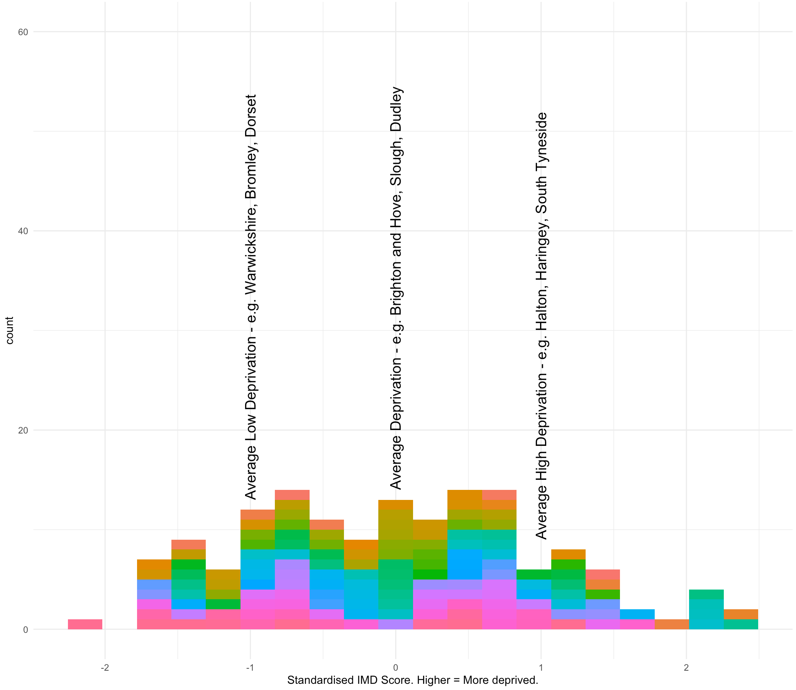
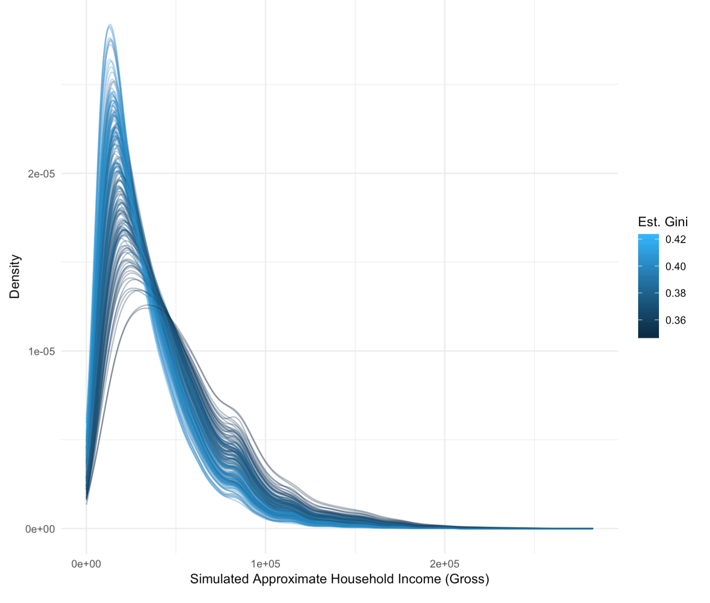

```{r setup, include = FALSE, echo = FALSE}
library(metathis)

meta() %>%
  meta_description(
    "One of the articles we had published in Children and Youth Services Review this year highlighted a new finding that the social gradient in child welfare interventions was predicted to be as much as five times stronger in local authorities with..."
  ) %>% 
  meta_viewport() %>% 
  meta_social(
    title = "Socioeconomic inequalities in child welfare interventions are five times stronger
  in unequal and affluent local authorities than they are in equal and deprived local
  authorities. Why?",
    url = "https://calumwebb.co.uk/posts/2020-08-20-inequality-cwi/",
    image = "https://calumwebb.co.uk/posts/2020-08-20-inequality-cwi/img/ineq/sweet-temptation.jpeg",
    image_alt = "Dog looking at a cake",
    og_type = "website",
    og_author = "Calum Webb",
    twitter_card_type = "summary_large_image",
    twitter_creator = "@cjrwebb"
  )


```


<br>

One of the articles we had published in [Children and Youth Services Review this year](https://www.sciencedirect.com/science/article/pii/S0190740919312344?casa_token=0tcIAK4zivEAAAAA:qO28aPQxO7alXAgrXwHSFkYHkeWvlKQGwGm1SeTUn43fp-ozvZcm_zxKtSUo_4hpS3a4GFED5Q) highlighted a new finding that the **social gradient** in child welfare interventions was predicted to be as much as **five times stronger** in local authorities with both lower-than-average deprivation and higher-than-average income inequality than it was in local authorities with higher-than-average deprivation and lower-than-average income inequality. 

This blog post explores one reason why this might be, but before discussing this, it's important to review what we mean by the social gradient, income inequality, how we measured these, and how local income inequality differs from many of the ways we think about 'inequality'. 

## The technical bit...

The [social gradient in child welfare interventions](https://onlinelibrary.wiley.com/doi/abs/10.1111/cfs.12383) is a measure of the how much intervention rates - such as children being placed on child protection registers, or being taken into care - differ according to family socioeconomic status, which is largely measured by their economic and material wellbeing. Sometimes this is measured at different levels so, for example and in our 'Untangling Child Welfare Inequalities' paper, we look at the social gradient in neighbourhood (approx 1500 people) intervention rates based on neighbourhood deprivation levels. 

In order to do this, and to standardise certain things to control for 'confounding factors' - that is, other features of neighbourhoods the effect of which we want to control for so we don't confuse it with the deprivation effect - we created a way to express the social gradient in a single number that represents how many times we would expect the rate of child welfare interventions to increase or decrease for every one standard deviation increase in deprivation, measured by the [Indices of Multiple Deprivation](https://www.gov.uk/government/statistics/english-indices-of-deprivation-2015). A one-standard deviation difference is about the same to comparing an 'average' deprivation neighbourhood with one that is ranked in the middle of the third most deprived of all neighbourhoods. 

For simplicity's sake, I refer to a minus 1 change in standard deviation as an 'average low deprivation' neighbourhood, and plus one standard deviation change as representing an 'average high deprivation' neighbourhood. It's best to not overthink it too much and just consider it us comparing low, average, and high deprivation neighbourhoods in a way that doesn't mean we focus on the extremes. See the graph below for a more simple example of local authority deprivation. We scaled up the same logic to local authorities - so an 'average high deprivation local authority' would be one with a deprivation score one standard deviation, and did the same for 'income inequality'.

<br>

<font size=2>
*Image showing distribution of LA deprivation as a standardised distribution, with examples of average low-, average high-, and average deprivation.*
</font>
<br>

What does that all mean? Well, it means if we had a social gradient of 2, we would be saying that 'we would expect the rate in a high deprivation neighbourhood to be twice (2 times) as high as the rate in an average deprivation neighbourhood'. Basically, that the rates of intervention double. The multiplied change would be the same on average for the comparison between an average neighbourhood and a low-deprivation neighbourhood. This basically means that the higher the social gradient number is, the larger socioeconomic inequalities there are in that local authority. 

So, what would we predict the social gradient to be in a local authority with high-deprivation and low-income inequality? The answer in our paper is about 1.26 for children looked after rates, and a little higher for CP plans and Children in Need rates. So, an average neighbourhood would have 1.26 times higher children looked after rates than a low-deprivation neighbourhood, and a high-deprivation neighbourhood would have 1.26 times higher children looked after rates than an average deprivation neighbourhood. This can also be read as a 26% increase. 

In a low-deprivation, high-income inequality local authority, we calculate an average social gradient of 2.29 for children looked after rates. Meaning that we would expect the rates of children looked after to more than double when we compare average deprivation to low-deprivation neighbourhoods and high-deprivation to average deprivation neighbourhood. Again, this can be read as 129% increases in rates when comparing increases in deprivation (which is where our 'five times greater' comes from). 

## The shape of local income inequality

Before we raise a few ideas that start exploring why this might be the case, it's important that we understand something crucial about what within-local area income inequality looks like. Paradoxically, more deprived local authorities tend to have greater within-area income inequality than less deprived local authorities. The image below shows the income distributions we used to calculate income inequality using the Gini coefficient, which ranges from 0 to 1 where 1 is completely unequal (one household gets 100% of the income) and 0 is completely equal (everyone gets an equal amount of income). 

<br>


<font size=2>
*Simulated gross household income distributions for local authorities in England and Wales. Income distribution estimates from CACI Ltd. Paycheck data.*
</font>

<br>

What this graph is saying is that areas with a higher proportion of the population on a low-income also tend to be more unequal; of course these areas also tend to be more deprived. Our conventional understanding of inequality tells us this shouldn't be the case: places like Kensington and Chelsea *should* come out as the most unequal. They don't for a couple of reasons: firstly, we tend to confuse wealth inequality - differences in people being able to afford huge houses or apartments and having massive amounts of money invested - with income inequality when imagining what inequality looks and feels like, despite them being two different but related things. 

Secondly, we tend to think about national or even transnational/global-level inequality when we think about inequality. Unless Jeff Bezos has developed the power of multilocation he can only, while contained within his mortal body, exist and have his income recorded (or not, whichever the case may be) in one place at a time. Millionaires and billionaires are not equally distributed to Sunderland in the same proportions as they are to Los Angeles, New York, and Inner London (or the Bahamas), and for these reasons, local area income inequality looks very different to global inequality.

Local area income inequality using the Gini method is therefore largely determined by the ratio of low-income households to middle-income households, rather than the presence of obscene wealth/income, as we see in our graph above. In the most unequal places (represented by the lighter shades of blue), we have a much larger proportion of 'low-income' households - the first 'peak' - but only a slightly lower proportion of 'middle-income' households (relative to how many more low-income households there are). This is probably because job security, hours, salaries, and so on are more standardised across the country for middle-income jobs than they are for low-income jobs. In many places, you literally cannot live in the local authority if your income is below a certain level - you might then be forced out by the housing market, or may be in receipt of comparatively large cash transfers like housing benefit that try and prevent such things from happening.

In sum, more income unequal local authorities (under our estimates) tend to have a bigger ratio of low-income households to middle-income households.

## Lived experience gaps and organic empathy

How do we make sense of this effect? One particular bugbear of mine is that income inequality is often brought up as something detrimental to society but there's comparatively little theorising about the mechanisms behind how this happens. The example below is more focused on how inequality effects might emerge in practice relationships, but there are likely far more factors that are not considered here, including how local income inequality might constrain the capacity of local authorities to provide services that support families on a low income if they aren't able to as efficiently raise funds from the local population through council taxes, business rates, and other sources of revenue. 

Let's imagine the position of a social worker (and other professionals in social work) in a high-income inequality and a low-income inequality local authority, based on what we know about what this means above. The salaries of social workers are probably too low in general considering the strain of the job and number of hours, but most people would agree that they fall somewhere in that 'middle-income' range of the distribution, especially after the newly qualified stage. They certainly would fall more under the second peak than they would under the 'low-income' first peak (of between £5k and £30k per year, gross, per *household* - keep in mind that the second peak represents total gross household income, so in many cases includes two adults, I am not suggesting that I think social workers earn £80k a year on average).

As discussed in the above section, paradoxically, more deprived local authorities tend to be more unequal because of the gap between the proportion of middle-income households and the proportion of low-income households. Now let's consider what you can buy for social worker's salary in a high-income - not wealth! - inequality local authority compared to a low-income inequality local authority. 

For starters, a social worker can probably be much more ambitious with property, either rented or bought, if they live in, say, Sunderland instead of Kingston upon Thames. This might also translate into opportunities related to schools for their kids and the areas they live in general. Even the most deprived local authorities tend to have their own microcosm of 'comfortable' neighbourhoods for middle-income professionals that are found everywhere: teachers, doctors, dentists, civil servants, and social workers. 

Contrast this to the options afforded to social workers who work in the less income unequal local authorities, the places that tend to be less deprived and therefore more expensive. The property market may be out of reach, or much harder to reach, which will restrict where they can live, and therefore there would likely be many parts of life that they are priced out of. 

Rather than the more locally income equal places bringing up the quality of life that low- and middle-income households can afford by redistributing income from the top (which doesn't happen in local-area equality), it squeezes all households closer together creating more 'equality' but probably not a better quality of life overall. The very low-income households have their incomes nudged up (either through London weighting or rent-based housing benefit), but this probably doesn't improve peoples' quality of life; it just props up a broken housing market. Middle-income households may have their incomes nudged up a little bit, especially with things like London weightings in affluent parts of London, but probably not nearly enough to offset the additional costs of living in an 'affluent' county/city.

So, where am I going with this? Basically, my theory is that the lived experience of a social worker - their experience with housing, where they can afford to live, class discrimination, schooling, quality of life - is probably more similar to that of the people they work with in the more 'income equal' local authorities, despite the fact that the way that this equality emerges is somewhat counter-intuitive and perverse. In more locally income-unequal places, middle-income households, which include many social workers, are better able to carve out a quality of life that looks very different to those of the low-income households within their city or county. 

This, I suspect, makes it harder for some people to develop empathy, poverty-aware practice, and perhaps other things associated with child welfare inequalities organically, through living in the same places, sending children to the same schools, and facing the same financial difficulties. Through experiencing the same experiences. As social workers are [burdened with more and more paperwork](https://www.basw.co.uk/resources/80-20-campaign-final-report-2018), the capacity to build this empathy through direct work also reduces. This may, of course, all be completely incorrect nonsense - the truth is probably a combination of many factors - but I think we have to start somewhere in understanding how inequality subtly shapes injustice in the child protection system. 

## Where from here?

We argue in our paper that this means that local children's services solutions, with all the best will in the world, can never tackle socioeconomic inequalities in child welfare intervention rates on their own - neither can individual social workers. They can make strides, certainly, but there are structural patterns reinforced by national policy that create the contexts in which unequal likelihoods of intervention flourish. Local income inequality is one of these. 

All the evidence suggests that reducing the deprivation and poverty that people face will reduce the rates of social work intervention, but this alone does not change how socially just children's social services are - poorer neighbourhoods would still have higher intervention rates. The enormous variation in the proportion of households on a low income across the country, in contrast to much lower variation of middle-incomes, may be leading to even more unintended consequences as our material lives create figurative and literal barriers between us, sowing more inequality into all of our social engagements. This, for a profession that prides itself on human connection and relationships, should be particularly worrying. 

<br>
<hr>

*You can read the full article this blog is based on [here](https://www.sciencedirect.com/science/article/pii/S0190740919312344?casa_token=0tcIAK4zivEAAAAA:qO28aPQxO7alXAgrXwHSFkYHkeWvlKQGwGm1SeTUn43fp-ozvZcm_zxKtSUo_4hpS3a4GFED5Q). Email c.j.webb@sheffield.ac.uk if you do not have access.*

*You can read the final report from the Child Welfare Inequalities Project [here](https://mk0nuffieldfounpg9ee.kinstacdn.com/wp-content/uploads/2019/11/CWIP-Overview-Final-V4.pdf). The Child Welfare Inequalities Project was funded by the Nuffield Foundation.*