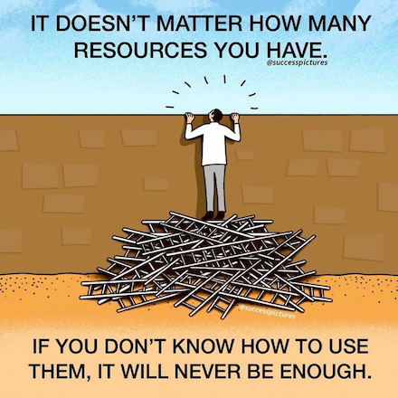

```{r setup, include=FALSE}
library(metathis)

knitr::opts_chunk$set(echo = FALSE)

meta() %>%
  meta_description(
    "Untitled"
  ) %>% 
  meta_viewport() %>% 
  meta_social(
    title = "Sufficiency is more important than efficiency if you want to improve public services",
    url = "https://calumwebb.co.uk/posts/2021-08-03-sufficiency-and-efficiency",
    og_type = "website",
    og_author = "Calum Webb", 
    image = "https://calumwebb.co.uk/posts/2021-08-03-sufficiency-and-efficiency/sufficiency-and-efficiency-card-image.png", 
    image_alt = "A cat sits atop a wall with a large pile of ladders underneath it.", 
    description = "Things seemed to be going well. There was a general acknowledgment in the room that family support services and early help interventions were well worth investing in. And then, very slowly, the focus of the conversation started to change.",
    twitter_card_type = "summary_large_image",
    twitter_creator = "@cjrwebb"
  )

```

I was recently in a (virtual) room presenting forthcoming research to a large group of people. I'm not able to disclose who they were, so I will just call them very important and powerful people™, to the extent that they, unlike me, could probably change things if they wanted to. I explained that the papers my colleagues and I have under review showed that the more money local authorities were able to spend on family support and early help services in a given year, the fewer children in need and 16-17 year olds entering care there were the following year. The research also showed that the more local authorities spent on these services, the more likely they were to get a 'Good' or 'Outstanding' Ofsted rating under any of the frameworks from the past ten years. (This research is still under review, but I hope to be able to share it with you soon.)

Things seemed to be going well. There was a general acknowledgment in the room that family support services and early help interventions were well worth investing in. And then, very slowly, the focus of the conversation started to change. 

> "Yes, we all agree that we need more early help and family support. But we have to make sure that we're using the most effective services with the best quality evidence."

I could go on for the length of a book about the problematic aspects of the term "best quality evidence" or how "effectiveness" is measured, never mind the fact that all public spending is accused of being inefficient by default. But there is something more fundamentally wrong with the tendency of very important and powerful people™ to focus first on efficiency. This came to mind today after seeing this [hilariously self-defeating motivational cartoon](bad-motivational-image.png).

<aside>
```{r, echo = FALSE}

```
</aside>

---

# Sufficiency and efficiency

```{r, layout = "l-page", echo = FALSE, fig.alt="The comic strip shows four brick walls side by side, labelled A, B, C and D. The first and second brick wall have a cat on top of them. The third and fourth have a cat sat on the floor. The first wall has a large pile of poorly placed ladders that the cat used to climb up. A caption reads: sufficient resources, used inefficiently. The second wall has a well-placed ladder. The caption reads: sufficient resources, used efficiently. The third wall has a small, single ladder, laid flat on the floor. The caption reads: insufficient resources, used inefficiently. The final wall has a small, single ladder, placed against the wall, but the ladder is too short to reach the top. The caption reads: insufficient resources, used efficiently."}


```

Despite our obsession with efficiency and its cousin, value for money, these things can be a distraction when focused on in contexts where there are insufficient resources in the first place. In the (de)motivational cartoon, the little man with the ladders achieved his objective of looking over the wall even with his horrendously inefficient use of wall-scaling technology. His lack of efficiency was made up for by the sufficiency of the resources provided to him. I've taken the liberty of extending the possible combinations of resources and efficiency that this cartoon implies above. 

As shown in the (de)motivational cartoon, sufficient resources can usually compensate for inefficiency (A). Of course, it would be great if we could always use our resources in the most efficient way possible (B). This means that we don't need to allocate more resources than we absolutely need to to achieve our objectives — a nice added bonus in addition to achieving our objective. 

But what if we don't have enough resources in general? Despite a clear difference in efficiency, neither approach C nor D reaches the objective of scaling the wall. This adds additional complications in trying to assess efficiency when neither approach has sufficient resources. 

By definition, an efficient approach is the one the reaches the same objective with the least amount of resources. B is clearly more efficient than A. They both reach the same binary objective (climbing the wall) with different amounts of resources (ladders).

But in the case of C and D, we can't get a reading on which is more efficient because neither achieves the objective, at least not without shifting the goalposts. We could, for instance, measure how close each approach got to the objective, but this is rarely something that can be operationalised or recorded when we translate the metaphor to public services, nor would such a translation be particularly meaningful to the person concerned or the service. 

Sufficiency of resource is often a pre-requisite to being able to achieve an objective and identify the efficiency of one approach over another. It is considered quite crude or naive to suggest that a system would work much better with an uplift of resources alone, even if what is being done is fundamentally unchanged (regardless of how efficient or inefficient it may be). For many things though, enough really can be enough. If our focus is on improving efficiency, we should also be mindful that we risk misdiagnosing a fault in the system as a fault in the approach when working in contexts of insufficient resources. The consequences of this misdiagnosis can be highly disruptive.

---

# Doing the right thing

```{r, echo = FALSE, fig.align='center',fig.alt = "A single panel cartoon shows a cat sat on the floor. Next to him is a ladder, but it's placed inside a seemingly endless hole in the ground. A caption reads: 'If you are doing the wrong thing then doing it better makes you wronger, not righter' (acreditted to Kathy Evans)"}


```

There are exceptions to every rule and the most important one here is that sufficient resources can only reach an objective if they are being used correctly. Needless to say, if you throw more resources at doing the wrong thing you will only end up doing it more wrongly. This is something I first heard from [Kathy Evans](https://www.childrenengland.org.uk/blog/commissioning-its-time-for-clarity-about-cost-price-and-the-real-effects-of-competition), who informs me she first heard it from [Simon Caulkin](https://www.theguardian.com/business/2006/oct/01/theobserver.observerbusiness5) who, in turn, credits it to systems theorist [Russell Ackoff](https://en.wikipedia.org/wiki/Russell_L._Ackoff). Ackoff is credited in Caulkin's article as saying:

> "When we make a mistake doing the wrong thing and correct it, we become wronger. When we make a mistake doing the right thing and correct it, we become righter. Therefore, it is better to do the right thing wrong than the wrong thing right."

If you are using your ladders to dig holes you are, very clearly, doing something wrong. If you are very efficient at digging holes with ladders, you are only going to be working very quickly towards the wrong objective. And if you have a large amount of resources, you are going to be doing this a lot.

---

# What should we focus on when it comes to improving public services?

Based on the above logic, we might list the order our priorities should be in as follows:

### 1. Is what we're doing *right*?

Are we doing things that are moving us in the right direction, towards our objective? If not, it won't matter how efficient we are or how sufficient our resources are, because they'll just take us further away from our goal.

### 2. Is it _insufficiency of resources_ holding us back, or lack of efficiency?

Do we actually have enough resources to translate us doing the right thing into a meaningful outcome? Even if we made what we are doing more efficient, would our resources be enough to translate that into real change?

### 3. Can what we are doing be made more _efficient_?

If we're doing the right thing, and we have enough resources for it to reach a meaningful objective, can we make it any more efficient?

---

How often, when you speak to very important and powerful people™, do you witness the focus shifting on to the third point with little interrogation of first and second? After ten years of austerity, which saw an average reduction of more than [50 per cent per child in spending on early help and family support](https://www.tandfonline.com/doi/full/10.1080/03003930.2018.1430028), with a post-Brexit, post-Covid-19 recession looming in the distance, the question of sufficiency of resources has never been more important. 

The Conservative-led government has been fond of trumpeting their £14million investment in Family Hubs as a response to the crisis in children's social care, with little challenge on the sheer insufficiency of this amount, which equates to only around 0.5 per cent of the family support and early help funding the average local authority has seen cut from their budgets over the past decade. At this point it likely doesn't matter so much how efficiently we prop our ladders up against the wall, insufficient resources mean there is little chance of public services surmounting the obstacles between them and their objectives. This, in turn, makes them ever more vulnerable to political attacks. 

When climbing the wall means keeping children safe, with their parents when possible, and ensuring they have the best quality of life, let's make sure we can do that first; then we can worry about optimising the number of ladders we use.

