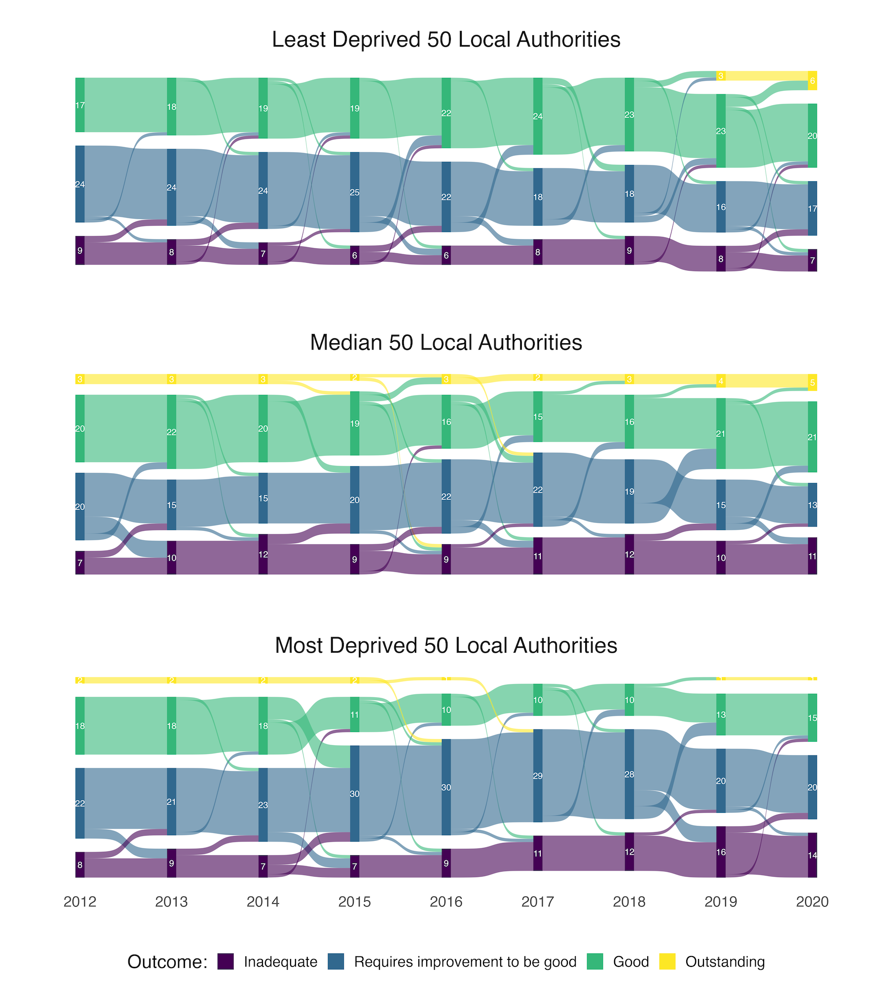

```{r setup, include=FALSE}
library(metathis)

knitr::opts_chunk$set(echo = FALSE)

meta() %>%
  meta_description(
    "This post summarises a research article that explored whether Ofsted judgements over the past ten years were associated with local authority expenditure and levels of deprivation. The inspectorate has previously maintained that funding and deprivation pale in comparison to leadership, but is this true? Our research suggests that higher spending on early help and family support and lower poverty is associated with a greater likelihood of positive ratings."
  ) %>%
  meta_viewport() %>%
  meta_social(
    title = "Children's Services Ofsted Judgements, Funding, and Poverty: A level playing field?",
    url = "https://www.calumwebb.co.uk/posts/2022-01-12-ofsted-funding-poverty",
    og_type = "website",
    og_author = "Calum Webb",
    image = "https://calumwebb.co.uk/posts/2022-01-12-ofsted-funding-poverty/ehfs_graph.png",
    image_alt = "A graph showing the association between Early Help and Family Support expenditure and Ofsted ratings.",
    twitter_card_type = "summary_large_image",
    twitter_creator = "@cjrwebb"
  )

```

> "In any case, we have found no significant correlation between levels of deprivation and the performance of children’s services. Nor can it be put down to funding levels – some of the authorities judged inadequate are among the highest spenders."

<aside>[<br>Sir Michael Wilshaw's speech on the launch of Ofsted’s Social Care Annual Report 2016](https://www.gov.uk/government/speeches/sir-michael-wilshaw-launches-ofsteds-social-care-annual-report-2016)</aside>


In 2017, Paul Bywaters, Tim Sparks, and I challenged this statement from Ofsted [in an article written for Community Care](https://www.communitycare.co.uk/2017/01/18/ofsted-ratings-reflect-local-authority-deprivation-spending/). This later led to some revision of the claim in a following Ofsted report, which acknowledged that there may be some association between levels of deprivation and children's services Ofsted outcomes. Later, research by David Wilkins and Vivi Antonopoulou reported an association between levels of deprivation and Ofsted outcomes, but found no association between local authority expenditure and Ofsted outcomes (see: [Wilkins and Antonopoulou, 2020a](https://academic.oup.com/bjsw/article-abstract/50/3/850/5253800), and [Wilkins and Antonopoulou, 2020b](https://doi.org/10.1108/JCS-07-2019-0035)).

This week, [a new paper](https://doi.org/10.1017/S147474642200001X) authored by Davara Bennett (University of Liverpool), Paul Bywaters (Huddersfield University), and me was published in Social Policy and Society. We found that levels of deprivation **and** levels of expenditure on early help and family support services were significant predictors of a positive (Good or Outstanding) Ofsted judgement.

## More money, better odds

Every £100 per child increase in early help and family support-related spending was associated with around a 1.7 times increase in the odds of receiving a Good or Outstanding Ofsted rating, after controlling for deprivation, the year of the inspection, and levels of safeguarding expenditure. To put this number in context, over the 2010 decade the highest level of expenditure per child on these services was around £1,000 and the lowest was around £90 per child, with the average local authority spending somewhere between £220 and £380 per child, indicating that multiple increments of increase of this value would not be unrealistic.

<aside>
```{r, fig.cap="Association between positive Ofsted outcomes and spending on early help/family support."}


```
</aside>

However, we found no association between 'safeguarding' expenditure (that is, expenditure largely associated with the social work workforce and child protection functions) and Ofsted outcomes. We suspect this along with some methodological differences may explain why previous analyses by the National Audit Office, and by Wilkins and Antonopoulou, may have found no association between expenditure and Ofsted outcomes. 

We believe that this evidence suggests that greater capacity to invest in early help and family support — [capacity that has declined rapidly and inequitably over the 2010 decade](https://doi.org/10.1080/03003930.2018.1430028) — may help reduce failure demand in children's services; meaning increases in demand that are associated with a failure to do something, or to do something right ([Seddon and Brand, 2008](https://www.tandfonline.com/doi/pdf/10.1111/j.1467-9302.2008.00611.x?casa_token=8xqboUKXYSwAAAAA:DyZh2aSbmoW79wNW7IHtRfOW5Z8ujML1JZWCC3QsUeOYBjZaYJ1xp04W05JSO1VwFVs08FyLZq_LzwY)). [Rick Hood (2015)](https://doi.org/10.3109/13561820.2014.937482) describes the impact of failure demand on children's services as leading to a state where:

> "[I]ssues that are not resolved straightaway keep reappearing and cumulatively start to overload the system’s ability to cope"

The figure below shows how Ofsted judgements of local authorities have been distributed across three tertiles of expenditure on early help and family support between 2012-13 (after Ofsted replaced 'adequate' with 'required improvement to be good') and 2019-2020, after adjusting for deprivation. The third of local authorities with the highest deprivation-adjusted expenditure on early help and family support have been notably more likely to receive Good or Outstanding Ofsted outcomes than those with relatively middling or low expenditure per child on these services. 

```{r, fig.cap="A Sankey diagram showing the distribution of Ofsted outcomes between 2012 and 2020, broken down by adjusted Early Help/Family Support spending tertile."}


```


## Poverty and Ofsted ratings

Just as Wilkins and Antonoloupou found, we also found that there was a strong association between levels of poverty (in this case, Indices of Multiple Deprivation decile) and the likelihood of a local authority receiving a positive Ofsted rating. The more deprived a local authority was, the less likely they were to receive a Good or Outstanding judgement. For every increase in IMD score decile — meaning moving from, say, the least deprived 10% of local authorities to between the 10th and 20th percentiles of local authorities) — there was around a 16 per cent decrease in the odds of receiving a Good or Outstanding Ofsted rating on inspection, after controlling for expenditure and year.

<aside>
```{r, fig.cap="Association between positive Ofsted outcomes and poverty."}


```
</aside>

This means that, controlling for average levels of expenditure and the propensity for different distributions of outcomes across the decade, we predict that a local authority in the least deprived decile of local authorities in England would have a around 53 per cent chance of receiving a Good or Outstanding outcome while a local authority in the most deprived 10 per cent of all local authorities in England would only have around a 19 per cent chance of a 'Good' or 'Outstanding' outcome. 

The Sankey plot below also seems to suggest that this inequality in Ofsted outcomes has gotten worse over time. In 2012, around 60% of the most deprived third of local authorities in England held 'Requires Improvement to be Good' or 'Inadequate' Ofsted ratings, compared to 66% of the least deprived third. By contrast, in 2020 around 68% of the most deprived third of local authorities held ratings below 'Good' while in the least deprived third of local authorities this figure had fallen to 48%. 


```{r, fig.cap="A Sankey diagram showing the distribution of Ofsted outcomes between 2012 and 2020, broken down by deprivation tertile."}



```


## The political and health consequences of context

If we take for granted that Ofsted judgements are an accurate representation of the quality of children's services (which others have rightly argued may not be the case) these findings clearly suggest that those children most in need of good-quality services are the least likely to have access to them. This has parallels to [Julian Tudor Hart's well known 'inverse care law'](https://www.thelancet.com/journals/lancet/article/PIIS0140-6736(71)92410-X/fulltext), that the 'availability of good medical care tends to vary inversely with the need for it in the population served'. Without proper attention to the role that socioeconomic and funding contexts play in children's services quality, or the ratings of such, social inequalities are likely to become further entrenched and the adversities children and families face are less likely to be met with remedial support.

Politically, these findings raise important questions about the role of 'take over' policies. These reforms introduced in 2015 were described by a government spokesperson as: ["a formalised academy-style system … any local authority judged as inadequate by Ofsted has to show significant improvement within six months or be taken over"](https://www.communitycare.co.uk/2015/12/14/david-cameron-announce-landmark-reforms-tackle-inadequate-childrens-services/). To date, [nine local authority children's services](https://www.communitycare.co.uk/2020/10/09/childrens-trusts-lessons-outsourcing-failing-local-authority-services/) (covering around 8% of the child population) have been removed from public ownership and replaced with independent trusts, with a tenth conversion on the horizon. A disproportionate number of these local authorities — Doncaster, Sunderland, Sandwell, and Birmingham — are in the most deprived 20 per cent of all local authorities. A further four all reported severe funding pressures prior to their conversion. 

If 'take over' policies are a consequence of local levels of poverty and funding, both of which are determined by national policies and decision-making, this risks creating two tiers of children's services that can be indirectly created by national policymaking — one which is publicly owned and publicly accountable, for those better funded and more affluent areas, and one which is opened up to marketisation through 'take over'. Given the [disproportionate spending of the Government's 'levelling up fund'](https://www.theguardian.com/politics/2021/mar/04/tories-accused-of-levelling-up-stitch-up-over-regional-deprivation-fund) in already affluent local authorities, as well as the [disproportionate impact of austerity measures in poorer areas](https://doi.org/10.1080/03003930.2018.1430028), these political consequences look set to deepen. 

The political issues associated with 'take over' policies and the health-related issues associated with the inverse care law are not altogether separate. Tudor Hart found that when medical care is more exposed to market forces the law operates more strongly, meaning that health inequalities increase. As such, a lack of attention to the socioeconomic predictors of Ofsted judgements, and the role that Ofsted judgements play in take over policies, creates, in theory, a system poised to exacerbate child welfare inequalities. 

---

The views in this blog are not necessarily the views of my co-authors. You can read the full research article here: [https://doi.org/10.1017/S147474642200001X](https://doi.org/10.1017/S147474642200001X). Please feel free to email me for a PDF copy, or you can view the open-access accepted version at the White Rose Online Research Repository: [https://eprints.whiterose.ac.uk/181694/](https://eprints.whiterose.ac.uk/181694/)
