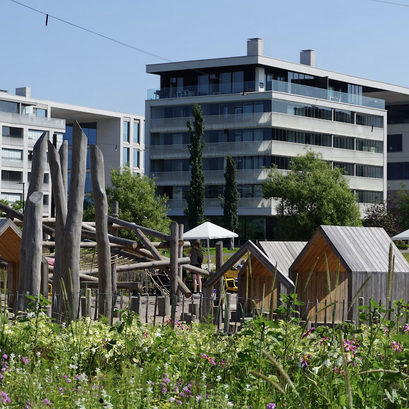
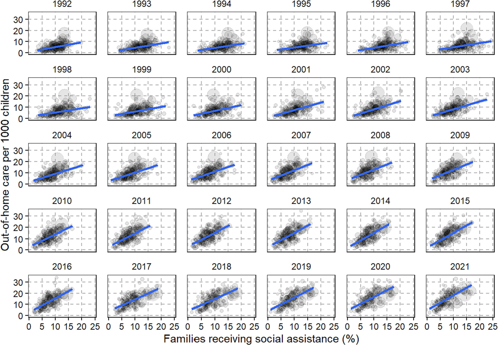
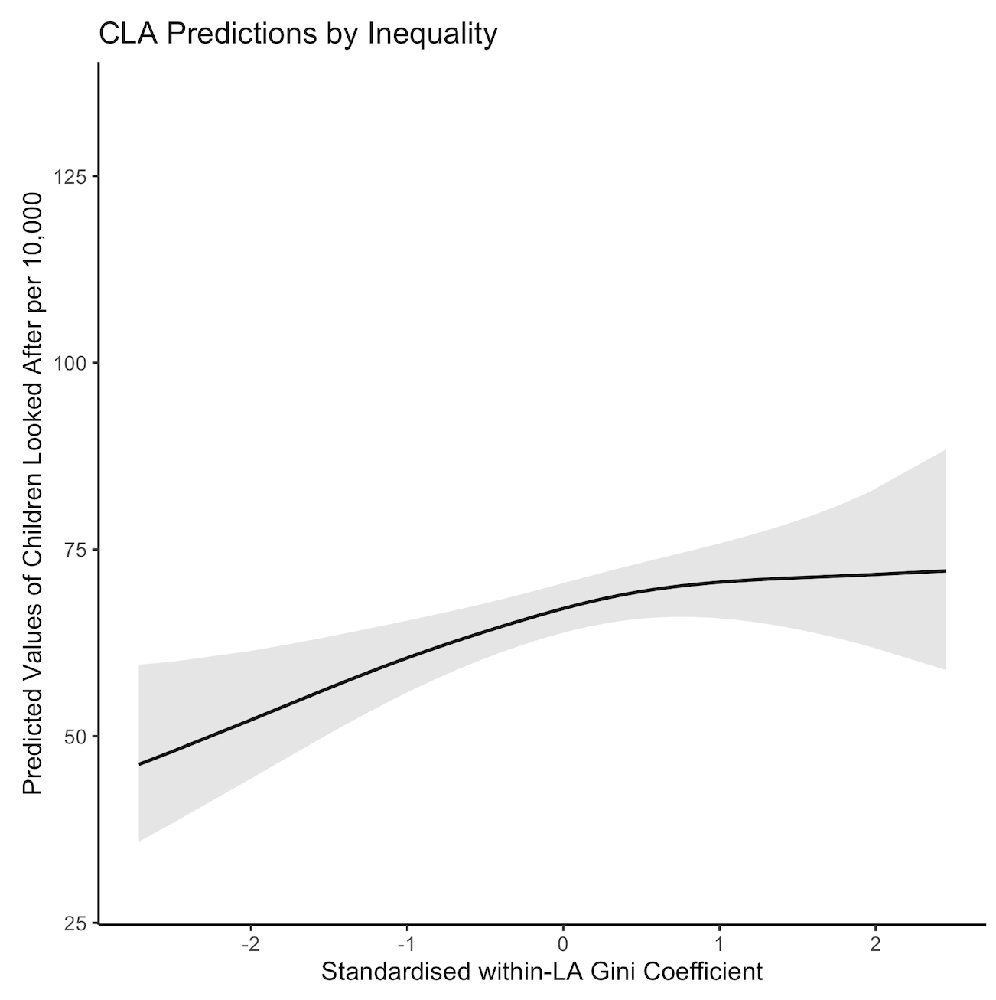
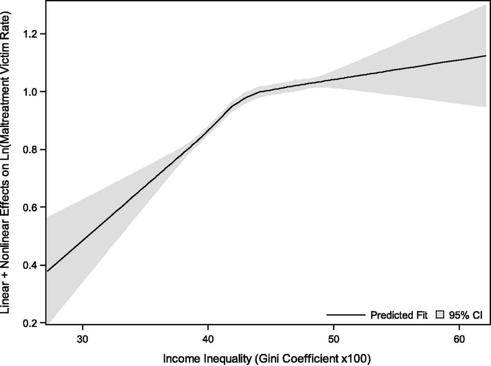
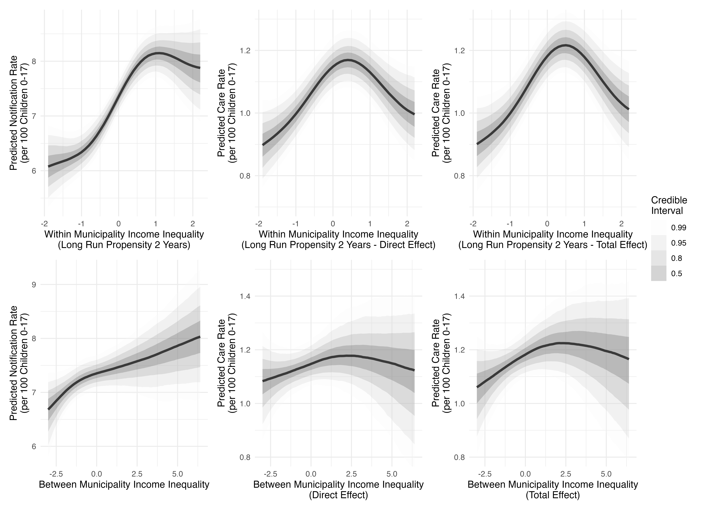

class: middle, title
background-size: contain

<!--------- 
decktape generic --key=ArrowRight --load-pause 1800 --slides '1-56' --size '1216x684' --url-load-timeout 80000 --page-load-timeout 40000 "uef-cwi.html" Webb-C-UEF-26.pdf
------>


<br><br><br><br>

# Local Income Inequality and Child Welfare Notifications and Interventions in Finland


.pull-left[

<br>

**Dr. Calum Webb**<sup>1</sup>, Ning Zhu<sup>2</sup>, Juulia Hietamäki<sup>2</sup>, Timo Toikko<sup>2</sup><br>
<sup>1</sup>Sheffield Methods Institute, the University of Sheffield<br>
[c.j.webb@sheffield.ac.uk](mailto:c.j.webb@sheffield.ac.uk)<br>
<sup>2</sup>Department of Social Sciences, University of Eastern Finland<br>

]

.pull-right[

<br><br><br><br><br>

]

```{r setup, include=FALSE}
options(htmltools.dir.version = FALSE)

# These packages are required for creating the slides
# Many will need to be installed from Github
library(icons)
library(tidyverse)
library(xaringan)
library(xaringanExtra)
library(xaringanthemer)

xaringanExtra::use_tachyons()

# Defaults for code
knitr::opts_chunk$set(
  fig.width=9, fig.height=3.5, fig.retina=3,
  out.width = "100%",
  cache = FALSE,
  echo = TRUE,
  message = FALSE, 
  warning = FALSE,
  fig.show = TRUE,
  hiline = TRUE
)

# set global theme for ggplot to make background #F8F8F8F8 (off white),
# but otherwise keep all ggplot themes default (better for teaching)
theme_set(
  theme(plot.background = element_rect(fill = "#F8F8F8", colour = "#F8F8F8"), 
        panel.background = element_rect(fill = "#F8F8F8", colour = "#F8F8F8"),
        legend.background = element_rect(fill = "#F8F8F8", colour = "#F8F8F8")
        )
  )

ipse_theme <- theme(plot.background = element_rect(fill = "#F8F8F8", colour = "#F8F8F8"), 
        panel.background = element_rect(fill = "#F8F8F8", colour = "#F8F8F8"),
        legend.background = element_rect(fill = "#F8F8F8", colour = "#F8F8F8")
        )

```

```{r xaringan-tile-view, echo=FALSE}
# Use tile overview by hitting the o key when presenting
xaringanExtra::use_tile_view()
```

```{r xaringan-logo, echo=FALSE}
# Add logo to top right
xaringanExtra::use_logo(
  image_url = "header/smi-logo-white.png",
  exclude_class = c("inverse", "hide_logo", "inverse2"), 
  width = "180px", position = css_position(top = "1em", right = "2em")
)
```

```{r xaringan-themer, include=FALSE, warning=FALSE}

# Set some global objects containing the colours
# of the university's branding
primary_color <- "#131E29"
secondary_color <- "#440099"
tuos_blue <- "#9ADBE8"
white = "#F8F8F8"
tuos_yellow <- "#FCF281"
tuos_purple <- "#440099"
tuos_red <- "#E7004C"
tuos_midnight <- "#131E29"

turquoise_light <- "#00AF91"
turquoise_dark <- "#006353"
red_dark <- "#631C00"
red_light <- "#B03200"
ipse_blue <- "#097ABD"
ipse_gold <- "#FC9C19"
ipse_lightgold <- "#FDC375"
ipse_grey <- "#5F584F"

# The bulk of the styling is handled by xaringanthemer
style_duo_accent(
  primary_color = "#131E29",
  secondary_color = "#097ABD",
  colors = c(tuos_purple = "#440099", 
             grey = "#131E2960", 
             tuos_blue ="#9ADBE8",
             tuos_mint = "#00CE7C",
             turquoise_dark = "#006353",
             ipse_gold = "#FC9C19",
             off_white = "#F8F8F8"
             ),
  header_font_google = xaringanthemer::google_font("Source Serif Pro", "600", "600i"),
  text_font_google   = xaringanthemer::google_font("Source Sans Pro", "300", "300i", "600", "600i"),
  code_font_google   = xaringanthemer::google_font("Lucida Console"),
  header_h1_font_size = "2rem",
  header_h2_font_size = "1.5rem", 
  header_h3_font_size = "1.25rem", 
  text_font_size = "0.9rem",
  code_font_size = "0.65rem", 
  code_inline_font_size = "0.85rem",
  inverse_text_color = "#F8F8F8", 
  background_color = "#F8F8F8", 
  text_color = "#131E29", 
  link_color = "#097ABD", 
  inverse_link_color = "#F8F8F8",
  text_slide_number_color = "#097ABD",
  table_row_even_background_color = "transparent", 
  table_border_color = "#097ABD",
  text_bold_font_weight = 600
)

```


```{r xaringan-panelset, echo=FALSE}
# Allow for adding panelsets (see example on slide 2)
xaringanExtra::use_panelset()
```

```{r xaringanExtra, echo = FALSE}
# Adds white progress bar to top
xaringanExtra::use_progress_bar(color = "#F8F8F8", location = "top")
```

```{r xaringan-extra-styles, echo = FALSE}
# Allow for code to be highlighted on hover
xaringanExtra::use_extra_styles(
  hover_code_line = TRUE,         #<<
  mute_unhighlighted_code = TRUE  #<<
)
```

```{r share-again, echo=FALSE}
# Add sharing links and other embedding tools
xaringanExtra::use_share_again()
```

```{r xaringanExtra-search, echo=FALSE}
# Add magnifying glass search function to bottom left for quick
# searching of slides
xaringanExtra::use_search(show_icon = TRUE, auto_search = FALSE)
```


---

class: middle, inverse

# Why do we need a social model of child protection? 

---

class: middle

.pull-left[

<br><br><br><br>

## Child Welfare Interventions & Social Policy

* Child welfare interventions (notifications/care rates) represent a **failure of the welfare state to meet the needs of people to live a normal and safe family life** (Hood, et. al. 2016)
* .grey[Causes of child abuse and neglect are often highly individualised and ignore the role that social institutions have in protecting children (Featherstone, et al. 2018).]
* .grey[Parallels with public health: there is a need to balance the responsibility of society more widely in providing support/removing structural determinants of ill health, while also understanding individual decision-making and behaviours.]
* .grey[The former is still a relatively marginalised position in children's social care research. ]

]

.pull-right[

.center[.circle-mask[
```{r, echo = FALSE}



```
]

Töölönlahti Park, Marek Lumi
]
]

---

class: middle

.pull-left[

<br><br><br><br>

## Child Welfare Interventions & Social Policy

* .grey[Child welfare interventions (notifications/care rates) represent a failure of the welfare state to meet the needs of people to live a normal and safe family life (Hood, et. al. 2016)]
* Causes of child abuse and neglect are often highly individualised and ignore **the role that social institutions have in protecting children** (Featherstone, et al. 2018). 
* .grey[Parallels with public health: there is a need to balance the responsibility of society more widely in providing support/removing structural determinants of ill health, while also understanding individual decision-making and behaviours.]
* .grey[The former is still a relatively marginalised position in children's social care research.]

]

.pull-right[

.center[.circle-mask[
```{r, echo = FALSE}


```
]

Töölönlahti Park, Marek Lumi
]
]

---

class: middle

.pull-left[

<br><br><br><br>

## Child Welfare Interventions & Social Policy

* .grey[Child welfare interventions (notifications/care rates) represent a failure of the welfare state to meet the needs of people to live a normal and safe family life (Hood, et. al. 2016)]
* .grey[Causes of child abuse and neglect are often highly individualised and ignore the role that social institutions have in protecting children (Featherstone, et al. 2018).]
* **Parallels with public health**: there is a need to balance the responsibility of society more widely in providing support/removing structural determinants of ill health, while also understanding individual decision-making and behaviours.
* .grey[The former is still a relatively marginalised position in children's social care research.]

]

.pull-right[

.center[.circle-mask[
```{r, echo = FALSE}


```
]

Töölönlahti Park, Marek Lumi
]
]


---

class: middle

.pull-left[

<br><br><br><br>

## Child Welfare Interventions & Social Policy

* .grey[Child welfare interventions (notifications/care rates) represent a failure of the welfare state to meet the needs of people to live a normal and safe family life (Hood, et. al. 2016)]
* .grey[Causes of child abuse and neglect are often highly individualised and ignore the role that social institutions have in protecting children (Featherstone, et al. 2018).]
* .grey[Parallels with public health: there is a need to balance the responsibility of society more widely in providing support/removing structural determinants of ill health, while also understanding individual decision-making and behaviours.]
* The former is still a **relatively marginalised position** in children's social care research. 

]

.pull-right[

.center[.circle-mask[
```{r, echo = FALSE}


```
]

Töölönlahti Park, Marek Lumi
]
]


---

class: inverse, middle


# Why local income inequality and child welfare interventions?

---

.pull-left[

<br><br>

## Why local income inequality and child welfare interventions?

* There is a strong **social gradient** in child welfare interventions in many countries, including England and Finland. Public health research (Pickett & Wilkinson, 2015) often highlights that income inequality — at a national level — is often associated with public health problems in a similar way to poverty in health inequalities research (Marmot, 2017).
* .grey[Existing research in England and Wales (Webb, et al. 2021) and in the United States (Eckenrode, et al. 2014) has shown a relationship between local income inequality and rates of children in out-of-home care.]
* .grey[There is a plausible mechanism by which local income inequality may influence social work practice (relationality, status, othering). Higher local income inequality is linked to greater spatial segregation (Tammaru et al., 2020, 2021).]


]

.pull-right[

.center[.circle-mask[
```{r, echo = FALSE}


```
]

Tampere Harbour, Sini Tiainen
]
]
---

class: middle

<br>

## Children in the poorest 10% of neighbourhoods in England are >10 times as likely to be on a child protection plan or in care than the least poor 10%

.center[
```{r bywaters2020child, fig.align="left", echo=FALSE, warning=FALSE, fig.width=10.8, fig.height = 3.8, out.width=1080, out.height=380, fig.cap="<p align='right'>Data from Bywaters, et al. <a href = https://pure.hud.ac.uk/en/publications/the-child-welfare-inequalities-project-final-report>2020</a></p>"}

library(plotly)

cwi_rates <- tibble(depr = c(1, 2, 3, 4, 5, 6, 7, 8, 9, 10, 1, 2, 3, 4, 5, 6, 7, 8, 9, 10),
                    cpp = c(9, 14, 21, 23, 32, 35, 47, 51, 71, 113, 1, 5, 8, 13, 17, 33, 39, 55, 74, 114),
                    cla = c(12, 14, 23, 29, 29, 40, 55, 67, 88, 133, 7, 12, 16, 22, 31, 39, 54, 63, 108, 165),
                    country = c(rep("England", 10), rep("Wales", 10)))

cwi_plot <- cwi_rates %>%
  filter(country == "England") %>%
  pivot_longer(cpp:cla, names_to = "Intervention", values_to = "rate") %>%
  mutate(
    Intervention = ifelse(Intervention == "cla", "In Care (CLA)", "CPP")
  ) %>%
  ggplot() +
  geom_col(aes(x = as.factor(depr), y = rate, group = Intervention, fill = Intervention), position = "dodge") +
    geom_text(aes(x = as.factor(depr), y = rate + 4, group = Intervention,  label = rate, colour = Intervention), stat = "identity", position = position_dodge(width = 1), size = 4, fontface = "bold") +
  ggtitle(str_wrap("", 80)) +
  scale_fill_manual(values = c(ipse_blue, tuos_purple)) +
  scale_colour_manual(values = c(ipse_blue, tuos_purple)) +
  ylab("Intervention Rate per 10,000 Children") +
  xlab("Deprivation Decile of Neighbourhoods (10 = Most Deprived)") +
  ggeasy::easy_add_legend_title("Intervention") +
  #theme_minimal() +
  theme(plot.title = element_text(face = "bold"))

cwi_plot

# widgetframe::frameWidget(ratesplot) #403 errors on deployment?

# knitr::include_graphics("images/cpp_graph.gif")

```
]

---

.pull-left-big[
<br>
.bg-white.b--blue.ba.bw2.br3.shadow-5.ph4[
```{r, echo = FALSE, out.width="100%"}



```
]
]

.pull-right-small[

<br><br><br><br>

### Association between Social Assistance Receipt and Out-of-home Care Rate in Finnish Municipalities 1992-2021

Hiilamo, A., Keski-Säntti, M., Niemelä, M., & Ristikari, T. (2023). The increasing association between child poverty and children in out-of-home care-an ecological longitudinal analysis of Finnish municipalities in the period 1992–2021. *Child Abuse & Neglect*, 145, 106395.

]

---

.pull-left[

<br><br>

## Why local income inequality and child welfare interventions?

* .grey[There is a strong social gradient in child welfare interventions in many countries, including England and Finland. Public health research (Pickett & Wilkinson, 2015) often highlights that income inequality — at a national level — is often associated with public health problems in a similar way to poverty in health inequalities research (Marmot, 2017).]
* **Existing research** in England and Wales (Webb, et al. 2021) and in the United States (Eckenrode, et al. 2014) has shown a relationship between local income inequality and rates of children in out-of-home care.
* .grey[There is a plausible mechanism by which local income inequality may influence social work practice (relationality, status, othering). Higher local income inequality is linked to greater spatial segregation (Tammaru et al., 2020, 2021).]


]

.pull-right[

.center[.circle-mask[
```{r, echo = FALSE}


```
]

Tampere Harbour, Sini Tiainen
]
]

---

class: middle


.pull-left[

.bg-white.b--blue.ba.bw2.br3.shadow-5.ph4[

```{r, echo = FALSE}



```

]

]

.pull-right[

<br>

## Income Inequality & Child Welfare Interventions in England & Wales (Webb, et al. 2021)

* Analysis of local income inequality and rates of intervention (children in care, child protection plans) across 172 English and Welsh local authorities.
* General Additive Models (GAMs) with smoothed splines.
* Higher local income inequality was associated with increased rates of children placed in care, but this increase was non-linear.
* More income-unequal local authorities also had steeper social gradients — that is, poverty had a bigger consequence for intervention rates in unequal places compared to more equal places.

]


---

class: middle


.pull-left[

.bg-white.b--blue.ba.bw2.br3.shadow-5.ph4[

```{r, echo = FALSE}



```

]

]

.pull-right[

## Income Inequality & Child Welfare Interventions in the USA (Eckenrode, et al. 2014)

* Analysis of local income inequality and rates of substantiated abuse and neglect across 3,142 US Counties.
* General Additive Models (GAMs) with smoothed splines.
* Higher local income inequality was associated with increased rates of substantiated abuse and neglect, but this increase was non-linear.
* The effect of income inequality on abuse and neglect rates was stronger in areas with moderate to high levels of poverty.

]


---

.pull-left[

<br><br>

## Why local income inequality and child welfare interventions?

* .grey[There is a strong social gradient in child welfare interventions in many countries, including England and Finland. Public health research (Pickett & Wilkinson, 2015) often highlights that income inequality — at a national level — is often associated with public health problems in a similar way to poverty in health inequalities research (Marmot, 2017).]
* .grey[Existing research in England and Wales (Webb, et al. 2021) and in the United States (Eckenrode, et al. 2014) has shown a relationship between local income inequality and rates of children in out-of-home care.]
* There is a plausible mechanism by which local income inequality may influence social work practice (relationality, status, othering). **Higher local income inequality is linked to greater spatial segregation** (Tammaru et al., 2020, 2021).


]

.pull-right[

.center[.circle-mask[
```{r, echo = FALSE}


```
]

Tampere Harbour, Sini Tiainen
]
]


---

class: middle, inverse

.pull-left[

.bg-white.b--light-blue.ba.bw2.br3.shadow-5.ph4[

<iframe src="https://www.google.com/maps/embed?pb=!4v1782912569941!6m8!1m7!1sq0-AMfRNouRrmCv9bymvGg!2m2!1d54.8920389327411!2d-1.369316737552454!3f182.13120512977088!4f-2.5595472016781713!5f0.7820865974627469" width="600" height="215" frameborder="0" style="border:0;" allowfullscreen="" aria-hidden="false" tabindex="0" data-external="1"></iframe>

]

.center[
Sunderland, Most Deprived LSOA, Average House Price (2018): £140,000
]

.bg-white.b--light-blue.ba.bw2.br3.shadow-5.ph4[
<iframe src="https://www.google.com/maps/embed?pb=!4v1602086717105!6m8!1m7!1sbdzowbDYET7YYo65CjZd7Q!2m2!1d54.89689879046756!2d-1.493145921426356!3f339.4669946534618!4f-7.778891356493901!5f0.7820865974627469" width="600" height="215" frameborder="0" style="border:0;" allowfullscreen="" aria-hidden="false" tabindex="0" data-external="1">
</iframe>

]

.center[

Sunderland, Least Deprived LSOA, Average House Price (2018): £225,000

]

]

.pull-right[

.bg-white.b--light-blue.ba.bw2.br3.shadow-5.ph4[

<iframe src="https://www.google.com/maps/embed?pb=!4v1602087201203!6m8!1m7!1sZex0rmjnhimOlnIF2UV_cQ!2m2!1d51.4444184457374!2d-0.9029664642045893!3f244.69586296448418!4f-5.50061464711105!5f0.7820865974627469" width="600" height="215" frameborder="0" style="border:0;" allowfullscreen="" aria-hidden="false" tabindex="0" data-external="1">
</iframe>

]

.center[

Wokingham, Most Deprived LSOA, Average House Price (2018): £525,000

]

.bg-white.b--light-blue.ba.bw2.br3.shadow-5.ph4[
<iframe src="https://www.google.com/maps/embed?pb=!4v1782912389334!6m8!1m7!1sUJryyqod6RN_mH4erSdmlQ!2m2!1d51.47861827117381!2d-0.883407235519457!3f217.82150764835615!4f-10.293114764169061!5f0.7820865974627469" width="600" height="215" frameborder="0" style="border:0;" allowfullscreen="" aria-hidden="false" tabindex="0" data-external="1"></iframe>
]

.center[Wokingham, Least Deprived LSOA, Average House Price (2018): £565,000]

]


---

class: middle, inverse

# Findings from Finnish Municipalities

---

.pull-left-big[

<br>

.bg-white.b--light-blue.ba.bw2.br3.shadow-5.ph4[

```{r, echo = FALSE, out.width="95%", fig.align="center"}



```

]

]

.pull-right-small[

<br><br><br><br><br><br>

## Findings

A more complex methodology than previous studies in England/US (Bayesian within-between models with lagged effects) allows examination of what happens within municipalities over time when income inequality changes, as well as between municipalities.


]

---

.pull-left-big[

<br>

.bg-white.b--light-blue.ba.bw2.br3.shadow-5.ph4[

```{r, echo = FALSE, out.width="95%", fig.align="center"}


```

]

]

.pull-right-small[

<br><br><br><br><br><br>

## Findings

Very similar patterns (breakpoint) when comparing between municipalities to what is found in England, Wales, and the United States, **despite the fact that** the average level of local income inequality is much lower in Finland.


]


---

.pull-left-big[

<br>

.bg-white.b--light-blue.ba.bw2.br3.shadow-5.ph4[

```{r, echo = FALSE, out.width="95%", fig.align="center"}


```

]

]

.pull-right-small[

<br><br><br><br><br><br>

## Findings

A more pronounced non-linear effect when looking at the association within municipalities over time.

]

---

.pull-left-big[

<br>

.bg-white.b--light-blue.ba.bw2.br3.shadow-5.ph4[

```{r, echo = FALSE, out.width="95%", fig.align="center"}


```

]

]

.pull-right-small[

<br><br><br><br><br><br>

## Findings

Strong evidence of a lagged effect (preceding changes in income inequality credibly predict changes in notification rates and care rates the following year)

]

---

.pull-left[

<br><br><br><br>

## Conclusions

* Local income inequality (probably) matters for child welfare interventions in Finland as it does in England, Wales, and the USA, despite Finland being a low-inequality country from a different welfare regime. 
* The relative breakpoint around average levels of inequality is a puzzle — is it more about how income inequality manifests socially/geographically than about inequality itself?
* Finland also has a highly variable municipal tax system (4.7% to 19.5%!) that may interact with income inequality and the provision of child welfare services that we have not yet explored. 
* More international comparisons are needed, but this is challenging because of availability of child welfare data, income inequality data, and lack of quantitative research skills in the subject area.


]

.pull-right[

.circle-mask[
```{r, echo = FALSE}


```
]

.center[Oodi Central Library Helsinki, Sayo Oladeji]

] 
