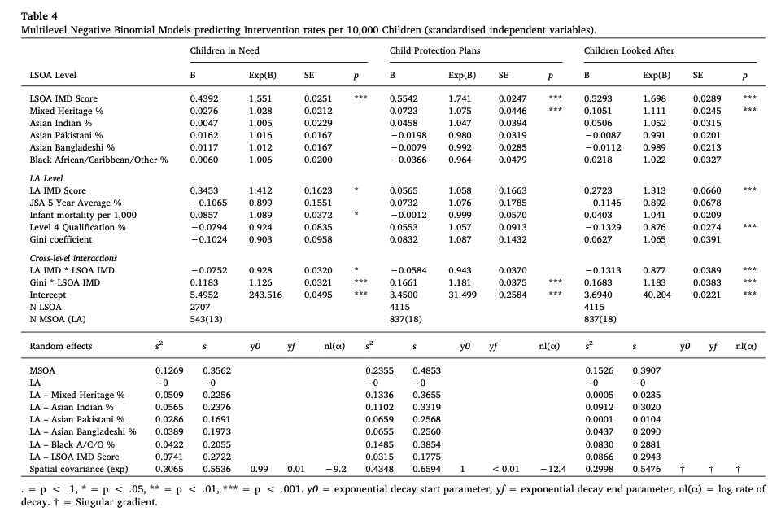
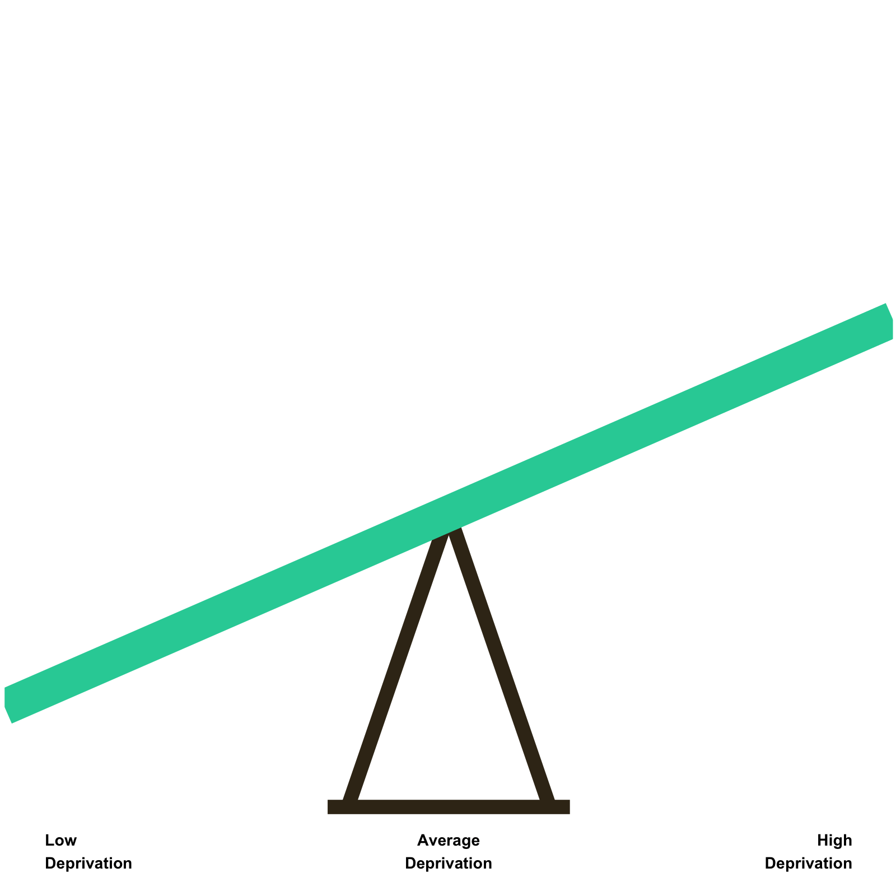
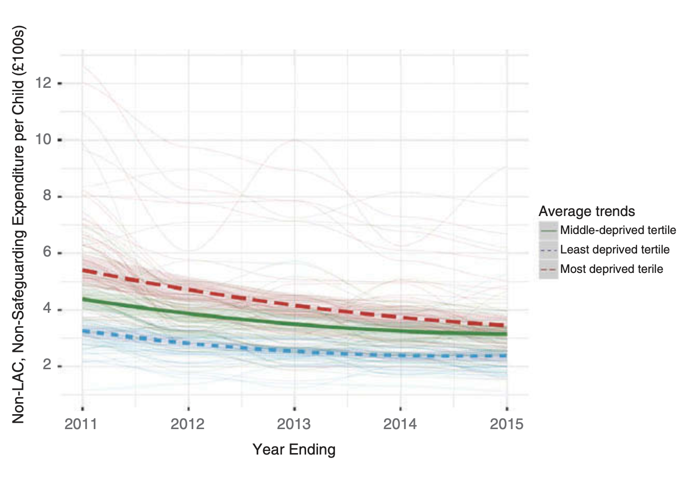
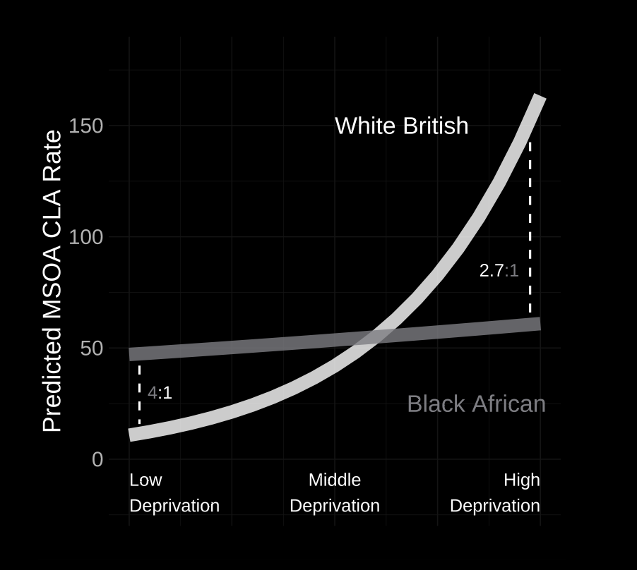
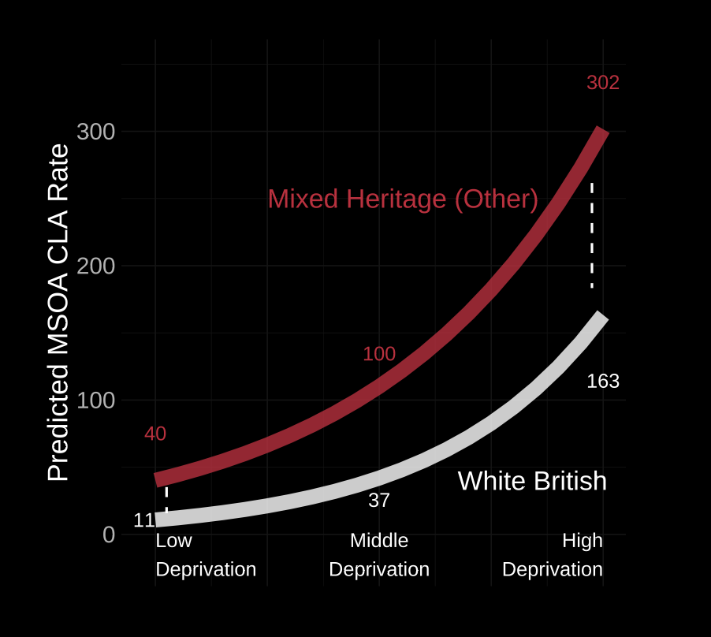
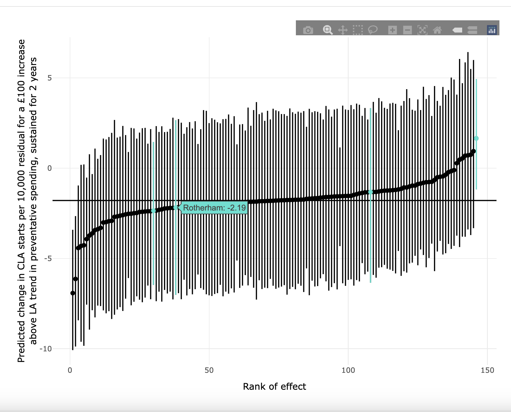

class: middle, title
background-size: contain


<br><br>

# Help! Everyone thinks they're an outlier!
#### Convincing local authority audiences to care about abstract statistical models using interactive data visualisation

.grey[NB: I am going to be deliberately mischaracterising my good local authority colleagues for dramatic effect]

<br><br>

**Dr. Calum Webb**<br>
Sheffield Methods Institute, the University of Sheffield<br>
[c.j.webb@sheffield.ac.uk](mailto:c.j.webb@sheffield.ac.uk)

```{r setup, include=FALSE}
options(htmltools.dir.version = FALSE)

# These packages are required for creating the slides
# Many will need to be installed from Github
library(icons)
library(tidyverse)
library(xaringan)
library(xaringanExtra)
library(xaringanthemer)

# Defaults for code
knitr::opts_chunk$set(
  fig.width=9, fig.height=3.5, fig.retina=3,
  out.width = "100%",
  cache = FALSE,
  echo = TRUE,
  message = FALSE, 
  warning = FALSE,
  fig.show = TRUE,
  hiline = TRUE
)

# set global theme for ggplot to make background #F8F8F8F8 (off white),
# but otherwise keep all ggplot themes default (better for teaching)
theme_set(
  theme(plot.background = element_rect(fill = "#F8F8F8", colour = "#F8F8F8"))
  )

```

```{r xaringan-tile-view, echo=FALSE}
# Use tile overview by hitting the o key when presenting
xaringanExtra::use_tile_view()
```

```{r xaringan-logo, echo=FALSE}
# Add logo to top right
xaringanExtra::use_logo(
  image_url = "header/smi-logo-white.png",
  exclude_class = c("inverse", "hide_logo"), 
  width = "180px", position = css_position(top = "1em", right = "2em")
)
```

```{r xaringan-themer, include=FALSE, warning=FALSE}

# Set some global objects containing the colours
# of the university's branding
primary_color <- "#131E29"
secondary_color <- "#440099"
tuos_blue <- "#9ADBE8"
white = "#F8F8F8"
tuos_yellow <- "#FCF281"
tuos_purple <- "#440099"
tuos_red <- "#E7004C"
tuos_midnight <- "#131E29"

# The bulk of the styling is handled by xaringanthemer
style_duo_accent(
  primary_color = "#131E29",
  secondary_color = "#440099",
  colors = c(tuos_purple = "#440099", 
             grey = "#131E2960", 
             tuos_blue ="#9ADBE8",
             tuos_mint = "#00CE7C"),
  header_font_google = xaringanthemer::google_font("Source Serif Pro", "600", "600i"),
  text_font_google   = xaringanthemer::google_font("Source Sans Pro", "300", "300i"),
  code_font_google   = xaringanthemer::google_font("Lucida Console"),
  header_h1_font_size = "2rem",
  header_h2_font_size = "1.5rem",
  header_h3_font_size = "1.25rem", 
  text_font_size = "0.9rem",
  code_font_size = "0.65rem", 
  code_inline_font_size = "0.85rem",
  inverse_text_color = "#9ADBE8", 
  background_color = "#F8F8F8", 
  text_color = "#131E29", 
  link_color = "#005A8F", 
  inverse_link_color = "#F8F8F8",
  text_slide_number_color = "#44009970"
)

```


```{r xaringan-panelset, echo=FALSE}
# Allow for adding panelsets (see example on slide 2)
xaringanExtra::use_panelset()
```

```{r xaringanExtra, echo = FALSE}
# Adds white progress bar to top
xaringanExtra::use_progress_bar(color = "#F8F8F8", location = "top")
```

```{r xaringan-extra-styles, echo = FALSE}
# Allow for code to be highlighted on hover
xaringanExtra::use_extra_styles(
  hover_code_line = TRUE,         #<<
  mute_unhighlighted_code = TRUE  #<<
)
```

```{r share-again, echo=FALSE}
# Add sharing links and other embedding tools
xaringanExtra::use_share_again()
```

```{r xaringanExtra-search, echo=FALSE}
# Add magnifying glass search function to bottom left for quick
# searching of slides
xaringanExtra::use_search(show_icon = TRUE, auto_search = FALSE)
```

---

class: middle

.middle-left-small[

.center[

```{r echo = FALSE, out.width = "90%"}


```

]

]

.middle-right-big[

## Dr. Calum Webb
.tuos_purple[Sheffield Methods Institute]<br>
[c.j.webb@sheffield.ac.uk](mailto:c.j.webb@sheffield.ac.uk)


Social science researcher and lecturer in quantitative social science — RSS fellow & registered Data Analyst — self-taught `shiny` — research on how austerity and child poverty has led to greater child abuse & neglect and intervention from child welfare services (child protection).


]

---

# Three stories from our Child Welfare Inequalities research 

.middle-left[

<br><br>

* .tuos_purple[Child poverty is the strongest single predictor of child protection involvement and children being in the care system, and this effect was stonger in neighbourhoods within more affluent local authorities.]

* Spending on services for supporting families upstream have been cut dramatically since 2010, with the poorest places faces the steepest cuts.

* Children from some ethnic groups are disproportionately represented in the child protection system (.grey[and it's not just because their families are poorer on average])

]


.middle-right[

<br><br><br><br>

```{r, echo = FALSE, fig.cap="A big 'Table 2' Regression Table... Very accessible"}



```

A 1SD increase in neighbourhood deprivation was associated with a 1.7 times increase in CLA rates. A 1SD increase in LA deprivation was associated with a 1.3 times increase in CLA rates.


]

---

# Three stories from our Child Welfare Inequalities research 

.middle-left[

<br><br>

* .tuos_purple[Child poverty is the strongest single predictor of child protection involvement and children being in the care system, and this effect was stonger in neighbourhoods within more affluent local authorities.]

* Spending on services for supporting families upstream have been cut dramatically since 2010, with the poorest places faces the steepest cuts.

* Children from some ethnic groups are disproportionately represented in the child protection system (.grey[and it's not just because their families are poorer on average])

]


.middle-right[

<br><br><br><br>

.center[

```{r, echo = FALSE, out.width = "70%"}

knitr::include_graphics("images/seesaw_3.gif")

```

]

.center[I really tried to make it more engaging!]


]

---

# Three stories from our Child Welfare Inequalities research 

.middle-left[

<br><br>

* .tuos_purple[Child poverty is the strongest single predictor of child protection involvement and children being in the care system, and this effect was stonger in neighbourhoods within more affluent local authorities.]

* Spending on services for supporting families upstream have been cut dramatically since 2010, with the poorest places faces the steepest cuts.

* Children from some ethnic groups are disproportionately represented in the child protection system (.grey[and it's not just because their families are poorer on average])

]


.middle-right[

<br><br><br><br>

.center[

```{r, echo = FALSE, out.width = "70%"}



```

]

.center[I really tried to make it more engaging!]


]


---

# Three stories from our Child Welfare Inequalities research 

.middle-left[

<br><br>

* .tuos_purple[Child poverty is the strongest single predictor of child protection involvement and children being in the care system, and this effect was stonger in neighbourhoods within more affluent local authorities.]

* Spending on services for supporting families upstream have been cut dramatically since 2010, with the poorest places faces the steepest cuts.

* Children from some ethnic groups are disproportionately represented in the child protection system (.grey[and it's not just because their families are poorer on average])

]


.middle-right[

<br><br><br><br>

.center[

```{r, echo = FALSE, out.width = "70%"}

knitr::include_graphics("images/seesaw_5.gif")

```

]

.center[I really tried to make it more engaging!]


]


---

# Three stories from our Child Welfare Inequalities research 

.middle-left[

<br><br>

* Child poverty is the strongest single predictor of child protection involvement and children being in the care system, and this effect was stonger in neighbourhoods within more affluent local authorities.

* .tuos_purple[Spending on services for supporting families upstream have been cut dramatically since 2010, with the poorest places faces the steepest cuts.]

* Children from some ethnic groups are disproportionately represented in the child protection system (.grey[and it's not just because their families are poorer on average])

]


.middle-right[

<br><br><br><br>

.center[

```{r, echo = FALSE, out.width = "90%"}



```

]

.center[Showing trajectories in spending on preventative services in low, middling, and high deprivation local authorities]


]

---

# Three stories from our Child Welfare Inequalities research 

.middle-left[

<br><br>

* Child poverty is the strongest single predictor of child protection involvement and children being in the care system, and this effect was stonger in neighbourhoods within more affluent local authorities.

* Spending on services for supporting families upstream have been cut dramatically since 2010, with the poorest places faces the steepest cuts.

* .tuos_purple[Children from some ethnic groups are disproportionately represented in the child protection system] (.grey[and it's not just because their families are poorer on average])

]


.middle-right[

<br><br><br><br>

.center[

```{r, echo = FALSE, out.width = "80%"}



```

]

.center[Showing differences in the association between poverty and child welfare interventions across different ethnic groups]


]

---

# Three stories from our Child Welfare Inequalities research 

.middle-left[

<br><br>

* Child poverty is the strongest single predictor of child protection involvement and children being in the care system, and this effect was stonger in neighbourhoods within more affluent local authorities.

* Spending on services for supporting families upstream have been cut dramatically since 2010, with the poorest places faces the steepest cuts.

* .tuos_purple[Children from some ethnic groups are disproportionately represented in the child protection system] (.grey[and it's not just because their families are poorer on average])

]


.middle-right[

<br><br><br><br>

.center[

```{r, echo = FALSE, out.width = "80%"}



```

]

.center[Showing differences in the association between poverty and child welfare interventions across different ethnic groups]


]


---

class: inverse, middle

.middle-left[

# "That doesn't apply to us, we're an outlier to the trend because [...]."

]


---

class: inverse, middle

.middle-left[

# "That doesn't apply to us, we're an outlier to the trend because [...]."

]

.middle-right[

Some things I learned in the process:

* By and large: local authorities and the people working in them don't win policy/resource arguments on national statistics.
* "Prove it's happening here" isn't a challenge to you, it's a challenge they face from national bodies.
* Local authorities are OBSESSED with comparing themselves to other local authorities.
* My (overboard) solution...

]

---

class: inverse
background-image: url(images/cwip-app.png)
background-size: fill

## .shadow[ [Link](https://webb.shinyapps.io/cwip-app-testserver/) ]<br>.shadow[ `[Source code](https://github.com/cjrwebb/cwip-app)` ]

---

# Potential for interactive visualisation in multilevel models

.middle-left[

# &nbsp;

$$\bar{Y_ij} = \beta_{0} + \beta_{1}X_{ij} + U_{0j} + U_{1j}X_{ij}\\
U_{0j} \sim N(0, \sigma_{u0})\\U_{1j} \sim N(0, \sigma_{u1})$$

<br>

* Often have local authority random effects (random slopes, random intercepts)
* Often 'nuisance' parameters, not of substantive interest, or happily summarised as normal distributions with mean $\beta$ and standard deviation $\sigma$


]


---

# Potential for interactive visualisation in multilevel models

.middle-left[

# &nbsp;

$$\bar{Y_ij} = \beta_{0} + \beta_{1}X_{ij} + U_{0j} + U_{1j}X_{ij}\\
U_{0j} \sim N(0, \sigma_{u0})\\U_{1j} \sim N(0, \sigma_{u1})$$

<br>

* Often have local authority random effects (random slopes, random intercepts)
* Often 'nuisance' parameters, not of substantive interest, or happily summarised as normal distributions with mean $\beta$ and standard deviation $\sigma$


]

.middle-right[

# &nbsp;

<br>

### But can we do more with these?

.center[

```{r, echo = FALSE, out.width = "90%"}



```

.center[The Bayesian Random Effects Visualiser ([BREfualiser](https://webb.shinyapps.io/brefualiser/)).] [Source Code](https://github.com/cjrwebb/brefualiser)

]

]

---

class: middle

# .center[Thank you for your time!]


.center[Calum Webb | c.j.webb@sheffield.ac.uk]
