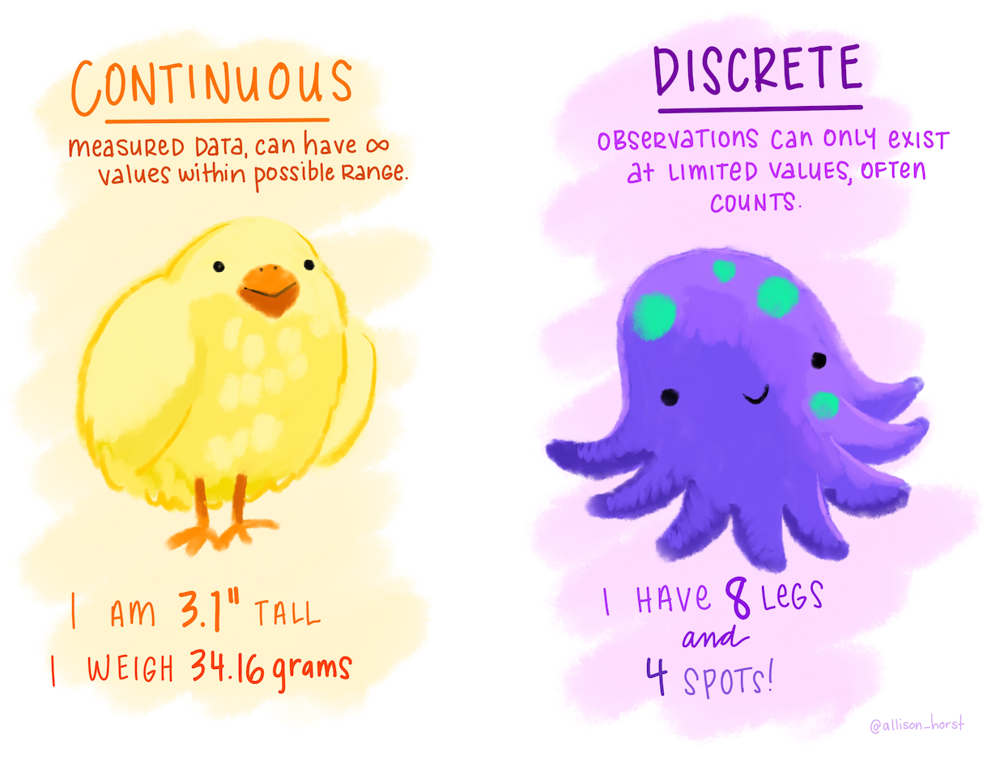
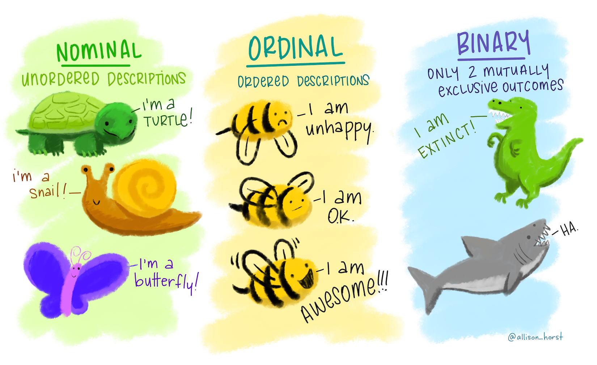
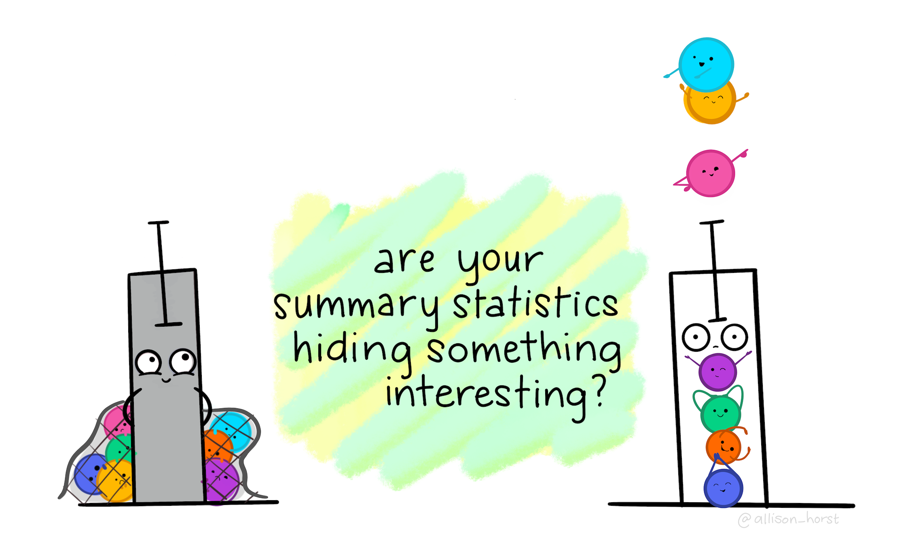

class: middle
background-size: contain

# .tuos_purple[SMI606: Week 2<br>Types of quantification]

### Dr. Calum Webb
#### Sheffield Methods Institute, the University of Sheffield.
#### c.j.webb@sheffield.ac.uk

```{r setup, include=FALSE}
options(htmltools.dir.version = FALSE)
library(icons)
library(tidyverse)
library(plotly)
library(xaringanExtra)
library(xaringanthemer)
knitr::opts_chunk$set(
  fig.width=9, fig.height=3.5, fig.retina=3,
  out.width = "100%",
  cache = FALSE,
  echo = TRUE,
  message = FALSE, 
  warning = FALSE,
  fig.show = TRUE,
  hiline = TRUE
)
```

```{r xaringan-tile-view, echo=FALSE}
xaringanExtra::use_tile_view()
```

```{r xaringan-logo, echo=FALSE}
xaringanExtra::use_logo(
  image_url = "images/uni-sheffield.png",
  exclude_class = c("inverse", "hide_logo")
)
```

```{r xaringan-themer, include=FALSE, warning=FALSE}
library(xaringanthemer)
style_duo_accent(
  primary_color = "#019EE3",
  secondary_color = "#FCF281",
  colors = c(tuos_purple = "#030043", grey = "#a8a8a8", tuos_blue ="#019EE3"),
  header_font_google = xaringanthemer::google_font("Playfair Display", "600", "600i"),
  text_font_google   = xaringanthemer::google_font("Work Sans", "300", "300i"),
  code_font_google   = xaringanthemer::google_font("Lucida Console"),
  header_h1_font_size = "2.25rem",
  header_h2_font_size = "1.75rem",
  header_h3_font_size = "1.5rem"
)

tuos_blue <- "#019EE3"
tuos_yellow <- "#FCF281"
tuos_purple <- "#030043"

```

```{r xaringan-panelset, echo=FALSE}
xaringanExtra::use_panelset()
```

```{r xaringanExtra, echo = FALSE}
xaringanExtra::use_progress_bar(color = "#019EE3", location = "top")
```

```{r xaringan-extra-styles, echo = FALSE}
xaringanExtra::use_extra_styles(
  hover_code_line = TRUE,         #<<
  mute_unhighlighted_code = TRUE  #<<
)
```

```{r share-again, echo=FALSE}
xaringanExtra::use_share_again()
```

```{r metathis, echo=FALSE}
# Add metadata

# library(metathis)
# meta() %>%
#   meta_name("github-repo" = "cjrwebb/cjrwebb.github.io/tree/master/pres/smi") %>% 
#   meta_social(
#     title = "In Defence of Ordinary Help: The declining effectiveness of preventative children's services in England",
#     description = paste(
#       "On average, an additional £40 spent per child on preventative services in a given year was associated with decreases of nearly 5 children in need per 10,000, but this effectiveness has been declining over the decade."
#     ),
#     url = "https://cjrwebb.github.io/pres/smi/smi-research",
#     image = "https://cjrwebb.github.io/pres/smi/idoh-card.png",
#     image_alt = paste(
#       "Title slide of In Defence of Ordinary Help"
#     ),
#     og_type = "website",
#     og_author = "Calum Webb",
#     twitter_card_type = "summary_large_image",
#     twitter_creator = "@cjrwebb",
#     twitter_site = "@cjrwebb"
#   )
```

---
class: middle

.pull-left[
```{r, echo=FALSE, out.width = "80%"}

knitr::include_graphics("images/pg-sign-in.png")

```
]
.pull-right[

<br><br><br><br><br><br>

# Sign In

]
---
class: middle

## Learning Objectives

.panelset[

.panel[.panel-name[What will I learn?]

By the end of this week you will:

* Be able to identify different variables using the continuous/ordinal/categorical typology.

* Be able to relate these variable types to variable classes in `R`.

* Know how a range of descriptive statistics can be used to summarise and simplify large amounts of data, and which ones to use for different types of variable.

* Be able to produce descriptive statistics and basic visualisations of different types of variables using `R`.

]

.panel[.panel-name[How does this week fit into my course?]

* Being able to interpret summary and descriptive statistics is a key skill in quantitative social science, with the first table of any research paper often being a table describing all variables.

* Social researchers regularly make use of descriptive statistics and visualisations to inform their analytical approach.

* Visualising distributions is an important part of checking for outliers, errors, and violated assumptions in statistical modelling. 

]


]


???


---
class: middle

.center[
```{r, echo = FALSE, out.width = "70%"}



```
]

*Illustration by Allison Horst*

---
class: middle

## Continuous and discrete variables in `R`

Continuous and discrete variables are largely handled through the __numeric__ class that we saw in last week's practical.

```{r}

continuous <- c(1.00735, 2.0873, 9.328, 12.4747)
class(continuous)

```

```{r}

discrete <- c(1, 2, 3, 4)
class(discrete)

```

--


However, `R` does have a class of variable with specific functionality for discrete data: integer.

```{r}

as.integer(continuous)

```


---
class: middle 

.center[
```{r, echo = FALSE, out.width = "85%"}



```
]

*Illustration by Allison Horst*

---

## Nominal, Ordinal, and Binary Variables in `R`

There are multiple different ways to handle these kinds of variables in `R`. You can use simple character variables for nominal and binary variables:

```{r}

nominal <- c("turtle", "snail", "butterfly")
class(nominal)

```

---

## Nominal, Ordinal, and Binary Variables in `R`

You can use ordered factors for ordinal variables...

```{r}

ordinal <- factor(c("unhappy", "ok", "awesome"), levels = c("unhappy", "ok", "awesome"),
                  ordered = TRUE)
print(ordinal)
class(ordinal)

```

--

... or simply make a numeric variable that corresponds to their character labels.

```{r}

tibble(label = c("unhappy", "ok", "awesome"), numeric_val = c(1, 2, 3))

```

---

## Nominal, Ordinal, and Binary Variables in `R`

And lastly, we could store our binary variables as either numeric (identified by 0 = false or 1 = true); character; factor; or logical variables...

```{r}

binary_num <- c(1, 0)
binary_chr <- c("extinct", "not extinct")
binary_fct <- factor(c("extinct", "not extinct"), levels = c("not extinct", "extinct"))
binary_lgc <- c(TRUE, FALSE)

tibble(binary_num, binary_chr, binary_fct, binary_lgc)

```

---
class: middle

## Why do we need to know 'types' of variable?

### .tuos_purple[The kinds of statistical methods and data visualisations we need to use depends on the type of variable we are analysing/visualising.]

### .tuos_purple[Knowing this will also help us know how we need to tidy our data in `R` before we can analyse it.]


---
class: middle, inverse

``` {r hse-prep, include=FALSE}
library(tidyverse)
library(haven)
library(labelled)

options(max.print = 999)
options(width = 45)

hse_cleaned <- read_dta("hse-2011.dta") %>%
  user_na_to_na() %>%
  unlabelled() %>%
  janitor::clean_names() %>%
  filter(age > 16) 

hse_cleaned <- hse_cleaned %>%
  select(hserial, pserial, tenureb, sex, age, topqual3, econact, 
         nssec8, eth_origin = origin, totinc, eqvinc, say_wgt, 
         say_diet, htval, wtval, omsysval, omdiaval, dnnow, totalwu,
         porfv, cigst1, cigst2, cigs, health, marital, employed, fruitveg)

```

.pull-left[

<br><br><br><br><br><br><br>

### .tuos_blue[Univariate Descriptive Statistics]<br>.tuos_purple[Measures of Central Tendency]

* Summarising data using the most frequent response.

]

.pull-right[

#### How do we effectively communicate this?
 
Percentage of children in poverty
 
```{r, out.width=200, echo = FALSE}

idaci <- read_csv("idaci.csv", skip = 7) %>%
  select(-1) %>%
  dplyr::rename(lad = 1, idaci = 2) %>%
  mutate(idaci = idaci*100)

head(idaci$idaci, 200)

```


]

---

## Univariate Descriptive Statistics<br>.tuos_purple[Measures of Central Tendency]

<br>

```{r, echo = FALSE}

idaci %>%
  ggplot() +
  geom_histogram(aes(x = idaci), col = "darkgrey", fill = "transparent") +
  scale_y_continuous(limits = c(0, 30)) +
  theme_minimal() +
  xlab("Income Deprivation Affecting Children Index (% in low income)") +
  ylab("Frequency")

```

---

## Univariate Descriptive Statistics<br>.tuos_purple[Measures of Central Tendency]

<br>

```{r, echo = FALSE}

# Change to IDACI

idaci %>%
  ggplot() +
  geom_histogram(aes(x = idaci), col = "darkgrey", fill = "transparent") +
  geom_vline(xintercept = mean(idaci$idaci, na.rm = TRUE), col = tuos_blue) +
  scale_y_continuous(limits = c(0, 30)) +
  annotate("text", x = mean(idaci$idaci, na.rm=TRUE) + 0.5, y = 26, 
           label = paste("Mean IDACI:", round(mean(idaci$idaci, na.rm = FALSE), 1)),
           hjust = 0, colour = tuos_blue) +
  theme_minimal() +
  xlab("Income Deprivation Affecting Children Index (% in low income)") +
  ylab("Frequency")


```


---

## Univariate Descriptive Statistics<br>.tuos_purple[Measures of Central Tendency]

<br>

```{r, echo = FALSE}

# Change to IDACI

idaci %>%
  ggplot() +
  geom_histogram(aes(x = idaci), col = "darkgrey", fill = "transparent") +
  geom_vline(xintercept = mean(idaci$idaci, na.rm = TRUE), col = "darkgrey") +
  scale_y_continuous(limits = c(0, 30)) +
  annotate("text", x = mean(idaci$idaci, na.rm=TRUE) + 0.5, y = 26, 
           label = paste("Mean IDACI:", round(mean(idaci$idaci, na.rm = FALSE), 1)),
           hjust = 0, colour = "darkgrey") +
  geom_vline(xintercept = median(idaci$idaci, na.rm = TRUE), col = tuos_blue) +
  annotate("text", x = mean(idaci$idaci, na.rm=TRUE) + 0.5, y = 24, 
           label = paste("Median IDACI:", round(median(idaci$idaci, na.rm = FALSE), 1)),
           hjust = 0, colour = tuos_blue) +
  theme_minimal() +
  xlab("Income Deprivation Affecting Children Index (% in low income)") +
  ylab("Frequency")


```


---

## Univariate Descriptive Statistics<br>.tuos_purple[Measures of Central Tendency]

<br>

```{r, include=FALSE}

options(width = 80)

```

```{r, echo = FALSE}

library(modeest)

# mfv(round(idaci$idaci, 0), na_rm = TRUE)

# Change to IDACI

idaci %>%
  ggplot() +
  geom_histogram(aes(x = idaci), col = "darkgrey", fill = "transparent") +
  geom_vline(xintercept = mean(idaci$idaci, na.rm = TRUE), col = "darkgrey") +
  scale_y_continuous(limits = c(0, 30)) +
  annotate("text", x = mean(idaci$idaci, na.rm=TRUE) + 0.5, y = 26, 
           label = paste("Mean IDACI:", round(mean(idaci$idaci, na.rm = FALSE), 1)),
           hjust = 0, colour = "darkgrey") +
  geom_vline(xintercept = median(idaci$idaci, na.rm = TRUE), col = "darkgrey") +
  annotate("text", x = mean(idaci$idaci, na.rm=TRUE) + 0.5, y = 24, 
           label = paste("Median IDACI:", round(median(idaci$idaci, na.rm = FALSE), 1)),
           hjust = 0, colour = "darkgrey") +
  geom_vline(xintercept = mfv(round(idaci$idaci, 0), na_rm = TRUE), col = tuos_blue) +
  annotate("text", x = mean(idaci$idaci, na.rm=TRUE) + 0.5, y = 22, 
           label = paste("Mode IDACI:", mfv(round(idaci$idaci, 0), na_rm = TRUE)),
           hjust = 0, colour = tuos_blue) +
  theme_minimal() +
  xlab("Income Deprivation Affecting Children Index (% in low income)") +
  ylab("Frequency")


```


---

## Univariate Descriptive Statistics<br>.tuos_purple[Measures of Central Tendency]


<br><br>

```{r}

library(modeest) # Package for calculating the mode

hse_cleaned %>%
  summarise(
    height_mean =   mean(htval,    na.rm = TRUE), # Height
    topqual3_mode = mfv(topqual3,  na.rm = TRUE), # Qualifications
    eqvinc_mean =   mean(eqvinc,   na.rm = TRUE), # Income
    eqvinc_median = median(eqvinc, na.rm = TRUE)  # Income
            )

```

---

## Univariate Descriptive Statistics<br>.tuos_purple[Measures of Central Tendency]

<br><br>

```{r}

library(modeest)

hse_cleaned %>%
  summarise(
    height_mean =   mean(htval,    na.rm = TRUE), # Height #<<
    topqual3_mode = mfv(topqual3,  na.rm = TRUE), # Qualifications
    eqvinc_mean =   mean(eqvinc,   na.rm = TRUE), # Income
    eqvinc_median = median(eqvinc, na.rm = TRUE)  # Income
            )

```

---

## Univariate Descriptive Statistics<br>.tuos_purple[Measures of Central Tendency]

<br><br>

```{r}

library(modeest)

hse_cleaned %>%
  summarise(
    height_mean =   mean(htval,    na.rm = TRUE), # Height 
    topqual3_mode = mfv(topqual3,  na.rm = TRUE), # Qualifications #<<
    eqvinc_mean =   mean(eqvinc,   na.rm = TRUE), # Income
    eqvinc_median = median(eqvinc, na.rm = TRUE)  # Income
            )

```

---

## Univariate Descriptive Statistics<br>.tuos_purple[Measures of Central Tendency]

<br><br>

```{r}

library(modeest)

hse_cleaned %>%
  summarise(
    height_mean =   mean(htval,    na.rm = TRUE), # Height 
    topqual3_mode = mfv(topqual3,  na.rm = TRUE), # Qualifications 
    eqvinc_mean =   mean(eqvinc,   na.rm = TRUE), # Income #<<
    eqvinc_median = median(eqvinc, na.rm = TRUE)  # Income
            )

```

---

## Univariate Descriptive Statistics<br>.tuos_purple[Measures of Central Tendency]

<br><br>

```{r}

library(modeest)

hse_cleaned %>%
  summarise(
    height_mean =   mean(htval,    na.rm = TRUE), # Height 
    topqual3_mode = mfv(topqual3,  na.rm = TRUE), # Qualifications 
    eqvinc_mean =   mean(eqvinc,   na.rm = TRUE), # Income 
    eqvinc_median = median(eqvinc, na.rm = TRUE)  # Income #<<
            )


```

---

## Univariate Descriptive Statistics<br>.tuos_purple[Measures of Central Tendency]

```{r, echo = FALSE}

hse_cleaned %>%
  ggplot() +
  geom_histogram(aes(x = htval), col = "darkgrey", fill = "transparent") +
  geom_vline(xintercept = mean(hse_cleaned$htval, na.rm = TRUE), col = tuos_blue) +
  annotate("text", x = mean(hse_cleaned$htval, na.rm = TRUE) + 1,
           y = 750, label = paste("Mean: ", round(mean(hse_cleaned$htval, na.rm = TRUE), 0)),
           col = tuos_blue, hjust = 0) +
  scale_y_continuous(limits = c(0, 800)) +
  theme_minimal() +
  xlab("Height distribution Age > 16 (in Health Survey England), cm") +
  ylab("Frequency")

```

---

## Univariate Descriptive Statistics<br>.tuos_purple[Measures of Central Tendency]

```{r, echo = FALSE}

hse_cleaned %>%
  ggplot() +
  geom_histogram(aes(x = htval), col = "darkgrey", fill = "transparent") +
  geom_vline(xintercept = mean(hse_cleaned$htval, na.rm = TRUE), col = "darkgrey") +
  annotate("text", x = mean(hse_cleaned$htval, na.rm = TRUE) + 1,
           y = 750, label = paste("Mean: ", round(mean(hse_cleaned$htval, na.rm = TRUE), 0)),
           col = "darkgrey", hjust = 0) +
  geom_vline(xintercept = median(hse_cleaned$htval, na.rm = TRUE), col = tuos_blue) +
  annotate("text", x = mean(hse_cleaned$htval, na.rm = TRUE) + 1,
           y = 700, label = paste("Median: ", round(median(hse_cleaned$htval, na.rm = TRUE), 0)),
           col = tuos_blue, hjust = 0) +
  scale_y_continuous(limits = c(0, 800)) +
  theme_minimal() +
  xlab("Height distribution Age > 16 (in Health Survey England), cm") +
  ylab("Frequency")

```

---

## Univariate Descriptive Statistics<br>.tuos_purple[Measures of Central Tendency]

```{r, echo = FALSE}

mode_height <- mfv(hse_cleaned$htval, na.rm = TRUE)

hse_cleaned %>%
  ggplot() +
  geom_histogram(aes(x = htval), col = "darkgrey", fill = "transparent") +
  geom_vline(xintercept = mean(hse_cleaned$htval, na.rm = TRUE), col = "darkgrey") +
  annotate("text", x = mean(hse_cleaned$htval, na.rm = TRUE) + 1,
           y = 750, label = paste("Mean: ", round(mean(hse_cleaned$htval, na.rm = TRUE), 0)),
           col = "darkgrey", hjust = 0) +
  geom_vline(xintercept = median(hse_cleaned$htval, na.rm = TRUE), col = "darkgrey") +
  annotate("text", x = mean(hse_cleaned$htval, na.rm = TRUE) + 1,
           y = 700, label = paste("Median: ", round(median(hse_cleaned$htval, na.rm = TRUE), 0)),
           col = "darkgrey", hjust = 0) +
  geom_vline(xintercept = mode_height, col = tuos_blue) +
  annotate("text", x = mean(hse_cleaned$htval, na.rm = TRUE) + 1,
           y = 650, label = paste("Mode: ", mode_height),
           col = tuos_blue, hjust = 0) +
  scale_y_continuous(limits = c(0, 800)) +
  theme_minimal() +
  xlab("Height distribution Age > 16 (in Health Survey England), cm") +
  ylab("Frequency")

```

---
class: inverse, middle


## When a continuous/integer variable is normally distributed, the mean, median, and mode should all align.


---

## Univariate Descriptive Statistics<br>.tuos_purple[Measures of Central Tendency]

```{r, echo = FALSE}

mode_income <- mfv(round(hse_cleaned$eqvinc, 0), na.rm = TRUE)

hse_cleaned %>%
  ggplot() +
  geom_histogram(aes(x = eqvinc), col = "darkgrey", fill = "transparent", bins = 50) +
  geom_vline(xintercept = mean(hse_cleaned$eqvinc, na.rm = TRUE), col = tuos_blue) +
  annotate("text", x = mean(hse_cleaned$eqvinc, na.rm = TRUE) + 10000,
           y = 1750, label = paste("Mean: ", round(mean(hse_cleaned$eqvinc, na.rm = TRUE), 0)),
           col = tuos_blue, hjust = 0) +
  geom_vline(xintercept = median(hse_cleaned$eqvinc, na.rm = TRUE), col = "grey50") +
  annotate("text", x = mean(hse_cleaned$eqvinc, na.rm = TRUE) + 10000,
           y = 1500, label = paste("Median: ", round(median(hse_cleaned$eqvinc, na.rm = TRUE), 0)),
           col = "grey50", hjust = 0) +
  geom_vline(xintercept = mode_income, col = tuos_purple) +
  annotate("text", x = mean(hse_cleaned$eqvinc, na.rm = TRUE) + 10000,
           y = 1250, label = paste("Mode: ", mode_income),
           col = tuos_purple, hjust = 0) +
  scale_y_continuous(limits = c(0, 2000)) +
  theme_minimal() +
  xlab("Income distribution Age > 16 (in Health Survey England), £ equivalised") +
  ylab("Frequency")

```

---

```{r, echo = FALSE}



```

---
class: inverse, middle


## When a continuous/integer variable is __.tuos_purple[not]__ normally distributed (it is skewed), the mean, median, and mode do not align.

---

## Univariate Descriptive Statistics<br>.tuos_purple[Measures of Central Tendency/Summary Statistics]

.pull-left[

#### What about nominal/categorical variables?

1. For more than two categories, we can still use the mode.

2. .grey[For two categories stored as a logical variable (a binary variable), we can use the mean to calculate the proportion of each category.]

3. .grey[We can use this same logic to create the proportion of all possible options in the categories (your typical percentages).]

]

.pull-right[

```{r, echo = FALSE}

options(width = 45)

```

```{r}

mfv(hse_cleaned$econact, na.rm = TRUE)

```


]

???

Categorical/Ordinal variables

---

## Univariate Descriptive Statistics<br>.tuos_purple[Measures of Central Tendency/Summary Statistics]

.pull-left[

#### What about nominal/categorical variables?

1. .grey[For more than two categories, we can still use the mode.]

2. For two categories stored as a logical variable (a binary variable), we can use the mean to calculate the proportion of each category.

3. .grey[We can use this same logic to create the proportion of all possible options in the categories (your typical percentages).]

]

.pull-right[

```{r, echo = FALSE}

options(width = 45)

```

```{r}

hse_cleaned <- hse_cleaned %>%
  mutate(
    employed_lgc = ifelse(
      test = employed == "1. Employed", 
      yes = TRUE, 
      no = FALSE)
  )

mean(hse_cleaned$employed_lgc, na.rm = TRUE)

```


]

???

Categorical/Ordinal variables

---

## Univariate Descriptive Statistics<br>.tuos_purple[Measures of Central Tendency/Summary Statistics]

.pull-left[

#### What about nominal/categorical variables?

1. .grey[For more than two categories, we can still use the mode.]

2. .grey[For two categories stored as a logical variable (a binary variable), we can use the mean to calculate the proportion of each category.]

3. We can use this same logic to create the proportion of all possible options in the categories (your typical percentages).

]

.pull-right[


```{r}

options(width = 40)

hse_cleaned %>%
  sjmisc::to_dummy("econact", 
                   suffix = "label") %>%
  janitor::clean_names() %>%
  summarise_all(~mean(., na.rm = TRUE))

```


]

---

## Univariate Descriptive Statistics<br>.tuos_purple[Measures of Central Tendency/Summary Statistics]

.pull-left[

#### What about nominal/categorical variables?

1. For more than two categories, we can still use the mode.

2. For two categories stored as a logical variable (a binary variable), we can use the mean to calculate the proportion of each category.

3. We can use this same logic to create the proportion of all possible options in the categories (your typical percentages).

]

.pull-right[


```{r, echo = FALSE, out.height=450, out.width = 500, dpi = 72, fig.height=4.5, fig.width=5}

hse_cleaned %>%
  ggplot(aes(econact)) +
  geom_bar(aes(y = ..count../sum(..count..), fill = econact)) +
  scale_xaringan_fill_discrete() +
  scale_y_continuous(labels=scales::percent_format(), breaks = seq(0, 0.6, 0.1)) +
  theme_minimal() +
  coord_flip() +
  ylab("Percentage of Survey Sample") +
  theme(legend.position = "none")

```


]


---

## Univariate Descriptive Statistics<br>.tuos_purple[Measures of Central Tendency/Summary Statistics]

.pull-left[

#### What about ordinal variables?

1. You can still use the mean, but it is unlikely to give a 'valid' value.

2. You can use the median for the numeric equivalent for the value.

3. You can use the mode for either the character equivalent or the numeric equivalent.

]

.pull-right[

```{r}

hse_cleaned %>%
  mutate(
    health_nm = as.numeric(health)
  ) %>%
  summarise(
    health_mean = mean(health_nm, 
                       na.rm = TRUE),
    health_med = median(health_nm, 
                       na.rm = TRUE),
    health_mfv = mfv(health,
                     na.rm = TRUE)
  )

unique(hse_cleaned$health)

```

]
 
---

## Univariate Descriptive Statistics<br>.tuos_purple[Measures of Central Tendency/Summary Statistics]

.pull-left[

#### What about ordinal variables?

1. You can still use the mean, but it is unlikely to give a 'valid' value.

2. You can use the median for the numeric equivalent for the value.

3. You can use the mode for either the character equivalent or the numeric equivalent.

]

.pull-right[

```{r, echo = FALSE, out.height=450, out.width = 500, dpi = 72, fig.height=4.5, fig.width=5}

hse_cleaned %>%
  mutate(
    health_nm = as.numeric(health)
  ) %>%
  ggplot() +
  geom_bar(aes(x = health, fill = health)) +
  scale_xaringan_fill_discrete() +
  theme_minimal() +
  theme(legend.position = "bottom")

```


]

```{r, echo = FALSE}

options(width = 45)

```


---

## Univariate Descriptive Statistics<br>.tuos_purple[Measures of Dispersion]

<br>

```{r, echo = FALSE}

idaci %>%
  ggplot() +
  geom_histogram(aes(x = idaci), col = "darkgrey", fill = "transparent") +
  geom_vline(xintercept = mean(idaci$idaci, na.rm = TRUE), col = "darkgrey") +
  annotate("rect", xmin = 2, xmax = 15, 
            ymin = 0, ymax = 30.3, alpha = 0.2) +
  annotate("rect", xmin = 15.6, xmax = 34, 
            ymin = 0, ymax = 23, alpha = 0.2) +
  scale_y_continuous(limits = c(0, 31)) +
  annotate("text", x = mean(idaci$idaci, na.rm=TRUE) + 0.5, y = 26, 
           label = paste("Mean IDACI:", round(mean(idaci$idaci, na.rm = FALSE), 1)),
           hjust = 0, colour = "darkgrey") +
  theme_minimal() +
  xlab("Income Deprivation Affecting Children Index (% in low income)") +
  ylab("Frequency")

```

???

Distribution, std deviation 

---

class: middle


## .tuos_purple[If a variable is approximately normally distributed we can describe its dispersion around the mean using 'standard deviation'.]

```{r}

sd(idaci$idaci)

```

---


## Univariate Descriptive Statistics<br>.tuos_purple[Measures of Dispersion]

```{r, echo=FALSE}

StatAreaUnderDensity <- ggproto(
  "StatAreaUnderDensity", Stat,
  required_aes = "x",
  compute_group = function(data, scales, xlim = NULL, n = 50) {
    fun <- approxfun(density(data$x))
    StatFunction$compute_group(data, scales, fun = fun, xlim = xlim, n = n)
  }
)

stat_aud <- function(mapping = NULL, data = NULL, geom = "area",
                    position = "identity", na.rm = FALSE, show.legend = NA, 
                    inherit.aes = TRUE, n = 50, xlim=NULL,  
                    ...) {
  layer(
    stat = StatAreaUnderDensity, data = data, mapping = mapping, geom = geom, 
    position = position, show.legend = show.legend, inherit.aes = inherit.aes,
    params = list(xlim = xlim, n = n, ...))
}

set.seed(10000)
normal_dist <- rnorm(100000)
normal_dist <- tibble(x = normal_dist)

ggplot(data = normal_dist, aes(x)) +
  #stat_aud(geom = "area",
   #        xlim = c(-1, 1), fill = tuos_blue, alpha = 0.3) +
  #annotate("text", x = 1, y = 0.35, label = "About 68% within\n1 Standard Deviation", hjust = 0) +
  stat_function(fun = dnorm, n = 101, args = list(mean = 0, sd = 1), size = 1) + 
  ylab("") +
  scale_y_continuous(breaks = NULL) +
  scale_x_continuous(breaks = c(-3, -2, -1, 0, 1, 2, 3),
                     labels = c("-3SD", "-2SD", "-1SD", "Mean", "+1SD", "+2SD", "+3SD"),
                     minor_breaks = NULL) +
  xlab("") +
  ggtitle("The Empirical Rule (68, 95, 99.7 Rule)") +
  theme_minimal()

```

---

## Univariate Descriptive Statistics<br>.tuos_purple[Measures of Dispersion]

```{r, echo=FALSE}

StatAreaUnderDensity <- ggproto(
  "StatAreaUnderDensity", Stat,
  required_aes = "x",
  compute_group = function(data, scales, xlim = NULL, n = 50) {
    fun <- approxfun(density(data$x))
    StatFunction$compute_group(data, scales, fun = fun, xlim = xlim, n = n)
  }
)

stat_aud <- function(mapping = NULL, data = NULL, geom = "area",
                    position = "identity", na.rm = FALSE, show.legend = NA, 
                    inherit.aes = TRUE, n = 50, xlim=NULL,  
                    ...) {
  layer(
    stat = StatAreaUnderDensity, data = data, mapping = mapping, geom = geom, 
    position = position, show.legend = show.legend, inherit.aes = inherit.aes,
    params = list(xlim = xlim, n = n, ...))
}

set.seed(10000)
normal_dist <- rnorm(100000)
normal_dist <- tibble(x = normal_dist)

ggplot(data = normal_dist, aes(x)) +
  stat_aud(geom = "area",
           xlim = c(-1, 1), fill = tuos_blue, alpha = 0.3) +
  annotate("text", x = 1, y = 0.35, label = "About 68% within\n1 Standard Deviation", hjust = 0) +
  stat_function(fun = dnorm, n = 101, args = list(mean = 0, sd = 1), size = 1) + 
  ylab("") +
  scale_y_continuous(breaks = NULL) +
  scale_x_continuous(breaks = c(-3, -2, -1, 0, 1, 2, 3),
                     labels = c("-3SD", "-2SD", "-1SD", "Mean", "+1SD", "+2SD", "+3SD"),
                     minor_breaks = NULL) +
  xlab("") +
  ggtitle("The Empirical Rule (68, 95, 99.7 Rule)") +
  theme_minimal()

```


---

## Univariate Descriptive Statistics<br>.tuos_purple[Measures of Dispersion]

```{r, echo=FALSE}

StatAreaUnderDensity <- ggproto(
  "StatAreaUnderDensity", Stat,
  required_aes = "x",
  compute_group = function(data, scales, xlim = NULL, n = 50) {
    fun <- approxfun(density(data$x))
    StatFunction$compute_group(data, scales, fun = fun, xlim = xlim, n = n)
  }
)

stat_aud <- function(mapping = NULL, data = NULL, geom = "area",
                    position = "identity", na.rm = FALSE, show.legend = NA, 
                    inherit.aes = TRUE, n = 50, xlim=NULL,  
                    ...) {
  layer(
    stat = StatAreaUnderDensity, data = data, mapping = mapping, geom = geom, 
    position = position, show.legend = show.legend, inherit.aes = inherit.aes,
    params = list(xlim = xlim, n = n, ...))
}

set.seed(10000)
normal_dist <- rnorm(100000)
normal_dist <- tibble(x = normal_dist)

ggplot(data = normal_dist, aes(x)) +
  stat_aud(geom = "area",
           xlim = c(-2, 2), fill = tuos_blue, alpha = 0.3) +
  annotate("text", x = 1, y = 0.35, label = "About 95% within\n2 Standard Deviations", hjust = 0) +
  stat_function(fun = dnorm, n = 101, args = list(mean = 0, sd = 1), size = 1) + 
  ylab("") +
  scale_y_continuous(breaks = NULL) +
  scale_x_continuous(breaks = c(-3, -2, -1, 0, 1, 2, 3),
                     labels = c("-3SD", "-2SD", "-1SD", "Mean", "+1SD", "+2SD", "+3SD"),
                     minor_breaks = NULL) +
  xlab("") +
  ggtitle("The Empirical Rule (68, 95, 99.7 Rule)") +
  theme_minimal()

```

---

## Univariate Descriptive Statistics<br>.tuos_purple[Measures of Dispersion]

```{r, echo=FALSE}

StatAreaUnderDensity <- ggproto(
  "StatAreaUnderDensity", Stat,
  required_aes = "x",
  compute_group = function(data, scales, xlim = NULL, n = 50) {
    fun <- approxfun(density(data$x))
    StatFunction$compute_group(data, scales, fun = fun, xlim = xlim, n = n)
  }
)

stat_aud <- function(mapping = NULL, data = NULL, geom = "area",
                    position = "identity", na.rm = FALSE, show.legend = NA, 
                    inherit.aes = TRUE, n = 50, xlim=NULL,  
                    ...) {
  layer(
    stat = StatAreaUnderDensity, data = data, mapping = mapping, geom = geom, 
    position = position, show.legend = show.legend, inherit.aes = inherit.aes,
    params = list(xlim = xlim, n = n, ...))
}

set.seed(10000)
normal_dist <- rnorm(100000)
normal_dist <- tibble(x = normal_dist)

ggplot(data = normal_dist, aes(x)) +
  stat_aud(geom = "area",
           xlim = c(-3, 3), fill = tuos_blue, alpha = 0.3) +
  annotate("text", x = 1, y = 0.35, label = "About 99.7% within\n3 Standard Deviations", hjust = 0) +
  stat_function(fun = dnorm, n = 101, args = list(mean = 0, sd = 1), size = 1) + 
  ylab("") +
  scale_y_continuous(breaks = NULL) +
  scale_x_continuous(breaks = c(-3, -2, -1, 0, 1, 2, 3),
                     labels = c("-3SD", "-2SD", "-1SD", "Mean", "+1SD", "+2SD", "+3SD"),
                     minor_breaks = NULL) +
  xlab("") +
  ggtitle("The Empirical Rule (68, 95, 99.7 Rule)") +
  theme_minimal()

```


---

## Univariate Descriptive Statistics<br>.tuos_purple[Measures of Dispersion]

<br>

```{r, echo = FALSE}

set.seed(1000)
sim_idaci <- tibble(x = rnorm(n = 371, mean = 15.3, sd = 5.977357))
bw <- 1
n_obs <- 317

idaci %>%
  ggplot() +
  geom_histogram(aes(x = idaci), col = "darkgrey", fill = "transparent", binwidth = 1) +
  stat_function(fun = function(x) 
      dnorm(x, mean = mean(idaci$idaci, na.rm=TRUE), 
                       sd = sd(idaci$idaci, na.rm = TRUE)) * bw * n_obs) +
  geom_vline(xintercept = mean(idaci$idaci, na.rm = TRUE), col = "darkgrey") +
  scale_y_continuous(limits = c(0, 31)) +
  scale_x_continuous(limits = c(0, 35)) +
  annotate("text", x = mean(idaci$idaci, na.rm=TRUE) + 0.5, y = 26, 
           label = paste("Mean IDACI:", round(mean(idaci$idaci, na.rm = FALSE), 0),
                         "\nStd.Dev.: 6"),
           hjust = 0, colour = "darkgrey") +
  theme_minimal() +
  xlab("Income Deprivation Affecting Children Index (% in low income)") +
  ylab("Frequency")

```

---

## Univariate Descriptive Statistics<br>.tuos_purple[Measures of Dispersion]

<br>

```{r, echo = FALSE}

idaci2 <- idaci %>%
  mutate(
    idaci_1sd = ifelse(idaci > (15-6) & idaci < (15+6), TRUE, FALSE),
    idaci_2sd = ifelse(idaci > (15-(2*6)) & idaci < (15+(2*6)), TRUE, FALSE),
    idaci_3sd = ifelse(idaci > (15-(3*6)) & idaci < (15+(3*6)), TRUE, FALSE)
  )

# Figure out how to shade under this curve

idaci2 %>%
  ggplot(aes(x = idaci)) +
  geom_histogram(aes(x = idaci, fill = idaci_1sd), col = "darkgrey", binwidth = 1,
                 alpha = 0.4) +
  stat_function(fun = function(x) 
      dnorm(x, mean = mean(idaci$idaci, na.rm=TRUE), 
                       sd = sd(idaci$idaci, na.rm = TRUE)) * bw * n_obs) +
  geom_vline(xintercept = mean(idaci$idaci, na.rm = TRUE), col = "darkgrey") +
  stat_aud(geom = "area",
           xlim = c(10, 20), n = 317, fill = tuos_blue, alpha = 0.3) +
  scale_y_continuous(limits = c(0, 31)) +
  scale_x_continuous(limits = c(0, 35)) +
  scale_fill_manual(values = c("transparent", tuos_blue)) +
  annotate("text", x = mean(idaci$idaci, na.rm=TRUE) + 0.5, y = 26, 
           label = paste("Mean IDACI:", round(mean(idaci$idaci, na.rm = FALSE), 0),
                         "\nStd.Dev.: 6"),
           hjust = 0, colour = "darkgrey") +
  theme_minimal() +
  theme(legend.position = "none") +
  xlab("Income Deprivation Affecting Children Index (% in low income)") +
  ylab("Frequency")

```


---

## Univariate Descriptive Statistics<br>.tuos_purple[Measures of Dispersion]

<br>

```{r, echo = FALSE}

# Figure out how to shade under this curve

idaci2 %>%
  ggplot(aes(x = idaci)) +
  geom_histogram(aes(x = idaci, fill = idaci_2sd), col = "darkgrey", binwidth = 1,
                 alpha = 0.4) +
  stat_function(fun = function(x) 
      dnorm(x, mean = mean(idaci$idaci, na.rm=TRUE), 
                       sd = sd(idaci$idaci, na.rm = TRUE)) * bw * n_obs) +
  geom_vline(xintercept = mean(idaci$idaci, na.rm = TRUE), col = "darkgrey") +
  stat_aud(geom = "area",
           xlim = c(10, 20), n = 317, fill = tuos_blue, alpha = 0.3) +
  scale_y_continuous(limits = c(0, 31)) +
  scale_x_continuous(limits = c(0, 35)) +
  scale_fill_manual(values = c("transparent", tuos_blue)) +
  annotate("text", x = mean(idaci$idaci, na.rm=TRUE) + 0.5, y = 26, 
           label = paste("Mean IDACI:", round(mean(idaci$idaci, na.rm = FALSE), 0),
                         "\nStd.Dev.: 6"),
           hjust = 0, colour = "darkgrey") +
  theme_minimal() +
  theme(legend.position = "none") +
  xlab("Income Deprivation Affecting Children Index (% in low income)") +
  ylab("Frequency")

```


---

## Univariate Descriptive Statistics<br>.tuos_purple[Measures of Dispersion]

<br>

```{r, echo = FALSE}

# Figure out how to shade under this curve

idaci2 %>%
  ggplot(aes(x = idaci)) +
  geom_histogram(aes(x = idaci, fill = idaci_3sd), col = "darkgrey", binwidth = 1,
                 alpha = 0.4) +
  stat_function(fun = function(x) 
      dnorm(x, mean = mean(idaci$idaci, na.rm=TRUE), 
                       sd = sd(idaci$idaci, na.rm = TRUE)) * bw * n_obs) +
  geom_vline(xintercept = mean(idaci$idaci, na.rm = TRUE), col = "darkgrey") +
  stat_aud(geom = "area",
           xlim = c(10, 20), n = 317, fill = tuos_blue, alpha = 0.3) +
  scale_y_continuous(limits = c(0, 31)) +
  scale_x_continuous(limits = c(0, 35)) +
  scale_fill_manual(values = c(tuos_blue)) +
  annotate("text", x = mean(idaci$idaci, na.rm=TRUE) + 0.5, y = 26, 
           label = paste("Mean IDACI:", round(mean(idaci$idaci, na.rm = FALSE), 0),
                         "\nStd.Dev.: 6"),
           hjust = 0, colour = "darkgrey") +
  theme_minimal() +
  theme(legend.position = "none") +
  xlab("Income Deprivation Affecting Children Index (% in low income)") +
  ylab("Frequency")

```


---

## Univariate Descriptive Statistics<br>.tuos_purple[Measures of Dispersion]

```{r}

# Mean = ~15
# Standard deviation = ~6

idaci %>%
    mutate(
    idaci_1sd = ifelse(idaci > (15-(1*6)) & idaci < (15+(1*6)), TRUE, FALSE),
    idaci_2sd = ifelse(idaci > (15-(2*6)) & idaci < (15+(2*6)), TRUE, FALSE),
    idaci_3sd = ifelse(idaci > (15-(3*6)) & idaci < (15+(3*6)), TRUE, FALSE)
  )

```


---

## Univariate Descriptive Statistics<br>.tuos_purple[Measures of Dispersion]

```{r}

# Mean = ~15
# Standard deviation = ~6

idaci %>%
    mutate(
    idaci_1sd = ifelse(idaci > (15-(1*6)) & idaci < (15+(1*6)), TRUE, FALSE),
    idaci_2sd = ifelse(idaci > (15-(2*6)) & idaci < (15+(2*6)), TRUE, FALSE),
    idaci_3sd = ifelse(idaci > (15-(3*6)) & idaci < (15+(3*6)), TRUE, FALSE)
  ) %>%
  summarise_all(
    ~mean(., na.rm = TRUE)
  )

```

#### The Empirical Rule states that within __1 standard deviation__ should be approx __68%__ of observations, within __2 standard deviations__ should be around __95%__ of observations, within __3 standard deviations__ should be around __99.7%__ of observations.

---
class: middle

```{r, include=FALSE}

options(width = 100)

# Data for workshop

#hse_reduced <- hse_cleaned %>%
#  select(hserial, pserial, tenureb, sex, age, topqual3, econact, nssec8, eth_origin,
#         eqvinc, htval, wtval, omsysval, omdiaval, porfv, cigs, health, marital, employed_lgc)

#write_rds(hse_reduced, file = "../week-2-exercises/week-2/www/hse_reduced.rds")

```


## Week 2 `R` Exercises

* Today we will be using a different kind of tutorial that can be accessed through a web browser, e.g. by clicking [here](https://webb.shinyapps.io/week-2/) or clicking the link on the Blackboard page.

* __Follow this tutorial__ to learn how to calculate univariate descriptive statistics and visualise single variables in `R` using a few different methods.

* If you finish the tutorial with a lot of time remaining, __try out the Week 2 challenge__!
