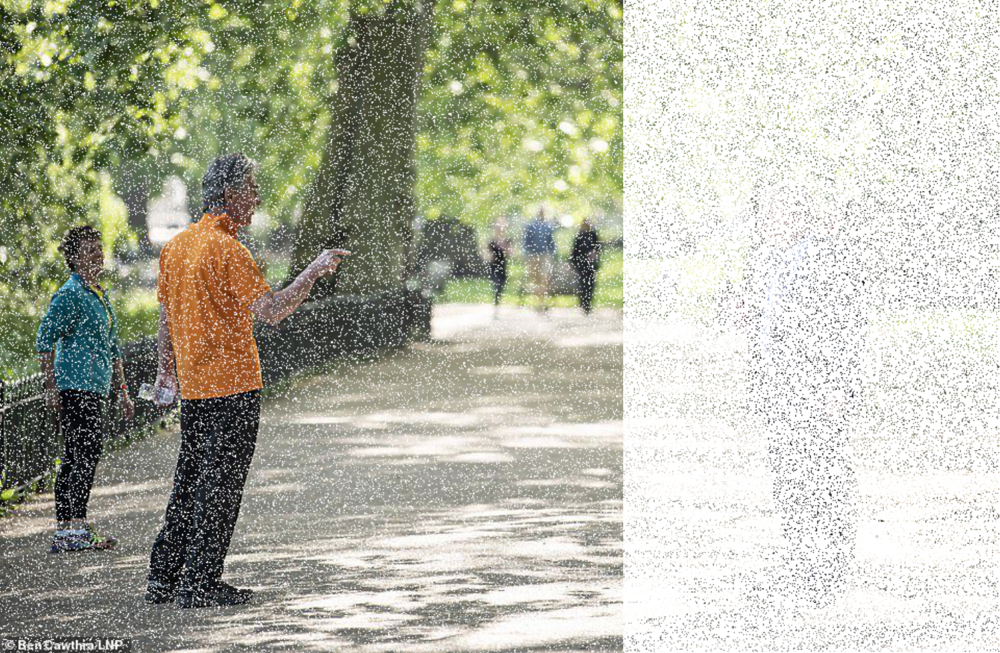
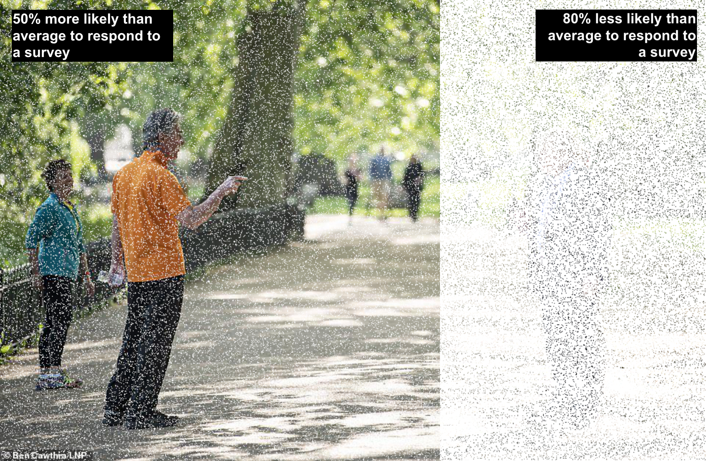
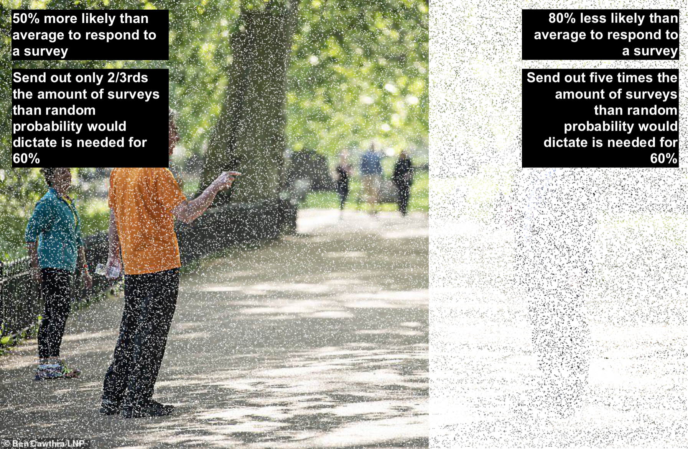
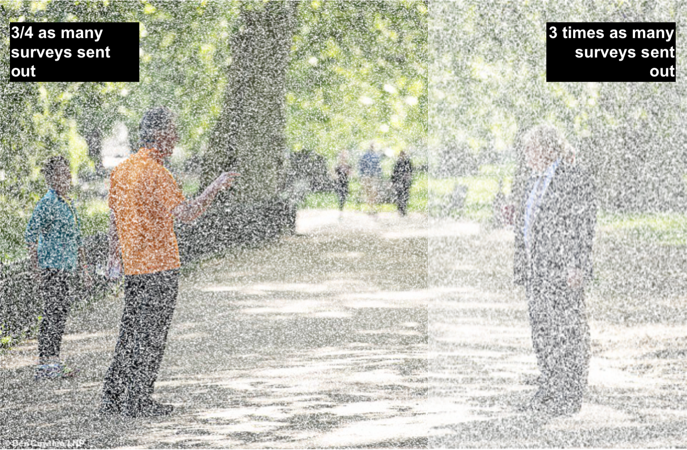
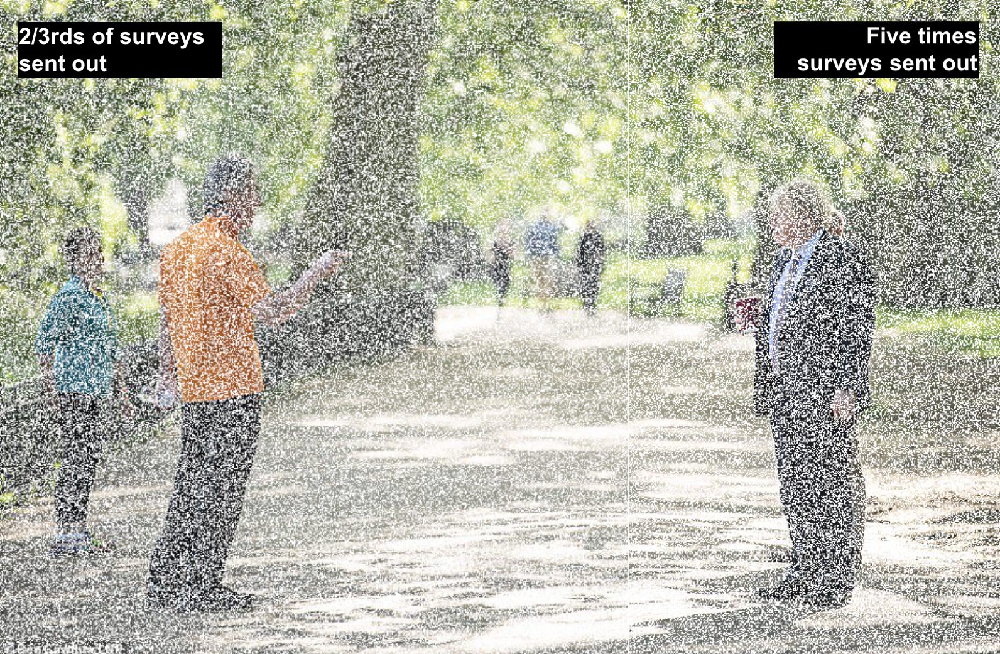
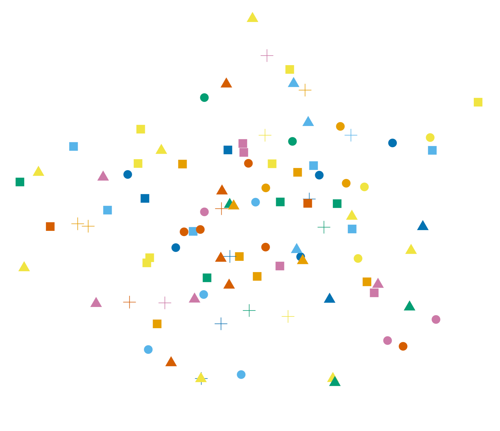
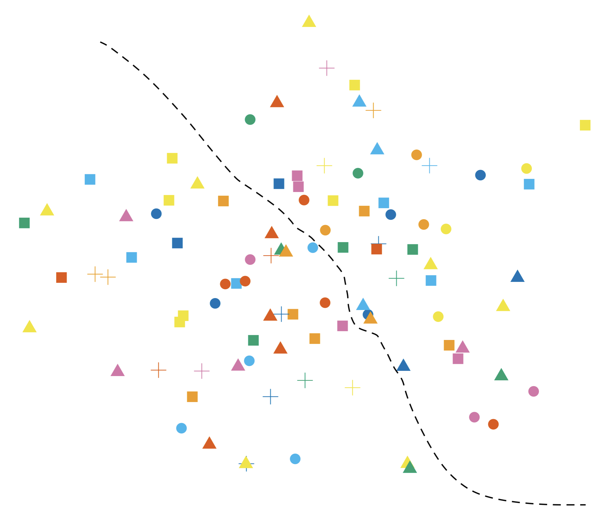
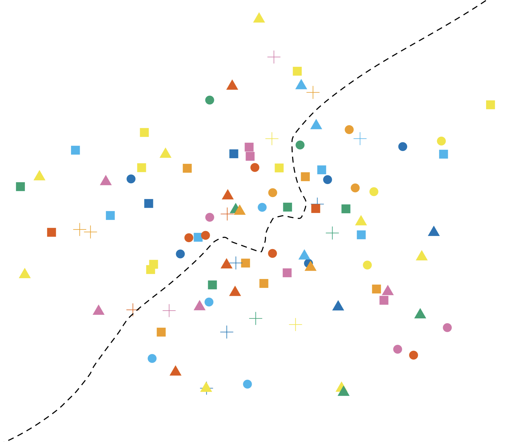
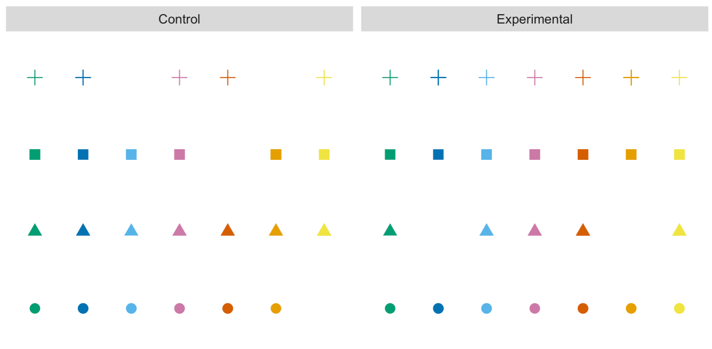

class: middle, title
background-size: contain

<!----- 

Make a pdf using:

decktape generic --key=ArrowRight --load-pause 1800 --slides '1-77' --size '1216x684' --url-load-timeout 80000 --page-load-timeout 80000 "ppe-nhst-ci.html" NHST-CIs-Slides.pdf

decktape generic --key=ArrowRight --load-pause 1800 --slides '1-2' --size '1216x684' --url-load-timeout 80000 --page-load-timeout 80000 "ppe-nhst-ci.html" NHST-CIs-Slide-1.pdf

----->


<br><br>

# Hypothesis Testing & Confidence Intervals
#### EDC108: Principles in Politics, Philosophy and Economics

<br><br>

**Dr. Calum Webb**<br>
Sheffield Methods Institute, the University of Sheffield<br>
[c.j.webb@sheffield.ac.uk](mailto:c.j.webb@sheffield.ac.uk)

```{r setup, include=FALSE}
options(htmltools.dir.version = FALSE)

# These packages are required for creating the slides
# Many will need to be installed from Github
library(icons)
library(tidyverse)
library(xaringan)
library(xaringanExtra)
library(xaringanthemer)

# Defaults for code
knitr::opts_chunk$set(
  fig.width=9, fig.height=3.5, fig.retina=3,
  out.width = "100%",
  cache = FALSE,
  echo = TRUE,
  message = FALSE, 
  warning = FALSE,
  fig.show = TRUE,
  hiline = TRUE
)

# set global theme for ggplot to make background #F8F8F8F8 (off white),
# but otherwise keep all ggplot themes default (better for teaching)
theme_set(
  theme(plot.background = element_rect(fill = "#F8F8F8", colour = "#F8F8F8"), 
        panel.background = element_rect(fill = "#F8F8F8", colour = "#F8F8F8"),
        legend.background = element_rect(fill = "#F8F8F8", colour = "#F8F8F8")
        )
  )

```

```{r xaringan-tile-view, echo=FALSE}
# Use tile overview by hitting the o key when presenting
xaringanExtra::use_tile_view()
```

```{r xaringan-logo, echo=FALSE}
# Add logo to top right
xaringanExtra::use_logo(
  image_url = "header/smi-logo-white.png",
  exclude_class = c("inverse", "hide_logo"), 
  width = "180px", position = css_position(top = "1em", right = "2em")
)
```

```{r xaringan-themer, include=FALSE, warning=FALSE}

xaringanExtra::use_tachyons()

# Set some global objects containing the colours
# of the university's branding
primary_color <- "#131E29"
secondary_color <- "#440099"
tuos_blue <- "#9ADBE8"
white = "#F8F8F8"
tuos_yellow <- "#FCF281"
tuos_purple <- "#440099"
tuos_red <- "#E7004C"
tuos_midnight <- "#131E29"

# The bulk of the styling is handled by xaringanthemer
style_duo_accent(
  primary_color = "#131E29",
  secondary_color = "#440099",
  colors = c(tuos_purple = "#440099", 
             grey = "#131E2960", 
             tuos_blue ="#9ADBE8",
             tuos_mint = "#00CE7C"),
  header_font_google = xaringanthemer::google_font("Source Serif Pro", "600", "600i"),
  text_font_google   = xaringanthemer::google_font("Source Sans Pro", "300", "300i", "600", "600i"),
  code_font_google   = xaringanthemer::google_font("Lucida Console"),
  header_h1_font_size = "2rem",
  header_h2_font_size = "1.5rem", 
  header_h3_font_size = "1.25rem", 
  text_font_size = "0.9rem",
  code_font_size = "0.65rem", 
  code_inline_font_size = "0.85rem",
  inverse_text_color = "#9ADBE8", 
  background_color = "#F8F8F8", 
  text_color = "#131E29", 
  link_color = "#005A8F", 
  inverse_link_color = "#F8F8F8",
  text_slide_number_color = "#44009970",
  table_row_even_background_color = "transparent", 
  table_border_color = "#44009970",
  text_bold_font_weight = 600
)

```


```{r xaringan-panelset, echo=FALSE}
# Allow for adding panelsets (see example on slide 2)
xaringanExtra::use_panelset()
```

```{r xaringanExtra, echo = FALSE}
# Adds white progress bar to top
xaringanExtra::use_progress_bar(color = "#F8F8F8", location = "top")
```

```{r xaringan-extra-styles, echo = FALSE}
# Allow for code to be highlighted on hover
xaringanExtra::use_extra_styles(
  hover_code_line = TRUE,         #<<
  mute_unhighlighted_code = TRUE  #<<
)
```

```{r share-again, echo=FALSE}
# Add sharing links and other embedding tools
xaringanExtra::use_share_again()
```

```{r xaringanExtra-search, echo=FALSE}
# Add magnifying glass search function to bottom left for quick
# searching of slides
xaringanExtra::use_search(show_icon = TRUE, auto_search = FALSE)
```

---

class: middle

## Learning Objectives

.panelset[

.panel[.panel-name[What will I learn?]

By the end of this week you will:

* Be able to explain why we test hypotheses in the empirical quantitative research in the social sciences

* Describe the essential statistical ideas of the normal distribution and central limit theorem that underlie null hypothesis significance testing and confidence intervals

* Conduct a null hypothesis significance test by using a test statistic and a p-value using real world data

* Construct and correctly interpret a 95% confidence interval using real world data


]

.panel[.panel-name[How does this week fit into my course?]

* The vast majority of quantitative research in economics, political science, and the sciences more broadly makes use of hypothesis testing. Confidence intervals are considered the gold standard, and are mandatory in some fields (e.g. health research). This week will help you understand the findings of that research.

* In your dissertation, you will be expected to have an element of original empirical research, which for many people will be an analysis of data including the use of NHST and CIs. 


]


]

???

Two statistical concepts:
- Normal distribution, standard deviation and the Empirical Rule
- Central limit theorem (use income as an example)
Keep these two ideas in mind

- Null hypothesis significance testing
- Dice game
- Purpose is generalisation

- How does it work?
- Correlation and ANOVA games

- When can we use it and when can we not?
- Johnson picture

Confidence intervals
- Definition
- Calculation
- Exercise/practice
- Why might we use it?
-- Post-hoc comparison
-- Comparing effect size


---

.pull-left[

<br>

## Normal Distribution, Standard Deviation & the Empirical Rule

A variable with a **normal distribution** is characterised by a "bell shaped curve"; this shape of distribution is quite common in data.

]

.pull-right[

.center[

<br><br>
```{r, echo = FALSE, fig.height=5, fig.width=5, out.height=500, out.width=500}

StatAreaUnderDensity <- ggproto(
  "StatAreaUnderDensity", Stat,
  required_aes = "x",
  compute_group = function(data, scales, xlim = NULL, n = 50) {
    fun <- approxfun(density(data$x))
    StatFunction$compute_group(data, scales, fun = fun, xlim = xlim, n = n)
  }
)

stat_aud <- function(mapping = NULL, data = NULL, geom = "area",
                    position = "identity", na.rm = FALSE, show.legend = NA, 
                    inherit.aes = TRUE, n = 50, xlim=NULL,  
                    ...) {
  layer(
    stat = StatAreaUnderDensity, data = data, mapping = mapping, geom = geom, 
    position = position, show.legend = show.legend, inherit.aes = inherit.aes,
    params = list(xlim = xlim, n = n, ...))
}

set.seed(10000)
normal_dist <- rnorm(100000)
normal_dist <- tibble(x = normal_dist)

ggplot(data = normal_dist, aes(x)) +
  #stat_aud(geom = "area",
   #        xlim = c(-1, 1), fill = tuos_blue, alpha = 0.3) +
  #annotate("text", x = 1, y = 0.35, label = "About 68% within\n1 Standard Deviation", hjust = 0) +
  stat_function(fun = dnorm, n = 101, args = list(mean = 0, sd = 1), size = 1) + 
  ylab("") +
  scale_y_continuous(breaks = NULL) +
  scale_x_continuous(breaks = c(-3, -2, -1, 0, 1, 2, 3),
                     labels = c("-3SD", "-2SD", "-1SD", "Mean", "+1SD", "+2SD", "+3SD"),
                     minor_breaks = NULL) +
  xlab("") +
  coord_cartesian(xlim = c(-3, 3), ylim = c(0, 0.5)) +
  theme_minimal() +
  theme(plot.background = element_rect(fill = "#F8F8F8", colour = "#F8F8F8"), 
        panel.background = element_rect(fill = "#F8F8F8", colour = "#F8F8F8"))

```

]]

---

.pull-left[

<br>

## Normal Distribution, Standard Deviation & the Empirical Rule

A variable with a **normal distribution** is characterised by a "bell shaped curve"; this shape of distribution is quite common in data.

The **mean** of a distribution represents the most frequent response, and, in a true normal distribution, this is represented by 50% of the data being below the mean and 50% of the data being above the mean.

$$\bar{x} = \frac{\sum_1^n{x_i}}{n}$$

]

.pull-right[

.center[

<br><br>

```{r, echo = FALSE, fig.height=5, fig.width=5, out.height=500, out.width=500}

set.seed(10000)
ggplot(data = normal_dist, aes(x)) +
  stat_function(fun = dnorm, n = 101, args = list(mean = 0, sd = 1), size = 1) + 
  ylab("") +
  geom_vline(xintercept = 0, colour = tuos_purple) +
  annotate("text", x = 2, y = 0.35, label = "The mean is in the\ncenter of the\ndistribution") +
  scale_y_continuous(breaks = NULL) +
  scale_x_continuous(breaks = c(-3, -2, -1, 0, 1, 2, 3),
                     labels = c("-3SD", "-2SD", "-1SD", "Mean", "+1SD", "+2SD", "+3SD"),
                     minor_breaks = NULL) +
  xlab("") +
  coord_cartesian(xlim = c(-3, 3), ylim = c(0, 0.5)) +
  theme_minimal() +
  theme(plot.background = element_rect(fill = "#F8F8F8", colour = "#F8F8F8"), 
        panel.background = element_rect(fill = "#F8F8F8", colour = "#F8F8F8"))

```

]
]

---

.pull-left[

<br>

## Normal Distribution, Standard Deviation & the Empirical Rule

A variable with a **normal distribution** is characterised by a "bell shaped curve"; this shape of distribution is quite common in data.

The **standard deviation** of a normal distribution represents how spread out from the mean the data is (how dispersed it is). 

It is calculated as:

$$s = \sqrt{\frac{\sum_i^n{(x_i-\bar{x})^2}}{n-1}}$$

]

.pull-right[

.center[

<br><br>

```{r, echo = FALSE, fig.height=5, fig.width=5, out.height=500, out.width=500}

set.seed(10000)
ggplot(data = normal_dist, aes(x)) +
  stat_function(fun = dnorm, n = 101, args = list(mean = 0, sd = 1), size = 1, colour = tuos_purple) + 
  ylab("") +
  scale_y_continuous(breaks = NULL) +
  scale_x_continuous(breaks = c(-3, -2, -1, 0, 1, 2, 3),
                     labels = c("-3SD", "-2SD", "-1SD", "Mean", "+1SD", "+2SD", "+3SD"),
                     minor_breaks = NULL) +
  xlab("") +
  coord_cartesian(xlim = c(-3, 3), ylim = c(0, 0.5)) +
  theme_minimal() +
  theme(plot.background = element_rect(fill = "#F8F8F8", colour = "#F8F8F8"), 
        panel.background = element_rect(fill = "#F8F8F8", colour = "#F8F8F8"))

```

]
]


---

.pull-left[

<br>

## Normal Distribution, Standard Deviation & the Empirical Rule

A variable with a **normal distribution** is characterised by a "bell shaped curve"; this shape of distribution is quite common in data.

**The Empirical Rule** is that, when data are normally distributed, **68% of the data** will be within 1 standard deviation of the mean...


]

.pull-right[

.center[

<br><br>

```{r, echo = FALSE, fig.height=5, fig.width=5, out.height=500, out.width=500}

set.seed(10000)
ggplot(data = normal_dist, aes(x)) +
  stat_aud(geom = "area",
           xlim = c(-1, 1), fill = tuos_purple, alpha = 0.3) +
  annotate("text", x = 1, y = 0.35, label = "About 68% within\n1 Standard Deviation", hjust = 0) +
  stat_function(fun = dnorm, n = 101, args = list(mean = 0, sd = 1), size = 1) + 
  ylab("") +
  scale_y_continuous(breaks = NULL) +
  scale_x_continuous(breaks = c(-3, -2, -1, 0, 1, 2, 3),
                     labels = c("-3SD", "-2SD", "-1SD", "Mean", "+1SD", "+2SD", "+3SD"),
                     minor_breaks = NULL) +
  xlab("") +
  coord_cartesian(xlim = c(-3, 3), ylim = c(0, 0.5)) +
  theme_minimal() +
  theme(plot.background = element_rect(fill = "#F8F8F8", colour = "#F8F8F8"), 
        panel.background = element_rect(fill = "#F8F8F8", colour = "#F8F8F8"))

```

]
]


---

.pull-left[

<br>

## Normal Distribution, Standard Deviation & the Empirical Rule

A variable with a **normal distribution** is characterised by a "bell shaped curve"; this shape of distribution is quite common in data.

**The Empirical Rule** is that, when data are normally distributed, **68% of the data** will be within 1 standard deviation of the mean...

**95%** of the data will be within around 2 standard deviations of the mean (actually ~1.96 standard deviations)...

]

.pull-right[

.center[

<br><br>
```{r, echo = FALSE, fig.height=5, fig.width=5, out.height=500, out.width=500}

set.seed(10000)
ggplot(data = normal_dist, aes(x)) +
  stat_aud(geom = "area",
           xlim = c(-2, 2), fill = tuos_purple, alpha = 0.3) +
  annotate("text", x = 1, y = 0.35, label = "About 95% within\n2 Standard Deviations", hjust = 0) +
  stat_function(fun = dnorm, n = 101, args = list(mean = 0, sd = 1), size = 1) + 
  ylab("") +
  scale_y_continuous(breaks = NULL) +
  scale_x_continuous(breaks = c(-3, -2, -1, 0, 1, 2, 3),
                     labels = c("-3SD", "-2SD", "-1SD", "Mean", "+1SD", "+2SD", "+3SD"),
                     minor_breaks = NULL) +
  xlab("") +
  coord_cartesian(xlim = c(-3, 3), ylim = c(0, 0.5)) +
  theme_minimal() +
  theme(plot.background = element_rect(fill = "#F8F8F8", colour = "#F8F8F8"), 
        panel.background = element_rect(fill = "#F8F8F8", colour = "#F8F8F8"))

```

]]


---

.pull-left[

<br>

## Normal Distribution, Standard Deviation & the Empirical Rule

A variable with a **normal distribution** is characterised by a "bell shaped curve"; this shape of distribution is quite common in data.

**The Empirical Rule** is that, when data are normally distributed, **68% of the data** will be within 1 standard deviation of the mean...

**95%** of the data will be within around 2 standard deviations of the mean (actually ~1.96 standard deviations)...

And **99.9%** of the data will be within around 3 standard deviations of the mean.

]

.pull-right[

.center[

<br><br>
```{r, echo = FALSE, fig.height=5, fig.width=5, out.height=500, out.width=500}

set.seed(10000)
ggplot(data = normal_dist, aes(x)) +
  stat_aud(geom = "area",
           xlim = c(-3, 3), fill = tuos_purple, alpha = 0.3) +
  annotate("text", x = 1, y = 0.35, label = "About 99.7% within\n3 Standard Deviations", hjust = 0) +
  stat_function(fun = dnorm, n = 101, args = list(mean = 0, sd = 1), size = 1) + 
  ylab("") +
  scale_y_continuous(breaks = NULL) +
  scale_x_continuous(breaks = c(-3, -2, -1, 0, 1, 2, 3),
                     labels = c("-3SD", "-2SD", "-1SD", "Mean", "+1SD", "+2SD", "+3SD"),
                     minor_breaks = NULL) +
  xlab("") +
  coord_cartesian(xlim = c(-3, 3), ylim = c(0, 0.5)) +
  theme_minimal() +
  theme(plot.background = element_rect(fill = "#F8F8F8", colour = "#F8F8F8"), 
        panel.background = element_rect(fill = "#F8F8F8", colour = "#F8F8F8"))

```

]]


---

.pull-left[

<br>

## Normal Distribution, Standard Deviation & the Empirical Rule

A variable with a **normal distribution** is characterised by a "bell shaped curve"; this shape of distribution is quite common in data.

**The Empirical Rule** is that, when data are normally distributed, **68% of the data** will be within 1 standard deviation of the mean...

**95%** of the data will be within around 2 standard deviations of the mean (actually ~1.96 standard deviations)...

And **99.9%** of the data will be within around 3 standard deviations of the mean.

This is true **even when the data are quite far from a normal distribution**.

]

.pull-right[

.center[

<br><br>
```{r, echo = FALSE, fig.height=5, fig.width=5, out.height=500, out.width=500}

set.seed(10000)
ggplot(data = normal_dist, aes(x)) +
  stat_aud(geom = "area",
           xlim = c(-3, 3), fill = tuos_purple, alpha = 0.3) +
  stat_function(fun = dnorm, n = 101, args = list(mean = 0, sd = 1), size = 1) + 
  ylab("") +
  scale_y_continuous(breaks = NULL) +
  scale_x_continuous(breaks = c(-3, -2, -1, 0, 1, 2, 3),
                     labels = c("-3SD", "-2SD", "-1SD", "Mean", "+1SD", "+2SD", "+3SD"),
                     minor_breaks = NULL) +
  xlab("") +
  coord_cartesian(xlim = c(-3, 3), ylim = c(0, 0.5)) +
  theme_minimal() +
  theme(plot.background = element_rect(fill = "#F8F8F8", colour = "#F8F8F8"), 
        panel.background = element_rect(fill = "#F8F8F8", colour = "#F8F8F8"))

```

]]


---

class: inverse, middle

.pull-left[

# Practice

Given the following statements, how would you describe the distribution of the following datasets given their means and standard deviations.

**Notes**:

* To calculate the mean, add up all of the observations, and then divide by the total number of observations.

$$\bar{x} = \frac{\sum_1^n{x_i}}{n}$$

* To calculate the standard deviation, subtract each observation from the mean and square the result. Afterwards, sum up all of the observations. Then, divide them by the total number of observations minus 1. Then, take the square root of the result. 

$$s = \sqrt{\frac{\sum_i^n{(x_i-\bar{x})^2}}{n-1}}$$

* The Empirical Rule: 68% within 1 standard deviation, 95% of data within 2 standard deviations, 99.9% within 3 standard deviations.

]


.pull-right[

# Questions:

* Q1: A sample of students' ages is normally distributed. The mean age of the students is 22. The standard deviation for students' ages is 1.5. Between which two ages would we expect 95% of students to be?

* Q2: A sample of hourly wages is normally distributed, with a mean wage of £14 per hour and a standard deviation of £3.20 per hour. You find that a new person has a wage of £20.40 per hour. Approximately what percentage of people in your sample would you expect to be earning more than this?

* Given the following data on the number of times people have voted in the last 10 years, describe the distribution using the mean and standard deviation:

$$X = 2, 3, 4, 5, 5, 6, 7, 8$$
]

---

class: inverse, middle

.pull-left[

# Questions:

* Q1: A sample of students' ages is normally distributed. The mean age of the students is 22. The standard deviation for students' ages is 1.5. Between which two ages would we expect 95% of students to be?

* Q2: A sample of hourly wages is normally distributed, with a mean wage of £14 per hour and a standard deviation of £3.20 per hour. You find that a new person has a wage of £20.40 per hour. Approximately what percentage of people in your sample would you expect to be earning more than this?

* Given the following data on the number of times people have voted in the last 10 years, describe the distribution using the mean and standard deviation:

$$X = 2, 3, 4, 5, 5, 6, 7, 8$$
]

.pull-right[

# Answers

* A1: We would expect 95% of students' ages to fall between 19 years old and 25 years old.

$$Lower = 22 - 2*1.5=25\newline Upper = 22 + 2*1.5=25$$
* A2: We would expect less than 2.5% of people in the sample to be earning more than £20.40 per hour.<br>The 95% range of earnings is $£14-2*£3.20=£7.60$ to $£14+2*£3.20=£20.40$. Because half of the remainder of the distribution is equally below the central 95% range and half is above the central 95% range, only 2.5% of the sample earn more than £20.40.


]

---

class: inverse, middle

.pull-left[

# Questions:

* Q1: A sample of students' ages is normally distributed. The mean age of the students is 22. The standard deviation for students' ages is 1.5. Between which two ages would we expect 95% of students to be?

* Q2: A sample of hourly wages is normally distributed, with a mean wage of £14 per hour and a standard deviation of £3.20 per hour. You find that a new person has a wage of £20.40 per hour. Approximately what percentage of people in your sample would you expect to be earning more than this?

* Given the following data on the number of times people have voted in the last 10 years, describe the distribution using the mean and standard deviation:

$$X = 2, 3, 4, 5, 5, 6, 7, 8$$
]

.pull-right[

# Answers

* A3: The calculation is as follows:

$$n=8\newline\bar{X}=\frac{2+3+4+5+5+6+7+8}{8}=5\newline\\
s = (2-5)^2+(3-5)^2+(4-5)^2+(5-5)^2+...\newline\\ ...(5-5)^2+(6-5)^2+(7-5)^2+(8-5)^2\newline\\
s = -3^2 + -2^2 + -1^2 + 0^2 + 0^2 + 1^2 + 2^2 + 3^2\newline\\
s = 9+4+1+0+0+1+4+9 = 28\newline\\
s = \frac{28}{(8-1)} = 4\newline\\
s = \sqrt{4} = 2$$

* The average person in the sample voted 5 times in the last ten years, with a standard deviation of 2 voting occurances. This means we would expect 68% of people to have voted between 3 and 7 times in the last ten years.

]


---

class: inverse, middle

# Why do we care so much about the normal distribution?

---

.pull-left[

<br>


```{r, echo = FALSE, fig.height=5, fig.width=5, out.height=500, out.width=500}

library(labelled)
library(haven)
hse_cleaned <- read_dta("hse-2011.dta") %>%
  user_na_to_na() %>%
  unlabelled() %>%
  janitor::clean_names() %>%
  filter(age > 16) 

hse_cleaned <- hse_cleaned %>%
  select(hserial, pserial, tenureb, sex, age, topqual3, econact, 
         nssec8, eth_origin = origin, totinc, eqvinc, say_wgt, 
         say_diet, htval, wtval, omsysval, omdiaval, dnnow, totalwu,
         porfv, cigst1, cigst2, cigs, health, marital, employed, fruitveg)

bw <- 5000
n_obs <- sum(!is.na(hse_cleaned$eqvinc))

hse_cleaned %>%
  ggplot() +
  geom_histogram(aes(x = eqvinc), fill = tuos_blue, colour = "transparent", binwidth = 5000) +
  stat_function(fun = function(x) 
      dnorm(x, mean = mean(hse_cleaned$eqvinc, na.rm=TRUE), 
                       sd = sd(hse_cleaned$eqvinc, na.rm = TRUE)) * bw * n_obs) +
  geom_vline(xintercept = mean(hse_cleaned$eqvinc, na.rm = TRUE), col = "grey20", size = 0.75) +
  #scale_y_continuous(limits = c(0, 31)) +
  scale_x_continuous(limits = c(-1e+05, 3e+05), labels = scales::dollar_format(prefix = "£")) +
  theme_minimal() +
  xlab("Equivalised Household Income") +
  ylab("Frequency") +
  theme(plot.background = element_rect(fill = "#F8F8F8", colour = "#F8F8F8"), 
        panel.background = element_rect(fill = "#F8F8F8", colour = "#F8F8F8"))

```

]

.pull-right[

<br><br><br><br><br><br>

## Many distributions are not normal, and the mean and standard deviation are not good ways of describing them.

This is especially the case in the social sciences and in much of economics, so why is the normal distribution and empirical rule so important?

]


---

.pull-left[

<br>


```{r, echo = FALSE, fig.height=5, fig.width=5, out.height=500, out.width=500}

hse_cleaned %>%
  ggplot() +
  geom_histogram(aes(x = eqvinc), fill = tuos_blue, colour = "transparent", binwidth = 5000) +
  stat_function(fun = function(x) 
      dnorm(x, mean = mean(hse_cleaned$eqvinc, na.rm=TRUE), 
                       sd = sd(hse_cleaned$eqvinc, na.rm = TRUE)) * bw * n_obs) +
  geom_vline(xintercept = mean(hse_cleaned$eqvinc, na.rm = TRUE), col = "grey20", size = 0.75) +
  #scale_y_continuous(limits = c(0, 31)) +
  scale_x_continuous(limits = c(-1e+05, 3e+05), labels = scales::dollar_format(prefix = "£")) +
  theme_minimal() +
  xlab("Equivalised Household Income") +
  ylab("Frequency") +
  theme(plot.background = element_rect(fill = "#F8F8F8", colour = "#F8F8F8"), 
        panel.background = element_rect(fill = "#F8F8F8", colour = "#F8F8F8"))

```

]

.pull-right[

<br><br>

.center[
```{r, echo = FALSE, out.width = "80%"}


```
]

.center[[webb.shinyapps.io/mean-clt-app/](https://webb.shinyapps.io/mean-clt-app/)]

]

---

.pull-left[

<br><br><br>

# The Central Limit Theorem

The **Central Limit Theorem** is the name given to the phenomenon that any sequence of scaled sums (e.g. mean, correlation, regression coefficient) of samples of a variable will converge to a normal distribution.

In other words, if we took many, many, samples and plotted them, we would expect them to be normally distributed.

Because it is normally distributed, we can make inferences about the probability of certain values (because of the Empirical Rule) in the population.

]

.pull-right[

<br>

```{r, echo = FALSE, fig.height=5, fig.width=5, out.height=500, out.width=500}

mean_incomes <- numeric(1000)
set.seed(1000)

for (i in 1:1000) {
  inc_sample <- sample_n(hse_cleaned %>% drop_na(eqvinc), 1000) %>%
    summarise(mean_income = mean(eqvinc)) %>%
    .$mean_income
  mean_incomes[i] <- inc_sample
}

tibble(mean_income = mean_incomes) %>%
  ggplot(aes(x = mean_income)) +
  geom_histogram(colour = "transparent", fill = tuos_purple, binwidth = 500) +
  scale_x_continuous(labels = scales::dollar_format(prefix = "£")) +
  xlab("Mean Income (1000 Samples)")


```

]

---

.pull-left[
.center[
### Are children more likely to live in deprived neighbourhoods in the North of England or in the South of England?
]
.center[
```{r, out.width = "80%", echo = FALSE}


```
]
.center[[webb.shinyapps.io/anova-sig/](https://webb.shinyapps.io/anova-sig/)]

]

.pull-right[
.center[
### Are children living in more deprived neighbourhoods more or less likely to smoke cigarettes at age 15?
]
.center[
```{r, out.width = "80%", echo = FALSE}


```
]
.center[[webb.shinyapps.io/cor-sig/](https://webb.shinyapps.io/cor-sig/)]

]


---

.pull-left[

<br><br><br>

# What about if we only have one sample?

It's often not feasible or desirable to go out and collect many, many samples from the entire population in order to make a general statement.

Instead, we can estimate what the standard deviation of many samples of the summary statistic would likely be for that sample size using the **standard error**. We assume the specific summary statistic we got from our sample came from around the middle of the hypothetical distribution, because that is what is most likely.

$$SE = \frac{\sigma}{\sqrt{N}}$$

]

.pull-right[

<br>

```{r, echo = FALSE, fig.height=5, fig.width=5, out.height=500, out.width=500}

bw = 500
n_obs = 1000

tibble(mean_income = mean_incomes) %>%
  ggplot(aes(x = mean_income)) +
  geom_histogram(colour = "transparent", fill = tuos_purple, binwidth = 500) +
  scale_x_continuous(labels = scales::dollar_format(prefix = "£")) +
  xlab("Mean Income (1000 Samples)") +
  stat_function(fun = function(x) 
      dnorm(x, mean = mean(hse_cleaned$eqvinc, na.rm=TRUE), 
                       sd = (sd(hse_cleaned$eqvinc, na.rm = TRUE)) / sqrt(n_obs)) * bw * n_obs, colour = tuos_blue, linewidth = 2) 


```

]

---

.pull-left[

<br><br>

## Null Hypothesis Significance Testing

In all kinds of science, it is common to test a null hypothesis using statistical methods. 

The null hypothesis is **what we would expect if there was no positive or negative difference**, for example, no difference between two groups (mean difference = 0), no correlation (Pearson's R = 0), no linear relationship (B = 0), or no difference between observed and expected scores. 

As we have seen, we can use the characteristics of the central limit theorem and the normal distribution to calculate percentages which reflect **the probability of observing a summary statistic of that magnitude.**

]

.pull-right[

<br><br>

```{r, echo = FALSE, fig.height=4, fig.width=5, out.height=400, out.width=500, fig.cap="Less than a 0.0001% probability that Public sector is paid more than Private sector in the population."}

bw = 500
n_obs = 1000

set.seed(1000)
paysim <- tibble(men_pay = rnorm(1000, 22, 5),
       women_pay = rnorm(1000, 17, 5),
       diff = men_pay-women_pay)

mean_diff_pay <- mean(paysim$diff)
se_diff_pay <- sd(paysim$diff) / sqrt(nrow(paysim))

ggplot() +
  scale_x_continuous(limits = c(-1, 6), labels = scales::dollar_format(prefix = "£")) +
  xlab("Hourly Pay Differential (Private v Public)") +
  ylab("Density") +
  stat_function(fun = function(x) 
      dnorm(x, mean = mean_diff_pay, se_diff_pay), colour = tuos_purple ) +
  geom_vline(xintercept = 0, colour = tuos_purple)


```


]


---

.pull-left[

<br><br>

## Null Hypothesis Significance Testing

In all kinds of science, it is common to test a null hypothesis using statistical methods. 

The null hypothesis is **what we would expect if there was no positive or negative difference**, for example, no difference between two groups (mean difference = 0), no correlation (Pearson's R = 0), no linear relationship (B = 0), or no difference between observed and expected scores. 

As we have seen, we can use the characteristics of the central limit theorem and the normal distribution to calculate percentages which reflect **the probability of observing a summary statistic of that magnitude.**

]

.pull-right[

<br><br>

```{r, echo = FALSE, fig.height=4, fig.width=5, out.height=400, out.width=500, fig.cap="Less than an 8.7% probability that Public sector is paid more than Private sector in the population."}

set.seed(1000)
paysim <- tibble(men_pay = rnorm(1000, 22, 14),
       women_pay = rnorm(1000, 21, 14),
       diff = men_pay-women_pay)

mean_diff_pay <- mean(paysim$diff)
se_diff_pay <- sd(paysim$diff) / sqrt(nrow(paysim))

#pnorm(0, mean_diff_pay, se_diff_pay)

ggplot() +
  scale_x_continuous(limits = c(-1, 6), labels = scales::dollar_format(prefix = "£")) +
  xlab("Hourly Pay Differential (Private v Public)") +
  ylab("Density") +
  stat_function(fun = function(x) 
      dnorm(x, mean = mean_diff_pay, se_diff_pay), colour = tuos_purple ) +
  geom_vline(xintercept = 0, colour = tuos_purple)


```


]

---

.pull-left[

<br><br>

## Null Hypothesis Significance Testing

.grey[In all kinds of science, it is common to test a null hypothesis using statistical methods. 

The null hypothesis is what we would expect if there was no positive or negative difference, for example, no difference between two groups (mean difference = 0), no correlation (Pearson's R = 0), no linear relationship (B = 0), or no difference between observed and expected scores. 

As we have seen, we can use the characteristics of the central limit theorem and the normal distribution to calculate percentages which reflect the probability of observing a summary statistic of that magnitude.]

**How low should the probability (p-value) be before we reject the null hypothesis?**

]

.pull-right[

<br><br>

```{r, echo = FALSE, fig.height=4, fig.width=5, out.height=400, out.width=500, fig.cap="Less than an 8.7% probability that Public sector is paid more than Private sector in the population."}

set.seed(1000)
paysim <- tibble(men_pay = rnorm(1000, 22, 14),
       women_pay = rnorm(1000, 21, 14),
       diff = men_pay-women_pay)

mean_diff_pay <- mean(paysim$diff)
se_diff_pay <- sd(paysim$diff) / sqrt(nrow(paysim))

#pnorm(0, mean_diff_pay, se_diff_pay)

ggplot() +
  scale_x_continuous(limits = c(-1, 6), labels = scales::dollar_format(prefix = "£")) +
  xlab("Hourly Pay Differential (Private v Public)") +
  ylab("Density") +
  stat_function(fun = function(x) 
      dnorm(x, mean = mean_diff_pay, se_diff_pay), colour = tuos_purple ) +
  geom_vline(xintercept = 0, colour = tuos_purple)


```


]

---

<br><br>
.pull-left[

# Hypothesis testing

We can express how unlikely we were to get results as difference to what we would expect under the null hypothesis using **inferential statistics**.

There are many different kinds of inferential statistics and tests we can use for different hypotheses and kinds of relationships in data (t-test, chi-square test, z-test). The differences don't matter much for our purposes; they use the same underlying statistical theory.

* An inferential statistic gives us a __p-value__.
* The p-value tells us the probability of seeing the kind of results we got __if the null hypothesis is the best explanation for the distribution of the data in the population__.
* In our previous example, the p-value would be 0.087

]

--

.pull-right[

In applied statistics, we compare our p-value with a pre-chosen '__critical value__' (sometimes called *alpha*) below which we decide to reject the null hypothesis. 

* Conventionally, our critical value, **below which we reject the null hypothesis**, is __0.05__.

]


---

<br><br>
.pull-left[

# Hypothesis testing

We can express how unlikely we were to get results as difference to what we would expect under the null hypothesis using **inferential statistics**.

There are many different kinds of inferential statistics and tests we can use for different hypotheses and kinds of relationships in data (t-test, chi-square test, z-test). The differences don't matter much for our purposes; they use the same underlying statistical theory.

* An inferential statistic gives us a __p-value__.
* The p-value tells us the probability of seeing the kind of results we got __if the null hypothesis is the best explanation for the distribution of the data in the population__.
* In our previous example, the p-value would be 0.087

]

.pull-right[

In applied statistics, we compare our p-value with a pre-chosen '__critical value__' (sometimes called *alpha*) below which we decide to reject the null hypothesis. 

* Conventionally, our critical value, **below which we reject the null hypothesis**, is __0.05__.

There is no strong reason why 5% is used in the social sciences, and sometimes 10%, 1% or 0.1% are used instead, but it can depend on the following:
  * What are the risks if we set our critical value too high and incorrectly reject the null hypothesis? __(Type I error; false positive)__
  * What are the risks if we set our critical value too low and incorrectly fail to reject the null hypothesis? __(Type II error; false negative)__
  
5%, or 0.05, is often seen as a good compromise between these two risks.

]


---

class: inverse, middle

# Inferential statistics help us quantify the confidence we have in a hypothesis based on how likely we would expect to see the results we got if it were accurate.


---

class: middle

## When should we use inferential statistics in social research?

* When we wish to make generalisations beyond our sample of data to a wider population.

---
class: middle

## When can we use inferential statistics in social research?

* When our data __does not violate any of the assumptions made about it__ by the tests (e.g. bivariate normal distrubution).

--

* When our sample is __proportionally representative__ of the population we wish to generalise to.

--

* The easiest way to know a sample is proportionally representative of the population is by finding out how the sample was collected. If it is **randomly selected** (a random sample), it is likely to be representative of the population because __every 'thing' in the sample had an equal chance of being selected__.

--

* However, __this is quite difficult to achieve with human beings__ — they are not like machine sensors and do some of the following things:
  * Ignore your invitations to join the sample
  * Refuse to answer questions
  * Withdraw from the study
  * Die
  * And other things.


---

class: inverse, middle


# Sampling methods

Whether our data are a representative sample of a larger population often depends on the *sampling method*


---

class: middle

# Sampling methods

<br>

* __Volunteer or opportunity sampling__: the sample is chosen based on who is available to take part in the study (e.g. advertising an online survey; selecting people off the street)

---

# Opportunity sampling (60% of pixels)

.center[
```{r, out.height=502, out.width=770, echo = FALSE, fig.alt="The picture shows an older man and woman in a park. The man is pointing at something not shown on the right side of the screen. The image has a dashed border around it which shows that some of the total picture is not visible to the viewer (around 40% of it)."}


```
]

---

# Population

.center[
```{r, out.height=502, out.width=770, echo = FALSE, fig.alt="The picture from before has now been expanded. It now shows the woman and man on the left hand side and the former British Prime Minister Boris Johnson on the right hand side. The man is pointing at the former prime minister in an accusatory way. The prime minister was previously obscured because the sample of the picture did not include him."}


```
]

---

class: middle

# Sampling methods

<br>

* __Volunteer or opportunity sampling__: the sample is chosen based on who is available to take part in the study (e.g. advertising an online survey; selecting people off the street)
  * Very unlikely to be representative of a population you want to generalise to — what about people without internet access? Or who aren't in close vicinity?<br>

--

* __Simple random sampling__: the sample is chosen truly at random from a population sampling frame (e.g. randomly mailing surveys to or visiting addresses on record)

---

# Random sampling (60% of pixels)

.center[
```{r, out.height=502, out.width=770, echo = FALSE, fig.alt="The image is the same as the previous picture in the park: two people stand pointing at the former British prime minister. However, now the image is fuzzy because 60% of the pixels have been selected at random. While it is still easy to roughly make out the 'whole picture', some of the details might be fuzzy - but they are not missing."}


```
]

---

# Random sampling (30% of pixels)

.center[
```{r, out.height=502, out.width=770, echo = FALSE, fig.alt="The image now includes a sample of only 30% of the pixels. Even though the image is much grainier than before, the random sampling of pixels still seems to do a good job of helping us infer what the overall image is showing."}


```
]


---

class: middle

# Sampling methods

<br>

* __Volunteer or opportunity sampling__: the sample is chosen based on who is available to take part in the study (e.g. advertising an online survey; selecting people off the street)
  * Very unlikely to be representative of a population you want to generalise to — what about people without internet access? Or who aren't in close vicinity?<br>

* __Simple random sampling__: the sample is chosen truly at random from a population sampling frame (e.g. randomly mailing surveys to or visiting addresses on record)
  * Ignores the fact that some people in the population may be more prone to non-response than others/participation bias ([Berg, 2010](https://papers.ssrn.com/sol3/papers.cfm?abstract_id=1691967)).<br>


---

# Random sampling (with non-response)

.center[
```{r, out.height=502, out.width=770, echo = FALSE, fig.alt="The image now shows what would happen if one part of the image is less likely to respond to the random selection than another. In the left hand side of the image, the two people are shown in a high degree of clarity as a large number of pixels has been selected. On the right hand side of the image, where the former Prime Minister stands, there are hardly any pixels shown at all. As a result, the left hand side of the image is much clearer than the right hand side."}



```
]

---

# Random sampling (with non-response)

.center[
```{r, out.height=502, out.width=770, echo = FALSE, fig.alt="The image is the same as the previous image but now includes the caption '50% more likely than average to respond to a survey' on the left hand side and '80% less likely than average to respond to a survey' on the right hand side."}



```
]


---

class: middle

# Sampling methods

<br>

* __Volunteer or opportunity sampling__: the sample is chosen based on who is available to take part in the study (e.g. advertising an online survey; selecting people off the street)
  * Very unlikely to be representative of a population you want to generalise to — what about people without internet access? Or who aren't in close vicinity?<br>

* __Simple random sampling__: the sample is chosen truly at random from a population sampling frame (e.g. randomly mailing surveys to or visiting addresses on record)
  * Ignores the fact that some people in the population may be more prone to non-response than others/participation bias ([Berg, 2010](https://papers.ssrn.com/sol3/papers.cfm?abstract_id=1691967)).<br>

* __Stratified random sampling__: important demographic categories are first chosen (strata), and then participants are randomly sampled from within those categories (usually proportional to the percentage of the entire population they make up derived from, e.g. a census)

---

## Stratified random sampling (with non-response adjustment)

.center[
```{r, out.height=502, out.width=770, echo = FALSE, fig.alt="The image shows the result of a sample of pixels where the left hand side is 50% more likely to respond and the right hand side is 80% less likely to respond. Now an additional caption on the left hand side reads: 'send out only 2/3rds of the surveys than random sampling dictates would be needed for a sample of 60%' and an additional caption on the right hand side reads 'send out five times the number of surveys than random sampling dictates would be needed for a sample of 60%'"}



```
]

---

## Stratified random sampling (with non-response adjustment)

.center[
```{r, out.height=502, out.width=770, echo = FALSE, fig.alt="The left hand side and the right hand side are now closer to being in the same level of clarity, but there is still less clarity on the right hand side of the image compared to the left. The caption on the left hand side reads: 3/4s as many surveys sent out. The caption on the right hand side reads: 3 times as many surveys sent out."}



```
]

---

## Stratified random sampling (with non-response adjustment)

.center[
```{r, out.height=502, out.width=770, echo = FALSE, fig.alt="The left hand side and the right hand side are now displayed in about the same level of clarity. The caption on the left hand side reads: 2/3rds as many surveys sent out. The caption on the right hand side reads: 5 times as many surveys sent out."}



```
]


---

class: middle

# Sampling methods

<br>

* __Volunteer or opportunity sampling__: the sample is chosen based on who is available to take part in the study (e.g. advertising an online survey; selecting people off the street)
  * Very unlikely to be representative of a population you want to generalise to — what about people without internet access? Or who aren't in close vicinity?<br>

* __Simple random sampling__: the sample is chosen truly at random from a population sampling frame (e.g. randomly mailing surveys to or visiting addresses on record)
  * Ignores the fact that some people in the population may be more prone to non-response than others/participation bias ([Berg, 2010](https://papers.ssrn.com/sol3/papers.cfm?abstract_id=1691967)).<br>

* __Stratified random sampling__: important demographic categories are first chosen (strata), and then participants are randomly sampled from within those categories (usually proportional to the percentage of the entire population they make up derived from, e.g. a census)
  * Who decides which demographic categories are meaningful and should be strata and who decides which are unimportant?
  
  
---

class: middle

# _Post-hoc_ adjustment for representativeness

* __Sample weighting__: researchers calculate 'survey weights' which can be used to 're-balance' each observation so that the overall sample proportionally matches the population of interest.

--

  * For example, __imagine we wanted a representative sample of England & Wales.__

--

  * __Approximately 5%__ of people in England & Wales live in Wales.

--

  * We used a stratified sampling method to __survey 1,000 people__ in England and Wales. Ideally, we want 950 English respondents and 50 Welsh respondents.

--

  * However, we ended up with 100 Welsh respondents and 900 English.

--

  * We could count each of those Welsh respondents as only 0.5 of a respondent, and every one of the English respondents as 1.055 of a respondent to "re-balance" our sample to be proportionate to the population.
  
--

In reality this process is far more complicated but that's the basic jist of it! In reality, survey data will come with weights already calculated. You can apply them in analysis using the [`survey` package](https://cran.r-project.org/web/packages/survey/survey.pdf) in `R`, but this is more something to worry about for a PhD project. For now, don't worry about weighting data.
  

---

class: middle

# _Post-hoc_ adjustment for representativeness<br>(Non-response)

We can also have a scenario where we get a proportionally representative sample from our population, but then __not all of this sample respond to all questions or have data for all variables__ (e.g. some might refuse). This would mean that some analyses will end up 'unbalanced' due to this __missing data__ (usually coded as `NA` in `R`) when it is removed.

--

* Multiple ways of dealing with missing data: most common are *listwise* and *pairwise* deletion — where entire observations are deleted if they have missing data in a variable of interest. __This unbalances our sample__.

--

* However, we can try to **impute** missing data — e.g. fill in all of the missing values with our 'best guess' of what it would have been based on responses from respondents who are the most similar to them.

--

* Some methods have specific procedures for handling missing data (e.g. FIML).

--

__Imputation__ and __maximum likelihood__ is too complex a topic to cover here, but is something to be aware of if you are doing a quantitative PhD.


---

class: inverse, middle


# Inference in experimental designs


---

class: middle

# Inference in experimental designs

If your research uses an **experimental** design (e.g. a survey experiment or a randomised controlled trial), you are usually aiming to test the significant differences between the groups *within* your sample. You might try and make your sample representative, but this is often difficult due to cost.

--

This is handled through **a priori randomisation** of conditions (randomly assigning participants to either 'treatment' or 'control' conditions). Because the __assignment is random__, statistical significance/inferential statistics can be used to generalise to the group who participated in the study as a whole. 

--

In other words, inferential statistics can be used to determine __whether the difference between the 'treatment' group and 'control' group would have been different to what would be expected under the null hypothesis if the groups were reverse, or if the random assignment was different__. 

---

class: middle
background-color: white

.center[
```{r, echo = FALSE, fig.alt="The picture shows a scatterplot of a random spread of three different types of shapes, all of which are across five different colours. There is no order to or sorting of the points.", out.width="65%"}



```
]

---

class: middle
background-color: white

.center[
```{r, echo = FALSE, fig.alt="A line is now drawn through the points of random shapes and colours. There are an approximately equal number of points on either side of the line.", out.width="65%"}



```
]


---

class: middle
background-color: white

.center[
```{r, echo = FALSE, fig.alt="A different line is now drawn through the points of random shapes and colours. There are an approximately equal number of points on either side of the line.", out.width="65%"}



```
]

---

class: middle
background-color: white

.center[
```{r, echo = FALSE, fig.alt="The points are now sorted into those on the 'control' side of the line and those on the 'experiment' side of the line. They have also been sorted into colour and shape.  The random split has resulted in 5 cross shaped points being in the control group and 7 cross shaped points being in the experimental group. 6 square shaped points are in the control group and 7 are in the experimental group. 7 triangles are in the control group and 5 are in the experimental group. 6 circles are in the control group and 7 are in the experimental group. The colours are also fairly evenly represented in both the control group and experimental group. There are 4 green points in both the control and experimental groups. Both groups have at least three of all of the 7 possible colours.", out.width="90%"}



```
]


---

class: inverse, middle

# Evaluate the following statements:

---

.pull-left[

<br><br><br>

> We tested the effects of Drug A and Drug B on life expectancy. Drug A significantly increased the average life expectancy of participants (p < 0.05), when compared to a placebo drug. Drug B also significantly increased the average life expectancy of the participants (p < 0.05).


]

.pull-right[
<br><br><br><br>
.center[
```{r, echo = FALSE, out.width="70%"}


```
]

]


---

.pull-left[

<br><br><br>

> We tested the effects of Drug A and Drug B on life expectancy. Drug A significantly increased the average life expectancy of participants (p < 0.05), when compared to a placebo drug. Drug B also significantly increased the average life expectancy of the participants (p < 0.05).

<hr>

> We tested the effects of Drug A and Drug B on life expectancy. Drug A significantly increased the average life expectancy of participants (p < 0.05) with a 95% confidence interval of +1.1 to +2.4 years, when compared to a placebo drug. Drug B also significantly increased the average life expectancy of the participants (p < 0.05) with a 95% confidence interval of +4.3 year to +6.7 years.


]

.pull-right[
<br><br><br><br>
.center[
```{r, echo = FALSE, out.width="70%"}


```
]

]

---

.pull-left[

<br><br><br>

> We tested the effects of Drug A and Drug B on life expectancy. Drug A significantly increased the average life expectancy of participants (p < 0.05), when compared to a placebo drug. Drug B also significantly increased the average life expectancy of the participants (p < 0.05).

<hr>

> We tested the effects of Drug A and Drug B on life expectancy. Drug A significantly increased the average life expectancy of participants (p < 0.05) with a 95% confidence interval of +1.1 to +2.4 years, when compared to a placebo drug. Drug B also significantly increased the average life expectancy of the participants (p < 0.05) with a 95% confidence interval of +4.3 year to +6.7 years.

* What can we do with the second statement that we can't with the first?


]

.pull-right[
<br><br><br><br>
.center[
```{r, echo = FALSE, out.width="70%"}


```
]

]

---

.pull-left[

<br><br><br><br>

# Confidence intervals

A **confidence interval** is a range of values that is likely to contain the true value (summary statistic, such as a mean or regression coefficient) over many repeated samples.

Typically, a 95% confidence interval is used. A 95% confidence interval is interpreted as "in 100 repeated trials/studies using the same method, the true value would be expected to be found in 95% of them". The size of the effect (the mean, the correlation, the regression coefficient), is therefore likely to be within the interval.

It **does not mean** that the probability of the true value being within the interval is 95%. (If you want that interpretation, you need to use *Bayesian statistics*)


]


.pull-right[

<br>

```{r, echo = FALSE, fig.height=5, fig.width=5, out.width=500, out.height=500, fig.alt="A graph shows the 95% Confidence Intervals of a series of studies. The confidence intervals that contain the true value are coloured in purple while the confidence intervals that do not are coloured in red. 94 of the 100 lines are coloured in purple."}

obs <- 1000
b1true <- 2
results <- tibble(
  iteration = numeric(),
  sample_size = numeric(),
  b2true = numeric(),
  b1 = numeric(),
  b0 = numeric(),
  b1se = numeric(),
  b0se = numeric()
)

b2 <- 0

set.seed(2345)
for (iteration in 1:300) {
    # simulate the data
    sim <- tibble(
      e = rnorm(obs, 0, 4), # residual unexplained variance
      z = rnorm(obs, 0, 2), # simulate the confounder
      x = 0*z + rnorm(obs, 0, 2), # simulate x (impacted by confounder)
      y = 1 + b1true*x + b2*z + e # simulate y, with varying covariance with z
    )
    # create a regression model
    mod <- lm(data = sim, y ~ x)
    # create a new vector that can be appended to our 
    # results dataframe
    res <- c(
      iteration = iteration,
      sample_size = obs,
      b2true = b2, # Add the true value for b2 for this iteration
      b1 = coefficients(mod)["x"][[1]], # Add the coefficient for x for this iteration
      b0 = coefficients(mod)["(Intercept)"][[1]], # Add the intercept
      b1se = sqrt(diag(vcov(mod)))["x"][[1]], # Add the standard error for b1
      b0se = sqrt(diag(vcov(mod)))["(Intercept)"][[1]] # Add the standard error for the intercept
      )
    # append our results to our results dataframe
    results <- results %>% bind_rows(res)
}


results %>%
  slice(1:100) %>%
  mutate(
    b1_lb = b1 - 1.96*b1se,
    b1_ub = b1 + 1.96*b1se,
    colour = ifelse(b1_lb < b1true & b1_ub > b1true, tuos_purple, tuos_red)
  ) %>%
  ggplot() +
  geom_segment(
    aes(x = iteration, xend = iteration,
        y = b1_lb, yend = b1_ub, colour = colour)
  ) +
  geom_hline(yintercept = b1true) +
  scale_colour_identity() +
  xlab("Study Number") +
  ylab("Confidence Interval & True Value")


```

]

---

.pull-left[

<br><br><br>

# Calculating confidence intervals

Luckily, you already know how to calculate confidence intervals, because we've done it together already several times today!

To calculate a 95% confidence interval (which is standard), we do the following:
* For the lower bound, calculate the estimate minus 1.96 times the standard error.
* For the upper bound, calculate the estimate plus 1.96 times the standard error.

For 90%, we would use 1.645 instead of 1.96. For 99% we would use 2.58.

]

--

.pull-right[
<br>
```{r, echo = FALSE, results = "asis"}

mod <- lm(data = hse_cleaned, formula = eqvinc ~ age + sex + marital + employed)

stargazer::stargazer(mod, type = "html", no.space = TRUE, report="vcs*", omit.stat = c("adj.rsq", "aic", "bic", "ll", "ser", "f"), covariate.labels = c("Age", "Sex (ref: Male)", "Marital Status (ref: Unmarried)", "Employment status (Ref: unemployed)", "Intercept"), dep.var.labels = "Equivalised Income", model.names = FALSE, dep.var.caption = "", digits = 2)

```

]


---

.pull-left[

<br><br><br>

# Calculating confidence intervals

* For the lower bound, calculate the estimate minus 1.96 times the standard error.
* For the upper bound, calculate the estimate plus 1.96 times the standard error.

Let's calculate a confidence interval for the effect of a 1 year increase in age on predicted income together.

Then, I want you to calculate a 95% confidence interval for the effect of being a woman (relative to a man) in the sample and a 95% confidence interval for the effect of being married (relative to unmarried).

]

.pull-right[
<br>
```{r, echo = FALSE, results = "asis"}

mod <- lm(data = hse_cleaned, formula = eqvinc ~ age + sex + marital + employed)

stargazer::stargazer(mod, type = "html", no.space = TRUE, report="vcs*", omit.stat = c("adj.rsq", "aic", "bic", "ll", "ser", "f"), covariate.labels = c("Age", "Sex (ref: Male)", "Marital Status (ref: Unmarried)", "Employment status (Ref: unemployed)", "Intercept"), dep.var.labels = "Equivalised Income", model.names = FALSE, dep.var.caption = "", digits = 2)

```

]


---

.pull-left[

<br><br><br>

# Calculating confidence intervals

* For the lower bound, calculate the estimate minus 1.96 times the standard error.
* For the upper bound, calculate the estimate plus 1.96 times the standard error.

Let's calculate a confidence interval for the effect of a 1 year increase in age on predicted income together.

Then, I want you to calculate a 95% confidence interval for the effect of being a woman (relative to a man) in the sample and a 95% confidence interval for the effect of being married (relative to unmarried).

]

.pull-right[
<br>
```{r, echo = FALSE, results = "asis"}

stargazer::stargazer(mod, type = "html", no.space = TRUE, report="vcs*", omit.stat = c("adj.rsq", "aic", "bic", "ll", "ser", "f"), covariate.labels = c("Age", "Sex (ref: Male)", "Marital Status (ref: Unmarried)", "Employment status (Ref: unemployed)", "Intercept"), dep.var.labels = "Equivalised Income", model.names = FALSE, dep.var.caption = "", ci = TRUE, ci.level = 0.95, digits = 2)

```

]

---

.pull-left-small[

<br><br><br><br><br>

# Forest Plots

Confidence intervals are often also presented visually, in the form of, for example, a forest plot. On the right is a typical forest plot of the kind we would usually expect in journal articles.

This forest plot was made using the `summata` package in R.

]

.pull-right-big[
<br><br><br><br><br><br>
```{r, echo = FALSE, results = "asis"}

library(summata)

modforest <- mod %>%
  lmforest(
    data = hse_cleaned,
    title = "Regression of Equivalised Income",
    labels = c("Age", "Sex (ref: Male)", "Marital Status (ref: Unmarried)", "Employment status (Ref: unemployed)"),
    font_size = 0.7,
    color = tuos_purple
  )

modforest

```

]

---

class: middle

.pull-left[

# In the computer lab

We will be learning how to calculate confidence intervals using some of the commands that are built into Stata.

]

.pull-right[

# Thanks for your time today. Any questions?

]

