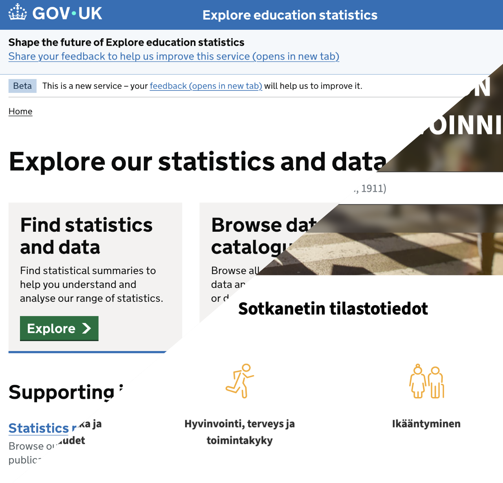
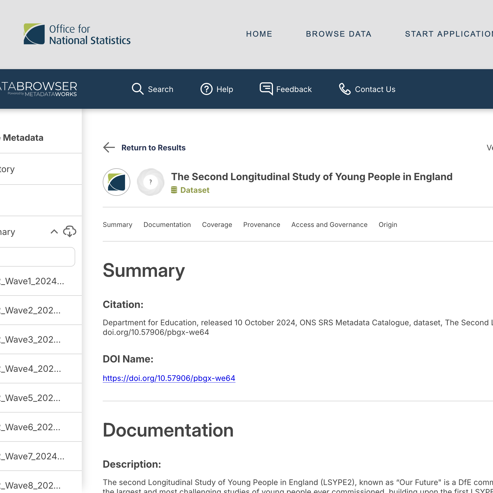
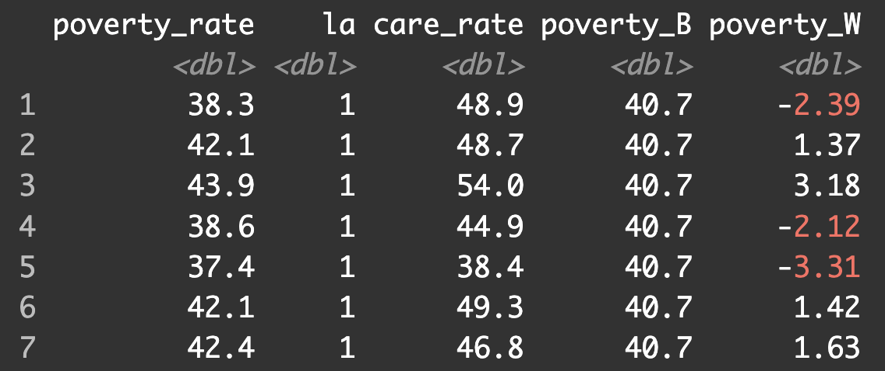
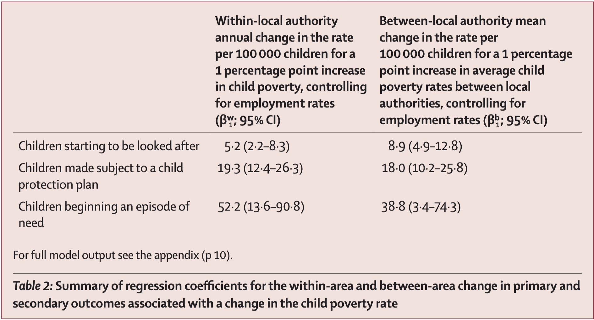
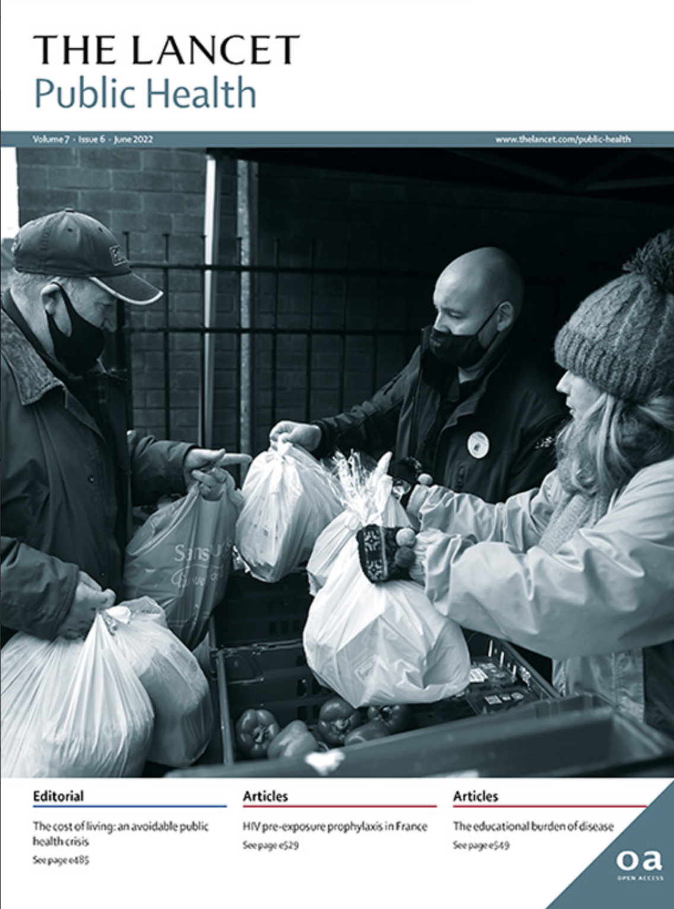
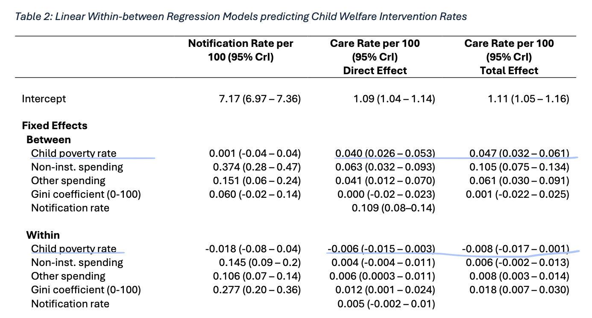
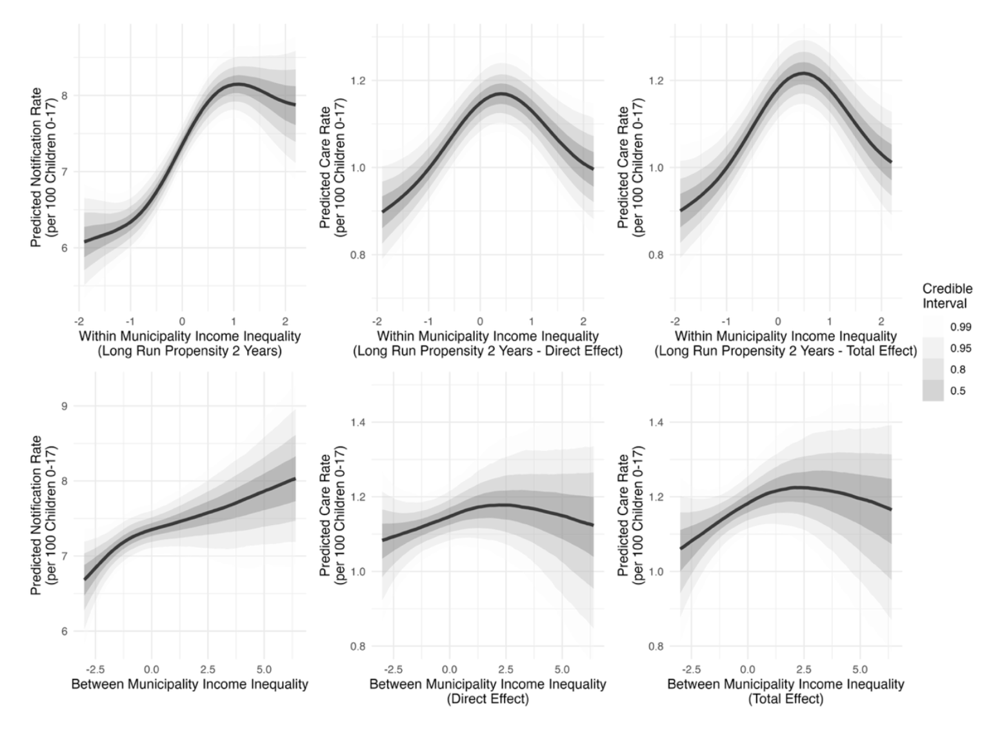

class: middle, title
background-size: contain


<!----- 

Make a pdf using:

decktape generic --key=ArrowRight --load-pause 1800 --slides '1-31' --size '1216x684' --url-load-timeout 80000 --page-load-timeout 40000 "ntnu-quants.html" ntnu-quantitative-approaches-cwi.pdf

----->


<br><br>

# Studying Welfare Inequalities: Quantitative Approaches

<br><br>

**Dr. Calum Webb**<br>
Sheffield Methods Institute, the University of Sheffield<br>
[c.j.webb@sheffield.ac.uk](mailto:c.j.webb@sheffield.ac.uk)

```{r setup, include=FALSE}
options(htmltools.dir.version = FALSE)

# These packages are required for creating the slides
# Many will need to be installed from Github
library(icons)
library(tidyverse)
library(xaringan)
library(xaringanExtra)
library(xaringanthemer)

# Defaults for code
knitr::opts_chunk$set(
  fig.width=9, fig.height=3.5, fig.retina=3,
  out.width = "100%",
  cache = FALSE,
  echo = TRUE,
  message = FALSE, 
  warning = FALSE,
  fig.show = TRUE,
  hiline = TRUE
)

# set global theme for ggplot to make background #F8F8F8F8 (off white),
# but otherwise keep all ggplot themes default (better for teaching)
theme_set(
  theme(plot.background = element_rect(fill = "#F8F8F8", colour = "#F8F8F8"), 
        panel.background = element_rect(fill = "#F8F8F8", colour = "#F8F8F8"),
        legend.background = element_rect(fill = "#F8F8F8", colour = "#F8F8F8")
        )
  )

xaringanExtra::use_tachyons()

```

```{r xaringan-tile-view, echo=FALSE}
# Use tile overview by hitting the o key when presenting
xaringanExtra::use_tile_view()
```

```{r xaringan-logo, echo=FALSE}
# Add logo to top right
xaringanExtra::use_logo(
  image_url = "header/smi-logo-white.png",
  exclude_class = c("inverse", "hide_logo"), 
  width = "180px", position = css_position(top = "1em", right = "2em")
)
```

```{r xaringan-themer, include=FALSE, warning=FALSE}

xaringanExtra::use_tachyons()

# Set some global objects containing the colours
# of the university's branding
primary_color <- "#131E29"
secondary_color <- "#440099"
tuos_blue <- "#9ADBE8"
white = "#F8F8F8"
tuos_yellow <- "#FCF281"
tuos_purple <- "#440099"
tuos_red <- "#E7004C"
tuos_midnight <- "#131E29"

# The bulk of the styling is handled by xaringanthemer
style_duo_accent(
  primary_color = "#131E29",
  secondary_color = "#440099",
  colors = c(tuos_purple = "#440099", 
             grey = "#131E2960", 
             tuos_blue ="#9ADBE8",
             tuos_mint = "#00CE7C"),
  header_font_google = xaringanthemer::google_font("Source Serif Pro", "600", "600i"),
  text_font_google   = xaringanthemer::google_font("Source Sans Pro", "300", "300i", "600", "600i"),
  code_font_google   = xaringanthemer::google_font("Lucida Console"),
  header_h1_font_size = "2rem",
  header_h2_font_size = "1.5rem", 
  header_h3_font_size = "1.25rem", 
  text_font_size = "0.9rem",
  code_font_size = "0.65rem", 
  code_inline_font_size = "0.85rem",
  inverse_text_color = "#9ADBE8", 
  background_color = "#F8F8F8", 
  text_color = "#131E29", 
  link_color = "#005A8F", 
  inverse_link_color = "#F8F8F8",
  text_slide_number_color = "#44009970",
  table_row_even_background_color = "transparent", 
  table_border_color = "#44009970",
  text_bold_font_weight = 600
)

```


```{r xaringan-panelset, echo=FALSE}
# Allow for adding panelsets (see example on slide 2)
xaringanExtra::use_panelset()
```

```{r xaringanExtra, echo = FALSE}
# Adds white progress bar to top
xaringanExtra::use_progress_bar(color = "#F8F8F8", location = "top")
```

```{r xaringan-extra-styles, echo = FALSE}
# Allow for code to be highlighted on hover
xaringanExtra::use_extra_styles(
  hover_code_line = TRUE,         #<<
  mute_unhighlighted_code = TRUE  #<<
)
```

```{r share-again, echo=FALSE}
# Add sharing links and other embedding tools
xaringanExtra::use_share_again()
```

```{r xaringanExtra-search, echo=FALSE}
# Add magnifying glass search function to bottom left for quick
# searching of slides
xaringanExtra::use_search(show_icon = TRUE, auto_search = FALSE)
```


---

class: middle

.pull-left[

<br><br><br><br><br><br>

# Structure of the session

* Why study welfare inequalities quantitatively?
* Sources of Quantitative Child Welfare Data
* Quantitative methods case study: Multilevel modelling approaches for local variation and causal analysis

]

.pull-right[

.circle-mask[

```{r, echo = FALSE, fig.align='center'}


```

]

]


---

class: middle, inverse

# I. Why study child welfare inequalities quantitatively?

---

class: middle, inverse

> .white[A director of an urban community organisation remarked, ‘People talk about their individual mental health experiences, incredibly powerful. But then you have to take that and put it in a way that would make sense to policymakers. It would need to have some quantitative data.’ Respondents across the wider system perceived central government actors to place a higher value on quantitative data. A scientific adviser in a government department noted that, ‘there’s been a focus on quantitative evidence no doubt within government… the quant stuff, the data, it just seems to trump it [qualitative data]’. This observation was confirmed by a Whitehall data analyst who believed that personal accounts, on their own, ‘wouldn’t cut much ice with Ministers and officials’.]

.right[.small[Bates, G., Ayres, S., Barnfield, A., & Larkin, C. (2023). <br>What types of health evidence persuade policy actors in a complex system?.<br> Policy & Politics, 51(3), 386-412]]


---

.pull-left[

<br><br><br>

# The role of quantitative evidence in policymaking

**Do you want your research to make a difference?** What do policymakers and policy influencers look for when they are making a case for change?

"This is just the kind of evidence we need"

**Four Evidence Profiles of Policy Actors:** *Piddington, G., MacKillop, E., & Downe, J. (2024). Do policy actors have different views of what constitutes evidence in policymaking?. Policy & Politics, 52(2), 239-258.*

]

--

.pull-right[

<br><br><br>

## [Evidence Based Policy Making] Idealists

"[Evidence Based Policy Making] Idealists have a strong preference for ‘rigorous’ evidence, however, the participants in this profile recognise that it is not just limited to quantitative evidence. Classic EBPM views such as quantitative evidence being the most important (-1) and evidence being what can be counted and measured (-2) were not ranked positively in either study, suggesting a recognition that these ideals do not apply in the real world. There was some support for RCTs being the gold standard of evidence (+1), but as one participant commented:

> ‘I don’t agree that only quants should count or RCTs or statistical analysis
should be all that matters. More recently I am seeing more of a mix of data
analysis and case studies. If you only do very scientific studies, you would
be unlikely to be able to influence people.’ "

]

---

.pull-left[

<br><br><br>

# The role of quantitative evidence in policymaking

**Do you want your research to make a difference?** What do policymakers and policy influencers look for when they are making a case for change?

"This is just the kind of evidence we need"

**Four Evidence Profiles of Policy Actors:** *Piddington, G., MacKillop, E., & Downe, J. (2024). Do policy actors have different views of what constitutes evidence in policymaking?. Policy & Politics, 52(2), 239-258.*

]

.pull-right[

<br><br><br>

## The Inclusive

"This profile places emphasis on considering “a broad variety of evidence”
(INC-9) in policymaking, suggesting that “[the policy community] need[s] to
take all kinds of evidence into account” (INC-27). ... Those people with an inclusive view of evidence value individual stories as evidence (+2), believe that evidence is anything that helps draw a rich picture of an issue (+2) and that policymakers should use evidence in an impartial way (+2)."


> "[T]here is an irreducible complexity to the world that research can help
with but not resolve"

]

---

.pull-left[

<br><br><br>

# The role of quantitative evidence in policymaking

**Do you want your research to make a difference?** What do policymakers and policy influencers look for when they are making a case for change?

"This is just the kind of evidence we need"

**Four Evidence Profiles of Policy Actors:** *Piddington, G., MacKillop, E., & Downe, J. (2024). Do policy actors have different views of what constitutes evidence in policymaking?. Policy & Politics, 52(2), 239-258.*

]

.pull-right[

<br><br><br>

## The Pragmatist

The Scottish Pragmatists strongly agree with the idea that ‘evidence is always going
to be contested’ and that ‘there is not always clear evidence about what works on
an issue’. 

One participant explained that policymakers come to the role with preconceptions
which should be challenged, and evidence is a valuable step in that process... 

> ‘it can reaffirm the views that you took or decisions that you made...it has a
very important challenge function… [and] it is important for all the different
voices to be heard as equally as possible so that everyone gets the opportunity
to participate in the democratic process.’

]

---

.pull-left[

<br><br><br>

# The role of quantitative evidence in policymaking

**Do you want your research to make a difference?** What do policymakers and policy influencers look for when they are making a case for change?

"This is just the kind of evidence we need"

**Four Evidence Profiles of Policy Actors:** *Piddington, G., MacKillop, E., & Downe, J. (2024). Do policy actors have different views of what constitutes evidence in policymaking?. Policy & Politics, 52(2), 239-258.*

]

.pull-right[

<br><br><br>

## The Political

This profile strongly disagreed that ‘quantitative evidence is the most important
evidence’ (-4) and that ‘there is a need for a hierarchy of evidence’ (-4). Participants said, “those statements make me shudder, they make me so cross” (POL-5) and that “it’s just completely untrue” (POL-19). Further, this profile ranked the ideas that “evidence should be rigorously tested and capable of replication” (-3) and “RCTs are the gold standard of evidence” (-3) lower than other profiles. Concerning RCTs, one participant commented that “some types of science use RCTs to delegitimise other forms of science” (POL-17). 


]

---

<br><br>

.pull-left[

## EBPM Idealists

* Favour paradigm that fits quants more easily (replicable, "rigorous") than quals
* Support for the idea of a hierarchy of evidence (Randomised Controlled Trials at the top)

<br>
<hr>

## The Inclusives

* Strongest support for a plurality of evidence
* Strongest support for including qualitative and lived experience as evidence in policymaking

]


.pull-right[

## The Pragmatists<br>

* Emphasises the rhetorical role that evidence plays (challenging viewpoints)
* Flexibility on what evidence is most suitable depending on what the issue is

<br>
<hr>

## The Politicals

* Greatest opposition to a hierarchy of evidence
* Emphasise the role that power relations play in what is counted as evidence


]

.footnote[*Piddington, G., MacKillop, E., & Downe, J. (2024). Do policy actors have different views of what constitutes evidence in policymaking?. Policy & Politics, 52(2), 239-258.*]

---

class: inverse, middle

# Reflection

* Which evidence profile do you most strongly align with?
* If you had to speak to someone who fit with a different evidence profile, which would you find the most challenging?
* Which do you think is the most common evidence profile amongst policymakers? Which do you think is the most powerful?


---

<br><br>

.pull-left[

## EBPM Idealists (17/54)

* Favour paradigm that fits quants more easily (replicable, "rigorous") than quals
* Support for the idea of a hierarchy of evidence (Randomised Controlled Trials at the top)

<br>
<hr>

## The Inclusives (13/54)

* Strongest support for a plurality of evidence
* Strongest support for including qualitative and lived experience as evidence in policymaking

]


.pull-right[

## The Pragmatists (14/54)

* Emphasises the rhetorical role that evidence plays (challenging viewpoints)
* Flexibility on what evidence is most suitable depending on what the issue is

<br>
<hr>

## The Politicals (10/54)

* Greatest opposition to a hierarchy of evidence
* Emphasise the role that power relations play in what is counted as evidence


]

.footnote[*Piddington, G., MacKillop, E., & Downe, J. (2024). Do policy actors have different views of what constitutes evidence in policymaking?. Policy & Politics, 52(2), 239-258.*]


---

class: middle, inverse

# The odds of any given man in the poorest 10% of neighbourhoods in England dying in 2017 were 1.63 times higher than a man in the richest 10% of neighbourhoods. 1.54 times higher for women.

.right[[Banks, et al. 2021](https://ifs.org.uk/news/socioeconomic-inequalities-mortality-were-growing-adults-pre-pandemic-falling-young-children)]

---

class: middle, inverse

# The age-standardised incidence rate of Lung Cancer is 2.5 times higher in the poorest 20% of neighbourhoods in England than it is in the richest 20% of neighbourhoods. 

.right[[Cancer Research UK, 2025](https://www.cancerresearchuk.org/sites/default/files/cancer_in_the_uk_2025_socioeconomic_deprivation.pdf)]

---

class: middle, inverse

# People in the poorest 10% of neighbourhoods in England are 2.3 times as likely to be diagnosed with Type 2 Diabetes, 1.6 times as likely to be diagnosed with Anxiety and Depression, and 2.5 times as likely to be diagnosed with chronic pain, when compared to people in the richest 10% of neighbourhoods.

.right[[The Health Foundation, 2025](https://www.health.org.uk/evidence-hub/health-inequalities/inequalities-in-specific-health-conditions-by-deprivation-decile)]

---

class: middle, inverse

# How big are the inequalities in child welfare?

---

class: middle

## Children in the poorest 10% of neighbourhoods in England are >10 times as likely to be on a child protection plan or in care than the least poor 10%

.center[
```{r bywaters2020child, fig.align="left", echo=FALSE, warning=FALSE, out.width="100%", out.height=420, fig.cap="Data from Bywaters, et al. <a href = https://pure.hud.ac.uk/en/publications/the-child-welfare-inequalities-project-final-report>2020</a>"}

library(plotly)

cwi_rates <- tibble(depr = c(1, 2, 3, 4, 5, 6, 7, 8, 9, 10, 1, 2, 3, 4, 5, 6, 7, 8, 9, 10),
                    cpp = c(9, 14, 21, 23, 32, 35, 47, 51, 71, 113, 1, 5, 8, 13, 17, 33, 39, 55, 74, 114),
                    cla = c(12, 14, 23, 29, 29, 40, 55, 67, 88, 133, 7, 12, 16, 22, 31, 39, 54, 63, 108, 165),
                    country = c(rep("England", 10), rep("Wales", 10)))

cwi_plot <- cwi_rates %>%
  filter(country == "England") %>%
  pivot_longer(cpp:cla, names_to = "Intervention", values_to = "rate") %>%
  mutate(
    Intervention = ifelse(Intervention == "cla", "In Care (CLA)", "CPP")
  ) %>%
  ggplot() +
  geom_col(aes(x = as.factor(depr), y = rate, group = Intervention, fill = Intervention), position = "dodge") +
    geom_text(aes(x = as.factor(depr), y = rate + 2, group = Intervention,  label = rate, colour = Intervention), stat = "identity", position = position_dodge(width = 1), size = 4, fontface = "bold") +
  ggtitle(str_wrap("", 80)) +
  scale_fill_manual(values = c(tuos_purple, tuos_blue)) +
  scale_colour_manual(values = c(tuos_purple, tuos_blue)) +
  ylab("Intervention Rate per 10,000 Children") +
  xlab("Deprivation Decile of Neighbourhoods (10 = Most Deprived)") +
  ggeasy::easy_add_legend_title("Intervention") +
  #theme_minimal() +
  theme(plot.title = element_text(face = "bold"))

ratesplot <- ggplotly(cwi_plot, tooltip = "") %>% plotly::config(displayModeBar = F)

ratesplot

# widgetframe::frameWidget(ratesplot) #403 errors on deployment?

# knitr::include_graphics("images/cpp_graph.gif")

```
]

---

.pull-left-big[

# <br>
.bg-white.b--gold.ba.bw2.br3.shadow-5.ph4[
<iframe width="810" height="400" src="https://www.youtube.com/embed/Zf2x3zMfKWk?start=94&end=157&rel=0" title="ThinkIn Family Separation - ATD Fourth World" frameborder="0" allow="accelerometer; autoplay; clipboard-write; encrypted-media; gyroscope; picture-in-picture; web-share" referrerpolicy="strict-origin-when-cross-origin" allowfullscreen></iframe>
]

]

.pull-right-small[

# <br><br><br><br><br><br><br>

<br>
Moraene Roberts (1953—2020) was an activist, campaigner, poet & researcher who worked with the charity ATD Fourth World. You can read a tribute to her work and life on the [ATD Fourth World UK website](https://atd-uk.org/2020/01/15/moraene-roberts-campaigning-with-a-banner-made-of-silk/). 


]

---

class: inverse, middle

# II. Sources of Quantitative Child Welfare Data

---

class: middle

.pull-left[

<br><br><br>

# Sources of Quantitative Child Welfare Data

* **Municipal/national administrative data over time**
  * E.g. explore-education-statistics.service.gov.uk; sotkanet.fi
  * Often open data, can be downloaded without any special permissions or license requests.
  * Can be combined with other municipal-level data quite easily to develop research studies.
* .grey[Child/household-level administrative data]
* .grey[Survey data]

]

.pull-right[

.circle-mask[

```{r, echo = FALSE, fig.align='center'}



```

]

]

---

class: middle

.pull-left[

<br><br><br>

# Sources of Quantitative Child Welfare Data

* .grey[Municipal/national administrative data over time]
* **Child/household-level administrative data**
  * e.g. ndacan.acf.hhs.gov; echild.ac.uk
  * Requires extensive access permissions & secure infrastructure, but no risk of ecological fallacy
  * Can be requested to be linked with other forms of individual/household administrative data e.g. housing records
* .grey[Survey data]

]

.pull-right[

.circle-mask[

```{r, echo = FALSE, fig.align='center'}


```

]

]

---

class: middle

.pull-left[

<br><br><br>

# Sources of Quantitative Child Welfare Data

* .grey[Municipal/national administrative data over time]
* .grey[Child/household-level administrative data]
* **Survey data**
  * [SLAITS](https://archive.cdc.gov/www_cdc_gov/nchs/slaits/nscnc.htm); childhealthdata.org (NSCH); [NSCAW](https://acf.gov/opre/project/national-survey-child-and-adolescent-well-being-nscaw-1997-2014-and-2015-2024); [LSYPE2](https://ons.metadata.works/browser/dataset/1405106/0?tab=descriptiveMetadata)
  * Often fairly straightforward access permissions.
  * Almost exclusively United States data; some possible linkage with existing surveys elsewhere.

]

.pull-right[

.circle-mask[

```{r, echo = FALSE, fig.align='center'}



```

]

]


---

class: middle

.pull-left[

<br><br><br>

# Sources of Quantitative Child Welfare Data

Search article databases for "**Cohort Profile**"s for information on what data might be suitable for your projects.


]

.pull-right[

.bg-white.b--lightest-blue.ba.bw2.br3.shadow-5.ph4[
```{r, echo = FALSE, fig.align='center'}


```
]
]

---

class: inverse, middle

# III. Case study<br>Multilevel modelling approaches for local variation and causal analysis

---

.pull-left[

<br><br><br>

### Are welfare inequalities the same everywhere?

In most countries, child welfare services & social care operates at a **local or municipal level**. Children's experiences of social care **will be more similar if they live in the same locality/municipality**. Measures of children's social care and poverty of the same locality/municipality over time will be more similar than measure between different municipalities.

This introduces a statistical problem of non-independence of errors ([Jones, et al. 2013](https://www.researchgate.net/profile/Kelvyn-Jones/publication/252146040_Do_multilevel_models_ever_give_different_results/links/0deec51f290d08078d000000/Do-multilevel-models-ever-give-different-results)).

More importantly, we lose valuable information about how child welfare inequalities exist in the real world.

This can be corrected by using **multilevel models**. 


]


.pull-right[

```{r, echo = FALSE, fig.width=5.5, fig.height=5.5, out.width=550, out.height=550}

library(tidyverse)
library(lme4)

set.seed(11211)
household_income <- rlnorm(n = 1000, meanlog = log(20000), sdlog = 0.2)
la <- rep(seq(1, 20, 1), 1000/20)
la_rs_coefs <- rnorm(20, -0.1, 0.02)
d <- tibble(household_income, la = as.factor(la)) %>%
       left_join(tibble(la = as.factor(1:20), la_rs_coefs), by = "la")

noise <- rnorm(1000, 0.5, 0.6)

d <- d %>%
  mutate(
    gcse_get_p = exp(-1 + (household_income/1000)*la_rs_coefs + noise ) / (1 + exp(-1 + (household_income/1000)*la_rs_coefs + noise)),
    gcse_get = ifelse(gcse_get_p > 0.5, 1, 0)
  ) 

# glmer(data = d, formula = gcse_get ~ I(household_income/1000) + (1 + I(household_income/1000) | la), family = binomial) %>%
#   summary()

# exp(0.17379-1.96*0.01446)
# exp(0.17379+1.96*0.01446)

ggplot(d, aes(x = household_income, y = gcse_get_p)) +
  geom_point(size = 0.5) +
  stat_smooth(method = "glm", se = FALSE, method.args = list(family=binomial),
              colour = tuos_purple) +
  scale_x_continuous(labels = scales::label_currency(prefix="£")) +
  xlab("Household Income (Equivalised)") +
  ylab("Probability of Child Welfare Contact")

```

]

---

.pull-left[

<br><br><br>

### Are welfare inequalities the same everywhere?

* Create a multilevel model where the relationship between predictor (e.g. income) and outcome (e.g. child welfare intervention) are **not single values, but unique values for each municipality/locality/country**.

* These are expressed as **random intercepts** and **random slopes**.

* **Random intercepts** represent group-level differences in the outcome

* **Random slopes** represent variation in the extent to which predictor(s) are associated with the outcome

]

.pull-right[

```{r, echo = FALSE, fig.width=5.5, fig.height=5.5, out.width=550, out.height=550}
ggplot(d, aes(x = household_income, y = gcse_get_p)) +
  geom_point(size = 0.5, aes(colour = la)) +
  stat_smooth(method = "glm", se = FALSE, method.args = list(family=binomial), aes(colour = la), linewidth = 0.75) +
  scale_x_continuous(labels = scales::label_currency(prefix="£")) +
  xlab("Household Income (Equivalised)") +
  ylab("Probability of Child Welfare Contact") +
  theme(legend.position = "none") +
  scale_colour_viridis_d(option = "D")
```
]


---

.pull-left[

<br><br><br>

### Are welfare inequalities the same everywhere?

* Create a multilevel model where the relationship between predictor (e.g. income) and outcome (e.g. child welfare intervention) are **not single values, but unique values for each municipality/locality/country**.

* These are expressed as **random intercepts** and **random slopes**.

* **Random intercepts** represent group-level differences in the outcome

* **Random slopes** represent variation in the extent to which predictor(s) are associated with the outcome

]

.pull-right[

```{r, echo = FALSE, fig.width=5.5, fig.height=5.5, out.width=550, out.height=550}
ggplot(d, aes(x = household_income, y = gcse_get_p)) +
  geom_point(size = 0.5, aes(colour = la)) +
  stat_smooth(method = "glm", se = FALSE, method.args = list(family=binomial), aes(colour = la), linewidth = 0.75) +
  xlab("Household Income (Equivalised)") +
  ylab("Probability of Child Welfare Contact") + scale_x_continuous(labels = scales::label_currency(prefix="£", scale = 0.001, suffix = "k")) +
  theme(legend.position = "none") +
  scale_colour_viridis_d(option = "D") +
  facet_wrap(~la)
```
]

---

class: inverse, middle

# Exercise

* Go to [ipse.calumwebb.co.uk](https://ipse.calumwebb.co.uk/)
* Click on the "Interactive App" menu item
* Load the interactive Shiny application: https://webb.shinyapps.io/ipse/ 
* Explore how the role of changes in preventative services funding has a different predicted impact depending on the city/county in England.

---

.pull-left[

<br><br><br>

### Are the differences between cities/countries more important than differences within those cities/countries?

An increasingly important objective when using multilevel models is separating the relationships at the group level (*between effects*) from those at the individual level (*within effects*).

* Does it matter more if you are born into a city that is poor  or a neighbourhood that is poor? Or are both equally important?
* Does living in a poor neighbourhood matter more if you live in a rich city? (The Inverse Intervention Law, [Webb, et al. 2020](https://www.sciencedirect.com/science/article/pii/S0190740919312344?casa_token=cLRElHALg5sAAAAA:yN156Ggr_QZhpVxrsEcd8wHYCkVeTQ0okKP5gxh7EmNaVvI8Q7IVYC7OzW0DWnRtxrLbG0TzvQ))
* Do services have a bigger impact in some places than others? ([Webb, C. 2025](https://ipse.calumwebb.co.uk/))

In extreme cases, a failure to do this can lead to **Simpson's Paradox**.

]


.pull-right[

```{r, echo = FALSE, fig.width=5.5, fig.height=5.5, out.width=550, out.height=550}

la1sim <- rnorm(100, 40, 5)
la2sim <- rnorm(100, 30, 5)
la3sim <- rnorm(100, 20, 5)
la4sim <- rnorm(100, 10, 3)

lasim <- tibble(
  poverty_rate = c(la1sim, la2sim, la3sim, la4sim),
  la = c(rep(1, 100), rep(2, 100), rep(3, 100), rep(4, 100))
)

noise <- rnorm(400, 0, 7)

lasim <- lasim %>%
  mutate(
    care_rate = 30 + 1.1*poverty_rate + ifelse(la==1, -30, 0) +
      ifelse(la==2, -15, 0) + ifelse(la==3, -5, 0) + ifelse(la==4, 20, 0) + noise
  )


lasim %>%
  ggplot(aes(x = poverty_rate, y = care_rate)) +
  geom_point() +
  geom_smooth(method = "lm", colour = tuos_purple) +
  xlab("Child Poverty Rate") +
  ylab("Care Rate per 10,000")

```

]


---

.pull-left[

<br><br><br>

### Are the differences between cities/countries more important than differences within those cities/countries?

An increasingly important objective when using multilevel models is separating the relationships at the group level (*between effects*) from those at the individual level (*within effects*).

* Does it matter more if you are born into a city that is poor  or a neighbourhood that is poor? Or are both equally important?
* Does living in a poor neighbourhood matter more if you live in a rich city? (The Inverse Intervention Law, [Webb, et al. 2020](https://www.sciencedirect.com/science/article/pii/S0190740919312344?casa_token=cLRElHALg5sAAAAA:yN156Ggr_QZhpVxrsEcd8wHYCkVeTQ0okKP5gxh7EmNaVvI8Q7IVYC7OzW0DWnRtxrLbG0TzvQ))
* Do services have a bigger impact in some places than others? ([Webb, C. 2025](https://ipse.calumwebb.co.uk/))

In extreme cases, a failure to do this can lead to **Simpson's Paradox**.

]


.pull-right[

```{r, echo = FALSE, fig.width=5.5, fig.height=5.5, out.width=550, out.height=550}

lasim %>%
  ggplot(aes(x = poverty_rate, y = care_rate, colour = as.factor(la))) +
  geom_point() +
  geom_smooth(method = "lm") +
  scale_colour_viridis_d(option = "D") +
  xlab("Child Poverty Rate") +
  ylab("Care Rate per 10,000") +
  labs(colour = "City") +
  theme(legend.position = "none")

```

]

---

.pull-left[

<br><br><br>

### Are the differences between cities/countries more important than differences within those cities/countries?

**Within** and **between** disaggregation of effects (sometimes called a Within-between model) is done within a multilevel model by doing the following:

* Adding the **group means** for each predictor variable to your data as a new variable, that is $\bar{X}$
* Adding **group mean centered** versions for each predictor variable as new variables, that is $X - \bar{X}$
* Including both the group means and the group mean centered versions of the variable in your multilevel model

]


.pull-right[

```{r, echo = FALSE, fig.width=5.5, fig.height=5.5, out.width=550, out.height=550}

lasim %>%
  ggplot(aes(x = poverty_rate, y = care_rate, colour = as.factor(la))) +
  geom_point() +
  geom_smooth(method = "lm") +
  scale_colour_viridis_d(option = "D") +
  xlab("Child Poverty Rate") +
  ylab("Care Rate per 10,000") +
  labs(colour = "City") +
  theme(legend.position = "none")

```

]

---

.pull-left[

<br><br><br>

### Are the differences between cities/countries more important than differences within those cities/countries?

**Within** and **between** disaggregation of effects (sometimes called a Within-between model) is done within a multilevel model by doing the following:

* Adding the **group means** for each predictor variable to your data as a new variable, that is $\bar{X}$
* Adding **group mean centered** versions for each predictor variable as new variables, that is $X - \bar{X}$
* Including both the group means and the group mean centered versions of the variable in your multilevel model

]


.pull-right[

<br><br><br><br><br><br>
.bg-white.b--lightest-blue.ba.bw2.br3.shadow-5.ph4[
```{r, echo = FALSE, fig.align='center'}



```
]
]


---

.pull-left[

<br><br><br>

### Are the differences between cities/countries more important than differences within those cities/countries?

**Within** and **between** disaggregation of effects (sometimes called a Within-between model) is done within a multilevel model by doing the following:

* Adding the **group means** for each predictor variable to your data as a new variable, that is $\bar{X}$
* Adding **group mean centered** versions for each predictor variable as new variables, that is $X - \bar{X}$
* Including both the group means and the group mean centered versions of the variable in your multilevel model

]


.pull-right[

<br><br>

```{r, echo = FALSE, results = "asis"}

lasim <- lasim %>%
  group_by(la) %>%
  mutate(
    poverty_B = mean(poverty_rate)
  ) %>%
  ungroup() %>%
  mutate(
    poverty_W = poverty_rate - poverty_B
  ) 

library(lme4)

model1 <- lm(data = lasim, formula = care_rate ~ poverty_rate)
wbmodel <- lmer(data = lasim, formula = care_rate ~ poverty_B + poverty_W + (1 | la))


stargazer::stargazer(model1, wbmodel, type = "html", no.space = TRUE, report="vc*", omit.stat = c("adj.rsq", "aic", "bic", "ll", "ser", "f"), covariate.labels = c("Poverty", "Poverty Between", "Poverty Within"), dep.var.labels = "Care Rate", model.names = FALSE, column.labels = c("OLS", "Within-Between Model"))

```

]

---

.pull-left[

<br><br><br>

## Real world examples

* Bennett, D.L., Schlüter, D.K., Melis, G., Bywaters, P., Alexiou, A., Barr, B., Wickham, S. and Taylor-Robinson, D., 2022. **Child poverty and children entering care in England, 2015–20: a longitudinal ecological study at the local area level.** *The Lancet Public Health*, 7(6), pp.e496-e503.

```{r, echo = FALSE, fig.align='center', out.width="90%"}



```

]

.pull-right[
<br>
.bg-white.b--lightest-blue.ba.bw2.br3.shadow-5.ph4[
```{r, echo = FALSE, fig.align='center', out.width="80%"}



```
]
]

---

.pull-left[

<br><br><br>

## Real world examples

* Webb, C., Zhu, N., Hietamäki, J., Toikko, T. (2026). **Local Income Inequality and Child Welfare Notifications and Interventions in Finland**. *Not yet published*.

```{r, echo = FALSE, fig.align='center', out.width="90%"}



```

]

.pull-right[

<br><br><br><br>

.bg-white.b--lightest-blue.ba.bw2.br3.shadow-5.ph4[

```{r, echo = FALSE, fig.align='center', out.width="100%"}



```

]

]

---

class: middle

.pull-left[

## Where can I learn these methods?

**Free**
* Bristol University's LEMMA Course: https://www.cmm.bris.ac.uk/lemma/ 
* Bell, A. An Introduction to Multilevel Modelling. Sheffield, UK: White Rose Social Sciences Doctoral Training Centre. Youtube. [link](https://www.youtube.com/watch?v=_7sp2-aJFUI)

**Paid Books/Courses**
* [Essex Summer School (2 week course)](https://essexsummerschool.com/course/ess-2026-course-list/3b/)
* [Robson, K., & Pevalin, D. (2015). Multilevel modeling in plain language. London, Sage.](https://methods.sagepub.com/book/mono/multilevel-modeling-in-plain-language/toc#_)
* [Snijders, T. A., & Bosker, R. (2011). Multilevel analysis: An introduction to basic and advanced multilevel modeling. London: Sage](https://uk.sagepub.com/en-gb/eur/multilevel-analysis/book234191)

]

.pull-right[
**Useful papers**
* [Bell, A., Fairbrother, M., & Jones, K. (2019). Fixed and random effects models: making an informed choice. Quality & quantity, 53(2), 1051-1074.](https://link.springer.com/article/10.1007/s11135-018-0802-x)
* [Bell, A., Jones, K., & Fairbrother, M. (2018). Understanding and misunderstanding group mean centering: A commentary on Kelley et al.’s dangerous practice. Quality & quantity, 52(5), 2031-2036.](https://link.springer.com/article/10.1007/s11135-017-0593-5)
* [Brown, V. A. (2021). An introduction to linear mixed-effects modeling in R. Advances in Methods and Practices in Psychological Science, 4(1), 2515245920960351.](https://journals.sagepub.com/doi/full/10.1177/2515245920960351)
* [Evans, C. R., Leckie, G., Subramanian, S. V., Bell, A., & Merlo, J. (2024). A tutorial for conducting intersectional multilevel analysis of individual heterogeneity and discriminatory accuracy (MAIHDA). SSM-population health, 26, 101664.](https://www.sciencedirect.com/science/article/pii/S235282732400065X)
* [Yaremych, H. E., Preacher, K. J., & Hedeker, D. (2023). Centering categorical predictors in multilevel models: Best practices and interpretation. Psychological methods, 28(3), 613.](https://www.ovid.com/journals/plmet/abstract/10.1037/met0000434~centering-categorical-predictors-in-multilevel-models-best)
]

---

class: inverse, middle

# Any questions?
