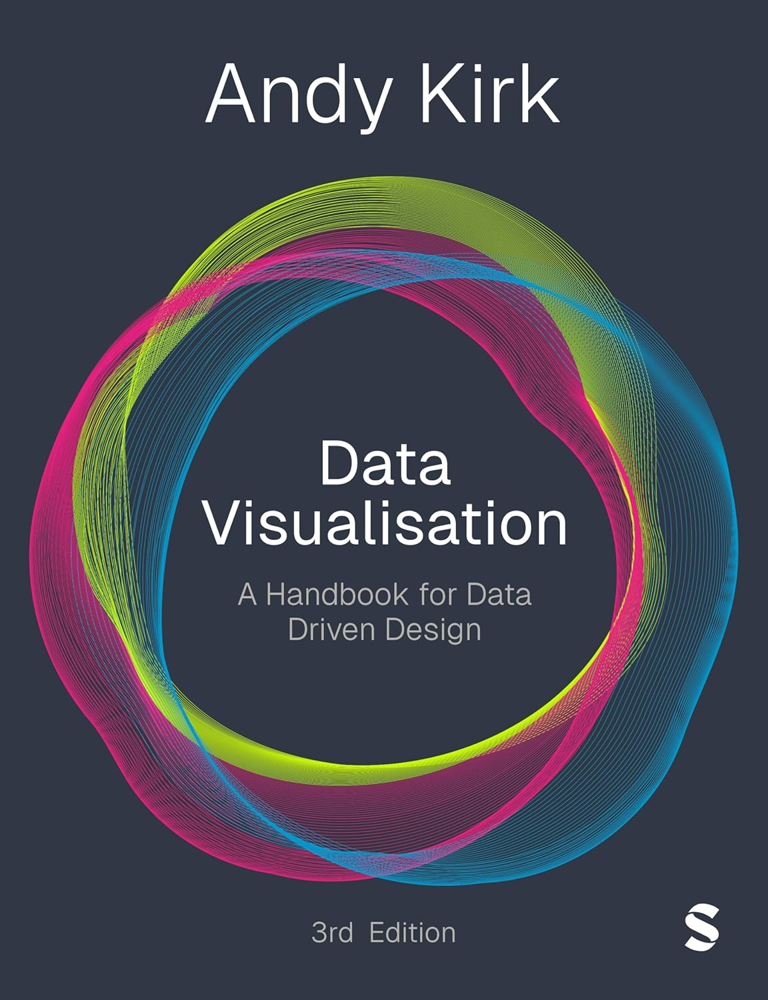
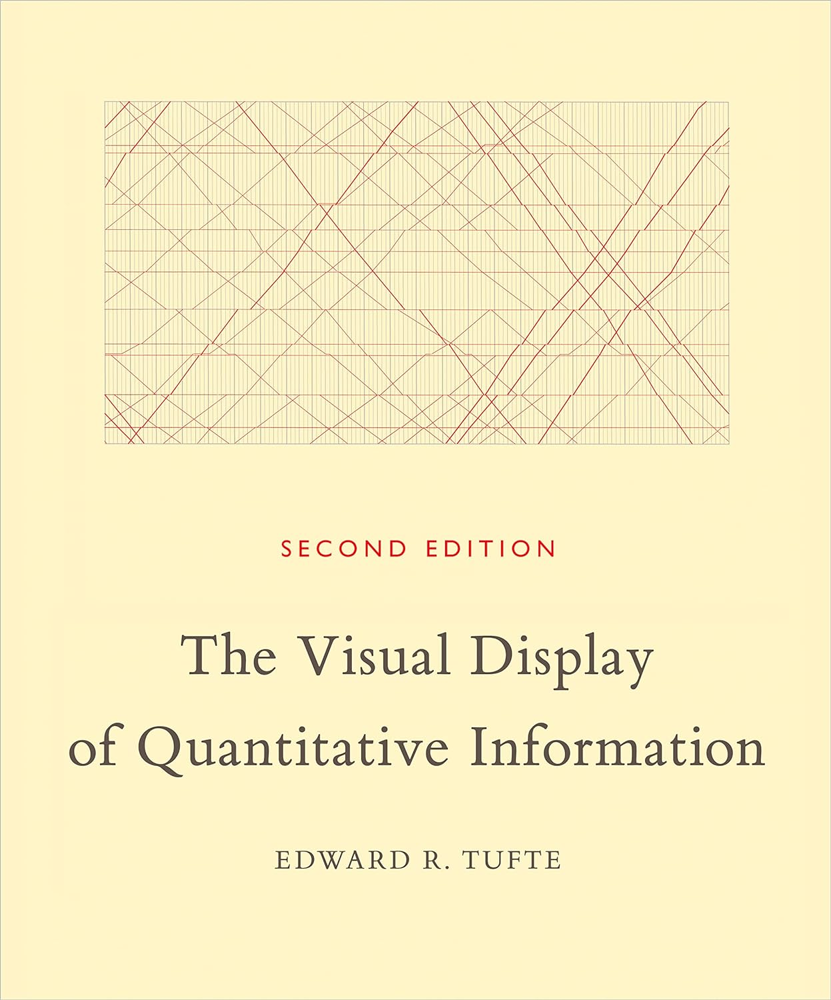
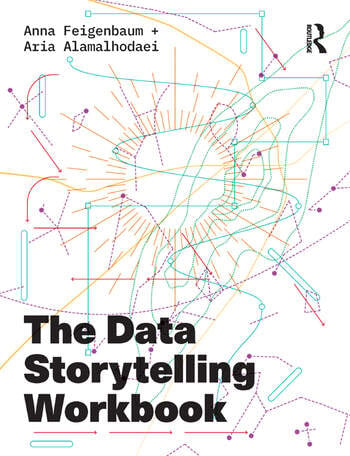
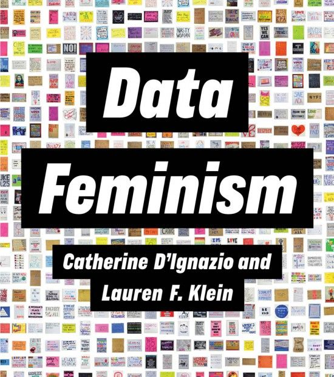
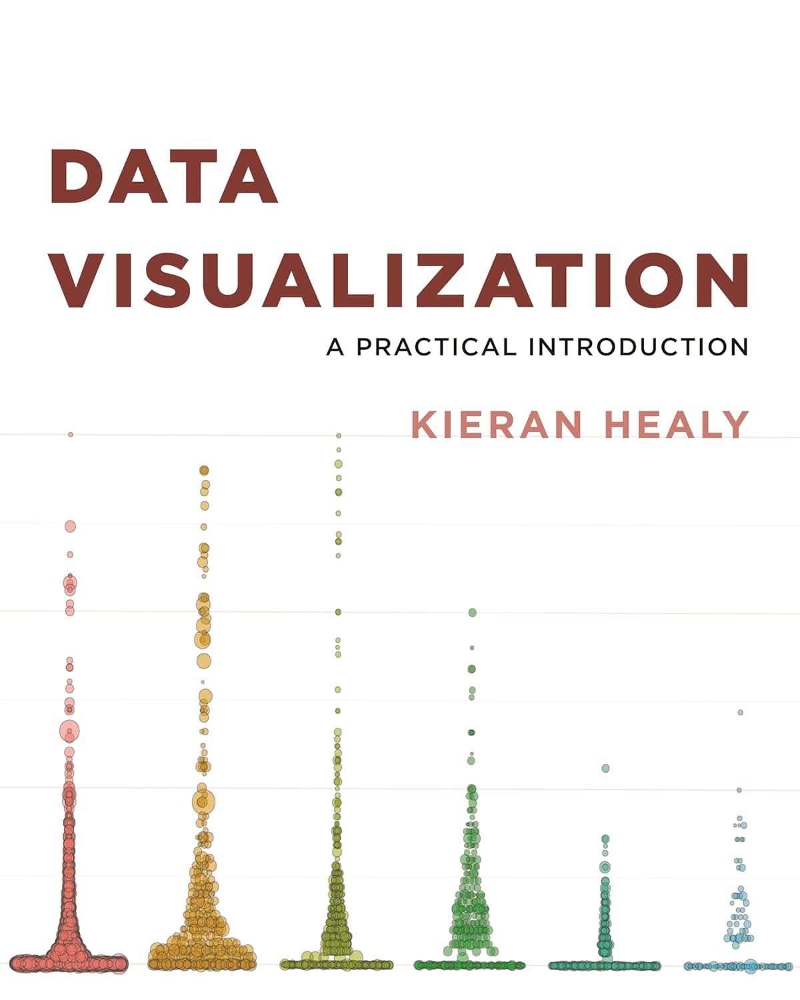
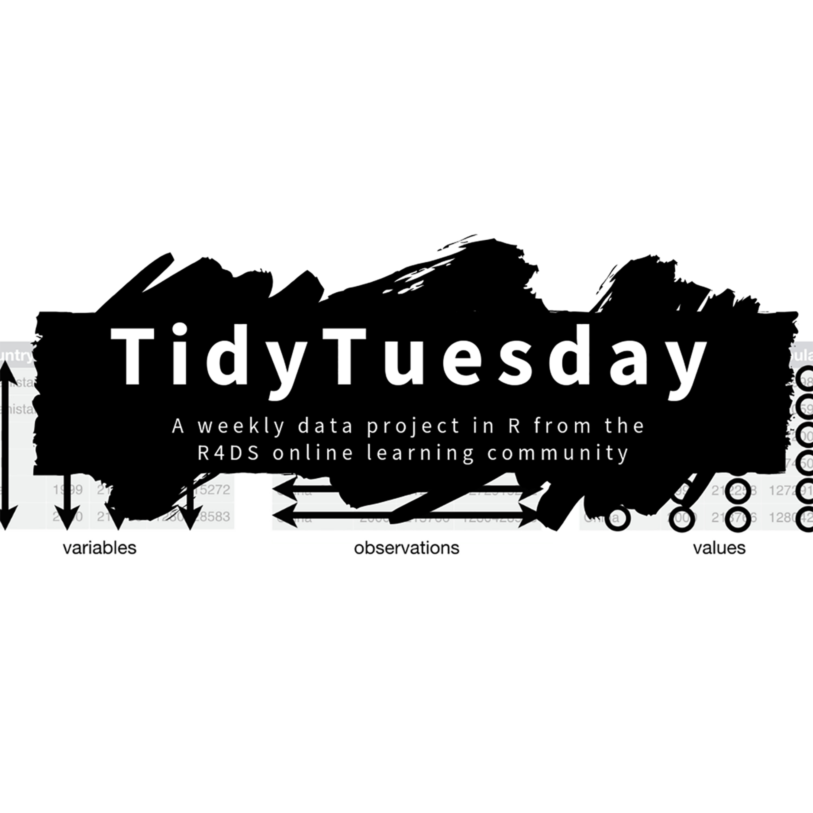

```{r setup, include=FALSE}
knitr::opts_chunk$set(echo = FALSE)
```

<!-- Font Awesome 5 Free -->
<link rel="stylesheet" href="https://cdnjs.cloudflare.com/ajax/libs/font-awesome/5.15.4/css/all.min.css">

<div>
  <input type="checkbox" class="checkbox" id="checkbox" onchange="toggleLight();return false;">
  <label for="checkbox" class="checkbox-label">
    <i class="fas fa-moon"></i>
    <i class="fas fa-sun"></i>
    <span class="ball"></span>
  </label>
</div>


This module is made up of three complementary parts: the theory of data visualisation, the practice of it, and a critical awareness of both. 

Knowledge about the theory and practice of data visualisation is based on long-established notions of ‘best practice’ and, therefore, there are many resources associated with these parts of what we are studying. However, the arguments that call for more critical awareness of the theory and practice of data visualisation are more recent. As a result, resources that put this critical awareness into practice are still emergent. You will find the resources listed at the bottom of the page in a way that reflects this:

*	Practical resources informed by ‘best practice’
*	The theory behind ‘best practice’
*	Practical resources informed from a critical perspective
*	The theory behind the critical perspective
*	Practical resources for working with R
*	Keeping up to date


## Week-by-week Plan

In this section, there’s a brief summary of what we’ll cover in the lecture and workshop each week. 

Also, you’ll find a description of the tasks we’d like you to carry out in advance of the following week’s sessions. We’ve labelled them either ‘lecture’ or ‘workshop’ to indicate that you should complete them before the following lecture or workshop, respectively.

Tasks are also labelled as core or supplementary. These labels describe the task’s role in supporting your learning on this module:

* **Core tasks**: We will draw on these in the following lecture or workshop, so you are required to complete these. We will often ask you to share your responses to core tasks on the Discussion Board. You must do this as it enables the teaching team to give feedback to the group at the start of the following lecture or workshop.
* **Supplementary tasks**: This is work that is relevant to the following lecture and or workshop so, if you do it, it will help your understanding.
 
We don’t expect you to have done anything before the sessions in week 1.

When we say week-by-week plan, the emphasis should be on the word plan. If we’re going too quickly, we’ll slow down; if we’re going to slowly, we’ll speed up. If there’s something that isn’t covered here that you think we should be doing, we’ll do it. Just let me know – email’s fine, discussion board’s fine, or tell me in a lecture or a workshop.


### Week 1: Overview and introduction

**Lecture**: We’ll start with an overview of the module, looking at how it’s going to work and what it will require of you. Then we’ll turn our focus to data visualisation, introducing the subject, thinking about when and where it is and isn’t useful, and why, as well as looking at some key concepts that will frame our study of it.

**Workshop**: A very gentle introduction to data visualisation using R, RStudio, and ggplot2. We’ll be making a first set of data visualisations, using techniques that we’ll be building on throughout the semester (don’t panic if it doesn’t make sense straight away).

#### Tasks to complete before this lecture and workshop

* There are no tasks to complete before the first workshop and lecture, but there are tasks to complete before Week 2: check them below!


### Week 2: Interpreting a data visualisation

**Lecture**: Whether or not you have come across much data visualisation before, it’s still important to reflect on how you interpret them and what factors influence the sense you make of them. This includes thinking about the different parts of a data visualisation that are intended to guide the audience through it, as well as the context in which we engage with a data visualisation. This context shapes each of our individual experiences with any given data visualisation, experiences that differ for different people. This all provides a useful foundation to build on as you go on to create your own data visualisations.

**Workshop**: Let’s extend bar charts. Last week we drew our first bar chart, but we can do better. What if we want to make the categories easier to interpret? What if we want to put the categories in descending order? What if we want to have bar charts that have the average of different categories, rather than just the number of categories that there are? 

#### Tasks to look at in advance of week 2:

Core tasks:

*	Before lecture: Read this module handbook in full 
*	Before workshop: 
  *	If you’ve got a personal machine, get R and RStudio installed on it (instructions on how to do this will be in the Week 2 learning resources folder)
  *	Having done so, work through the workshop handout once again to check it works on your machine (if it doesn’t, don’t worry, we’ll go through and troubleshoot it together)

Supplementary tasks:

  *	Before lecture: Read Top 5 things to look for in a visualisation on the Seeing Data website: https://seeingdata.org/developing-visualisation-literacy/top-5-things-to-look-for-in-a-visualisation/ (Note, the animation seems to be broken, but you can still see the 5 things highlighted by scrolling down the 5 images on the page)


### Week 3: Data storytelling

**Lecture**: Creating a data visualisation is a process with many steps. We’re going to talk about storytelling as the first step because being clear about what it is you are trying to communicate with the data – that is, the story – is helpful for the rest of the process. You can use the story to inform all the other decisions you make in the data visualisation process. And at the heart of working out the story is consideration of your audience. Where critical attention is required is whether and how the audience have been considered, for their own benefit, or not, and how transparent this is.

**Workshop**: let’s extend scatterplots. Scatterplots are one of the simplest and most powerful kinds of data visualisation, and we made our first one two weeks ago. How can we include more information than we did before? How can we draw a scatterplot with thousands of observations, without the plot becoming impossible to understand? 


#### Tasks to look at in advance of week 3:

Core tasks:

*	Before lecture: Give yourself two minutes. See how many different ways you can visualise this dataset: 75, 37 (yes, it is a dataset that only has two numbers in it). Use pen and paper to sketch all the different ways you can think of to visually compare these two numbers. Share (on the Discussion Board) the total number of ways you find.
*	Before lecture: Read the first half of the second chapter, pages 17-42, A Narrative Approach to Data Storytelling, in Feigenbaum, A. and Alamalhodaei, A. (2020) The Data Storytelling Workbook, Routledge
*	Before workshop: Work through the task at the end of the workshop handout from week 2


### Week 4: Chart types 

**Lecture**: As we saw in last week’s lecture, storytelling is central to data visualisation. While the dataset you are working with will limit the stories you can tell to some extent, there are usually still a variety of different types of chart you can create from a given dataset. Acquiring an understanding of which chart types are considered most effective for making different points will help your storytelling. However, we will also consider who decided that these chart types are the most effective? On what basis? And who are they effective for?

**Workshop**: Let’s extend graphs where we show the relationship between a continuous and a categorical variable: box plots, density curves, histograms, and so on. What’s the easiest way to understand this information? Why would we use one of these graphs over another? 

#### Tasks to look at in advance of week 4:

Core tasks:

*	Before lecture: Bookmark or download a copy of the FT’s Visual Vocabulary: https://github.com/Financial-Times/chart-doctor/blob/main/visual-vocabulary/poster.png  
*	Before lecture: Find a chart in the news that relates to the topic given to you at the end of week 3 lecture. Then, share on the Discussion Board: (i) the chart you find, (ii) where it was published (if that’s not obvious) and (iii) which category from the 9 listed across the top of FT Visual Vocabulary you think best describes the data relationship in it.
*	Before workshop: Work through the task at the end of the workshop handout from week 3

Supplementary tasks:

*	Before workshop: Read chapter 3/Make a plot of the Healy book


### Week 5: Visual design

**Lecture**: This week we’ll focus on the role of visual design in data visualisation, which includes considering how to work with colour, imagery, layout and text. We will look at some of the principles that have come to inform popular ‘best practice’. And, as data visualisation draws on knowledge from diverse fields such as graphic design, computer science and journalism, we will also look at the origins of these principles, and ask who they are ‘best’ for, as well as looking at some alternative approaches to data visualisation.

**Workshop**: We’ll begin by talking through your first assessment and address any questions you have about it. Then, let’s customise our graphs. The work we’ve been putting together so far looks OK, but it’s often very functional: default colour schemes, grey backgrounds, messy titles, and so on. In this session, we’ll go through some of the ways that we can tidy our graphs up so that we’re happy presenting them to a different set of audiences.

#### Tasks to look at in advance of week 5:

Core tasks:

*	Before lecture, read at least one of these:
  *	On the basics of formatting charts: https://analysisfunction.civilservice.gov.uk/policy-store/data-visualisation-charts/#section-6 (this section includes: Keep it simple; Labels; Annotations; Tick marks; Gridlines; but, ignore the last section ‘Communicating quality and uncertainty in charts’)
  * On working with text: https://blog.datawrapper.de/text-in-data-visualizations/ 
  *	On working with colour: https://blog.datawrapper.de/emphasize-with-color-in-data-visualizations/ 
*	Before workshop: Read the assessment brief for assessment 1
*	Before workshop: Work through the task at the end of the workshop handout

Supplementary tasks:

* Before workshop: Read chapter 4/Show the right numbers of the Healy book


### Week 6: Social Research Methods & Qualitative Data Visualisation

**Lecture**: This week we'll be dealing with the question of where the data we visualise comes from, with a particular focus on social research data. We'll talk about surveys in particular, and the different forms that data can take. We'll also consider how the ethics process works when collecting research data and what good ethical practice looks like. 

**Workshop**: This week we'll think about ways we might represent qualitative data from open survey responses as data visualisations, using techniques like word clouds, word frequency charts, and sentiment visualisation.

#### Tasks to look at in advance of Week 6:

* There are no homework tasks this week, as you should be working on your first assessment.


### Week 7: Publishing a data visualisation

**Lecture**: We’ve spent much of this module so far focusing on the elements that go into making a data visualisation, which means we’ve often looked at examples of data visualisation in isolation. However, for the audience, they always engage with a data visualisation in its published context, be that on a website, on social media, in a newspaper, on a poster, in an academic report or paper, for example. This week we will look at the factors you need to consider to integrate your data visualisations into the context in which they are published. 

**Workshop**: Let’s start drawing maps. We’re going to work with some existing data that includes spatial information to draw different kinds of maps, and consider the information that needs to be included when we draw maps.

#### Tasks to look at in advance of week 7:

Core tasks:

* Before workshop: Work through the task at the end of the workshop handout

Supplementary tasks:

* After week 6 lecture: Read Chalabi, M. and Gray, J. Sketching With Data The Data Journalism Handbook 2 pages 108-114, available online here: 
https://s3.eu-central-1.amazonaws.com/datajournalismcom/handbooks/The-Data-Journalism-Handbook-2.pdf


### Week 8: Maps

**Lecture**: Until this point we’ve looked at a lot of different kinds of graphs and charts. But maps are also a form of data visualisation and widely used. This week we’re going to focus on maps thinking about when to use them, when not to use them, and some of the specific challenges they pose. Like charts and graphs, there are also many social and cultural factors to take into consideration when working with maps. 

**Workshop**: let’s draw some more maps. In particular, what we’re going to focus on this week is combining different datasets together: what do you do if your map’s contained in one file, but the relevant variable you want to use to illustrate the map is contained in another?

#### Tasks to look at in advance of week 8:

Core tasks:

* Before lecture: Find a map in the news that is being used to present some data. Then, share on the Discussion Board: (i) the map you find, (ii) where it was published (if that’s not obvious) and (iii) one observation about how well, or not, you think it is integrated into the place where it has been published (one sentence will do).
*	Before lecture: Read When maps shouldn’t be maps http://www.ericson.net/content/2011/10/when-maps-shouldnt-be-maps/ 
*	Before workshop: Work through the task at the end of the workshop handout

Supplementary tasks:

* Before workshop: Read chapter 7/Draw maps of the Healy book


### Week 9: Guest lecture

**Lecture**: This week we have a guest lecturer, who’s going to talk about how they use data visualisation in their work.

**Workshop**: This week, we’ll think a bit more about working with data that might not be in a format we’re used to, and do our best to make it work for us. This will involve two things: first, some discussion of where we might pull data from in the first place, and some data manipulation techniques so that we can draw the kinds of graphs that we want to.

#### Tasks to look at in advance of week 9:

Core tasks:

* Before workshop: Work through the task at the end of the workshop handout for week 8

### Week 10: Data Visualisation as a Political Act: Past & Present, Visualising Networks and Using SQL

**Lecture**: In the lecture, we'll talk about the use of data visualisation as a political act. I'll tell you about two historical examples of the use of data visualisation by W.E.B. Du Bois and Florence Nightingale, and the impact that their use of data visualisation had in the context of the times they were living in. We'll finish by talking about a more recent example by Boehnert as a basis for using data visualisation for challenging established political narratives. 

**Workshop**: We'll be graphing some networks in R but with a twist! This week we'll be using SQL and RMarkdown to read our data into R.

#### Tasks to look at in advance of week 10:

Core tasks:

* **Before lecture**: Read [*Data Visualisation does Political Things* by Joanna Boehnert](https://dl.designresearchsociety.org/drs-conference-papers/drs2016/researchpapers/175/)
* **Before workshop**: Read *Talking Ties: Reflecting on Network Visualisation and Qualitative Interviewing* [https://journals.sagepub.com/doi/10.5153/sro.3404](https://journals.sagepub.com/doi/10.5153/sro.3404). Complete the tasks from the previous week's workshop.


### Week 11: Best practice for whom?

**Lecture**: Every week we’ve learnt about a different practical aspect of visualising data. Alongside this we’ve also asked critical questions about the social and cultural factors which influence each of these aspects. This week, we will draw together all of this thinking and look at why this matters for society more broadly.

**Workshop**: As with the lecture, we’ll be working through a novel approach to data viz, which will extend your skills in useful ways that are usually only possible with some coding knowledge. If you’ve got a kind of data visualisation in particular that you’d like to know how to make work, please let me know in advance of the workshop, and I’ll do my best to ensure that we cover it.

#### Tasks to look at in advance of week 11:

Core tasks:

* Before lecture: Read: D'Ignazio, C. and Klein, L.F. (2020) Introduction: Why Data Science Needs Feminism Data Feminism pages 1-19, The MIT Press https://doi.org/10.7551/mitpress/11805.003.0002 
* Before workshop: Work through the task at the end of the workshop handout from week 9

### Week 12: Wrapping up and assessment preparation

**Lecture**: By now we have covered a huge range of issues around data visualisation. The final assessment involves combining all these different elements in different ways, and in this final session we’ll work through this so that everyone should feel comfortable going into the Christmas break prepared to submit the final assessment.

**Workshop**: We’ll be working through different options for the assessment.

#### Tasks to look at in advance of week 12:

Core tasks:

*	Before lecture: Read the assessment brief for assessment 2, including any articles you might be asked to critique. This will mean that you can come prepared for week 12. 


## Resource list

### Practical resources informed by ‘best practice’

Datawrapper is an online data visualisation tool designed and used primarily by journalists. I am including it here as the great [Datawrapper blog](https://blog.datawrapper.de/) is an up-to-date resource on most aspects of chart, graph and map best practice. Largely authored by Lisa Charlotte Muth, she draws on recent developments in the field, and illustrates her articles with helpful examples.

The Office for National Statistics used to have good guidance online about working with data visualisation, providing lots of helpful advice about best practice in accessible visualisation, along with useful examples of what not to do. However, they are currently updating this resource. Keep an eye out for it coming back online. In its absence, I suggest the Government Analysis Function who have similar guidance available online.

The Office for National Statistics have [good guidance online](https://service-manual.ons.gov.uk/data-visualisation) about working with data visualisation, providing lots of helpful advice about best practice in accessible visualisation, along with useful examples of what not to do. I also suggest the [Government Analysis Function](https://analysisfunction.civilservice.gov.uk/policy-store/data-visualisation-charts/) who have similar guidance available online.

*Andy Kirk (2016). Data visualisation: a data-driven handbook for design. Sage.*
This comes from a practitioner’s perspective and addresses a huge range of principles around making graphics, along with some more practical questions of which kinds of graphics might be suitable for different tasks, their strengths and weaknesses, and so on. It’s very accessibly written, and reflects the author’s extensive experience of working with a wide range of different audiences. 

<aside>
```{r, echo = FALSE, out.width=200}

```
</aside>

Andy Kirk is also behind the [Visualising Data website](https://visualisingdata.com/) which has a helpful blog, podcast and resources. He is also active on social media and a good person to follow to find out what’s new in the field.


### The theory behind ‘best practice’

*Edward Tufte (2001). The visual display of quantitative information. Graphics Press.*
This is considered a classic of a particular type, presenting a set of hard-and-fast rules on principles for data visualisation. (It’s also not as dry as the title might imply). It’s not a very practical book: the analogy that’s sometimes used is that it’s more like a book full of beautiful photographs of food than it is like a recipe book. The principles in it also aren’t uncontroversial, something we’ll talk about during the module.

<aside>
```{r, echo = FALSE, out.width=200}

```
</aside>

*Colin Ware (2008). Visual thinking for design. Morgan Kaufman.*
This is a bit different, and covers a lot of issues around perception (what happens between an image on a screen, paper, etc, and that image going through our eyes and ending up in our brains). However, it too is written from a specific perspective that has been critiqued by sociocultural scholars.


### Practical resources informed from a critical perspective

Kennedy, H. at al (2015). Seeing Data was a research group of research projects which aimed to understand the place of data visualisations in society. One output was the [Developing Data Visualisation Literacy resource on their website](https://seeingdata.org/developing-visualisation-literacy/). It aims to help people make sense of data visualisations. It’s for the general public – people who are interested in visualisations, but are not experts in this subject. Each section tells you something different, and it attempts to build your confidence and skills in making sense of data visualisations.

Feigenbaum, A. and Alamalhodaei, A. (2020) The Data Storytelling Workbook Routledge
I like this book for its exercises and short case studies, both of which bring to life this socially-situated approach to ‘telling more effective, empathetic and evidence-based data stories’. 

<aside>
```{r, echo = FALSE, out.width=300}

```
</aside>

D’Ignazio, C. and Bhargava, R. (2017). [The Data Culture Project](https://databasic.io/en/culture/) The creators of this online resource describe it as a ‘self-service learning program to facilitate fun, creative introductions for the non-technical folks in your organisation.’ The website hosts a series of practical exercises, aimed at teams in organisations who want to build capacity to work with data. However, they contain valuable lessons that complement what we cover in this module.


### The theory behind the critical perspective

D'Ignazio, C. and Klein, L.F. (2020) Data Feminism The MIT Press 
This book is very readable and very topical. The book is accessible online: https://direct.mit.edu/books/oa-monograph/4660/Data-Feminism 

Engebretsen, M and Kennedy, H. (2020) Data Visualisation in Society Amsterdam University Press
This book is the first to bring together scholars researching data visualisation from a critical perspective and, as such, contains some of the most up-to-date thinking in this emerging field. It is written in a more academic style than some of the resources on this list.
The book is accessible online: https://www.jstor.org/stable/j.ctvzgb8c7 

<aside>
```{r, echo = FALSE, out.width=300}

```
</aside>


### Resources for working with `R`

Kieran Healy (2018). Data visualisation: a practical introduction. Princeton University Press. 
It is available in the University of Sheffield Library or at https://socviz.co/. This book is a hands-on introduction to the principles and practice of looking at and presenting data using R and ggplot. It does not assume any prior knowledge of R.

<aside>
```{r, echo = FALSE, out.width=300}

```
</aside>

This book combines technical material on how to make graphs with substantive material on what kinds of graphs you might want to make, and what makes bad graphs bad. 

Hadley Wickham (2016). ggplot2: elegant graphics for data analysis. Springer.
We’ll be using ggplot2 throughout the module, and if you want a really thorough understanding of what’s going on under the hood, with all the principles fully articulated, I’d recommend reading the book that accompanies it. While not very long, the book itself is very dense, so be prepared for that.

Winston Chang (2012). R graphics cookbook. O’Reilly.  
Unlike a lot of books about data visualisation, this book’s very practical: the format is consistently “here’s a problem you might have, here’s how you solve it”. I don’t recommend reading it cover-to-cover, I’d more encourage you to refer to it when you run into problems. 

Hadley Wickham & Garrett Grolemund (2017). R for data science. O’Reilly.
This goes significantly further than the material that we cover in this module; we’re just addressing visualisation, while this book gives you a very thorough foundation in data science using R, of which visualisation’s just one part. It’s generally written in a pretty accessible and manageable style; because of this, it’s very long.

It’s worth noting that when this module was delivered in 2020, most of the module was remote because of the global pandemic. The module was delivered by Dr Alexandra Anderson. Her excellent resources can be found at https://www.sheffield.ac.uk/smi/about/q-step/research-support (scroll down to Communicating your Research for the material that roughly corresponds to the lecture content, and to Data Visualisation – Instructional R Guides for the material that corresponds to the workshop material). Please don’t treat these resources as a substitute for attending the sessions we’ll be running this semester, but please do engage with them to consolidate your learning.


### Keeping up to date

To fully engage with this module you should be paying attention to visualisations that you see in the news media, on social media, and in all sorts of other places. Some resources you might want to particularly pay attention to are as follows:

The Economist’s [Graphic Detail](https://www.economist.com/graphic-detail) section of their website collates all the visualisations that they put together, including their Chart of the Day series. They’re generally very high-quality and well put together, and effectively integrate graphics and text. There’s also a lot of them. You can get access to The Economist through [the library's subscription](https://students.sheffield.ac.uk/library/eresources/economist).

The Financial Times collate their visual and data journalism into the [Visual and Data Journalism theme](https://www.ft.com/visual-and-data-journalism). In particular, the Data Points and Data Watch series can be a nice host of data visualisations. You can also sign up for a weekly "The Climate Graphic: Explained". As with the Economist, you can access the Financial Times [through the University Library's subscription](https://students.sheffield.ac.uk/library/eresources/ft).

The Royal Statistical Society publish six issues of the [Significance magazine](https://academic.oup.com/jrssig) per year, which you can access online from by logging in via the "Log in via your institution" button on the top-right of the page and searching for the University of Sheffield. These usually contain a wide range of interesting topics that include data visualisations. 

[Our World in Data](https://ourworldindata.org) can be a good source of both data and data visualisation inspiration across a wide range of topics. The subreddit [r/dataisbeautiful](https://www.reddit.com/r/dataisbeautiful/) often has an interesting range of posts with varying levels of complexity (just don't read the comments if you value your sanity!) 

Sophie Warnes’ [Fair Warning](https://fairwarning.substack.com) newsletter is released weekly and includes various different examples of datavis from the previous week. It’s accessible, well-written, and often highlights things that you might not have seen otherwise. You can either subscribe or just check in to the page where it’s hosted, or she posts it on her Twitter feed a couple of days after it’s gone to subscribers.

Every week, the `R` for Data Science community runs the [#TidyTuesday project](https://github.com/rfordatascience/tidytuesday), which usually involves someone picking up some open access data, usually alongside an original data visualisation presented in an article, and then making it available to the wider community where they can create their own data visualisations. The #TidyTuesday catalogue now spans near 7 years of weekly (ish) entries, with lots of opportunities to find data and visualisations. You can also search the #TidyTuesday hashtag on Twitter/X, Bluesky, etc. to see other peoples' visualisations.

<aside>
```{r, echo = FALSE, out.width=300}

```
</aside>

There are a lot of datavis practitioners posting their work on social media sites like Twitter/X, Mastodon, Bluesky, etc. both sharing graphics that they’ve made and sharing the experiences that they’ve had. Some people you might be interested in checking out are @GuardianVisuals, @ftdata, @ONS, @ECONdailycharts, @nytgraphics, @Datawrapper, @DataVizSociety, @hmtk, @kanarinka, @rahulbot, @monachalabi, @giorgialupi, @jburnmurdoch, @hadleywickham, @kjhealy, @sophiewarnes, @visualisingdata, however, you don't need to join social media to find interesting data visualisations and new sources of data.

While they don't publish data visualisations very often, the [Data is Plural](https://www.data-is-plural.com) archives can be a good source of interesting data that you could use for data visualisation. 

<br><br><br><br><br><br><br><br><br><br><br><br><br><br><br><br><br><br>

