class: middle
background-size: contain

# .tuos_purple[New Evidence on the Association between expenditure on Children’s Services and Ofsted Judgements, rates of CIN and rates of Children entering care.]

### Calum Webb .grey[.small[*British Academy Postdoctoral Fellow*]<sup>1</sup>] <br> Davara Bennett .grey[.small[*National Institute for Health Research Doctoral Researcher*]<sup>2</sup>]
#### <sup>1</sup>Sheffield Methods Institute, the University of Sheffield.<br><sup>2</sup>Department of Public Health, Policy and Systems, University of Liverpool.
#### c.j.webb@sheffield.ac.uk | davara.bennett@liverpool.ac.uk

```{r setup, include=FALSE}
options(htmltools.dir.version = FALSE)
library(icons)
library(tidyverse)
library(plotly)
library(xaringanExtra)
library(xaringanthemer)
knitr::opts_chunk$set(
  fig.width=9, fig.height=3.5, fig.retina=3,
  out.width = "100%",
  cache = FALSE,
  echo = TRUE,
  message = FALSE, 
  warning = FALSE,
  fig.show = TRUE,
  hiline = TRUE
)
```

```{r xaringan-tile-view, echo=FALSE}
xaringanExtra::use_tile_view()
```

```{r xaringan-logo, echo=FALSE}
xaringanExtra::use_logo(
  image_url = "images/uni-sheffield.png",
  exclude_class = c("inverse", "hide_logo")
)
```

```{r xaringan-themer, include=FALSE, warning=FALSE}
library(xaringanthemer)
style_duo_accent(
  primary_color = "#019EE3",
  secondary_color = "#FCF281",
  colors = c(tuos_purple = "#030043", grey = "#7a7a7a", tuos_blue ="#019EE3"),
  header_font_google = google_font("Playfair Display", "600", "600i"),
  text_font_google   = google_font("Work Sans", "300", "300i"),
  code_font_google   = google_font("Lucida Console"),
  header_h1_font_size = "2.25rem",
  header_h2_font_size = "1.75rem",
  header_h3_font_size = "1.5rem"
)
```

```{r xaringan-panelset, echo=FALSE}
xaringanExtra::use_panelset()
```

```{r xaringanExtra, echo = FALSE}
xaringanExtra::use_progress_bar(color = "#019EE3", location = "top")
```

```{r metathis, echo=FALSE}
# Add metadata
library(metathis)
meta() %>%
  meta_name("github-repo" = "cjrwebb/cjrwebb.github.io/tree/master/pres/smi") %>% 
  meta_social(
    title = "In Defence of Ordinary Help: The declining effectiveness of preventative children's services in England",
    description = paste(
      "On average, an additional £40 spent per child on preventative services in a given year was associated with decreases of nearly 5 children in need per 10,000, but this effectiveness has been declining over the decade."
    ),
    url = "https://cjrwebb.github.io/pres/smi/smi-research",
    image = "https://cjrwebb.github.io/pres/smi/idoh-card.png",
    image_alt = paste(
      "Title slide of In Defence of Ordinary Help"
    ),
    og_type = "website",
    og_author = "Calum Webb",
    twitter_card_type = "summary_large_image",
    twitter_creator = "@cjrwebb",
    twitter_site = "@cjrwebb"
  )
```


---
class: middle

### .tuos_purple[Webb, C. J. (_In press_). 'In Defence of Ordinary Help: Estimating the effect of Early Help/Family Support Spending on Children in Need Rates in England using ALT-SR'. _Journal of Social Policy_.]

### .tuos_purple[Webb, C., Bennett, D., & Bywaters, P. (_Submitted and under review_) ‘Austerity, poverty, and children’s services quality in England: Consequences for child welfare and public services’. *Social Policy & Society*.]

### .tuos_purple[Bennett, D., Webb, C., Mason, K., et al. (_Submitted and under review_) ‘Funding for preventative Children’s Services and rates of children becoming looked after: a natural experiment using longitudinal area-level data in England’. _Children and Youth Services Review_.]

---
class: inverse, middle

## Greater investment in preventative services (family support, early help, children's centres) in a given year* is associated with significant decreases in Children in Need rates and 16-17 year olds starting to be looked-after the following year, as well as increased odds of 'Good' or 'Outstanding' Ofsted ratings.

\* with some caveats

---

## One of those scientific findings up there with...


---

## One of those scientific findings up there with...

.pull-left[

<br><br><br><br>

* Bear sh— lives in woods

]

.pull-right[.center[

```{r, echo=FALSE, fig.cap="Image by NH53, Flickr https://flic.kr/p/Lw9dsz", out.height="70%", out.width="70%"}


```

]
]

---

## One of those scientific findings up there with...

.pull-left[

<br><br><br><br>

* Bear sh— lives in woods

* Pope is Catholic

]

.pull-right[.center[

```{r, echo=FALSE, fig.cap="Image by NH53, Flickr https://flic.kr/p/Lw9dsz", out.height="70%", out.width="70%"}


```

]
]

---

## One of those scientific findings up there with...

.pull-left[

<br><br><br><br>

* Bear sh— lives in woods

* Pope is Catholic

* Water is wet

]

.pull-right[.center[

```{r, echo=FALSE, fig.cap="Image by marneejill, Flickr https://flic.kr/p/YAKiXm", out.height="70%", out.width="70%"}


```

]
]

---

## One of those scientific findings up there with...

.pull-left[

<br><br><br><br>

* Bear sh— lives in woods

* Pope is Catholic

* Water is wet

* ... But deceptively hard to prove to policymakers and resource gatekeepers!

]

.pull-right[.center[

```{r, echo=FALSE, fig.cap="Image by marneejill, Flickr https://flic.kr/p/YAKiXm", out.height="70%", out.width="70%"}


```

]
]

---
class: inverse, middle

## Not naïve enough to think that you don't already know and believe this.

---
class: inverse, middle

## Am naïve enough to think that it could be useful for convincing policymakers and resource gatekeepers that these services are worth investing in.


???

I am going to focus on what each piece of research says and why it's better than the other claims that have been made by Ofsted and NAO.


---

class: inverse, middle

> # "Our inspectors have seen this across the country and we now know that: Inadequacy is __not a function of size, deprivation or funding__, but of the quality of leadership and management."

<br>

> >  ### Sir Michael Wilshaw, Chief Inspector, Ofsted, 2016: 5


???

Not fair of me to pick on Michael Wilshaw in this way, but this quote basically summarises some of the resource-holder's perspectives on the evidence. This has also been the line of various National Audit Office reports on the association between spending and outcomes.

Plenty of research has shown the effectiveness of early help and family support services through a range of methods. 

But often this effectiveness is expressed in terms of psychometric outcomes, self-assessed efficacy, or qualitative evaluation. 

This is not the language of rates of intervention and therefore not a strong basis to build an economic case.

These three papers use meaningful population outcomes that economically-driven decision-makers respond well to when building a case.

---

### **Why** is it critical that we can make this case in the language that we need to make it.* This is a crisis.


```{r spending_plot, echo=FALSE, warnings=FALSE, out.width="100%", out.height="380", fig.cap=".right[Data from <a href=https://www.gov.uk/government/collections/section-251-materials>S251 Outturns, DfE 2011-2020</a>.]"}

spend_plot <- readr::read_rds("csc_data_spend_imd.rds") %>%
  pivot_wider(names_from = "description", values_from = "value") %>%
  janitor::clean_names() %>%
  dplyr::rename(exp_cla = 4, exp_sg = 5, exp_eh = 6, pop = 7, imd = 8) %>%
  mutate(exp_cla = (exp_cla*100000) / pop,
         imd_tertile = as.factor(dplyr::ntile(x = imd, n = 3))) %>% # 3 = most deprived
  group_by(imd_tertile, year) %>%
  summarise_at(vars(exp_cla:exp_eh), ~round(median(., na.rm = TRUE), 1)) %>%
  ungroup() %>%
  pivot_longer(cols = exp_cla:exp_eh, names_to = "spending", values_to = "value_per_child") %>%
  mutate(spending = case_when(spending == "exp_cla" ~ "Looked-after", 
                              spending == "exp_sg" ~ "Safeguarding",
                              spending == "exp_eh" ~ "Early Help etc.") %>% 
           fct_relevel(., c("Looked-after", "Early Help etc.", "Safeguarding")),
         imd_tertile = fct_recode(imd_tertile, "Least Deprived 50 LAs" = "1", "Average 50 LAs" = "2", "Most Deprived 50 LAs" = "3")) %>%
  ggplot() +
  geom_area(aes(x = year, y = value_per_child, fill = spending)) +
  geom_text(data = . %>% filter(year %in% c(2011, 2013, 2015, 2017, 2019)) %>% filter(spending %in% c("Early Help etc.", "Safeguarding")) %>% mutate(value_per_child_less_sg = ifelse(spending == "Safeguarding", 0, value_per_child)) %>% group_by(year, imd_tertile) %>% summarise(value_per_child = sum(value_per_child), value_per_child_less_sg = sum(value_per_child_less_sg)), 
            aes(x = year+0.1, y = value_per_child+20, label = round(value_per_child_less_sg,0)), size = 2.5) +
  geom_line(data = . %>% filter(spending %in% c("Early Help etc.", "Safeguarding")) %>% group_by(year, imd_tertile) %>% summarise(value_per_child = sum(value_per_child)), 
            aes(x = year, y = value_per_child), size = 0.2, alpha = 0.8) +
  facet_wrap(vars(imd_tertile)) +
  ggeasy::easy_add_legend_title("\n\nSpending\nCategory") +
  ggplot2::theme_minimal() +
  scale_xaringan_fill_discrete() +
  xlab("") +
  ylab("Median Spending per Child") +
  scale_x_continuous(breaks = seq(2011, 2019, 2)) +
  theme(axis.text.x = element_text(angle = 45))

spend_plot <- ggplotly(spend_plot, tooltip = "") %>% config(displayModeBar = F)

spend_plot

```

\* Though we should not lose sight of the fact the moral and legal (CA 1989) imperative to provide this support is **more important** than the financial case!

???


---
class: middle

### .tuos_purple[Webb, C. J. (_In press_). 'In Defence of Ordinary Help: Estimating the effect of Early Help/Family Support Spending on Children in Need Rates in England using ALT-SR'. _Journal of Social Policy_.]

### .grey[Webb, C., Bennett, D., & Bywaters, P. (_Submitted and under review_) ‘Austerity, poverty, and children’s services quality in England: Consequences for child welfare and public services’. *Social Policy & Society*.]

### .grey[Bennett, D., Webb, C., Mason, K., et al. (_Submitted and under review_) ‘Funding for preventative Children’s Services and rates of children becoming looked after: a natural experiment using longitudinal area-level data in England’. _Children and Youth Services Review_.]


---

### Children in Need rates and the Trouble with Thresholds (Devaney, 2019). Why we don't often look at CIN and why it's usually not reliable.
###  

.pull-left[

<br>

Local authorities interpret legislation for interventions, especially 'low-level' ones, differently. e.g.

Section 17 (10) of the Children Act 1989: __Definition of a 'Child in Need'__:

> (a) he is unlikely to achieve or maintain ... a reasonable standard of health or development without the provision for him of services by a local authority .. 

> (b) his health or development is likely to be significantly impaired, or further impaired, without the provision for him of such services... or;

> (c) he is disabled.


]

.pull-right[.center[

```{r, echo = FALSE, fig.width=5, fig.height=4, out.height=400, out.width=500, dpi=400}

csc_data <- read_rds("csc_extract.rds") %>%
  filter(description %in% c("Total Expenditure per Child Aged 0-17 (£ per child in 2019 prices)",
                            "Children in Need rate per 10,000 Aged 0-17")) %>%
  pivot_wider(names_from = description, values_from = value) %>%
  rename(exp = 4, cin = 5) %>%
  left_join(., read_rds("imd_year.rds"), by = c("la_name", "year")) %>%
  select(-new_la_code.x, -new_la_code.y)

mod1 <- lm(csc_data, formula = cin ~ imd) %>% broom::augment(newdata = csc_data) %>%
  select(la_name, year, exp, cin, imd, cin_resid = .resid)

csc_data2 <- lm(csc_data, formula = exp ~ imd) %>% broom::augment(newdata = csc_data) %>%
  select(la_name, year, exp_resid = .resid) %>%
  left_join(., mod1)


scatterplot_csc <- csc_data2 %>%
  ggplot() +
  geom_point(aes(x = exp_resid, y = cin_resid), size = 0.5) +
  scale_x_continuous(limits = c(-475, 750), n.breaks = 4) +
  scale_y_continuous(limits = c(min(csc_data2$cin), 300), n.breaks = 4) +
  ylab("\nChildren in Need Rate per 10,000\n(Adjusted for Deprivation)") +
  xlab("\nExpenditure per Child\n(Adjusted for Deprivation)") +
  facet_wrap(~year) +
  theme_minimal() +
  theme_xaringan() +
  theme(legend.position = "bottom", legend.title = element_blank(), legend.box="vertical",
      text = element_text(size = 10), title = element_text(family = "Work Sans"), 
      axis.title = element_text(size = 10))

scatterplot_csc


```

]
]

???

However, this analysis was flawed because of some fundamental misunderstandings of how children become designated as Children in Need, and how services decide when to intervene.

Firstly, there are definitional problems -- terms like Children in Need are subject to local authorities' interpretation of legislation and, in the specific case of Need, this interpretation can be quite broad.

---

### Children in Need rates and the Trouble with Thresholds (Devaney, 2019). Why we don't often look at CIN and why it's usually not reliable.
###  

.pull-left[

<br>

A significant factor in the numbers of interventions is the extent of __rationing of services__ within a local authority (Webb & Bywaters, 2018; Devaney, 2019; Hood, 2020).

* Local authorities with less funding (relative to need), or with decreasing funding, more strictly ration access to services (and therefore the numbers of children who can be 'in Need' at a given time).

]

.pull-right[.center[

```{r, echo = FALSE, fig.width=5, fig.height=4, out.height=400, out.width=500, dpi=400}

scatterplot_csc

```

]
]


???

In practice, then, local authorities often ration many of their services, especially preventative or early help services, depending on the total amount of funding they have available -- in other words, need rates might often go down or be stable not because need has gone down, but because they are no longer able to have such an inclusive definition of need.

---

### Children in Need rates and the Trouble with Thresholds (Devaney, 2019). Why we don't often look at CIN and why it's usually not reliable.
###  

.pull-left[

<br>

A significant factor in the numbers of interventions is the extent of __rationing of services__ within a local authority (Webb & Bywaters, 2018; Devaney, 2019; Hood, 2020).

* Local authorities with less funding (relative to need), or with decreasing funding, more strictly ration access to services (and therefore the numbers of children who can be 'in Need' at a given time).


#### What we really want to analyse is what happens **within** a local authority when their spending on preventative services increases or decreases __above or below their normal level and trajectory__.

]

.pull-right[.center[

```{r, echo = FALSE, fig.width=5, fig.height=4, out.height=400, out.width=500, dpi=400}

scatterplot_csc

```

]

]

???

This means that relying on the relationships between cases may be unreliable -- higher levels of spending often correspond with higher rates of children in need, but using standard statistical models like those used by the National Audit Office does not recognise that that local authority may have a more inclusive defition of CIN and be more able to provide services.

What we really want to know is what happens to CIN rates _within_ a local authority when their expenditure on these services fluctuates above or below their stable level and trajectory.


---

### The separation of between-'unit' and within-'unit' components of individual change over time using the ALT-SR model (Curran, et al. 2014)

.pull-left[
.middle[
```{r, echo = FALSE, out.width="90%"}

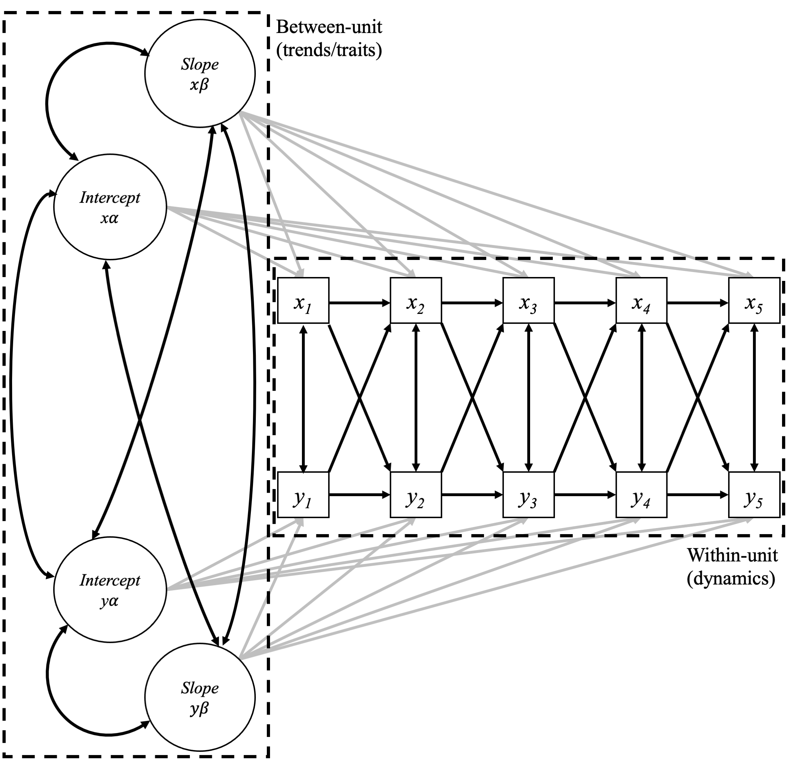

```
]
]

.pull-right[
.middle[

```{r, echo = FALSE, out.width="100%"}

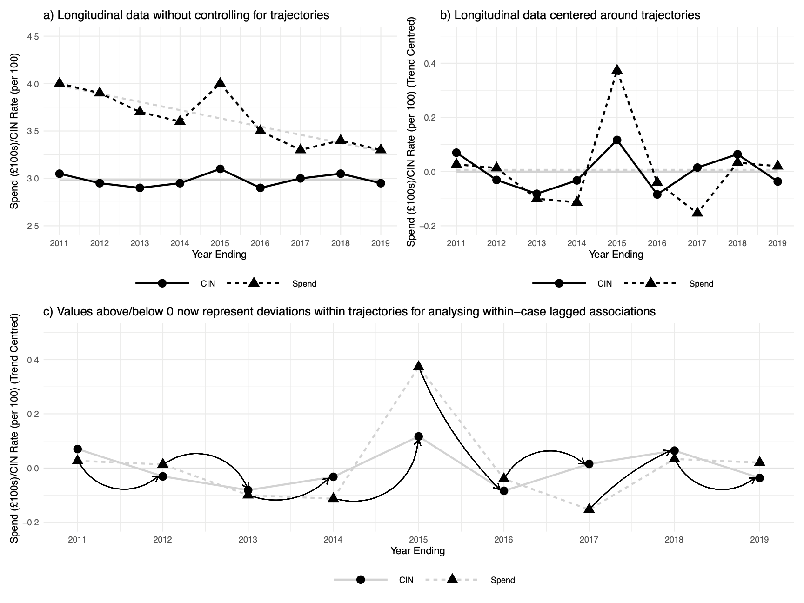

```
]
]

<div style="text-align:right;">Figures from Webb, in press.</div>

???

Fortunately, other observational studies in other research fields have been faced with this exact problem:

* How do you measure the effect of dietary changes on children's development when they are developing at different rates due to a number of measurable and unmeasurable indivdiual-level characteristics, like genetics?

* How do you measure the effect of alcohol consumption on wellbeing for a cohort that is ageing from late adolescence to adulthood?

This is where Curran, et al. developed the ALT-SR model to separate between-unit and within-unit components of change over time, to better identify within-unit dynamics. 

This partitions between-unit effects to a latent growth part of a structural equation model, and within-unit effects to a cross-lagged part of the model.

To my knowledge, I am the first person to apply this to local public services and populations as opposed to individuals.


---

### Higher spending per child in a given year was associated with significant reductions of Children in Need *within* local authorities, but this effect has weakened over the decade.

.pull-left[

* On average over the decade, __each additional £100__ in spending per child was associated with __a reduction of between 12 and 13 children ‘in need’ per 10,000 the following year__, around a 4 per cent reduction a typical local authority. Each increase of 1% in spending was associated with a 0.11% decrease in CIN rate the following year.

* After estimating this effect independently for each pair of years, __the effectiveness of spending on preventative services for children and young people was found to have declined to a point of non-significance beyond around 2015__.

* Spending cuts since 2010/11 can account for __between 13,000 to 16,500 more children and young people each year between 2010 and 2015 kept at risk of developmental or health impairments nationally__. 

]

.pull-right[


```{r, echo = FALSE, fig.width=5, fig.height=4, out.height=400, out.width=500, dpi=400}

idoh_results <- tibble(
  year = c("2011 \U2192 2012",
           "2012 \U2192 2013",
           "2013 \U2192 2014", 
           "2014 \U2192 2015", 
           "2015 \U2192 2016",
           "2016 \U2192 2017",
           "2017 \U2192 2018",
           "2018 \U2192 2019"),
  effect = c(-0.159,
             -0.131,
             -0.097,
             -0.07,
             -0.039,
             -0.011,
             0.026,
             0.056),
  lower = c(-0.248,
            -0.208,
            -0.165,
            -0.135,
            -0.106,
            -0.088,
            -0.067,
            -0.056),
  upper = c(-0.068,
            -0.05,
            -0.024,
            0.002,
            0.036,
            0.075,
            0.127,
            0.174)


)

idoh_results %>%
  mutate(year = factor(year)) %>%
  ggplot() +
  geom_vline(xintercept = 0, colour = "grey") +
  geom_segment(aes(x = lower, xend = upper, y = fct_rev(year), yend = fct_rev(year)), 
               col = "#019EE3", size = 2, lineend = "round") +
  geom_point(aes(x = effect, y = fct_rev(year)), size = 4) +
  geom_text(aes(x = effect, y = fct_rev(year), label = effect), nudge_y = 0.4, size = 3) +
  theme_minimal() +
  theme_xaringan() +
  ylab("") +
  xlab("\nPredicted effect of 1% increase in preventative services\nspending per child on following year's CIN rate (in %)\nwith 95% BCa Bootstrap Intervals") +
  theme(legend.position = "bottom", legend.title = element_blank(), legend.box="vertical",
      text = element_text(size = 10), title = element_text(family = "Work Sans"), 
      axis.title = element_text(size = 10), panel.grid = element_blank())


```


]


???

When we apply this model to rates of children in need and levels of spending on preventative services per child, we find a significant and contextually large effect that indicates higher spending per child within a local authority results in reductions in children in need the following year.

On average, an additional £40 spent per child on preventative services in a given year was associated with decreases of nearly 5 children in need per 10,000 (the average rate of children in need in a local authority is around 360 per 10,000, and the average expenditure per child over the decade was around £320).

However, we also find that this effect has been decreasing over the decade: this is despite a significant investment in two 'What Works' centres, with over £15million of government grants provided to the Early Intervention Foundation and over £30million in grants provided to the What Works Centre for Children's Social Care over the decade.


---

### Why has spending on preventative services become less effective at meeting Children and Families needs?

.pull-left[

#### What has changed over the past ten years?


]

.pull-right[


]

???


---

### Why has spending on preventative services become less effective at meeting Children and Families needs?

.pull-left[

#### What has changed over the past ten years?

* A __reduction in total expenditure__ on services. Professor Rick Hood, et al. (2020) and research [published by the Sutton Trust](https://www.suttontrust.com/wp-content/uploads/2018/04/StopStart-FINAL.pdf) highlighted that this has meant resources have been rationed to meet much more acute and complex, rather than universal or chronic, needs. The NCB highlighted this risks 'storing up trouble' in 2017.

]

.pull-right[

]

???


---

### Why has spending on preventative services become less effective at meeting Children and Families needs?

.pull-left[

#### What has changed over the past ten years?

* A __reduction in total expenditure__ on services. Professor Rick Hood, et al. (2020) and research [published by the Sutton Trust](https://www.suttontrust.com/wp-content/uploads/2018/04/StopStart-FINAL.pdf) highlighted that this has meant resources have been rationed to meet much more acute and complex, rather than universal or chronic, needs. The NCB highlighted this risks 'storing up trouble' in 2017.

* A focus on __'what works'__ and services that can be evaluated using Randomised Controlled Trials or Quasi-Experimental Designs may have crowded out universal services and those delivered in a community setting, which are harder or impossible to evaluate under RCTs/QEDs, especially when they are __community-led, designed, and delivered__.


]

.pull-right[

]

???

---

### Why has spending on preventative services become less effective at meeting Children and Families needs?

.pull-left[

#### What has changed over the past ten years?

* A __reduction in total expenditure__ on services. Professor Rick Hood, et al. (2020) and research [published by the Sutton Trust](https://www.suttontrust.com/wp-content/uploads/2018/04/StopStart-FINAL.pdf) highlighted that this has meant resources have been rationed to meet much more acute and complex, rather than universal or chronic, needs. The NCB highlighted this risks 'storing up trouble' in 2017.

* A focus on __'what works'__ and services that can be evaluated using Randomised Controlled Trials or Quasi-Experimental Designs may have crowded out universal services and those delivered in a community setting, which are harder or impossible to evaluate under RCTs/QEDs, especially when they are __community-led, designed, and delivered__.


]

.pull-right[

#### <br>

* Strong focus on 'early intervention' where early means 'first 1,000 days' or similar. The [YMCA's Out of Service](https://www.ymca.org.uk/wp-content/uploads/2020/01/YMCA-Out-of-Service-report.pdf) report suggests that services for older children and young people have been most strongly affected. 

  Rates of children looked-after have grown most in the 16-17 year old age group (almost 2 times in 10 years), where rates for 1—4 year olds have been relatively stable.

]

???

---


### Why has spending on preventative services become less effective at meeting Children and Families needs?

.pull-left[

.center[

```{r, echo = FALSE, out.width="60%"}

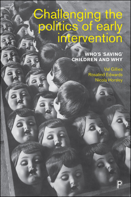

```
]

]

.pull-right[

.center[
```{r, echo = FALSE, out.width="60%"}

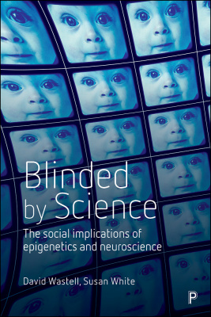

```
]

]

???


---


### Why has spending on preventative services become less effective at meeting Children and Families needs?

.pull-left[

.center[

```{r, echo = FALSE, out.width="60%"}


```
]

]

.pull-right[

* [Stewart‐Brown, S., et al. (2011). Should randomised controlled trials be the “gold standard” for research on preventive interventions for children?. _Journal of Children's Services_.](https://doi.org/10.1108/17466661111190929)
* [Forrester, D. (2012). Are the people who take part in randomised controlled trials real? A response to Stewart‐Brown et al. _Journal of Children's Services_.](https://doi.org/10.1108/17466661211238691)
* [Stewart‐Brown, S. (2012). More thoughts on the RCT question: a rejoinder to Forrester and Ritter. _Journal of Children's Services_.](https://doi.org/10.1108/17466661211238718)
* [Featherstone, B., Morris, K., & White, S. (2014). A marriage made in hell: Early intervention meets child protection. _British Journal of Social Work_, 44(7), 1735-1749.](https://doi.org/10.1093/bjsw/bct052)
* [Axford, N., & Berry, V. (2018). Perfect Bedfellows: Why Early Intervention Can Play a Critical Role in Protecting Children—A Response to Featherstone et al.(2014)‘A Marriage Made in Hell: Child Protection Meets Early Intervention’. _British Journal of Social Work_, 48(1), 254-273.](https://doi.org/10.1093/bjsw/bcx003)


]

???

---

class: inverse, middle


## Your thoughts.

---

class: middle

### .grey[Webb, C. J. (_In press_). 'In Defence of Ordinary Help: Estimating the effect of Early Help/Family Support Spending on Children in Need Rates in England using ALT-SR'. _Journal of Social Policy_.]

### .tuos_purple[Webb, C., Bennett, D., & Bywaters, P. (_Submitted and under review_) ‘Austerity, poverty, and children’s services quality in England: Consequences for child welfare and public services’. *Social Policy & Society*.]

### .grey[Bennett, D., Webb, C., Mason, K., et al. (_Submitted and under review_) ‘Funding for preventative Children’s Services and rates of children becoming looked after: a natural experiment using longitudinal area-level data in England’. _Children and Youth Services Review_.]


---

### The importance of quality

* Reduced rates of intervention would be of little comfort if they meant that children and families were going *without* support in the first place, rather than them no longer needing it.

--

> "Our inspectors have seen this across the country and we now know that: Inadequacy is __not a function of size, deprivation or funding__, but of the quality of leadership and management."

.right[Sir Michael Wilshaw, Chief Inspector, Ofsted, 2016: 5]

--

.pull-left[

## .tuos_purple[The existing evidence does currently support the idea that spending on services is not associated with Ofsted outcomes.]

]

.pull-right[

* [Wilkins, D., & Antonopoulou, V. (2020). Do performance indictors predict Ofsted ratings? An exploratory study of children’s services in England. _Journal of Children's Services_.](https://doi.org/10.1108/JCS-07-2019-0035)
* [Wilkins, D., & Antonopoulou, V. (2020). Ofsted and children’s services: what performance indicators and other factors are associated with better inspection results?. _The British Journal of Social Work_, 50(3), 850-867.](https://academic.oup.com/bjsw/article-abstract/50/3/850/5253800)
* [National Audit Office (2019). _Pressures on Children's Social Care_.](https://www.nao.org.uk/wp-content/uploads/2019/01/Pressures-on-Childrens-Social-Care.pdf)

]


---
class: middle

.pull-left[

## .tuos_purple[Limitations of these studies:]

- #### Only consider outcomes under one framework at a time (max N = 152).
- #### Have only used either total expenditure or safeguarding expenditure as predictors (as well as measures of service demand).

]

.pull-right[

* [Wilkins, D., & Antonopoulou, V. (2020). Do performance indictors predict Ofsted ratings? An exploratory study of children’s services in England. _Journal of Children's Services_.](https://doi.org/10.1108/JCS-07-2019-0035)
* [Wilkins, D., & Antonopoulou, V. (2020). Ofsted and children’s services: what performance indicators and other factors are associated with better inspection results?. _The British Journal of Social Work_, 50(3), 850-867.](https://academic.oup.com/bjsw/article-abstract/50/3/850/5253800)
* [National Audit Office (2019). _Pressures on Children's Social Care_.](https://www.nao.org.uk/wp-content/uploads/2019/01/Pressures-on-Childrens-Social-Care.pdf)

]

---
class: middle

.pull-left[

## .tuos_purple[Limitations of these studies:]

- #### Only consider outcomes under one framework at a time (max N = 152).
- #### Have only used either total expenditure or safeguarding expenditure as predictors (as well as measures of service demand).

]

.pull-right[

## &nbsp; 

- #### .tuos_blue[Can use multilevel modelling to model autocorrelation within LA and year.]
- #### .tuos_blue[Can break expenditure down over time into children looked-after related, 'safeguarding'-related, and non-safeguarding, non-CLA related.] 
<br>


]


---

### Findings

.pull-left[

<br><br>

* Each __£100 increase__ in non-safeguarding, non-children looked after related expenditure per child was associated with a __1.7 times__ increase in the odds of a local authority receiving a 'Good' or 'Outstanding' rating.


]

.pull-right[

.middle[.center[

<br><br>

```{r echo = FALSE}

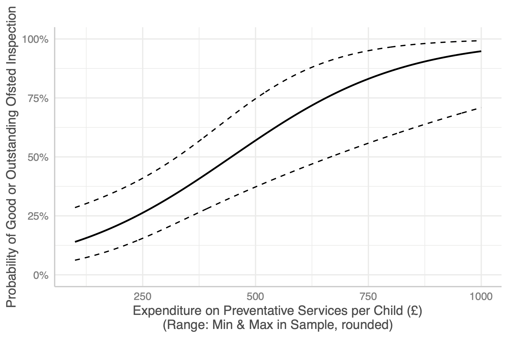

```

]]

]

---

### Findings

.pull-left[

<br><br>

* Each __£100 increase__ in non-safeguarding, non-children looked after related expenditure per child was associated with a __1.7 times__ increase in the odds of a local authority receiving a 'Good' or 'Outstanding' rating.

* __No significant effect for safeguarding expenditure__ per child.


]

.pull-right[

.middle[.center[

<br><br>

```{r echo = FALSE}

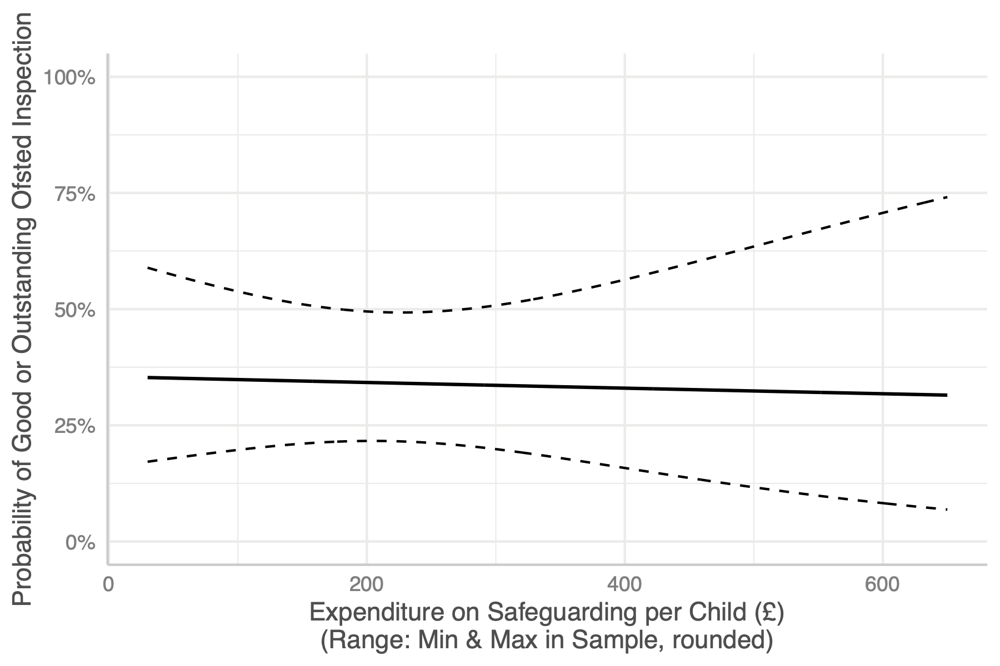

```

]]

]


---

### Findings

.pull-left[

<br><br>

* Each __£100 increase__ in non-safeguarding, non-children looked after related expenditure per child was associated with a __1.7 times__ increase in the odds of a local authority receiving a 'Good' or 'Outstanding' rating.

* __No significant effect for safeguarding expenditure__ per child.

* __Each decile increase in deprivation__ (measured by IMD 2019 - data year ~2015) was associated with a __16% decrease__ in the odds of a 'Good' or 'Outstanding' judgement.


]

.pull-right[

.middle[.center[

<br><br>

```{r echo = FALSE}

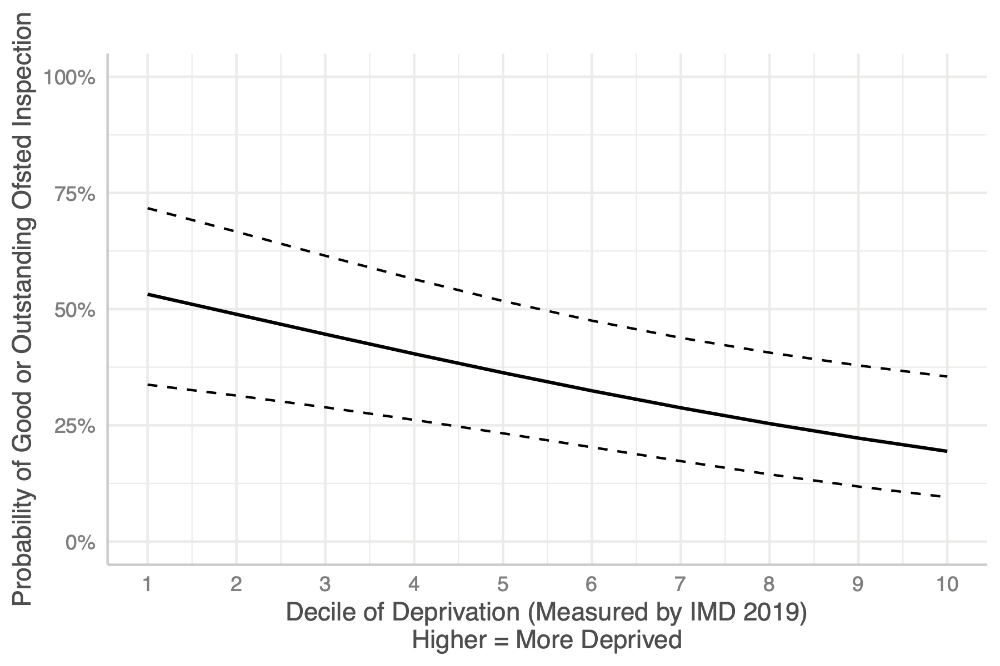

```

]]

]


---
class: hide-logo, middle

```{r echo = FALSE, out.height = "80%"}

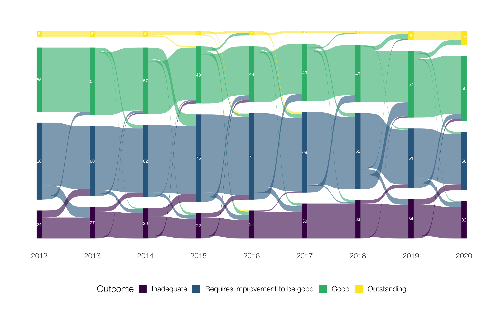

```


---
class: hide-logo, middle

```{r echo = FALSE}

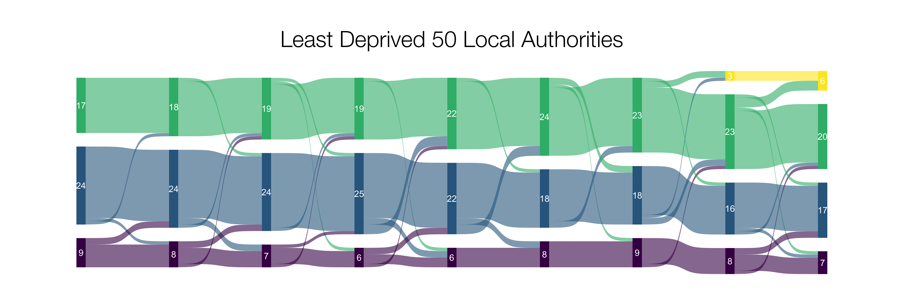

```

```{r echo = FALSE}


```


???

Change in Ofsted judgements split by deprivation

---
class: hide-logo, middle

```{r echo = FALSE}

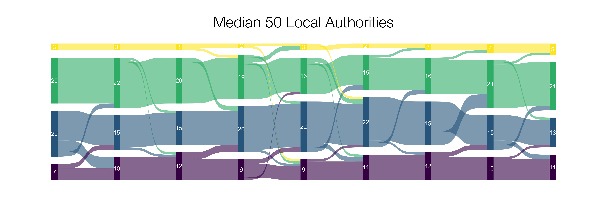

```

```{r echo = FALSE}


```


???

Change in Ofsted judgements split by deprivation

---
class: hide-logo, middle

```{r echo = FALSE}

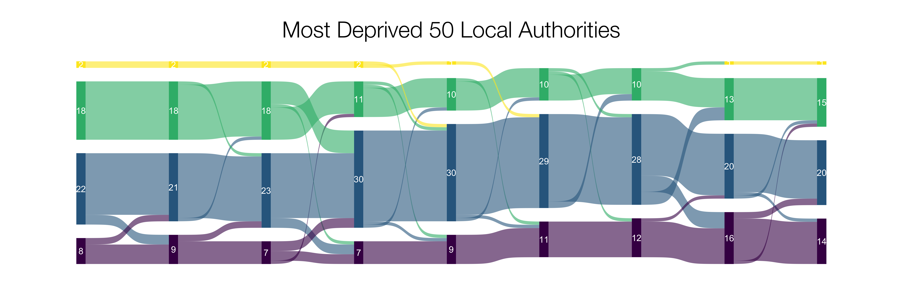

```

```{r echo = FALSE}


```


???

Change in Ofsted judgements split by deprivation


---
class: middle

> ### .tuos_purple[The result is what [Seddon] calls ‘‘failure demand’’, as issues that are not resolved straightaway keep reappearing and cumulatively start to overload the system’s ability to cope. ... The analogy in the context of children’s services is with prevention/early intervention and patterns of referral and re-referral to specialist agencies (Lord, Southcott, & Sharp, 2011). ... In Seddon’s terms, ‘‘failure demand’’ will start to mount up and put pressure on services, if interprofessional networks have been unable to intervene quickly and effectively at the point that families start to experience problems. In an example of the kind of negative feedback loop examined by Munro (2010, p. 13), this eventually has the counterproductive effect of increasing the number and severity of cases entering the system.]

.right[Rick Hood, 2015, 'A socio-technical critique of tiered services: implications for interprofessional care': 10]

---

class: middle

### .grey[Webb, C. J. (_In press_). 'In Defence of Ordinary Help: Estimating the effect of Early Help/Family Support Spending on Children in Need Rates in England using ALT-SR'. _Journal of Social Policy_.]

### .grey[Webb, C., Bennett, D., & Bywaters, P. (_Submitted and under review_) ‘Austerity, poverty, and children’s services quality in England: Consequences for child welfare and public services’. *Social Policy & Society*.]

### .tuos_purple[Bennett, D., Webb, C., Mason, K., et al. (_Submitted and under review_) ‘Funding for preventative Children’s Services and rates of children becoming looked after: a natural experiment using longitudinal area-level data in England’. _Children and Youth Services Review_.]

---
class: middle

.pull-left[

<br><br><br>

* Found __a statistically significant association between preventative services expenditure and rates of 16-17 year olds starting in care__, but not between preventative services expenditure and 1-4 year olds starting in care.

* This age group (16-17) have seen their rates of *starting* in care __more than double__ between 2011 and 2019 — from around __26 per 10,000 to 53 per 10,000__.

* __At least 1 in 20 entries into care__ in this age group can be __attributed to cuts__ in preventative services in the immediately preceding year (likely more as a cumulative effect).

]

.pull-right[

> ## .tuos_purple[Each additional £100 per child in expenditure on preventative and early help services for older children was associated with a decrease of nearly 2 per 10,000 in the rate of 16-17 year olds starting a period of time in care.]

]


---

### The role of 'soft causality' at a population level for improving services offered to children, young people, and their families?

```{r, echo=FALSE, out.width="100%", out.height = "400"}

DiagrammeR::grViz("digraph {
                  
                  graph[layout = dot, rankdir = LR]
                  
                  RCT[label='What is being\ndone? By who?\nFor who?\nHow does it\nfit together?\n', height=2.5, width=2.5, style='filled', fillcolor='PowderBlue', color='White', fontname='Helvetica']
                  MTA[label='Can other places\nlearn from this?\n(Impact & Change)', height=2.5, width=2.5, style='filled', fillcolor='PowderBlue', color='White', fontname='Helvetica']
                  SYS[label='Where seems\nto have a\ngood system?', height=2.5, width=2.5, style='filled', fillcolor='PowderBlue', color='White', fontname='Helvetica']
                  OBS[label='For whom\nis it\nworking?\n', height=2.5, width=2.5, style='filled', fillcolor='PowderBlue', color='White', fontname='Helvetica']
                  
                  SYS -> OBS -> RCT -> MTA
                  
                  }")
```

.right[.small[\* Press p for presenter's notes explanation]]

???

Very often, we are focusing on the individual level and then generalising up to a population level -- assuming that if we do lots of what works for individuals we will make an overall effective system. The trouble is, it doesn't seem to work that way and the assumptions we make about the system itself - and how services work together - are often over simplistic. In reality, the children's social care system is much more like an ecosystem than a mechanical system — it should be approached more like a garden with an ecology that needs to be supported.

Our argument is that better quality systemic and structural information on the efficacy of 'big picture' funding is needed to make the case for more investment. Improvement *after* sufficient investment is also likely to be better, and to be based on better studies, because there are fewer issues of rationing and failure demand to contend with. 


---

### References not already provided in full

Allen, G. (2011). _Early intervention: the next steps, an independent report to Her Majesty's government by Graham Allen MP_. The Stationery Office.

Curran, P. J., Howard, A. L., Bainter, S. A., Lane, S. T., & McGinley, J. S. (2014). The separation of between-person and within-person components of individual change over time: a latent curve model with structured residuals. _Journal of Consulting and Clinical Psychology_, 82(5), 879.

Devaney, J. (2019). The trouble with thresholds: Rationing as a rational choice in child and family social work. _Child & Family Social Work_, 24(4), 458-466.

Hood, R., Goldacre, A., Gorin, S., & Bywaters, P. (2020). Screen, ration and churn: Demand management and the crisis in children’s social care. _The British Journal of Social Work_, 50(3), 868-889.

Ofsted. (2016). _The report of Her Majesty’s Chief Inspector of Education, Children’s Services and Skills 2016_. Manchester: Ofsted. 

Webb, C. J., & Bywaters, P. (2018). Austerity, rationing and inequity: trends in children’s and young peoples’ services expenditure in England between 2010 and 2015. _Local Government Studies_, 44(3), 391-415.

Webb, C. J. (Under review). In Defence of Ordinary Help: Estimating the effect of Early Help/Family Support Spending on Children in Need Rates in England using ALT-SR. _Journal of Social Policy_.