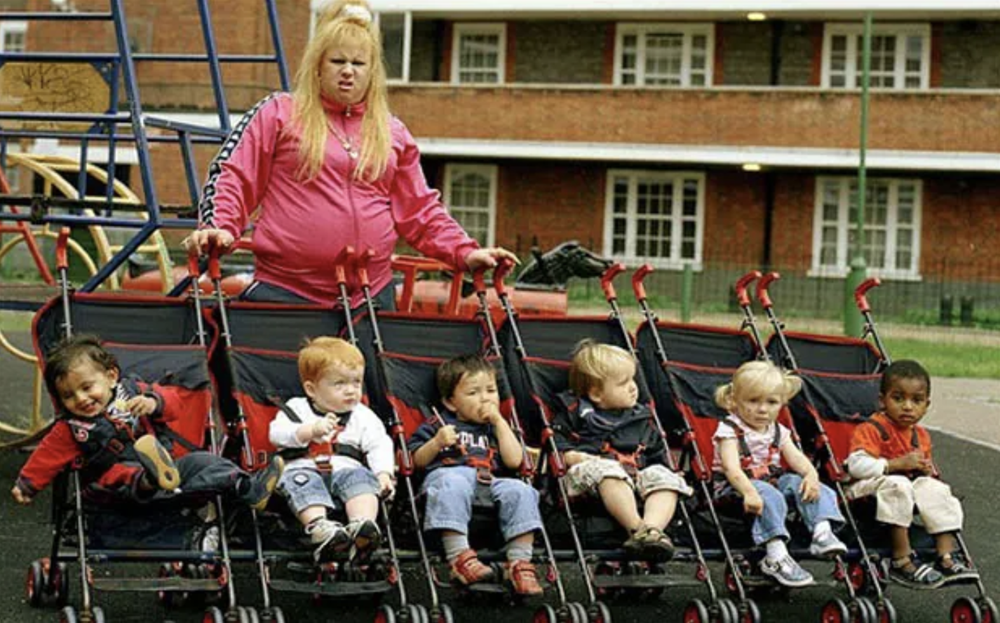

class: middle, title
background-size: contain

<!--------- 
decktape generic --key=ArrowRight --load-pause 1800 --slides '1-56' --size '1216x684' --url-load-timeout 80000 --page-load-timeout 40000 "uef-cwi.html" Webb-C-UEF-26.pdf
------>


<br><br><br><br>

# Inequality in British Child Welfare: Insights from Statistical Analysis


.pull-left[

<br>

**Dr. Calum Webb**<br>
Sheffield Methods Institute, the University of Sheffield<br>
[c.j.webb@sheffield.ac.uk](mailto:c.j.webb@sheffield.ac.uk)

]

.pull-right[

<br><br><br><br>
.right[.small[*University of Eastern Finland, 18th February 2026*]]

]

```{r setup, include=FALSE}
options(htmltools.dir.version = FALSE)

# These packages are required for creating the slides
# Many will need to be installed from Github
library(icons)
library(tidyverse)
library(xaringan)
library(xaringanExtra)
library(xaringanthemer)

xaringanExtra::use_tachyons()

# Defaults for code
knitr::opts_chunk$set(
  fig.width=9, fig.height=3.5, fig.retina=3,
  out.width = "100%",
  cache = FALSE,
  echo = TRUE,
  message = FALSE, 
  warning = FALSE,
  fig.show = TRUE,
  hiline = TRUE
)

# set global theme for ggplot to make background #F8F8F8F8 (off white),
# but otherwise keep all ggplot themes default (better for teaching)
theme_set(
  theme(plot.background = element_rect(fill = "#F8F8F8", colour = "#F8F8F8"), 
        panel.background = element_rect(fill = "#F8F8F8", colour = "#F8F8F8"),
        legend.background = element_rect(fill = "#F8F8F8", colour = "#F8F8F8")
        )
  )

ipse_theme <- theme(plot.background = element_rect(fill = "#F8F8F8", colour = "#F8F8F8"), 
        panel.background = element_rect(fill = "#F8F8F8", colour = "#F8F8F8"),
        legend.background = element_rect(fill = "#F8F8F8", colour = "#F8F8F8")
        )

```

```{r xaringan-tile-view, echo=FALSE}
# Use tile overview by hitting the o key when presenting
xaringanExtra::use_tile_view()
```

```{r xaringan-logo, echo=FALSE}
# Add logo to top right
xaringanExtra::use_logo(
  image_url = "header/smi-logo-white.png",
  exclude_class = c("inverse", "hide_logo", "inverse2"), 
  width = "180px", position = css_position(top = "1em", right = "2em")
)
```

```{r xaringan-themer, include=FALSE, warning=FALSE}

# Set some global objects containing the colours
# of the university's branding
primary_color <- "#131E29"
secondary_color <- "#440099"
tuos_blue <- "#9ADBE8"
white = "#F8F8F8"
tuos_yellow <- "#FCF281"
tuos_purple <- "#440099"
tuos_red <- "#E7004C"
tuos_midnight <- "#131E29"

turquoise_light <- "#00AF91"
turquoise_dark <- "#006353"
red_dark <- "#631C00"
red_light <- "#B03200"
ipse_blue <- "#097ABD"
ipse_gold <- "#FC9C19"
ipse_lightgold <- "#FDC375"
ipse_grey <- "#5F584F"

# The bulk of the styling is handled by xaringanthemer
style_duo_accent(
  primary_color = "#131E29",
  secondary_color = "#006353",
  colors = c(tuos_purple = "#440099", 
             grey = "#131E2960", 
             tuos_blue ="#9ADBE8",
             tuos_mint = "#00CE7C",
             turquoise_dark = "#006353",
             ipse_gold = "#FC9C19",
             off_white = "#F8F8F8"
             ),
  header_font_google = xaringanthemer::google_font("Source Serif Pro", "600", "600i"),
  text_font_google   = xaringanthemer::google_font("Source Sans Pro", "300", "300i", "600", "600i"),
  code_font_google   = xaringanthemer::google_font("Lucida Console"),
  header_h1_font_size = "2rem",
  header_h2_font_size = "1.5rem", 
  header_h3_font_size = "1.25rem", 
  text_font_size = "0.9rem",
  code_font_size = "0.65rem", 
  code_inline_font_size = "0.85rem",
  inverse_text_color = "#FC9C19", 
  background_color = "#F8F8F8", 
  text_color = "#131E29", 
  link_color = "#006353", 
  inverse_link_color = "#F8F8F8",
  text_slide_number_color = "#006353",
  table_row_even_background_color = "transparent", 
  table_border_color = "#00635370",
  text_bold_font_weight = 600
)

```


```{r xaringan-panelset, echo=FALSE}
# Allow for adding panelsets (see example on slide 2)
xaringanExtra::use_panelset()
```

```{r xaringanExtra, echo = FALSE}
# Adds white progress bar to top
xaringanExtra::use_progress_bar(color = "#F8F8F8", location = "top")
```

```{r xaringan-extra-styles, echo = FALSE}
# Allow for code to be highlighted on hover
xaringanExtra::use_extra_styles(
  hover_code_line = TRUE,         #<<
  mute_unhighlighted_code = TRUE  #<<
)
```

```{r share-again, echo=FALSE}
# Add sharing links and other embedding tools
xaringanExtra::use_share_again()
```

```{r xaringanExtra-search, echo=FALSE}
# Add magnifying glass search function to bottom left for quick
# searching of slides
xaringanExtra::use_search(show_icon = TRUE, auto_search = FALSE)
```

---

class: inverse, middle

# Esityksen pelottavin osuus.
(Ainakin minulle, mutta mahdollisesti myös teille.)

???

Aloitan sanomalla kiitos teille ja kiitos Timo Toikolle kun kutsuitte mut tänne. Timo sano mulle, että "saat pitää esityksen yhdellä ehdolla, että pidät ainakin vähän siitä suomeksi." 

Mä oon opiskellut suomea vain vähän alle kaks vuotta, joten olkaa kiltteja ja pyydän jo etukäteen anteeksi jos teistä tuntuu siltä, että suomen kieli tuli tänään vähän teurastettua.

---

class: middle

.pull-left[

# Sheffieldin Tutkimusmenetelmien Laitoksesta (SMI)

* Olemme tutkimusmenetelmiin erikoistunut laitos, johon kuuluu tutkijoita, opettajia, ja luennoitsijoita, jotka ovat kiinnostuneita tutkimusmenetelmien kehittämisestä, soveltamisesta, tai opettamisesta. (4 kvantitatiivista, 4 kvalitatiivista, 2 sekamenetelmäasiantuntijaa)

* Meillä on yhteensä [10 professoria ja luennoitsijaa](https://sheffield.ac.uk/education/people/academic/smi). Tutkimusaiheisiin sisältyvät mm. lastensuojelu, nuorten miesten mielenterveys, ruokaköyhyys, ikä–periodi–kohorttianalyysi, sekä julkisten wc-tilojen esteettömyys.

* Voitte tulla meille vierailulle! Viime vuonna tohtoriopiskelija Juulia Hietamäki UEF:stä vieraili neljä viikkoa aurinkoisessa Sheffieldissä. 


]

.pull-right[

.circle-mask[

```{r, echo = FALSE, fig.align='center'}

knitr::include_graphics("images/the-wave.png")

```

]

]


???

Mä oon täällä Sheffieldin Tutkimusmenetelmien Laitokselta. Mä oon ite kvantitatiivinen tutkija, mutta laitoksella meillä on kaikenlaisia tutkijoita. Meidän ainoa vaatimus on, että oot kiinnostunut tutkimusmenetelmistä.

Siksi, meiän tutkimusaiheet on ihan laidasta laitaan, ja niihin sisältyy muun muuassa lastensuojelu, nuorten miesten mielenterveys, ruokaköyhyys, ikä–periodi–kohorttianalyysi, julkisten wc-tilojen esteettömyys, ja niin edelleen.

Suomi maintitaan usein Sheffieldissä, koska meillä on myös yks luennoitsija, joka on dosentti Jyväskylässä. No, en mä nyt mitään ehdota, mutta, jos Jyväskylä pystyy siihen, niin... Vitsi, vitsi. Se oli vitsi. 

Meillä on myös aito suomalainen leipomo yliopiston lähellä nimeltä Cafe Nort.

Ja meillä on ollut jo yks vieras Itä-Suomen yliopistosta, Juulia Hietamäki. Hän viihdyi neljä viikoa siellä aurinkoisessa Sheffieldissä. Ne oli muuten ainoat aurinkoiset päivät, mitä me saatiin Englannissa. Voitte kysyä häneltä.

Vaihdetaanks me takas englantiin.

---

class: inverse, middle

.middle-left-small[

<br>

```{r, echo=FALSE,out.width="90%", out.height="20%", fig.cap="", fig.show='hold', fig.align='center'}

knitr::include_graphics(c("images/key-terms.svg"))

``` 

]

.pull-right-big[

# Some key terms

All rates refer to average rates at 31st March of each financial year.

.strong[Children looked after rate] .off_white[refers to the rate of children in care per 10,000 child population, unless otherwise specified. This could be care in a foster home, residential home, or in supported independent accommodation.]

.strong[Child protection plan rate] .off_white[refers to the rate of children on a child protection plan per 10,000 child population. A child protection plan usually follows a section 47 enquiry where a safeguarding assessment by a local authority social worker or social work team finds that a child requires a plan according to the statutory guidance.]

.strong[Child in need rate] .off_white[refers to the rate of children with 'child in need status' under Section 17 of the Children Act 1989 per 10,000 child population. This section of the Children Act places a duty on local authorities to provide additional support to children who are unlikely to achieve or maintain a reasonable standard of health or development, or whose health or development is likely the be impaired, without the provision of additional services, or, if the child has a disability.]

Preventative services spending .off_white[refers to spending on children's centres and children under 5; family support services; services for young people (including youth work, youth centres; substance misuse and teenage pregnancy services); and 'other' spending not related to children looked after, safeguarding, or youth justice.]

<br>


]


---

class: middle, inverse

# Child protection as a public health issue.

---

class: middle, inverse

# The odds of any given man in the poorest 10% of neighbourhoods in England dying in 2017 were 1.63 times higher than a man in the richest 10% of neighbourhoods. 1.54 times higher for women.

.right[[Banks, et al. 2021](https://ifs.org.uk/news/socioeconomic-inequalities-mortality-were-growing-adults-pre-pandemic-falling-young-children)]

---

class: middle, inverse

# The age-standardised incidence rate of Lung Cancer is 2.5 times higher in the poorest 20% of neighbourhoods in England than it is in the richest 20% of neighbourhoods. 

.right[[Cancer Research UK, 2025](https://www.cancerresearchuk.org/sites/default/files/cancer_in_the_uk_2025_socioeconomic_deprivation.pdf)]

---

class: middle, inverse

# People in the poorest 10% of neighbourhoods in England are 2.3 times as likely to be diagnosed with Type 2 Diabetes, 1.6 times as likely to be diagnosed with Anxiety and Depression, and 2.5 times as likely to be diagnosed with chronic pain, when compared to people in the richest 10% of neighbourhoods.

.right[[The Health Foundation, 2025](https://www.health.org.uk/evidence-hub/health-inequalities/inequalities-in-specific-health-conditions-by-deprivation-decile)]

---

class: middle, inverse

# How big are the inequalities in child welfare?

---

class: middle

## Children in the poorest 10% of neighbourhoods in England are >10 times as likely to be on a child protection plan or in care than the least poor 10%

.center[
```{r bywaters2020child, fig.align="left", echo=FALSE, warning=FALSE, out.width="100%", out.height=420, fig.cap="Data from Bywaters, et al. <a href = https://pure.hud.ac.uk/en/publications/the-child-welfare-inequalities-project-final-report>2020</a>"}

library(plotly)

cwi_rates <- tibble(depr = c(1, 2, 3, 4, 5, 6, 7, 8, 9, 10, 1, 2, 3, 4, 5, 6, 7, 8, 9, 10),
                    cpp = c(9, 14, 21, 23, 32, 35, 47, 51, 71, 113, 1, 5, 8, 13, 17, 33, 39, 55, 74, 114),
                    cla = c(12, 14, 23, 29, 29, 40, 55, 67, 88, 133, 7, 12, 16, 22, 31, 39, 54, 63, 108, 165),
                    country = c(rep("England", 10), rep("Wales", 10)))

cwi_plot <- cwi_rates %>%
  filter(country == "England") %>%
  pivot_longer(cpp:cla, names_to = "Intervention", values_to = "rate") %>%
  mutate(
    Intervention = ifelse(Intervention == "cla", "In Care (CLA)", "CPP")
  ) %>%
  ggplot() +
  geom_col(aes(x = as.factor(depr), y = rate, group = Intervention, fill = Intervention), position = "dodge") +
    geom_text(aes(x = as.factor(depr), y = rate + 2, group = Intervention,  label = rate, colour = Intervention), stat = "identity", position = position_dodge(width = 1), size = 4, fontface = "bold") +
  ggtitle(str_wrap("", 80)) +
  scale_fill_manual(values = c(turquoise_dark, ipse_gold)) +
  scale_colour_manual(values = c(turquoise_dark, ipse_gold)) +
  ylab("Intervention Rate per 10,000 Children") +
  xlab("Deprivation Decile of Neighbourhoods (10 = Most Deprived)") +
  ggeasy::easy_add_legend_title("Intervention") +
  #theme_minimal() +
  theme(plot.title = element_text(face = "bold"))

ratesplot <- ggplotly(cwi_plot, tooltip = "") %>% plotly::config(displayModeBar = F)

ratesplot

# widgetframe::frameWidget(ratesplot) #403 errors on deployment?

# knitr::include_graphics("images/cpp_graph.gif")

```
]

---

.pull-left-big[

# <br>
.bg-white.b--gold.ba.bw2.br3.shadow-5.ph4[
<iframe width="810" height="400" src="https://www.youtube.com/embed/Zf2x3zMfKWk?start=94&end=157&rel=0" title="ThinkIn Family Separation - ATD Fourth World" frameborder="0" allow="accelerometer; autoplay; clipboard-write; encrypted-media; gyroscope; picture-in-picture; web-share" referrerpolicy="strict-origin-when-cross-origin" allowfullscreen></iframe>
]

]

.pull-right-small[

# <br><br><br><br><br><br><br>

<br>
Moraene Roberts (1953—2020) was an activist, campaigner, poet & researcher who worked with the charity ATD Fourth World. You can read a tribute to her work and life on the [ATD Fourth World UK website](https://atd-uk.org/2020/01/15/moraene-roberts-campaigning-with-a-banner-made-of-silk/). 


]


---

class: middle, inverse

# "Recognizing that the child, for the full and harmonious development of his or her personality, should grow up in a family environment, in an atmosphere of happiness, love and understanding."

.right[[United Nations Convention on the Rights of the Child](https://www.unicef.org.uk/wp-content/uploads/2016/08/unicef-convention-rights-child-uncrc.pdf)]

---

class: middle, inverse

# "Families in poverty need material and social resources to function and thrive; but they are consistently denied these resources. Until child poverty strategies are linked with children social care policies, little will change."

.right[Dr. Simon Haworth, [2025](https://atd-uk.org/2025/02/19/uk-government-admits-problems-with-childrens-social-care/)]

---

class: middle, inverse

# How did we get here?

---


```{r, echo = FALSE, fig.height = 5.8, fig.width = 10.5, out.height=580, out.width=1050}

time <- seq(2009, 2022, 1)
y <- 1

tibble(time, y) %>%
  ggplot(aes(x = time, y = y)) +
  geom_hline(yintercept = 1, colour = turquoise_dark, linewidth = 2) +
  ylim(c(0.992, 1.03)) +
  geom_text(aes(y = 0.996, x = time, label = time), size = 5, angle = 90, colour = turquoise_dark) +
  annotate("text", x = 2011, y = 1.0025, angle = 70, label = "Publication of the Allen Reports", hjust = 0, size = 5, colour = turquoise_dark) +
    annotate("text", x = 2011.5, y = 1.0025, angle = 70, label = "Austerity measures hit prevention (-£54.40pc)", hjust = 0, size = 5, colour = turquoise_dark) +
  annotate("text", x = 2010, y = 1.0025, angle = 70, label = "Publication of the Field Review", hjust = 0, size = 5, colour = turquoise_dark) +
  annotate("text", x = 2012, y = 1.0025, angle = 70, label = "Creation of the Early Intervention Foundation", hjust = 0, size = 5, colour = turquoise_dark) +
  annotate("text", x = 2009, y = 1.0025, angle = 70, label = "Austerity measures after financial crises", hjust = 0, size = 5, colour = turquoise_dark) +
  annotate("text", x = 2013, y = 1.0025, angle = 70, label = "First Troubled Families Programme begins", hjust = 0, size = 5, colour = turquoise_dark) + # 120k families
  annotate("text", x = 2013.5, y = 1.0025, angle = 70, label = "Changes to funding formula", hjust = 0, size = 5, colour = turquoise_dark) +
  annotate("text", x = 2014, y = 1.0025, angle = 70, label = "ADCS warn of limited capacity for prevention", hjust = 0, size = 5, colour = turquoise_dark) +
  annotate("text", x = 2015, y = 1.0025, angle = 70, label = "Second Troubled Families Programme begins", hjust = 0, size = 5, colour = turquoise_dark) + # 420k
    annotate("text", x = 2016, y = 1.0025, angle = 70, label = "Target to eradicate Child Poverty dropped", hjust = 0, size = 5, colour = turquoise_dark) +
      annotate("text", x = 2019, y = 1.0025, angle = 70, label = "Highest child poverty rate since 2001 (23%)", hjust = 0, size = 5, colour = turquoise_dark) + 
  annotate("text", x = 2017, y = 1.0025, angle = 70, label = "What Works for CSC established", hjust = 0, size = 5, colour = turquoise_dark) + 
  annotate("text", x = 2020, y = 1.0025, angle = 70, label = "COVID-19 Pandemic starts", hjust = 0, size = 5, colour = turquoise_dark) + 
  ylab("") +
  xlab("") +
  geom_point(colour = turquoise_dark, size = 5) + ipse_theme +
  theme(axis.ticks = element_blank(), axis.text = element_blank(),
        panel.background = element_blank(), panel.grid = element_blank(), panel.border = element_blank())

```


---

class: middle

.pull-left-big[

```{r, echo = FALSE, eval = TRUE, fig.height = 5.5, fig.width = 7, out.height=550, out.width = 700}

safeguarding_prev_spend_change <- read_csv("data/safeguarding_prev_spend_change.csv")

spendribbon_prev <- safeguarding_prev_spend_change %>%
  ggplot() +
  geom_ribbon(aes(x = time_period, ymin = q25_prev_spend+348.94, ymax = q75_prev_spend+348.94),
               fill = turquoise_light, colour = "transparent") +
  geom_line(aes(x = time_period, y = med_prev_spend+348.94), colour = turquoise_dark) +
  geom_point(aes(x = time_period, y = med_prev_spend+348.94), colour = turquoise_dark, pch = 18) +
  scale_x_continuous(breaks = seq(2010, 2022, 2)) +
  ylab("Preventative Spending per Child\n(Relative to Average within LA, 50% Quantile)") +
  xlab("Year Ending") +
  ylim(c(200, 600))

spendribbon_safg <- safeguarding_prev_spend_change %>%
  ggplot() +
  geom_ribbon(aes(x = time_period, ymin = q25_safg_spend+270.95, ymax = q75_safg_spend+270.95),
               fill = ipse_lightgold, colour = "transparent") +
  geom_line(aes(x = time_period, y = med_safg_spend+270.95), colour = ipse_gold) +
  geom_point(aes(x = time_period, y = med_safg_spend+270.95), colour = ipse_gold, pch = 18) +
  scale_x_continuous(breaks = seq(2010, 2022, 2)) +
  ylab("Safeguarding Spending per Child\n(Relative to Average within LA, 50% Quantile)") +
  xlab("Year Ending") +
  ylim(c(200, 600))


library(patchwork)

spendribbon_prev + spendribbon_safg +
  plot_layout(axis_titles = "collect")

```

]

.middle-right-small[

<br>

### Since 2009-10, spending on preventative children's services has fallen by more than 40% in an average local authority.

Some categories of spending faced much bigger cuts. Sure start & Under 5 decreased by 72.2% and Young Peoples' Services by 66.4%.

Family Support Services (inc. TFP) increased by 34.6% and now makes up 58.1% of all preventative spending (previously 23.3%).

]

---

<br>


.bg-white.b--gold.ba.bw2.br3.shadow-5.ph4[

```{r, echo = FALSE, out.width = "90%", fig.align="center"}

knitr::include_graphics("images/funding-relative-to-needs.png")

```

.small[Webb, C. J. (2022). More money, more problems? Addressing the funding conditions required for rights-based child welfare services in England. Societies, 12(1), 9.]

]

---

class: inverse, middle

.pull-left[

## After the child welfare inequalities project, we had the following questions:

* Was the relationship between poverty and intervention rates the same for all groups of children?
* Income inequality is associated with many public health problems (Pickett & Wilkinson, 2015); is it also associated with child welfare interventions?
* What role have cuts to services had on intervention rates? 

]

.pull-right[

```{r, echo=FALSE, fig.align='center', out.width=300, out.height=300, fig.width=3, fig.height=3}

knitr::include_graphics("images/question.svg")

```

]

---

class: middle

.pull-left[

# Methods

* Representative (geographically & in terms of poverty rate) sample of 18 local authorities covering 1.2million children (>12% of English child population). Full samples from within each local authority.
* Multilevel negative binomial models where each observation of a child population was nested within a particular gender and ethnicity identifier.
* The association between deprivation/poverty and child welfare intervention rates was estimated with cross-level interactions between the ethnicity of the population
* Post-estimation of the social gradient (Incidence Rate Ratio) for a 1 standard deviation increase in deprivation for eahc ethnic group.

]


.pull-right[

.bg-white.b--gold.ba.bw2.br3.shadow-5.ph4[

```{r, echo = FALSE}

knitr::include_graphics("images/cuts-both-ways.png")

```

]

]


---

class: hide-logo
background-image: url("images/beige_bg.png")
background-position: center
background-size: contain

# Intersectionality and Child Welfare Interventions

```{r, echo = FALSE, fig.align='center'}

knitr::include_graphics("images/cla_infog.png")

```

---

class: middle

# The Social Gradient by Ethnic Population

.pull-left[

```{r ethsg_2, dev="svg", echo = FALSE, fig.width=4.5, fig.height=4.5, out.width = 450, out.height = 450, dpi = 350, fig.cap="Source: <a href='https://doi.org/10.1016/j.childyouth.2020.105299' style='color:white;text-decoration:underline'>Webb, et al. 2020</a>"}

library(formattable)

intercept_white <- 3.737
slope_white <- 1.359
intercept_blafr <- 3.737 + 0.244
slope_blafr <- 1.359 + -1.23
x <- seq(-1, 1, 0.1)

line_white <- intercept_white + slope_white * x
line_blafr <- intercept_blafr + slope_blafr * x


ggplot() +
  geom_line(aes(x = x, y = exp(line_white)), size = 3, alpha = 0.8) +
  geom_line(aes(x = x, y = exp(line_blafr)), size = 3, alpha = 0.8, col = turquoise_dark) +
  annotate("text", x = c(0, 1), y = exp(line_white[c(10, 21)]) * 0.8, label = round(exp(line_white[c(10, 21)]), 0), size = 4) +
  annotate("text", x = c(-1), y = exp(line_white[c(1)]) +15, label = round(exp(line_white[c(1)]), 0), size = 4) +
  annotate("text", x = c(-1, 0, 1), y = exp(line_blafr[c(1, 10, 21)]) +15, label = round(exp(line_blafr[c(1, 10, 21)]), 0), size = 4, col = "#7d7d83") +
  annotate("text", x = 0, y = 150, hjust = 0, label = "White British", size = 5) +
  annotate("text", x = 0.35, y = 25, hjust = 0, label = "Black African", size = 5, col = turquoise_dark) +
  annotate("text", x = c(-1, 0, 1), y = -15, hjust = c(0, 0.5, 1), label = c("Low\nDeprivation", "Middle\nDeprivation", "High\nDeprivation"), size = 3) +
  ylim(c(-20,180)) +
  ylab("Predicted MSOA CLA Rate") +
  xlab("") +
  theme(panel.border = element_blank(), panel.background = element_rect(color = NA),
        axis.text.x = element_blank(), axis.ticks.x = element_blank())


```

]

.pull-right[

.footnote[Webb, C., Bywaters, P., Scourfield, J., Davidson, G., & Bunting, L. (2020). Cuts both ways: Ethnicity, poverty, and the social gradient in child welfare interventions. Children and Youth Services Review, 117, 105299.]

<br><br><br>

The social gradient for the .green[White British] MSOA child populations in the representative CWIP sample was .green[around 3.9] - much larger than the social gradient for the entire population on average.

By contrast, the social gradient for the .green[Black African] MSOA child populations was .green[around 1.14], which was not statistically significant. This means that the .green[intervention rates did not differ significantly as deprivation increased].

]

---

class: middle

# The Social Gradient by Ethnic Population

.pull-left[

```{r ethsg_3.3, dev="svg", echo = FALSE, fig.width=4.5, fig.height=4.5, out.width = 450, out.height = 450, dpi = 350, fig.cap="Source: <a href='https://doi.org/10.1016/j.childyouth.2020.105299' style='color:white;text-decoration:underline'>Webb, et al. 2020</a>"}

intercept_white <- 3.737
slope_white <- 1.359
intercept_mh <- 3.737 + 0.965
slope_mh <- 1.359 + -0.352
x <- seq(-1, 1, 0.1)

line_white <- intercept_white + slope_white * x
line_mh <- intercept_mh + slope_mh * x


ggplot() +
  geom_segment(aes(x = -0.95, xend = -0.95, y = exp(line_mh[1]) - 5, yend = exp(line_white[1]) + 5), col = "white", size = 1, fill = "white", lty =2) +
  geom_segment(aes(x = 0.95, xend = 0.95, y = exp(line_mh[21]) - 40, yend = exp(line_white[21]) + 20), col = "white", size = 1, fill = "white", lty =2) +
  geom_line(aes(x = x, y = exp(line_white)), size = 3, alpha = 0.8) +
  geom_line(aes(x = x, y = exp(line_mh)), size = 3, alpha = 0.8, col = turquoise_dark) +
  annotate("text", x = c(0, 1), y = exp(line_white[c(10, 21)]) * 0.7, label = round(exp(line_white[c(10, 21)]), 0), size = 4) +
  annotate("text", x = c(-1.05), y = exp(line_white[c(1)]), label = round(exp(line_white[c(1)]), 0), size = 4) +
  annotate("text", x = c(-1, 0, 1), y = exp(line_mh[c(1, 10, 21)]) + 35, label = round(exp(line_mh[c(1, 10, 21)]), 0), size = 4, col = turquoise_dark) +
  annotate("text", x = 0.35, y = 40, hjust = 0, label = "White British", size = 5) +
  annotate("text", x = -0.5, y = 250, hjust = 0, label = "Mixed Heritage (Other)", size = 5, col = turquoise_dark) +
  annotate("text", x = c(-1, 0, 1), y = -15, hjust = c(0, 0.5, 1), label = c("Low\nDeprivation", "Middle\nDeprivation", "High\nDeprivation"), size = 3) +
  # annotate("text", x = -0.85, y = 30, label = '"4"*phantom(":1")', parse = T, col = "#C81D39", size = 6) +
  # annotate("text", x = -0.85, y = 30, label = 'phantom("4")*":1"', parse = T, col = "white", size = 6) +
  #   annotate("text", x = 0.8, y = 85, label = '"2.7"*phantom(":1")', parse = T, col = "white", size = 6) +
  # annotate("text", x = 0.8, y = 85, label = 'phantom("2.7")*":1"', parse = T, col = "#C81D39", size = 6) +
  ylim(c(-20,350)) +
  ylab("Predicted MSOA CLA Rate") +
  xlab("") +
  # dark_theme_minimal() +
  theme(panel.border = element_blank(), panel.background = element_rect(color = NA),
        axis.text.x = element_blank(), axis.ticks.x = element_blank())


```

]

.pull-right[

.footnote[Webb, C., Bywaters, P., Scourfield, J., Davidson, G., & Bunting, L. (2020). Cuts both ways: Ethnicity, poverty, and the social gradient in child welfare interventions. Children and Youth Services Review, 117, 105299.]

<br><br>

Across the spectrum of deprivation, the 'Mixed Heritage (Other)' population has .green[significantly higher rates of being in care], and a .green[significant social gradient]. They face the sharp end of the racial inequalities and socioeconomic inequalities we see in child welfare interventions.

Mixed Heritage is the .green[fastest growing ethnic population in the UK]. Yet our analyses rarely consider the inequalities they face - .green[they are often excluded] from analyses because the category is so broad.

]

---

.pull-left-big[

# Social Gradients in CLA rates for 11 English Ethnic Groups

```{r, echo=FALSE, width = "100%", fig.cap="Source: <a href='https://doi.org/10.1016/j.childyouth.2020.105299'>Webb, et al. 2020</a>"}

customGreen0 = "#DeF7E9"
customGreen = "#71CA97"
customRed = "#ff7f7f"

sg_data <- tibble::tribble(
                    ~eth_group, ~social_gradient, ~sig, ~diff_to_wb,
                  "White British",             3.89,   "Yes",                  "-",
              "Asian Bangladeshi",             1.01,    "No",                "Yes",
                   "Asian Indian",             1.13,    "No",                "Yes",
                "Asian Pakistani",             2.22,   "Yes",                 "No",
                  "Black African",             1.14,    "No",                "Yes",
                "Black Caribbean",             1.88,   "Yes",                "Yes",
                    "Black Other",             0.96,    "No",                "Yes",
                    "Mixed Other",             2.74,   "Yes",                 "No",
            "Mixed White & Asian",                3,   "Yes",                 "No",
    "Mixed White & Black African",             1.63,    "No",                "Yes",
  "Mixed White & Black Caribbean",             2.08,   "Yes",                "Yes"
  ) %>%
  rename(`Ethnic Group` = eth_group, `Social Gradient` = social_gradient,
         `Significant?` = sig, `Sig. Diff to W.B.` = diff_to_wb) %>%
  data.table::as.data.table(.)

formattable(sg_data, align =c("l", "r", "r", "r"),
            list(
              `Social Gradient` = color_tile("transparent", customGreen))
            )


```

]

--

.pull-right-small[

<br><br><br><br><br><br>

This essentially means that we would expect to find disproportionality in very different directions in areas of high and low poverty. 

.green[Remember this], the next time you see a paper that says .green["ethnic/racial differences disappear after controlling for poverty"] (and also that socially patterned disproportionate exposure to poverty *is* a product of racism!)

]


---

class: middle

.pull-left[

# Why?

.footnote[Flatley, J. (2016) Abuse during childhood: Findings from the Crime Survey for England and Wales, year ending March 2016. Office for National Statistics.]

There are **not** equivalent higher self-reported rates of experiencing child abuse and neglect among minoritised ethnic groups, even before adjusting for other factors.

> The report [Flatley, 2016] shows that the rate ratios of Black, Mixed Heritage, and Asian people reporting historical child abuse to White British people reporting historic child abuse were 0.75:1, 1.2:1, and 0.55:1 respectively. By contrast, the rate ratio of combined Child Protection Plan and Children Looked After rates was 1.18:1 for Black children, 1.6:1 for Mixed Heritage children, and 0.4:1 for Asian children (Bywaters et al., 2019)

]

--

.pull-right[

# <br>

> "the term ‘white trash’ reminds us that one of the worst crimes of which one can accuse a person is poverty. If you are white, calling someone ‘white’ is hardly an insult. But calling someone ‘white trash’ is both a racist and classist insult. … Perhaps the scar of race is cut by the knife of class. This is not to say that race is in any way reducible to class."

.right[Newitz & Wray (1996) *What is White Trash?*]


]


---

class: middle

.pull-left[

# <br>

.bg-white.b--gold.ba.bw2.br3.shadow-5.ph4[
```{r, echo = FALSE}



```
]

Vicky Pollard, character from the sketch comedy show Little Britain (2003-2006) which drew 9.5million viewers at its peak.

]

.pull-right[

# <br>

> "the term ‘white trash’ reminds us that one of the worst crimes of which one can accuse a person is poverty. If you are white, calling someone ‘white’ is hardly an insult. But calling someone ‘white trash’ is both a racist and classist insult. … Perhaps the scar of race is cut by the knife of class. This is not to say that race is in any way reducible to class."

.right[Newitz & Wray (1996) *What is White Trash?*]

What these examples highlight is the heavily racialised notion of class that results from poverty being seen as particularly abherrant alongside White identity and, by extension, relative wealth and affluence being considered abnormal when occuring alongside ‘non-Whiteness’.

]

---

class: middle, inverse


.pull-left[

.bg-white.b--gold.ba.bw2.br3.shadow-5.ph4[
<iframe src="https://www.google.com/maps/embed?pb=!4v1602086717105!6m8!1m7!1sbdzowbDYET7YYo65CjZd7Q!2m2!1d54.89689879046756!2d-1.493145921426356!3f339.4669946534618!4f-7.778891356493901!5f0.7820865974627469" width="600" height="450" frameborder="0" style="border:0;" allowfullscreen="" aria-hidden="false" tabindex="0" data-external="1">
</iframe>
]

]

.pull-right[

.bg-white.b--gold.ba.bw2.br3.shadow-5.ph4[

<iframe src="https://www.google.com/maps/embed?pb=!4v1602087201203!6m8!1m7!1sZex0rmjnhimOlnIF2UV_cQ!2m2!1d51.4444184457374!2d-0.9029664642045893!3f244.69586296448418!4f-5.50061464711105!5f0.7820865974627469" width="600" height="450" frameborder="0" style="border:0;" allowfullscreen="" aria-hidden="false" tabindex="0" data-external="1">
</iframe>

]

]


---

class: middle, inverse

.pull-left[
.bg-white.b--gold.ba.bw2.br3.shadow-5.ph4[
<iframe src="https://www.google.com/maps/embed?pb=!4v1602086717105!6m8!1m7!1sbdzowbDYET7YYo65CjZd7Q!2m2!1d54.89689879046756!2d-1.493145921426356!3f339.4669946534618!4f-7.778891356493901!5f0.7820865974627469" width="600" height="225" frameborder="0" style="border:0;" allowfullscreen="" aria-hidden="false" tabindex="0" data-external="1">
</iframe>

<iframe src="https://www.google.com/maps/embed?pb=!4v1602087201203!6m8!1m7!1sZex0rmjnhimOlnIF2UV_cQ!2m2!1d51.4444184457374!2d-0.9029664642045893!3f244.69586296448418!4f-5.50061464711105!5f0.7820865974627469" width="600" height="225" frameborder="0" style="border:0;" allowfullscreen="" aria-hidden="false" tabindex="0" data-external="1">
</iframe>
]
]

.pull-right[

.bg-white.b--gold.ba.bw2.br3.shadow-5.ph4[

```{r, echo = FALSE, out.width="60%", fig.align="center"}

knitr::include_graphics("images/house-wooclap-qr.png")

```

```{r, echo = FALSE, fig.align="center"}


```

] 

]

---

class: middle, inverse

.bg-white.b--gold.ba.bw2.br3.shadow-5.ph4[

```{r, echo = FALSE, out.width = "90%", fig.align="center"}

knitr::include_graphics("images/price-activity-result.png")

```

]

---

class: middle

.pull-left[

<br>

# Income Inequality & Child Welfare Interventions

* Analysis of **local** income inequality and rates of intervention (children in care, child protection plans) across 172 English and Welsh local authorities.
* General Additive Models (GAMs) with smoothed splines.
* Higher local income inequality was associated with increased rates of children placed in care, but this increase was non-linear.
* More income-unequal local authorities also had steeper social gradients — that is, poverty had a bigger consequence for intervention rates in unequal places compared to more equal places (different paper: Webb, C., et al. (2020). *Untangling child welfare inequalities and the ‘inverse intervention law’ in England*. Children and Youth Services Review, 111, 104849.)

]

.pull-right[

.bg-white.b--gold.ba.bw2.br3.shadow-5.ph4[

```{r, echo = FALSE}

knitr::include_graphics("images/income-inequality-england.png")

```

]

]


---

.pull-left[

<br>

.bg-white.b--gold.ba.bw2.br3.shadow-5.ph4[

```{r, echo = FALSE, out.width="95%", fig.align="center"}

knitr::include_graphics("images/income-inequality-finland.png")

```

]

]

.pull-right[

<br><br>

# A preview of the Finnish case...

With Ning Zhu, Juulia Hietamäki, and Timo Toikko from UEF

* Very similar patterns when comparing between municipalities to what is found in England, Wales, and the United States, **despite the fact that** the average level of local income inequality is much lower.
* A more pronounced non-linear effect when looking at the association within municipalities over time
* Strong evidence of a lagged effect (preceding changes in income inequality credibly predict changes in notification rates and care rates)
* More complex methodology (Bayesian within-between models with lagged effects)

]


---

class: inverse, middle

# Demand vs. Supply: Service funding or poverty?

---

class: inverse, middle

.middle-left-small[

<br>

```{r, echo=FALSE,out.width="90%", out.height="20%", fig.cap="", fig.show='hold', fig.align='center'}

knitr::include_graphics(c("images/icons8-bell_curve.svg"))

``` 

]

.pull-right-big[

# Methods & Data 

* 148 Local Authorities .off_white[(exl. City of London, Isle of Wight, Isles of Scilly, re-unified Bournemouth & Poole)]
* 13 time points (2009-10 to 2021-22) .off_white[without time-varying child poverty rate;] 8 time points .off_white[with time-varying child poverty rate (2014-15 to 2021-22)]
* .off_white[Data from] Department for Education .off_white[(Child Welfare Intervention Rates, Section 251 Returns);] Office for National Statistics .off_white[(Population Estimates);] Department for Work & Pensions .off_white[(Children in Low Income Households)]
* .off_white[Spending figures adjusted for] Service Providers Inflation Index .off_white[(2022 prices)]
* *Within-between* multilevel models .off_white[estimated throughout within a ]Bayesian .off_white[framework, using] .ipse_gold[R] .white[and] .ipse_gold[Stan]
  * Corrects for poor comparability of Section 251 returns by focusing on variation *within* local authorities
* .off_white[Missing data imputed through] Bayesian 2-level model based multiple imputation by chained equations.off_white[.] .off_white[Most missing data for CLA counts for Black (27%), Asian (32%), and 'other' ethnic group (41.5%) due to censoring]
* .off_white[All code and data made available through] open repositories upon publication

]

---

class: inverse2, hide-logo, middle

.middle-left-big[

<br>

# Shouldn't it have been pretty easy to figure out already whether spending is associated with intervention rates?

]

.pull-right-small[


```{r, echo=FALSE,out.width="80%", fig.cap="", fig.show='hold', fig.align='center'}

knitr::include_graphics(c("images/books.svg"))

``` 


]

---

class: middle

.middle-left[


## The major reason why the findings from this study differ from those of other studies is that a **within-between** regression model is used, as well as the inclusion of a lagged term. 

A groundbreaking study, by Dr. Davara Bennett et al.<sup>1</sup>, used these models before to explore differences between one to four year olds and older children.

There are other differences discussed in the report, including the use of Bayesian statistics and multiple imputation. But the form of the model is the most important reason why the findings may differ.


]

.pull-right[

.center[

**Standard Regression Model**

$$ \bar{Y} = B_0 + B'X' $$

**Random Intercepts Multilevel Regression Model**

$$\bar{Y_{ij}}=B_0+B'X'_{ij}+U_{0j}\\U_{0j}=N(0,\sigma_0)$$


**Within-between Regression Model**

$$\bar{Y_{ij}}=B_0+B'_w(X'_{ij}-\bar{X}'_j)+B'_b\bar{X}'_j+U_{0j}\\U_{0j}=N(0,\sigma_0)$$

]

]

.footnote[<sup>1</sup> Bennett, D.L., Webb, C.J., Mason, K.E., et al., (2021). Funding for preventative children’s services and rates of children becoming looked after. *Children and Youth Services Review*, 131, p.106289.]


---

class: middle

.middle-left[

<br>

## Differences in the substantive interpretation of coefficients:

$B'_w$  — What is the association between changes in $X$ around the mean for groups $j$ and changes in $Y$ around the random intercepts estimated by $U_{0j}$?

$B'_b$ — What is the association between group mean differences in $X$ and group mean differences in $Y$?

*In this context*, the relationship between changes in spending/poverty **within** a local authority over time has with rates of intervention **within** that local authority over time, are separated from the relationship **between** local authorities average levels of spending/poverty and their average rates of intervention.

]

.pull-right[

.center[

**Standard Regression Model**

$$ \bar{Y} = B_0 + B'X' $$

**Random Intercepts Multilevel Regression Model**

$$\bar{Y_{ij}}=B_0+B'X'_{ij}+U_{0j}\\U_{0j}=N(0,\sigma_0)$$


**Within-between Regression Model**

$$\bar{Y_{ij}}=B_0+B'_w(X'_{ij}-\bar{X}'_j)+B'_b\bar{X}'_j+U_{0j}\\U_{0j}=N(0,\sigma_0)$$

]

]


---

class: middle, inverse2, hide-logo


<span style="font-size:2.5em;"> .blockquote["The conflated slope in the [uncentered] UN Model lies between its within- and between-cluster effect, but is equal to neither. **The conflated estimate is therefore meaningless and cannot be interpreted.**"] </span>

.pull-right[

.right[

Yaremych, et al. 2021. Centering Categorical Predictors in Multilevel Models: Best Practices and Interpretation. *Psychological Methods*.

]

]


---

class: middle

.middle-left[

### Why does this matter so much for studying spending on preventative and supportive services?

* Lack of comparability of spending data *between* local authorities, but better comparability *within* local authorities.
* Lack of comparability between usage of some interventions *between* local authorities, but better comparability *within* local authorities.
* Fundamentally different causal directionality at the *between* level when compared to the *within* level.

]

.pull-right[

.center[


```{r, echo=FALSE, out.width=450, out.height=400, fig.height=4, fig.width=4.5}

library(dagitty)
library(rethinking)
library(ggdag)

dag2 <- 'dag {
  Poverty -> CWI
  Spend <- CWI
  Spend <- Poverty
}'

dag1_spec <- list( x=c("Poverty"=1, "Spend"=0, "CWI"=2), 
                y=c("Poverty"=-1, "Spend"=0, "CWI"=0) )

dag2 <- dagitty(dag2)
coordinates(dag2) <- dag1_spec

ggplot(tidy_dagitty(dag2), aes(x = x, y = y, xend = xend, yend = yend)) +
  geom_dag_node(colour = turquoise_light, size = 20) +
  geom_dag_edges(arrow_directed = grid::arrow(length = grid::unit(6, "pt"), type = "closed"), edge_colour = turquoise_light, edge_width = 1) +
  geom_dag_text(size = 3.5) +
  theme_dag_blank() + 
  theme(plot.background = element_rect(fill = "#F8F8F8", colour = "#F8F8F8"), 
        panel.background = element_rect(fill = "#F8F8F8", colour = "#F8F8F8"),
        legend.background = element_rect(fill = "#F8F8F8", colour = "#F8F8F8"))


```

#### Between local authorities

]

]


---

class: middle

.middle-left[

### Why does this matter so much for studying spending on preventative and supportive services?

* Lack of comparability of spending data *between* local authorities, but better comparability *within* local authorities.
* Lack of comparability between usage of some interventions *between* local authorities, but better comparability *within* local authorities.
* Fundamentally different causal directionality at the *between* level when compared to the *within* level.

]

.pull-right[

.center[


```{r, echo=FALSE, out.width=450, out.height=400, fig.height=4, fig.width=4.5}

dag1 <- 'dag {
  Poverty -> CWI
  Spend -> CWI
  Spend -> Poverty
}'

dag1_spec <- list( x=c("Poverty"=1, "Spend"=0, "CWI"=2), 
                y=c("Poverty"=-1, "Spend"=0, "CWI"=0) )


dag1 <- dagitty(dag1)
coordinates(dag1) <- dag1_spec

ggplot(tidy_dagitty(dag1), aes(x = x, y = y, xend = xend, yend = yend)) +
  geom_dag_node(colour = turquoise_light, size = 20) +
  geom_dag_edges(arrow_directed = grid::arrow(length = grid::unit(6, "pt"), type = "closed"), edge_colour = turquoise_light, edge_width = 1) +
  geom_dag_text(size = 3.5) +
  theme_dag_blank() + 
  theme(plot.background = element_rect(fill = "#F8F8F8", colour = "#F8F8F8"), 
        panel.background = element_rect(fill = "#F8F8F8", colour = "#F8F8F8"),
        legend.background = element_rect(fill = "#F8F8F8", colour = "#F8F8F8"))


```

#### Within local authorities

]

]


---

class: middle

.pull-left[


```{r, echo=FALSE, out.width=500, out.height=500, fig.height=5, fig.width=5, fig.align='center'}

simple_correlation_plots <- read_rds("data/simple_correlation_plots.rds")
d <- read_csv("data/merged_data.csv")

d2 <- d %>%
  filter(!la_name %in% c("Isles of Scilly", "City of London"))


simple_corr1_plot <- d2 %>%
  filter(!la_name %in% c("Isles of Scilly", "City of London")) %>%
  ggplot(aes(x = gspend_noncla_nonsg_pc, y = at_31_cla_rate10000)) +
  geom_point(size = 0.5, colour = turquoise_dark) +
  geom_smooth(se = FALSE, method = "lm", colour = ipse_gold) +
  theme_minimal() +
  xlab("Expenditure on Preventative Services per Child") +
  ylab("CLA Rate per 10,000 (at March 31st)")

d3 <- d2 %>%
  filter(!is.na(at_31_cla_rate10000) & !is.na(rel_pov_rate100))

d3 <- d3 %>%
  mutate(
    resid_cla = residuals(lm(d3, formula = at_31_cla_rate10000 ~ rel_pov_rate100))
  )

simple_corr2_plot <- d3 %>%
  ggplot(aes(x = gspend_noncla_nonsg_pc, y = resid_cla)) +
  geom_point(size = 0.5, colour = turquoise_dark) +
  geom_smooth(se = FALSE, method = "lm", colour = ipse_gold) +
  theme_minimal() +
  xlab("Expenditure on Preventative Services per Child") +
  ylab("CLA Rate per 10,000 (at March 31st)\nafter controlling for Child Poverty")


simple_corr3_plot <- d3 %>%
  mutate(
    residuals_cla2 = residuals(lm(d3, formula = at_31_cla_rate10000 ~ rel_pov_rate100 + la_name))
  ) %>%
  ggplot(aes(x = gspend_noncla_nonsg_pc, y = residuals_cla2)) +
  geom_point(size = 0.5, colour = turquoise_dark) +
  geom_smooth(se = FALSE, method = "lm", colour = ipse_gold) +
  theme_minimal() +
  xlab("Expenditure on Preventative Services per Child") +
  ylab("CLA Rate per 10,000 (at March 31st)\nafter controlling for Child Poverty and LA differences")

simple_corr1_plot + ipse_theme

```

]


.middle-right[

### A visualisation of model complexity up to within-between regression


$$\bar{Y}=B_0+B_1S$$


]

---

class: middle

.pull-left[


```{r, echo=FALSE, out.width=500, out.height=500, fig.height=5, fig.width=5, fig.align='center'}

simple_corr2_plot + ipse_theme

```

]


.middle-right[

### A visualisation of model complexity up to within-between regression


$$\bar{Y}=B_0+B_1S+U_{0j}\\U_{0j}=N(0,\sigma)$$


]

---

class: middle

.pull-left[


```{r, echo=FALSE, out.width=500, out.height=500, fig.height=5, fig.width=5, fig.align='center'}

simple_corr3_plot + ipse_theme

```

]


.middle-right[

### A visualisation of model complexity up to within-between regression


$$\bar{Y}=B_0+B_1S+B_2P+U_{0j}\\U_{0j}=N(0,\sigma)$$


]


---

class: middle

.pull-left[


```{r, echo=FALSE, out.width=500, out.height=500, fig.height=5, fig.width=5, fig.align='center'}

plot4_data <- simple_correlation_plots[[3]]$data %>%
    group_by(new_la_code) %>%
    # create group means
    mutate_at(vars(population_0_16:gspend_saf_percpp), list(grp_mean = ~mean(., na.rm = TRUE))) %>%
    # grand mean center group means
    ungroup() %>%
    mutate_at(vars(population_0_16_grp_mean:gspend_saf_percpp_grp_mean), ~scale(., center = TRUE, scale = FALSE)) %>% 
    # create group mean centered variables (within effects)
    group_by(new_la_code) %>%
    arrange(new_la_code, time_period) %>% 
    mutate_at(vars(population_0_16:gspend_saf_percpp), list(gmc = ~. - mean(., na.rm = TRUE))) %>%
    mutate_at(vars(population_0_16_gmc:gspend_saf_percpp_gmc), list(lag = ~lag(., 1)))

plot4m <- lme4::lmer(data = plot4_data, formula = at_31_cla_rate10000 ~ (1 | la_name))

plot4_data$cla_resid_4 <- resid(plot4m)


plot4_data %>%
  ggplot(aes(x = gspend_noncla_nonsg_pc_gmc_lag, y = cla_resid_4)) +
  geom_point(size = 0.5, colour = turquoise_dark) +
  geom_smooth(se = FALSE, method = "lm", colour = ipse_gold) +
  theme_minimal() +
  xlab("Expenditure on Preventative Services per Child") +
  ylab("CLA Rate per 10,000 (at March 31st)\n(Within effect)") +
  ipse_theme


```

]


.middle-right[

### A visualisation of model complexity up to within-between regression


$$\bar{Y_{ij}}=B_0+B'_{w1}(S'_{ij}-\bar{S}'_j)+B'_{b1}\bar{S}'_j+B'_{w2}(P'_{ij}-\bar{P}'_j)+B'_{b2}\bar{P}'_j+U_{0j}\\U_{0j}=N(0,\sigma_0)$$


]


---
class: middle

.pull-left-big[

```{r, echo = FALSE, eval = TRUE, fig.height = 5.5, fig.width = 7, out.height=550, out.width = 700}

spend_change_plot <- read_rds("data/spend-change.rds")

spend_change_plot$data %>%
  ggplot() +
  geom_bar(aes(y = change_period, x = value, fill = name), 
           stat = "identity", position = "dodge", width = 0.7) +
  geom_text(aes(y = change_period, x = value, 
                label = paste0(" ", ifelse(name == "Change in preventative spending" & value < 0, "-", ""), ifelse(name == "Change in preventative spending", "£", ""), round(ifelse(name == "Change in preventative spending", abs(value), value), 2), " "), 
                group = name, colour = name, hjust = ifelse(value > 0, 0, 1)), 
            position = position_dodge(width = .7), size = 3) +
  scale_x_continuous(limits = c(-90, 35)) +
  scale_color_manual(values = c(ipse_gold, turquoise_light)) +
  scale_fill_manual(values = c(ipse_gold, turquoise_light)) +
  theme_minimal() +
  theme(legend.position = "bottom", axis.ticks = element_blank(), 
        panel.grid = element_blank(), axis.text.x = element_blank(),
        plot.background = element_rect(fill = "white", colour = "white")) +
  ylab("") +
  xlab("") +
  ggeasy::easy_remove_legend_title() +
  labs(caption = "Note: Per 100,000 rate used for comparability of scales") +
  theme(plot.background = element_rect(fill = "#F8F8F8", colour = "#F8F8F8"), 
        panel.background = element_rect(fill = "#F8F8F8", colour = "#F8F8F8"),
        legend.background = element_rect(fill = "#F8F8F8", colour = "#F8F8F8")
        )
 
```


]


.middle-right-small[

### Every £100 per child cut from preventative spending was associated with 3.5 more children in care per 10,000 and 2 more children placed on Child Protection Plans per 10,000 over the following two years. 

The average local authority cut £212 per child in spending on these services. Each £1 cut is associated with £2.70 of additional costs linked to child poverty, care, mental health, and criminal justice outcomes.

]


---

.pull-left-big[

```{r, echo = FALSE, fig.height = 5.8, fig.width = 7, out.height=580, out.width=700}


cla_change_pov_spe_breakdown <- read_rds("data/cla_change_pov_spe_breakdown.rds")

cla_change_pov_spe_breakdown$data %>%
  ggplot() +
  geom_area(aes(x = time, y = agg_total, fill = name), colour = "white", linewidth = 0.7) +
  geom_hline(yintercept = 0, colour = "white", linewidth = 1) +
  scale_fill_manual(values = c(ipse_gold, turquoise_light, turquoise_dark, "#77C2AC")) +
  scale_y_continuous(limits = c(-2.01, 10.01), breaks = seq(-2, 10, 2)) +
  annotate("text", y = 5.3, x = 5, label = "+5.97 CLA per 10,000 — 3.73%p increase in\nchild poverty", size = 4, colour = "white") +
  annotate("text", y = 2.2, x = 5, label = "+1.01 CLA per 10,000 — -£57 per child spend", size = 4, colour = "white") +
  annotate("text", y = 0.8, x = 5, label = "+1.56 CLA per 10,000 — -£57 per child spend\nincreased child poverty", size = 4, colour = "white") +
  annotate("text", y = -1.1, x = 3, label = "-0.39 CLA per 10,000 — -£57 per child spend\ndecreased CPP & CIN", size = 4, colour = turquoise_dark) +
  annotate("curve", x = 4.4, xend = 6, y = -1.5, yend = -0.5, colour = turquoise_dark, curvature = 0.35) +
  annotate("segment", x = 6, xend = 7, y = 8.46 + 0.39, yend = 8.46 + 0.39, colour = turquoise_dark) +
  annotate("text", y = 9.3, x = 6.5, label = "Actual CLA Change", size = 4, colour = turquoise_dark) +
  theme_minimal() +
  theme(legend.position = "none", plot.background = element_rect(colour = "white", fill = "white")) +
  ggeasy::easy_remove_legend_title() +
  ylab("Cumulative change in CLA per 10,000 since 2015 by\nspending and poverty effect predictions (within-LA)") +
  xlab("") +
  scale_x_continuous(breaks = seq(1, 7, 1), labels = paste0(20, 15:21, "-", 20, 16:22)) +
  theme(plot.background = element_rect(fill = "#F8F8F8", colour = "#F8F8F8"), 
        panel.background = element_rect(fill = "#F8F8F8", colour = "#F8F8F8"),
        legend.background = element_rect(fill = "#F8F8F8", colour = "#F8F8F8")
        )

```

]

.pull-right-small[

<br><br>

### Increases in child poverty remain the largest contributor of increasing rates of children in care (around 2/3rds of the average increase a local authority has seen).

Cuts to preventative services were linked to increased rates of child poverty, which then contributed to higher rates of children in care. This may be because these services offer childcare (e.g. youth clubs) that can increase employment opportunities for parents.

]


---

class: middle


.middle-left[

<br>

### When spending on preventative services is low, more spending on safeguarding services tended to lead to increased rates of children in care.

Social workers need a well-resourced family support environment in order to find alternatives to social care.

]


.pull-right[

<br>

```{r, echo = FALSE, fig.height = 5, fig.width = 5.5, out.height=500, out.width = 550}

library(ggdist)

safeguarding_int_plots <- read_rds("data/safeguarding_int_plots.rds")

safeguarding_int_plots[[1]][[1]]$data %>%
  ggplot(aes(y = factor(as.character(moderator_value), levels = c("-200", "-100", "0", "100", "200")), x = value, fill = after_stat(x < 0))) +
  stat_dotsinterval(.width = c(0.5, 0.89), quantiles = 100, slab_size = 0.5, slab_colour = NA) +
  scale_fill_manual(labels = c(">0", "<0"), 
                    values = c("grey60", turquoise_light)) +
  ipse_theme +
  theme(legend.position = "none") +
  xlab("Predicted effect of a £100 per child increase\nin safeguarding spending on children\nlooked after rate") +
  ylab("Spending on Preventative Services\nper Child (£)") +
  coord_flip() 


```


]


---

class: middle

.pull-left-big[

<br>

```{r, echo = FALSE, eval = TRUE, fig.height = 5, fig.width = 7, out.height=500, out.width = 700, message=FALSE, warning=FALSE}

most_tab <- tibble(
  population = c("16+ Year Olds", "10-15 Year Olds", "Male", "Mixed heritage", "Asian/British Asian", "Black/Black British"),
  effect = c(-11, -4.9, -5.2, -6, -5.2, -4.9)
)

least_tab <- tibble(
  population = c("White/White British", "Female", "1 to 4 Year Olds", "5 to 9 Year Olds"),
  effect = c(-1.7, -2.5, 5, 1)
)

summary_poeff <- bind_rows(most_tab, least_tab, .id = "tab")

summary_poeff <- summary_poeff %>%
  mutate(
    tab = ifelse(tab=="1", "Most beneficial effects (relative)", "Least beneficial effects (relative)")
  )

# Fix ratio/scale

summary_poeff %>%
  mutate(
    population = fct_reorder(population, desc(effect)),
    tab = factor(tab, levels = c("Most beneficial effects (relative)", "Least beneficial effects (relative)"))
  ) %>%
  mutate(
    tab = factor(case_when(
      tab == "Most beneficial effects (relative)" ~ "Most benefit",
      tab == "Least beneficial effects (relative)" ~ "Least benefit"
    ), levels = c("Most benefit", "Least benefit"))
  ) %>%
  ggplot() +
  geom_bar(aes(x = effect, y = population, fill = tab), stat = "identity") +
  geom_text(aes(x = ifelse(effect<0, effect-0.3, effect+0.3), y = population, 
                label = ifelse(effect<0, paste0(effect,"%"), paste0("+", effect, "%")),
                colour = tab,
                hjust = ifelse(effect<0, 1, 0)
                )
            ) +
  scale_fill_manual(values = c(ipse_gold, turquoise_light)) +
  scale_colour_manual(values = c(ipse_gold, turquoise_light)) +
  xlim(c(-13, 6.5)) +
  facet_grid(vars(tab), scales = "free_y", space = "free_y") +
  ipse_theme +
  theme(
    legend.position = "none",
    strip.background = element_rect(fill = "#006353", colour = "#006353"),
    strip.text = element_text(colour = "#F8F8F8"),
    panel.grid.major.x = element_line(colour = "#F8F8F8"),
    panel.grid.minor.x = element_line(colour = "#F8F8F8"),
    panel.grid.major.y = element_blank(),
    plot.background = element_rect(fill = "#F8F8F8", colour = "#F8F8F8"),
    panel.background = element_rect(fill = "#F8F8F8", colour = "#F8F8F8"),
    legend.background = element_rect(fill = "#F8F8F8", colour = "#F8F8F8"),
    # text = element_text(family = "Source Sans Pro", colour = "#006353"),
    # axis.text.x = element_text(family = "Source Sans Pro", colour = "#006353"),
    # axis.text.y = element_text(family = "Source Sans Pro", colour = "#006353"),
    axis.ticks.x = element_line(colour = "#F8F8F8"),
    axis.ticks.y = element_blank()
  ) +
  xlab("Predicted change in CLA Rate for a £100 per child\nincrease in preventative spending (%)") +
  ylab("")


```

]

.pull-right-small[

<br><br><br>

### The consequences of cuts to spending have not impacted all children equally. Older children, boys and young men, and children with Mixed Heritage, Black/Black British, and Asian/British Asian backgrounds have been most impacted.

By contrast, some groups of children tend to enter care *more* often when spending is higher, particularly 1-4 year olds. 

]


---

class: middle

.middle-left-small[

### Preventative spending has gotten better at reducing rates of children in care, but worse at reducing rates of children on child protection plans or in need. 

The effects of spending have also become more variable since the funding formula change of 2012-13, meaning the impact of spending depends more on where you happen to live than it did before.


]

.pull-right-big[

```{r, echo = FALSE, eval = TRUE, fig.height = 5.5, fig.width = 7, out.height=550, out.width = 700}

random_eff_year_plot <- read_rds("data/random_eff_year_plots.rds")

set.seed(90)
cla_rate_data <- random_eff_year_plot[[1]]$data %>%
  group_by(year) %>%
  sample_n(1500)

set.seed(90)
cpp_rate_data <- random_eff_year_plot[[2]]$data %>%
  group_by(year) %>%
  sample_n(1500)

set.seed(90)
cin_rate_data <- random_eff_year_plot[[3]]$data %>%
  group_by(year) %>%
  sample_n(1500)

cla_year_plot <- cla_rate_data %>%
  ggplot(aes(y = year, x = value, fill = after_stat(x < 0))) +
  stat_dotsinterval(.width = c(0.5, 0.89), quantiles = 100, slab_size = 0.25, slab_colour = NA, interval_size_domain = c(1, 0.5)) +
  theme_minimal() +
  theme(plot.background = element_rect(fill = "white")) +
  scale_fill_manual(labels = c(">0", "<0"), 
                    values = c("grey60", turquoise_light)) +
  # scale_y_discrete(labels = c("Preventative Spending Lag + Concurrent Effect",
  #                             "Preventative Spending Concurrent Effect",
  #                             "Preventative Spending Lag Effect")) +
  ylab("") +
  xlab("Children Looked After") +
  ggeasy::easy_remove_legend() + theme(plot.background = element_rect(fill = "white", colour = "white")) +
  coord_flip() + 
  ipse_theme  +
  theme(axis.title = element_text(size = 7),
                     axis.text = element_text(size = 7)
                     )

cpp_year_plot <- cpp_rate_data %>%
  ggplot(aes(y = year, x = value, fill = after_stat(x < 0))) +
  stat_dotsinterval(.width = c(0.5, 0.89), quantiles = 100, slab_size = 0.25, slab_colour = NA, interval_size_domain = c(1, 0.5)) +
  theme_minimal() +
  theme(plot.background = element_rect(fill = "white")) +
  scale_fill_manual(labels = c(">0", "<0"), 
                    values = c("grey60", turquoise_light)) +
  # scale_y_discrete(labels = c("Preventative Spending Lag + Concurrent Effect",
  #                             "Preventative Spending Concurrent Effect",
  #                             "Preventative Spending Lag Effect")) +
  ylab("") +
  xlab("Child Protection Plans") +
  ggeasy::easy_remove_legend() + theme(plot.background = element_rect(fill = "white", colour = "white")) +
  coord_flip() + 
  ipse_theme +
  theme(axis.title = element_text(size = 7),
                     axis.text = element_text(size = 7)
                     )

cin_year_plot <- cin_rate_data %>%
  ggplot(aes(y = year, x = value, fill = after_stat(x < 0))) +
  stat_dotsinterval(.width = c(0.5, 0.89), quantiles = 100, slab_size = 0.5, slab_colour = NA, interval_size_domain = c(1, 0.5)) +
  theme_minimal() +
  theme(plot.background = element_rect(fill = "white")) +
  scale_fill_manual(labels = c(">0", "<0"), 
                    values = c("grey60", turquoise_light)) +
  # scale_y_discrete(labels = c("Preventative Spending Lag + Concurrent Effect",
  #                             "Preventative Spending Concurrent Effect",
  #                             "Preventative Spending Lag Effect")) +
  ylab("") +
  xlab("Children in Need") +
  ggeasy::easy_remove_legend() + theme(plot.background = element_rect(fill = "white", colour = "white")) +
  coord_flip() + 
  ipse_theme +
  theme(axis.title = element_text(size = 7),
                     axis.text = element_text(size = 7)
                     )


# random_eff_year_plot + ipse_theme + theme(axis.text = element_text(family = "Source Sans Pro", size = 6))


combined_year_plot <- cla_year_plot / cpp_year_plot / cin_year_plot

combined_year_plot 


```


]


---


class: inverse

.pull-left[

```{r, echo = FALSE, fig.height = 8.2*0.68, fig.width = 6.1*0.68, out.height=820*0.68, out.width = 610*0.68, fig.align='center'}

knitr::include_graphics("images/cla_map.png")

```


]


.middle-right[

## While increased spending on family support is predicted to decrease rates of children in care in most local authorities, this isn't necessarily the case everywhere.

.off_white[In 76.8% of local authorities, we would expect an increase in spending on preventative services to result in a decrease in children looked after rate over two years.]

]

---

class: inverse, middle


# To read the full report: .white[ipse.calumwebb.co.uk]

---

class: inverse, middle

# Concluding thoughts...

* .white[I am angry about child welfare inequalities, and I think you should be too.]
* Would we expect our National Health Service to function when some parts of a local authority are more than 10 times as likely to need care?
* Adequate resources are required to raise children safely, in the same way they are required to have a good diet, exercise, manage stress healthily, and so on.
* Why has it been so difficult to gain momentum behind this before? 
  * We should be critical of the fact that policymakers *listen* to statistical analysis, when they have ignored the lived experience of families. But at the same time, the social work academic and practice profession should be empowered to use  statistical analysis to advocate for families' and children's rights.
  
---

class: inverse, middle

# Concluding thoughts...

* I am angry about child welfare inequalities, and I think you should be too.
* .white[Would we expect our National Health Service to function when some parts of a local authority are more than 10 times as likely to need care?]
* Adequate resources are required to raise children safely, in the same way they are required to have a good diet, exercise, manage stress healthily, and so on.
* Why has it been so difficult to gain momentum behind this before? 
  * We should be critical of the fact that policymakers *listen* to statistical analysis, when they have ignored the lived experience of families. But at the same time, the social work academic and practice profession should be empowered to use  statistical analysis to advocate for families' and children's rights.

---

class: inverse, middle

# Concluding thoughts...

* I am angry about child welfare inequalities, and I think you should be too.
* Would we expect our National Health Service to function when some parts of a local authority are more than 10 times as likely to need care?
* .white[Adequate resources are required to raise children safely, in the same way they are required to have a good diet, exercise, manage stress healthily, and so on.]
* Why has it been so difficult to gain momentum behind this before? 
  * We should be critical of the fact that policymakers *listen* to statistical analysis, when they have ignored the lived experience of families. But at the same time, the social work academic and practice profession should be empowered to use  statistical analysis to advocate for families' and children's rights.

---

class: inverse, middle

# Concluding thoughts...

* I am angry about child welfare inequalities, and I think you should be too.
* Would we expect our National Health Service to function when some parts of a local authority are more than 10 times as likely to need care?
* Adequate resources are required to raise children safely, in the same way they are required to have a good diet, exercise, manage stress healthily, and so on.
* .white[Why has it been so difficult to gain momentum behind this before?]
  * .white[We should be critical of the fact that policymakers *listen* to statistical analysis, when they have ignored the lived experience of families. But at the same time, the social work academic and practice profession should be empowered to use statistical analysis to advocate for families' and children's rights.]


---

class: middle

.pull-left[

.center[

```{r echo = FALSE, out.width = "70%"}

knitr::include_graphics("header/staff-photo.png")

```

]

]

.pull-right[

<br><br><br>

## Dr. Calum Webb
#### .turquoise_dark[Sheffield Methods Institute]<br>The University of Sheffield<br>The Wave, 2 Whitham Road<br>Sheffield<br>S10 2AH

#### [c.j.webb@sheffield.ac.uk](mailto:c.j.webb@sheffield.ac.uk)

Olen Kuopiossa 28. helmikuuta asti, olisi mukava tavata kahvilla!


]
