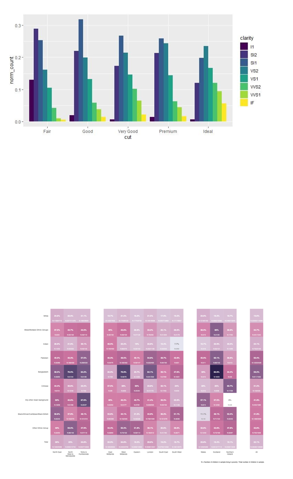
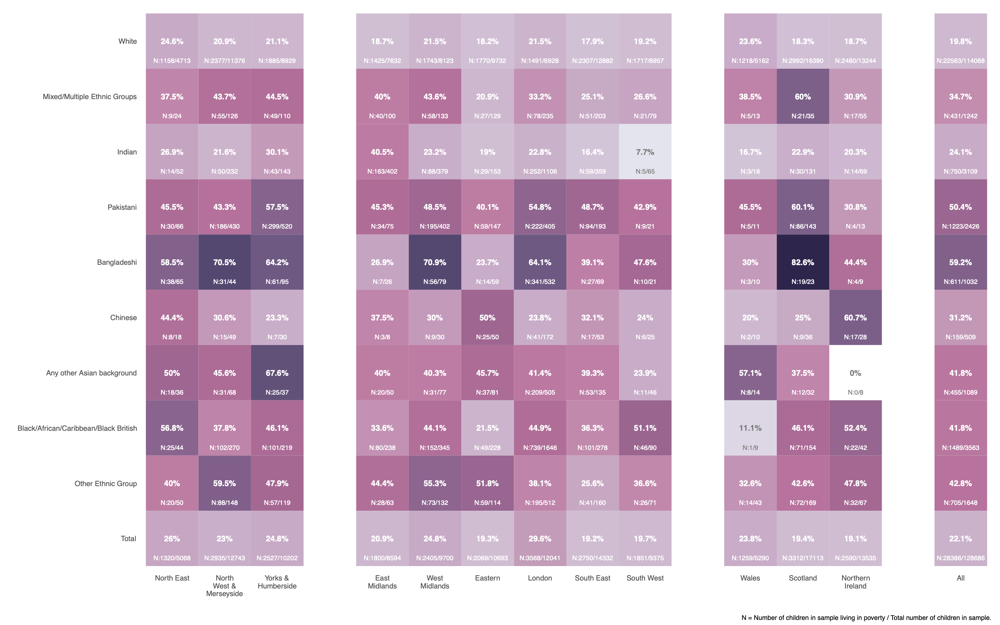
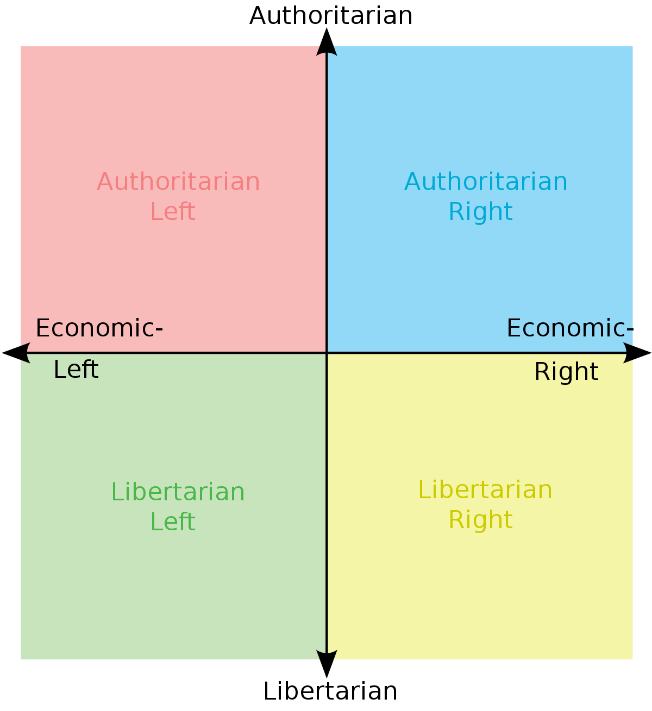

class: middle
background-size: contain

# .tuos_purple[SMI606: Week 3<br>Relationships between variables]

### Dr. Calum Webb
#### Sheffield Methods Institute, the University of Sheffield.
#### c.j.webb@sheffield.ac.uk

```{r setup, include=FALSE}
options(htmltools.dir.version = FALSE)
library(icons)
library(tidyverse)
library(xaringanExtra)
library(xaringanthemer)
knitr::opts_chunk$set(
  fig.width=9, fig.height=3.5, fig.retina=3,
  out.width = "100%",
  cache = FALSE,
  echo = TRUE,
  message = FALSE, 
  warning = FALSE,
  fig.show = TRUE,
  hiline = TRUE
)
```

```{r xaringan-tile-view, echo=FALSE}
xaringanExtra::use_tile_view()
```

```{r xaringan-logo, echo=FALSE}
xaringanExtra::use_logo(
  image_url = "images/uni-sheffield.png",
  exclude_class = c("inverse", "hide_logo")
)
```

```{r xaringan-themer, include=FALSE, warning=FALSE}
library(xaringanthemer)
style_duo_accent(
  primary_color = "#019EE3",
  secondary_color = "#FCF281",
  colors = c(tuos_purple = "#030043", grey = "#a8a8a8", tuos_blue ="#019EE3"),
  header_font_google = xaringanthemer::google_font("Playfair Display", "600", "600i"),
  text_font_google   = xaringanthemer::google_font("Work Sans", "300", "300i"),
  code_font_google   = xaringanthemer::google_font("Lucida Console"),
  header_h1_font_size = "2.25rem",
  header_h2_font_size = "1.75rem",
  header_h3_font_size = "1.5rem", code_font_size = "0.65rem"
)

tuos_blue <- "#019EE3"
tuos_yellow <- "#FCF281"
tuos_purple <- "#030043"

```

```{r xaringan-panelset, echo=FALSE}
xaringanExtra::use_panelset()
```

```{r xaringanExtra, echo = FALSE}
xaringanExtra::use_progress_bar(color = "#019EE3", location = "top")
```

```{r xaringan-extra-styles, echo = FALSE}
xaringanExtra::use_extra_styles(
  hover_code_line = TRUE,         #<<
  mute_unhighlighted_code = TRUE  #<<
)
```

```{r share-again, echo=FALSE}
xaringanExtra::use_share_again()
```

```{r metathis, echo=FALSE}
# Add metadata

# library(metathis)
# meta() %>%
#   meta_name("github-repo" = "cjrwebb/cjrwebb.github.io/tree/master/pres/smi") %>% 
#   meta_social(
#     title = "In Defence of Ordinary Help: The declining effectiveness of preventative children's services in England",
#     description = paste(
#       "On average, an additional £40 spent per child on preventative services in a given year was associated with decreases of nearly 5 children in need per 10,000, but this effectiveness has been declining over the decade."
#     ),
#     url = "https://cjrwebb.github.io/pres/smi/smi-research",
#     image = "https://cjrwebb.github.io/pres/smi/idoh-card.png",
#     image_alt = paste(
#       "Title slide of In Defence of Ordinary Help"
#     ),
#     og_type = "website",
#     og_author = "Calum Webb",
#     twitter_card_type = "summary_large_image",
#     twitter_creator = "@cjrwebb",
#     twitter_site = "@cjrwebb"
#   )
```

---
class: middle

.pull-left[
```{r, echo=FALSE, out.width = "80%"}

knitr::include_graphics("images/pg-sign-in.png")

```
]
.pull-right[

<br><br><br><br><br><br>

# Sign In

[Link](https://docs.google.com/forms/d/e/1FAIpQLSfUTgPPpkB3LkiDU41PxRn9CDCIojO2GKi7JIm1L_dES8ICJw/viewform)

]
---
class: middle

## Learning Objectives

.panelset[

.panel[.panel-name[What will I learn?]

By the end of this week you will:

* Learn how to __use variable types to select appropriate bivariate data visualisations and descriptive statistics__.

* Be able to create and interpret __bivariate bar charts, heatmaps, boxplots, ridgeplots, scatterplots, and hexbin plots__ using `R`.

* Be able to calculate and interpret several __bivariate descriptive statistics including__ __contingency tables, Cramer's V, Mean/Median differences, Spearman's $\rho$, and Pearson's R__ in `R`.


]

.panel[.panel-name[How does this week fit into my course?]

* Bivariate statistics an be important parts of research studies themselves, especially research studies with *a priori* controls (e.g. randomised controlled trials).

* Bivariate statistics and data visualisations are important for checking assumptions and for communicating findings in research. 

* Bivariate statistics can also be used to develop the rationale behind case studies in mixed methods research.


]


]


???

* Grid of variable types and relevant visualisations and descriptive statistics (no tests yet)


---

class: middle

## Visualisations for Exploring Relationships (Dependence) Between Variables

```{r, echo = FALSE}

library(formattable)

visuals <- tibble(
  `Variable Type` = c("Nominal", "Ordinal", "Continuous"),
  Nominal = c("Heatmap/<br>Bivariate Bar Chart", "Heatmap/<br>Bivariate Bar Chart", "Boxplot/<br>Ridgeplot"),
  Ordinal = c("", "Heatmap/<br>Bivariate Bar Chart", "Boxplot/<br>Ridgeplot"),
  Continuous = c("", "", "Scatterplot/<br>Hex Bin Plot")
)

visuals_tab <- formattable::formattable(visuals,
                         list(
                           `Variable Type` = formatter("span", style = formattable::style(font.weight = "bold"))
                         ))

as.htmlwidget(visuals_tab, width = "100%")

```


---

class: middle

## Descriptive Statistics for Describing Relationships (Dependence) Between Variables

```{r, echo = FALSE}

library(formattable)

descripts <- tibble(
  `Variable Type` = c("Nominal", "Ordinal", "Continuous"),
  Nominal = c("Contingency Table +<br>Cramer's V", "Contingency Table +<br>Cramer's V", "Mean/<br>Median Difference"),
  Ordinal = c("", "Spearman's Rho/<br>Contingency Table", "Mean/<br>Median Difference"),
  Continuous = c("", "", "Pearson's R or<br>Spearman's Rho")
)

descripts_tab <- formattable::formattable(descripts,
                         list(
                           `Variable Type` = formatter("span", style = formattable::style(font.weight = "bold"))
                         ))


as.htmlwidget(descripts_tab, width = "100%")


```


---

class: middle

## Visualisations for Exploring Relationships (Dependence) Between Variables

```{r, echo = FALSE}

library(formattable)

visuals <- tibble(
  `Variable Type` = c("Nominal", "Ordinal", "Continuous"),
  Nominal = c("<strong>Heatmap/<br>Bivariate Bar Chart</strong>", "<strong>Heatmap/<br>Bivariate Bar Chart</strong>", "Boxplot/<br>Ridgeplot"),
  Ordinal = c("", "<strong>Heatmap/<br>Bivariate Bar Chart</strong>", "Boxplot/<br>Ridgeplot"),
  Continuous = c("", "", "Scatterplot/<br>Hex Bin Plot")
)

visuals_tab <- formattable::formattable(visuals,
                         list(
                           `Variable Type` = formatter("span", style = formattable::style(font.weight = "bold"))
                         ))

as.htmlwidget(visuals_tab, width = "100%")

```

---

class: middle

.center[
```{r, echo=FALSE, out.width="55%"}



```
]

.center[
*One classic (bivariate bar chart), one 'modern' (heatmap)*
]

---

class: middle

.center[
```{r, echo=FALSE, out.width="90%"}

knitr::include_graphics("images/diamonds-bar.jpg")

```
]

---

class: middle

.center[
<br>

```{r, echo=FALSE, out.width="85%"}



```
]

---

class: middle, inverse

# .tuos_purple[Is there a relationship between peoples' attitudes towards the adequacy of benefits (welfare) payments and their attitudes towards immigration in Scotland?]


---

## Grouped bar chart

<br>

.pull-left[

```{r, include=FALSE}

library(haven)
library(labelled)

# Opinions differ about the level of benefits for unemployed people. Which of these two statements comes closest to your own view ...READ OUT...
# 1 ...benefits for unemployed people are too low and cause hardship,
# 2 or, benefits for unemployed people are too high and discourage them from finding
# jobs?
# 3 (Neither)

# Do you think the number of immigrants to Britain nowadays should be increased a lot, increased a little, remain the same as it is, reduced a little or reduced a lot?

ssa <- read_dta("data/ssa-2014") %>%
  janitor::clean_names() %>%
  user_na_to_na() %>%
  unlabelled() %>%
  mutate(
    dole_fct = case_when(
      dole_no_na == 1 ~ "Too low",
      dole_no_na == 2 ~ "Too high",
      dole_no_na == 3 ~ "Neither",
      TRUE ~ NA_character_
    ),
    imig_fct = case_when(
      let_in_no_na == 1 ~ "Increased a lot",
      let_in_no_na == 2 ~ "Increased a little",
      let_in_no_na == 3 ~ "Remain the same",
      let_in_no_na == 4 ~ "Reduced a little",
      let_in_no_na == 5 ~ "Reduced a lot",
      TRUE ~ NA_character_
    )
  ) %>%
  mutate(
    dole_fct = factor(dole_fct, levels = c("Too low", "Neither", "Too high")),
    imig_fct = factor(imig_fct, levels = c("Reduced a lot", "Reduced a little", "Remain the same", "Increased a little", "Increased a lot"))
  ) 

```

```{r, eval = FALSE}

ssa %>%
  # Remove missing
  filter(!is.na(imig_fct) & !is.na(dole_fct)
    ) %>% 
  # Plot bar chart
  ggplot() +
  geom_bar(aes(x = imig_fct, fill = dole_fct), 
           position = "dodge") +
  theme(legend.position = "bottom")
 
# imig_fct = views on how immigration should change

# dole_fct = views on whether benefits are too high, too low, or neither

```

]

.pull-right[

```{r, echo = FALSE, dpi = 200, fig.height=5, fig.width=5.5, out.height=500, out.width=550}

ssa %>%
  filter(!is.na(imig_fct) & !is.na(dole_fct)) %>% # Remove missing
  ggplot() +
  geom_bar(aes(x = imig_fct, fill = dole_fct), position = "dodge") +
  theme(legend.position = "bottom")

```


]


---

## Heatmap

.pull-left[

```{r, echo = FALSE, dpi = 200, fig.height=5.5, fig.width=5.5, out.height=550, out.width=550}

ssa %>%
  filter(!is.na(imig_fct) & !is.na(dole_fct)) %>% # Remove missing
  janitor::tabyl(imig_fct, dole_fct) %>%
  as_tibble() %>%
  pivot_longer(`Too low`:`Too high`, names_to = "dole_fct") %>%
  mutate(
    dole_fct = factor(dole_fct, 
                      levels = c("Too low", "Neither", "Too high"))
  ) %>%
  ggplot() +
  geom_tile(aes(x = imig_fct, y = dole_fct, fill = value)) +
  theme(legend.position = "bottom") +
  coord_fixed(1) +
  scale_fill_gradient2(low = "white", high = "seagreen")

```

]

.pull-right[

```{r, eval = FALSE}

ssa %>%
  filter(!is.na(imig_fct) & !is.na(dole_fct)) %>% # Remove missing
  janitor::tabyl(imig_fct, dole_fct) %>%
  as_tibble() %>%
  pivot_longer(`Too low`:`Too high`, names_to = "dole_fct") %>%
  mutate(
    dole_fct = factor(dole_fct, 
                      levels = c("Too low", "Neither", "Too high"))
  ) %>%
  ggplot() +
  geom_tile(aes(x = imig_fct, y = dole_fct, fill = value)) +
  theme(legend.position = "bottom") +
  coord_fixed(1) +
  scale_fill_gradient2(low = "white", high = "seagreen")

```


]

---

## Heatmap

.pull-left[

```{r, echo=FALSE}

ssa %>%
  filter(!is.na(imig_fct) & !is.na(dole_fct)) %>% # Remove missing
  janitor::tabyl(imig_fct, dole_fct)

```

]


.pull-right[

```{r, eval=FALSE}

ssa %>%
  filter(!is.na(imig_fct) & !is.na(dole_fct)) %>% # Remove missing
  janitor::tabyl(imig_fct, dole_fct) # Get crosstab

```

]


---

## Heatmap

.pull-left[

```{r, echo=FALSE}

ssa %>%
  filter(!is.na(imig_fct) & !is.na(dole_fct)) %>% # Remove missing
  janitor::tabyl(imig_fct, dole_fct) %>%
  as_tibble() 

```

]


.pull-right[

```{r, eval=FALSE}

ssa %>%
  filter(!is.na(imig_fct) & !is.na(dole_fct)) %>% # Remove missing
  janitor::tabyl(imig_fct, dole_fct) %>% # Get crosstab
  as_tibble() # Convert to tibble


```

]

---

## Heatmap

.pull-left[

```{r, echo=FALSE}

ssa %>%
  filter(!is.na(imig_fct) & !is.na(dole_fct)) %>% # Remove missing
  janitor::tabyl(imig_fct, dole_fct) %>%
  as_tibble() %>%
  pivot_longer(`Too low`:`Too high`, names_to = "dole_fct")

```

]


.pull-right[

```{r, eval=FALSE}

ssa %>%
  filter(!is.na(imig_fct) & !is.na(dole_fct)) %>% # Remove missing
  janitor::tabyl(imig_fct, dole_fct) %>% # Get crosstab
  as_tibble() %>% # Convert to tibble
  pivot_longer(`Too low`:`Too high`, names_to = "dole_fct") # Create 'long' data

```

]

---

## Heatmap

.pull-left[

```{r, echo=FALSE}

ssa %>%
  filter(!is.na(imig_fct) & !is.na(dole_fct)) %>% # Remove missing
  janitor::tabyl(imig_fct, dole_fct) %>%
  as_tibble() %>%
  pivot_longer(`Too low`:`Too high`, names_to = "dole_fct") %>%
  mutate( # re-factorise dole_fct
    dole_fct = 
      factor(dole_fct, levels = c("Too low", "Neither", "Too high"))
  )

```

]


.pull-right[

```{r, eval=FALSE}

ssa %>%
  filter(!is.na(imig_fct) & !is.na(dole_fct)) %>% # Remove missing
  janitor::tabyl(imig_fct, dole_fct) %>% # Get crosstab
  as_tibble() %>% # Convert to tibble
  pivot_longer(`Too low`:`Too high`, names_to = "dole_fct") %>% # Create 'long' data
  mutate( # re-factorise dole_fct
    dole_fct = factor(dole_fct, levels = c("Too low", "Neither", "Too high"))
  )
  
```

]

---

## Heatmap

.pull-left[

```{r, echo=FALSE, dpi = 200, fig.height=5.5, fig.width=5.5, out.height=550, out.width=550}

ssa %>%
  filter(!is.na(imig_fct) & !is.na(dole_fct)) %>% # Remove missing
  janitor::tabyl(imig_fct, dole_fct) %>%
  as_tibble() %>%
  pivot_longer(`Too low`:`Too high`, names_to = "dole_fct") %>%
  mutate( # re-factorise dole_fct
    dole_fct = 
      factor(dole_fct, levels = c("Too low", "Neither", "Too high"))
  ) %>%
  ggplot() +
  geom_tile(aes(x = imig_fct, y = dole_fct, fill = value))

```

]


.pull-right[

```{r, eval=FALSE}

ssa %>%
  filter(!is.na(imig_fct) & !is.na(dole_fct)) %>% # Remove missing
  janitor::tabyl(imig_fct, dole_fct) %>% # Get crosstab
  as_tibble() %>% # Convert to tibble
  pivot_longer(`Too low`:`Too high`, names_to = "dole_fct") %>% # Create 'long' data
  mutate( # re-factorise dole_fct
    dole_fct = factor(dole_fct, levels = c("Too low", "Neither", "Too high"))
  ) %>%
  ggplot() + # plot data
  geom_tile(aes(x = imig_fct, y = dole_fct, fill = value)) # create heatmap
  
```

]

---

## Heatmap

.pull-left[

```{r, echo=FALSE, dpi = 200, fig.height=5.5, fig.width=5.5, out.height=550, out.width=550}

ssa %>%
  filter(!is.na(imig_fct) & !is.na(dole_fct)) %>% # Remove missing
  janitor::tabyl(imig_fct, dole_fct) %>%
  as_tibble() %>%
  pivot_longer(`Too low`:`Too high`, names_to = "dole_fct") %>%
  mutate( # re-factorise dole_fct
    dole_fct = 
      factor(dole_fct, levels = c("Too low", "Neither", "Too high"))
  ) %>%
  ggplot() +
  geom_tile(aes(x = imig_fct, y = dole_fct, fill = value)) +
  theme(legend.position = "bottom") + # move legend to bottom
  coord_fixed(1) # force squares

```

]


.pull-right[

```{r, eval=FALSE}

ssa %>%
  filter(!is.na(imig_fct) & !is.na(dole_fct)) %>% # Remove missing
  janitor::tabyl(imig_fct, dole_fct) %>% # Get crosstab
  as_tibble() %>% # Convert to tibble
  pivot_longer(`Too low`:`Too high`, names_to = "dole_fct") %>% # Create 'long' data
  mutate( # re-factorise dole_fct
    dole_fct = factor(dole_fct, levels = c("Too low", "Neither", "Too high"))
  ) %>%
  ggplot() + # plot data
  geom_tile(aes(x = imig_fct, y = dole_fct, fill = value)) +  # create heatmap
  theme(legend.position = "bottom") + # move legend to bottom
  coord_fixed(1) # force squares
  
```

]


---

## Heatmap

.pull-left[

```{r, echo=FALSE, dpi = 200, fig.height=5.5, fig.width=5.5, out.height=550, out.width=550}

ssa %>%
  filter(!is.na(imig_fct) & !is.na(dole_fct)) %>% # Remove missing
  janitor::tabyl(imig_fct, dole_fct) %>%
  as_tibble() %>%
  pivot_longer(`Too low`:`Too high`, names_to = "dole_fct") %>%
  mutate( # re-factorise dole_fct
    dole_fct = 
      factor(dole_fct, levels = c("Too low", "Neither", "Too high"))
  ) %>%
  ggplot() +
  geom_tile(aes(x = imig_fct, y = dole_fct, fill = value)) +
  theme(legend.position = "bottom") + # move legend to bottom
  coord_fixed(1) + # force squares
  scale_fill_gradient2(low = "white", high = "seagreen")
  
```

]


.pull-right[

```{r, eval=FALSE}

ssa %>%
  filter(!is.na(imig_fct) & !is.na(dole_fct)) %>% # Remove missing
  janitor::tabyl(imig_fct, dole_fct) %>% # Get crosstab
  as_tibble() %>% # Convert to tibble
  pivot_longer(`Too low`:`Too high`, names_to = "dole_fct") %>% # Create 'long' data
  mutate( # re-factorise dole_fct
    dole_fct = factor(dole_fct, levels = c("Too low", "Neither", "Too high"))
  ) %>%
  ggplot() + # plot data
  geom_tile(aes(x = imig_fct, y = dole_fct, fill = value)) +  # create heatmap
  theme(legend.position = "bottom") + # move legend to bottom
  coord_fixed(1) + # force squares
  scale_fill_gradient2(low = "white", high = "seagreen") # change colour scheme
  
```

]

---

class: middle, inverse

## .tuos_purple[How do we effectively summarise and communicate this relationship in a standardised way?]


---

class: middle

## Descriptive Statistics for Describing Relationships (Dependence) Between Variables

```{r, echo = FALSE}

library(formattable)

descripts <- tibble(
  `Variable Type` = c("Nominal", "Ordinal", "Continuous"),
  Nominal = c("<strong>Contingency Table +<br>Cramer's V</strong>", "<strong>Contingency Table +<br>Cramer's V</strong>", "Mean/<br>Median Difference"),
  Ordinal = c("", "<strong>Spearman's Rho/<br>Contingency Table</strong>", "Mean/<br>Median Difference"),
  Continuous = c("", "", "Pearson's R or<br>Spearman's Rho")
)

descripts_tab <- formattable::formattable(descripts,
                         list(
                           `Variable Type` = formatter("span", style = formattable::style(font.weight = "bold"))
                         ))


as.htmlwidget(descripts_tab, width = "100%")


```

---

## Contingency tables ("Crosstabs")

<br>

.pull-left[

Contingency tables show the __frequency of responses that fall within all combinations of categories within two variables__ with mutually exclusive categories.

]

.pull-right[

```{r}
library(janitor)

ssa %>%
  tabyl(imig_fct, dole_fct)

```


]


---

## Contingency tables ("Crosstabs")

<br>

.pull-left[

Contingency tables show the __frequency of responses that fall within all combinations of categories within two variables__ with mutually exclusive categories.

Most visualisations rely on contingency but assign aesthetic elements (e.g. height of a bar or fill of a square) to illustrate variation.

]

.pull-right[

```{r}
library(janitor)

ssa %>%
  tabyl(imig_fct, dole_fct)

```


]

---

## Contingency tables ("Crosstabs")

<br>

.pull-left[

Contingency tables show the __frequency of responses that fall within all combinations of categories within two variables__ with mutually exclusive categories.

Most visualisations rely on contingency but assign aesthetic elements (e.g. height of a bar or fill of a square) to illustrate variation.

* Interpreting and communicating dependence between two categorical or ordinal variables using a contingency table __often requires the use of percentages__. 

  * These can be calculated based on the rows

]

.pull-right[

```{r}
library(janitor)

ssa %>%
  tabyl(imig_fct, dole_fct) %>%
  adorn_percentages(denominator = "row") %>%
  adorn_totals(where = c("col")) %>%
  adorn_pct_formatting() 

```


]

---

## Contingency tables ("Crosstabs")

<br>

.pull-left[

Contingency tables show the __frequency of responses that fall within all combinations of categories within two variables__ with mutually exclusive categories.

Most visualisations rely on contingency but assign aesthetic elements (e.g. height of a bar or fill of a square) to illustrate variation.

* Interpreting and communicating dependence between two categorical or ordinal variables using a contingency table __often requires the use of percentages__. 

  * These can be calculated based on the rows
  
  * Or based on columns

]

.pull-right[

```{r}
library(janitor)

ssa %>%
  tabyl(imig_fct, dole_fct) %>%
  adorn_percentages(denominator = "col") %>%
  adorn_totals(where = c("row")) %>%
  adorn_pct_formatting() 

```


]

---

## Contingency tables ("Crosstabs")

<br>

.pull-left[

Contingency tables show the __frequency of responses that fall within all combinations of categories within two variables__ with mutually exclusive categories.

Most visualisations rely on contingency but assign aesthetic elements (e.g. height of a bar or fill of a square) to illustrate variation.

* Interpreting and communicating dependence between two categorical or ordinal variables using a contingency table __often requires the use of percentages__. 

  * These can be calculated based on the rows
  
  * Or based on columns

* However, this should **always be clearly labelled** and actual frequency counts should **always be available** to be transparent about small numbers of respondents.

]

.pull-right[

```{r}
library(janitor)

ssa %>%
  tabyl(imig_fct, dole_fct) %>%
  adorn_percentages(denominator = "col") %>%
  adorn_totals(where = c("row")) %>%
  adorn_pct_formatting() 

```

```{r, echo=FALSE}
ssa %>%
  tabyl(imig_fct, dole_fct) 

```


]

---

## Cramer's V

<br>

.pull-left[

Measure of asymmetry/dependence.

* 0 = Total independence
* 1 = Total dependence

Does knowing the value of one of the variables help you know the value of the other variable (dependence), or does it make no difference (independence)?

]

.pull-right[

```{r}

library(rcompanion)

ssa %>%
  tabyl(imig_fct, dole_fct)

cramerV(x = ssa$dole_fct, y = ssa$imig_fct) 

```

]

---

## Cramer's V

<br>

.pull-left[

Measure of asymmetry/dependence.

* 0 = Total independence
* 1 = Total dependence

Does knowing the value of one of the variables help you know the value of the other variable (dependence), or does it make no difference (independence)?

]

.pull-right[

```{r}

zero_dep <- matrix(c(50, 50, 50, 50), nrow = 2, ncol = 2) 

zero_dep

```

```{r}

cramerV(zero_dep)

```

]

---

## Cramer's V

<br>

.pull-left[

Measure of asymmetry/dependence.

* 0 = Total independence
* 1 = Total dependence

Does knowing the value of one of the variables help you know the value of the other variable (dependence), or does it make no difference (independence)?

]

.pull-right[

```{r}

total_dep <- matrix(c(0, 100, 100, 0), nrow = 2, ncol = 2) 

total_dep

```

```{r}

cramerV(total_dep)

```

]

---

## Cramer's V

<br>

.pull-left[

Measure of asymmetry/dependence.

* 0 = Total independence
* 1 = Total dependence

Does knowing the value of one of the variables help you know the value of the other variable (dependence), or does it make no difference (independence)?

]

.pull-right[

```{r}

partial_dep <- matrix(c(25, 75, 75, 25), nrow = 2, ncol = 2) 

partial_dep

```

```{r}

cramerV(partial_dep)

```

]

---

## Spearman's rho ( $\rho$ ): Rank order correlation

<br>


.pull-left[

```{r}

# Change factors to be ordered
ssa <- ssa %>%
  mutate(
    imig_fct = factor(imig_fct, ordered = TRUE),
    dole_fct = factor(dole_fct, ordered = TRUE)
  )

# Immigration should be...
# 5 Levels: Reduced a lot < Reduced a little < ... < Increased a lot

# Benefits payments are...
# Levels: Too low < Neither < Too high

cor(x = as.numeric(ssa$imig_fct), # Must be numeric
    y = as.numeric(ssa$dole_fct), # Must be numeric
    use = "complete.obs", # Remove missing values
    method = "spearman" # Use spearman's rho
    )

```
]

.pull-right[

How closely do the orders of the two variables match up when ranked?

* 1 = Ranks increase at exactly the same rate
* 0 = Ranks neither increase or decrease consistently between the two variables
* -1 = As the rank of one variable increases, the other decreases.

]

---

## Spearman's rho ( $\rho$ ): Rank order correlation

<br>


.pull-left[

```{r}

# Change factors to be ordered
ssa <- ssa %>%
  mutate(
    imig_fct = factor(imig_fct, ordered = TRUE),
    dole_fct = factor(dole_fct, ordered = TRUE)
  )

# Immigration should be...
# 5 Levels: Reduced a lot < Reduced a little < ... < Increased a lot

# Benefits payments are...
# Levels: Too low < Neither < Too high

cor(x = as.numeric(ssa$imig_fct), # Must be numeric
    y = as.numeric(ssa$dole_fct), # Must be numeric
    use = "complete.obs", # Remove missing values
    method = "spearman" # Use spearman's rho
    )

```
]

.pull-right[

How closely do the orders of the two variables match up when ranked?

* 1 = Ranks increase at exactly the same rate
* 0 = Ranks neither increase or decrease consistently between the two variables
* __-1 = As the rank of one variable increases, the other decreases.__

__As the rank of immigration attitudes increases__ (people feel more that it should immigration should be increased and less that it should be reduced), __the rank of attitudes towards benefits tends to decrease__ (people feel more that benefits are too low rather than too high).

People who are pro-immigration are also more likely to support greater welfare generosity, though this is only a weak association. 

]

---

class: middle, inverse

## .tuos_purple[Are attitudes towards immigration associated with age?]

---


class: middle

## Visualisations for Exploring Relationships (Dependence) Between Variables

```{r, echo = FALSE}

library(formattable)

visuals <- tibble(
  `Variable Type` = c("Nominal", "Ordinal", "Continuous"),
  Nominal = c("Heatmap/<br>Bivariate Bar Chart", "Heatmap/<br>Bivariate Bar Chart", "<strong>Boxplot/<br>Ridgeplot</strong>"),
  Ordinal = c("", "Heatmap/<br>Bivariate Bar Chart", "<strong>Boxplot/<br>Ridgeplot</strong>"),
  Continuous = c("", "", "Scatterplot/<br>Hex Bin Plot")
)

visuals_tab <- formattable::formattable(visuals,
                         list(
                           `Variable Type` = formatter("span", style = formattable::style(font.weight = "bold"))
                         ))

as.htmlwidget(visuals_tab, width = "100%")

```

---

## Data preparation: Recoding

<br>

```{r}

ssa <- ssa %>%
  mutate(
    imig_fct_3 = case_when(imig_fct == "Reduced a lot" ~ "Reduced",
                           imig_fct == "Reduced a little" ~ "Reduced",
                           imig_fct == "Remain the same" ~ "Same",
                           imig_fct == "Increased a little" ~ "Increased",
                           imig_fct == "Increased a lot" ~ "Increased",
                           TRUE ~ NA_character_)
  ) %>%
  mutate(
    imig_fct_3 = factor(imig_fct_3, 
                        levels = c("Reduced", "Same", "Increased"), 
                        ordered = TRUE)
  ) 

ssa %>%
  tabyl(imig_fct, imig_fct_3)

```

---

## Boxplot 

<br>

```{r, echo = FALSE, out.height=550, out.width=1000, fig.height=5.5, fig.width=10}

ssa %>%
  filter(!is.na(rage) & !is.na(imig_fct_3)) %>%
  ggplot() +
  geom_boxplot(aes(x = imig_fct_3, y = rage))

```

---

## Boxplot 

<br>

.pull-left[

```{r, eval = FALSE}

ssa %>%
  # Remove missing
  filter(!is.na(rage) & !is.na(imig_fct_3)) %>%
  # Start plotting
  ggplot() +
  geom_boxplot(aes(x = imig_fct_3, y = rage))

# rage = Respondent's Age

```

<br>

* Whiskers = Minimum and Maximum
* Box = 25th to 75th percentile (50% of observations)
* Medial = Median

]

.pull-right[
```{r, echo = FALSE, out.height=500, out.width=500, fig.height=5, fig.width=5}

ssa %>%
  filter(!is.na(rage) & !is.na(imig_fct_3)) %>%
  ggplot() +
  geom_boxplot(aes(x = imig_fct_3, y = rage))

```

]

---

## Ridgeplot

<br>

```{r, echo = FALSE, out.height=550, out.width=1000, fig.height=5.5, fig.width=10}

library(ggridges)

ssa %>%
  filter(!is.na(rage) & !is.na(imig_fct_3)) %>%
  ggplot() +
  geom_density_ridges(aes(x = rage, y = imig_fct_3, fill = imig_fct_3),
                      alpha = 0.5)

```

---

## Ridgeplot

<br>

.pull-left[

```{r, eval = FALSE}

library(ggridges)

ssa %>%
  filter(!is.na(rage) & !is.na(imig_fct_3)) %>%
  ggplot() +
  geom_density_ridges(
    aes(x = rage, y = imig_fct_3, fill = imig_fct_3),
    alpha = 0.5
    )

# rage = Respondent's Age

```

<br>

* Shows distribution across the range - makes it easy to assess the distribution across groups (e.g. whether the variable is normally distributed across all groups).

]

.pull-right[
```{r, echo = FALSE, out.height=500, out.width=500, fig.height=5, fig.width=5}

ssa %>%
  filter(!is.na(rage) & !is.na(imig_fct_3)) %>%
  ggplot() +
  geom_density_ridges(
    aes(x = rage, y = imig_fct_3, fill = imig_fct_3),
    alpha = 0.5
    )

```

]

---

class: middle

## Descriptive Statistics for Describing Relationships (Dependence) Between Variables

```{r, echo = FALSE}

library(formattable)

descripts <- tibble(
  `Variable Type` = c("Nominal", "Ordinal", "Continuous"),
  Nominal = c("Contingency Table +<br>Cramer's V", "Contingency Table +<br>Cramer's V", "<strong>Mean/<br>Median Difference</strong>"),
  Ordinal = c("", "Spearman's Rho/<br>Contingency Table", "<strong>Mean/<br>Median Difference</strong>"),
  Continuous = c("", "", "Pearson's R or<br>Spearman's Rho")
)

descripts_tab <- formattable::formattable(descripts,
                         list(
                           `Variable Type` = formatter("span", style = formattable::style(font.weight = "bold"))
                         ))


as.htmlwidget(descripts_tab, width = "100%")


```

---

## Mean/Median Differences (and Ranges)

<br>


```{r, eval=FALSE}

ssa %>%
  group_by(imig_fct_3) %>%
  summarise(
    mean_age      = mean(rage, na.rm = TRUE),
    median_age    = median(rage, na.rm = TRUE),
    min_age       = min(rage, na.rm = TRUE),
    percentile_25 = quantile(rage, probs = 0.25),
    percentile_75 = quantile(rage, probs = 0.75),
    max_age       = max(rage, na.rm = TRUE)
  )

```


#### __Age summary statistics by attitudes towards future immigration policy __

```{r, echo=FALSE}

ssa %>%
  group_by(imig_fct_3) %>%
  summarise(
    mean_age      = mean(rage, na.rm = TRUE),
    median_age    = median(rage, na.rm = TRUE),
    min_age       = min(rage, na.rm = TRUE),
    percentile_25 = quantile(rage, probs = 0.25),
    percentile_75 = quantile(rage, probs = 0.75),
    max_age       = max(rage, na.rm = TRUE)
  )

```


---

## Mean/Median Differences (and Ranges)

<br>


```{r, eval=FALSE}

ssa %>%
  group_by(dole_fct) %>%
  summarise(
    mean_age      = mean(rage, na.rm = TRUE),
    median_age    = median(rage, na.rm = TRUE),
    min_age       = min(rage, na.rm = TRUE),
    percentile_25 = quantile(rage, probs = 0.25),
    percentile_75 = quantile(rage, probs = 0.75),
    max_age       = max(rage, na.rm = TRUE)
  )

```


#### __Age summary statistics by attitudes towards welfare generousity__

```{r, echo=FALSE}

ssa %>%
  group_by(dole_fct) %>%
  summarise(
    mean_age      = mean(rage, na.rm = TRUE),
    median_age    = median(rage, na.rm = TRUE),
    min_age       = min(rage, na.rm = TRUE),
    percentile_25 = quantile(rage, probs = 0.25),
    percentile_75 = quantile(rage, probs = 0.75),
    max_age       = max(rage, na.rm = TRUE)
  )

```

---

class: middle, inverse

## .tuos_purple[Is a person's age associated with their position on an Authoritarian-Libertarian scale?]

---

<br>

.center[
```{r, echo = FALSE, out.width="50%"}



```
]

---

<br><br>

__'Young people today don't have enough respect for traditional British values'__

1. Agree strongly
2. Agree
3. Neither agree nor disagree
4. Disagree
5. Disagree strongly
8. (Don't know)
9. (Refusal)

__'People who break the law should be given stiffer sentences'__

__'For some crimes, the death penalty is the most appropriate sentence'__

__'Schools should teach children to obey authority'__

__'The law should always be obeyed, even if a particular law is wrong'__

__'Censorship of films and magazines is necessary to uphold moral standards'__

__'Gay or lesbian couples should have the right to marry one another if they want to.'__

--

.center[Variable `libauth` is a scale based on responses where the value 1 represents the most libertarian position and 5 the most authoritarian.]

---

class: middle

```{r, include=FALSE}

ssa <- ssa %>%
  filter(libauth >= 1 & libauth <= 5) 

cor(ssa$rage, ssa$libauth)

```

## Visualisations for Exploring Relationships (Dependence) Between Variables

```{r, echo = FALSE}

library(formattable)

visuals <- tibble(
  `Variable Type` = c("Nominal", "Ordinal", "Continuous"),
  Nominal = c("Heatmap/<br>Bivariate Bar Chart", "Heatmap/<br>Bivariate Bar Chart", "Boxplot/<br>Ridgeplot"),
  Ordinal = c("", "Heatmap/<br>Bivariate Bar Chart", "Boxplot/<br>Ridgeplot"),
  Continuous = c("", "", "<strong>Scatterplot/<br>Hex Bin Plot</strong>")
)

visuals_tab <- formattable::formattable(visuals,
                         list(
                           `Variable Type` = formatter("span", style = formattable::style(font.weight = "bold"))
                         ))

as.htmlwidget(visuals_tab, width = "100%")

```

---

## Scatterplot

<br>

```{r, echo=FALSE, out.height=550, out.width=1000, fig.height=5.5, fig.width=10}

ssa %>%
  ggplot() +
  geom_point(aes(x = rage, y = libauth))

```

---

## Scatterplot

<br>

.pull-left[

```{r, echo=FALSE, out.height=550, out.width=550, fig.height=5.5, fig.width=5.5}

ssa %>%
  ggplot() +
  geom_point(aes(x = rage, y = libauth))

```

]

.pull-right[

```{r, eval = FALSE}

ssa %>%
  ggplot() +
  geom_point(aes(x = rage, y = libauth))

```


]

---

## Scatterplot

<br>

.pull-left[

```{r, echo=FALSE, out.height=550, out.width=550, fig.height=5.5, fig.width=5.5}

ssa %>%
  ggplot() +
  geom_point(aes(x = rage, y = libauth))

```

]

.pull-right[

```{r, eval = FALSE}

ssa %>%
  ggplot() +
  geom_point(aes(x = rage, y = libauth))

```

<br>

* Can easily end up with overplotting - especially with discrete variables.

Possible solutions:

* Add jitter to points (artificially spread them out from their true value) - not great as it manipulates data.
* Make points smaller - useful for overplotting with continuous variables but less useful for discrete
* Add transparency - same as above

Or...

* Use a hexbin plot.

]

---

## Hexbin plot
<br>

.pull-left[

```{r, eval = FALSE, out.height=550, out.width=550, fig.height=5.5, fig.width=5.5}

ssa %>%
  ggplot() +
  geom_hex(aes(x = rage, y = libauth), bins = 25)

```

]

.pull-right[

```{r, echo = FALSE, out.height=550, out.width=550, fig.height=5.5, fig.width=5.5}

ssa %>%
  ggplot() +
  geom_hex(aes(x = rage, y = libauth), bins = 25)

```

]

---

class: middle

## Descriptive Statistics for Describing Relationships (Dependence) Between Variables

```{r, echo = FALSE}

library(formattable)

descripts <- tibble(
  `Variable Type` = c("Nominal", "Ordinal", "Continuous"),
  Nominal = c("Contingency Table +<br>Cramer's V", "Contingency Table +<br>Cramer's V", "Mean/<br>Median Difference"),
  Ordinal = c("", "Spearman's Rho/<br>Contingency Table", "Mean/<br>Median Difference"),
  Continuous = c("", "", "<strong>Pearson's R or<br>Spearman's Rho</strong>")
)

descripts_tab <- formattable::formattable(descripts,
                         list(
                           `Variable Type` = formatter("span", style = formattable::style(font.weight = "bold"))
                         ))


as.htmlwidget(descripts_tab, width = "100%")


```

---

## Correlation: Pearson's R

<br>

.pull-left[

```{r}

cor(x = ssa$rage, y = ssa$libauth,
    use = "complete.obs",
    method = "pearson")

```

```{r}

cor(x = ssa$rage, y = ssa$libauth,
    use = "complete.obs",
    method = "spearman")

```

]

.pull-right[

Pearson's correlation coefficient R, is a measure of __how closely associated the variance in one variable is with the variance in another variable__, relative to the maximum possible covariance they could share.

* `-1` = Perfect negative correlation - as the value of one variable increases the other decreases.
* `0 ` = No correlation - changes in the value of one variable are not associated with changes in the other.
* `1` = Perfect positive correlation - as the value of one variable increases the other also increases.

__Rules of thumb__:

* ±0.01 - 0.19 = Very weak/Negligible correlation
* ±0.20 - 0.39 = Weak correlation
* ±0.40 - 0.59 = Moderate correlation
* ±0.60 - 0.79 = Strong correlation
* ±0.80 - 0.99 = Very strong correlation

]

---

<br><br><br>

```{r, echo = FALSE}

knitr::include_graphics("images/correl-ex.svg")

```

---

## Difference between Spearman & Pearson

<br>

.pull-left[

* Pearson's correlation relies on the use of means and variance (__assuming normal distribution__), and therefore can be sensitive to outliers or non-linearity (relationships that aren't a straight line).

* Spearman's correlation uses the __rank__ order association, so outliers will not affect it if the rank order remains the same.


]

.pull-right[

```{r}

x <- c(1, 2, 3, 4, 15)
y <- c(1, 2, 3, 4, 5)

cor(x, y, method = "pearson")

cor(x, y, method = "spearman")

```

]

---

<br>

.pull-left[

## Pearson (raw values)

```{r, out.height=400, out.width=400, fig.height=4, fig.width=4}

ggplot() +
  geom_point(
    aes(x = x, y = y), size = 5
  )

```

]

.pull-right[

## Spearman (ranks)

```{r, out.height=400, out.width=400, fig.height=4, fig.width=4}

ggplot() +
  geom_point(
    aes(x = rank(x), y = rank(y)), size = 5
  )

```

]

---

class: middle

# Summary

<br>

* There are a large range of ways to visualise and statistically describe relationships between variables in `R`; __appropriate methods can be chosen by considering the type of variables we wish to analyse using what we learned in Week 2.__ 

--

* __Visualisations of relationships__ between variables can help us get a full and proportionate picture of relationships, whereas __bivariate descriptive statistics__ (contingency tables, Spearman's Rho, Cramer's V, and Pearson's R) can give us a standardised, shorthand way of describing what these relationships are.


---

class: middle

# R Exercise

<br>

* This week, the focus is on __interpreting output__ from `R` in a quantitative research context - not on writing `R` code.

* In the process, you will also learn how a new type of `R` file - __R markdown__ - can be used to create documents (including pdfs and web pages).

<br>
<hr>
<br>

* __Download and unzip the Week 3 R Exercise files from the Blackboard page and open the .Rproj and week-3.Rmd files in Rstudio.__


```{r include = FALSE}

# Tidying SSA data - correcting codes etc

ssa_tidy <- ssa %>%
  rename(
    party_allg = pty_allg_s_no_na,
    gov_trust = gov_trust_no_na,
    tax_view = tax_spend_no_na,
    eu_policy = ec_policy_no_na,
    ev_cameron = ev_cameron_no_na,
    ev_salmond = ev_salmond_no_na,
    knowind = knowind_no_na,
    likely_vote = liklyvt_no_na,
    referend_vote = refvote_no_na,
    uk_scot_spend_fair = uk_spen_gb_no_na,
    scot_identity = scot_id_no_na,
    highest_quals = h_ed_qual2_no_na,
    union_benef = se_ben_gb_no_na
  ) %>%
  mutate(
    party_allg = case_when(party_allg == 1 ~ "Conservative",
                           party_allg == 2 ~ "Labour",
                           party_allg == 3 ~ "Liberal Democrats",
                           party_allg == 4 ~ "Scottish National Party",
                           party_allg == 5 ~ "Green Party",
                           party_allg == 6 ~ "UKIP",
                           party_allg == 7 ~ "British National Party",
                           party_allg == 8 ~ "Socialist Parties",
                           party_allg == 9 ~ "Other Party",
                           party_allg == 10 ~ "Other Answer",
                           party_allg == 11 ~ "None",
                           TRUE ~ NA_character_),
    gov_trust = case_when(gov_trust == 1 ~ "Always Trust",
                          gov_trust == 2 ~ "Often Trust",
                          gov_trust == 3 ~ "Sometimes Trust",
                          gov_trust == 4 ~ "Never Trust",
                          TRUE ~ NA_character_),
    gov_trust = factor(gov_trust, levels = c("Never Trust", "Sometimes Trust",
                                             "Often Trust", "Always Trust"),
                       ordered = TRUE),
    tax_view = case_when(tax_view == 1 ~ "Reduce taxes",
                         tax_view == 2 ~ "Keep the same",
                         tax_view == 3 ~ "Increase taxes",
                         TRUE ~ NA_character_),
    tax_view = factor(tax_view, levels = c("Reduce taxes", "Remain the same", "Increase taxes"), 
                      ordered = TRUE),
    eu_policy = factor(case_when(eu_policy == 1 ~ "Leave the EU",
                                 eu_policy == 2 ~ "Stay in EU but reduce its powers",
                                 eu_policy == 3 ~ "Keep the same",
                                 eu_policy == 4 ~ "Stay in EU and increase its powers",
                                 eu_policy == 5 ~ "Form a single European government",
                                 TRUE ~ NA_character_),
                       levels = c("Leave the EU",
                                  "Stay in EU but reduce its powers",
                                  "Keep the same",
                                  "Stay in EU and increase its powers",
                                  "Form a single European government"),
                       ordered= TRUE),
    knowind = factor(case_when(knowind == 1 ~ "A great deal",
                               knowind == 2 ~ "Quite a lot",
                               knowind == 3 ~ "Some",
                               knowind == 4 ~ "Not very much",
                               knowind == 5 ~ "Nothing at all",
                               TRUE ~ NA_character_),
                     levels = c("Nothing at all", "Not very much",
                                "Some", "Quite a lot", "A great deal"),
                     ordered = TRUE),
    referend_vote = factor(case_when(referend_vote == 1 ~ "Yes",
                                     referend_vote == 2 ~ "No",
                                     referend_vote == 3 ~ "Not decided yet",
                                     referend_vote == 4 ~ "Will not vote",
                                     TRUE ~ NA_character_),
                           levels = c("Yes", "No", "Not decided yet", "Will not vote")),
    uk_scot_spend_fair = factor(case_when(uk_scot_spend_fair == 1 ~ "Much more than fair share",
                                          uk_scot_spend_fair == 2 ~ "Little more than fair share", 
                                          uk_scot_spend_fair == 3 ~ "Pretty much fair share",
                                          uk_scot_spend_fair == 4 ~ "Little less fair share",
                                          uk_scot_spend_fair == 5 ~ "Much less fair share",
                                          TRUE ~ NA_character_),
                                levels = c("Much less fair share",
                                           "Little less fair share",
                                           "Pretty much fair share",
                                           "Little more than fair share",
                                           "Much more than fair share"),
                                ordered = TRUE),
    highest_quals = factor(case_when(highest_quals == 1 ~ "Post-grad degree",
                                     highest_quals == 2 ~ "First degree",
                                     highest_quals == 3 ~ "Higher ed below degree",
                                     highest_quals == 4 ~ "Highers/A levels or eq",
                                     highest_quals == 5 ~ "Standard grades 1-3/GCSEs or equiv",
                                     highest_quals == 6 ~"Standard grades 4-7/CSE or equiv",
                                     highest_quals == 7 ~ "Foreign or other",
                                     highest_quals == 8 ~ "No qualification"
                                     ),
                           levels = c("No qualification",
                                      "Foreign or other",
                                      "Standard grades 4-7/CSE or equiv",
                                      "Standard grades 1-3/GCSEs or equiv",
                                      "Highers/A levels or eq",
                                      "Higher ed below degree",
                                      "First degree",
                                      "Post-grad degree")),
    union_benef = case_when(union_benef == 1 ~ "England benefits more",
                            union_benef == 2 ~ "Scotland benefits more",
                            union_benef == 3 ~ "Equal",
                            union_benef == 4 ~ "Neither")
    
    
  ) %>%
  select(-let_in_no_na, -party_fw_no_na, -dole_no_na, -party_labels)


```