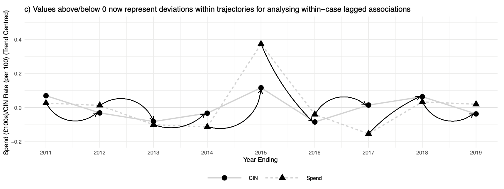
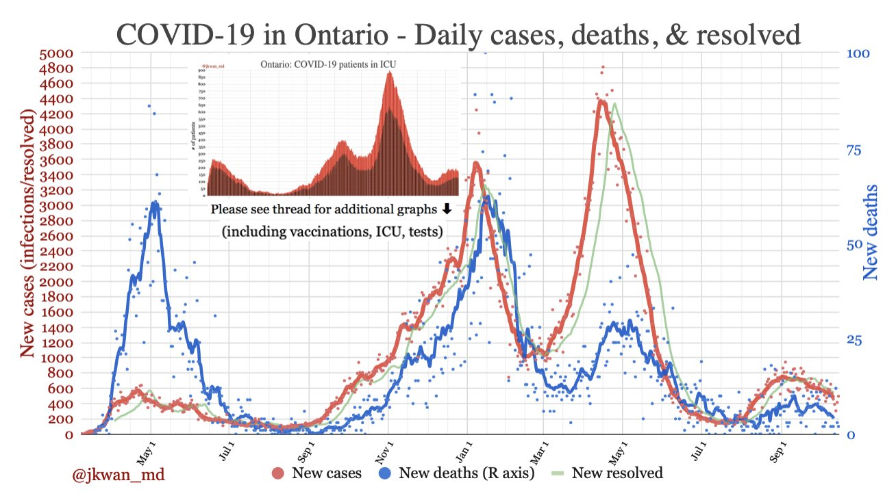
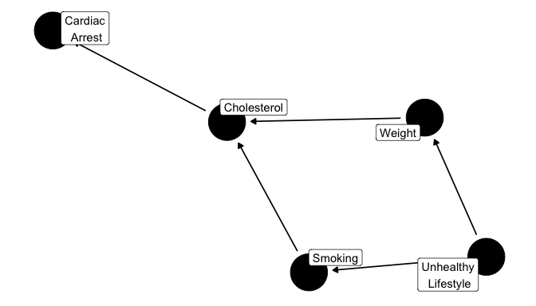
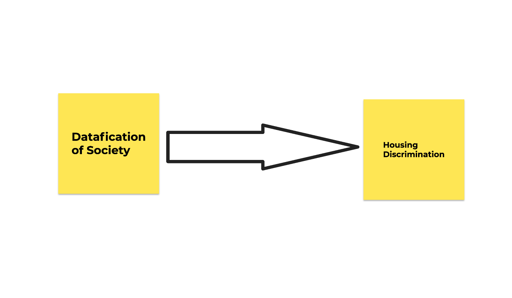

class: middle
background-size: contain

# .tuos_purple[SMI606: Week 5<br>Causality]

### Dr. Calum Webb
#### Sheffield Methods Institute, the University of Sheffield.
#### c.j.webb@sheffield.ac.uk

```{r setup, include=FALSE}
options(htmltools.dir.version = FALSE)
library(icons)
library(tidyverse)
library(xaringanExtra)
library(xaringanthemer)
knitr::opts_chunk$set(
  fig.width=9, fig.height=3.5, fig.retina=3,
  out.width = "100%",
  cache = FALSE,
  echo = TRUE,
  message = FALSE, 
  warning = FALSE,
  fig.show = TRUE,
  hiline = TRUE
)
```

```{r xaringan-tile-view, echo=FALSE}
xaringanExtra::use_tile_view()
```

```{r xaringan-logo, echo=FALSE}
xaringanExtra::use_logo(
  image_url = "images/uni-sheffield.png",
  exclude_class = c("inverse", "hide_logo")
)
```

```{r xaringan-themer, include=FALSE, warning=FALSE}
library(xaringanthemer)
style_duo_accent(
  primary_color = "#019EE3",
  secondary_color = "#FCF281",
  colors = c(tuos_purple = "#030043", grey = "#a8a8a8", tuos_blue ="#019EE3"),
  header_font_google = xaringanthemer::google_font("Playfair Display", "600", "600i"),
  text_font_google   = xaringanthemer::google_font("Work Sans", "300", "300i"),
  code_font_google   = xaringanthemer::google_font("Lucida Console"),
  header_h1_font_size = "2.25rem",
  header_h2_font_size = "1.75rem",
  header_h3_font_size = "1.5rem", code_font_size = "0.65rem"
)

tuos_blue <- "#019EE3"
tuos_yellow <- "#FCF281"
tuos_purple <- "#030043"

```

```{r xaringan-panelset, echo=FALSE}
xaringanExtra::use_panelset()
```

```{r xaringanExtra, echo = FALSE}
xaringanExtra::use_progress_bar(color = "#019EE3", location = "top")
```

```{r xaringan-extra-styles, echo = FALSE}
xaringanExtra::use_extra_styles(
  hover_code_line = TRUE,         #<<
  mute_unhighlighted_code = TRUE  #<<
)
```

```{r share-again, echo=FALSE}
xaringanExtra::use_share_again()
```

```{r metathis, echo=FALSE}
# Add metadata

# library(metathis)
# meta() %>%
#   meta_name("github-repo" = "cjrwebb/cjrwebb.github.io/tree/master/pres/smi") %>% 
#   meta_social(
#     title = "In Defence of Ordinary Help: The declining effectiveness of preventative children's services in England",
#     description = paste(
#       "On average, an additional £40 spent per child on preventative services in a given year was associated with decreases of nearly 5 children in need per 10,000, but this effectiveness has been declining over the decade."
#     ),
#     url = "https://cjrwebb.github.io/pres/smi/smi-research",
#     image = "https://cjrwebb.github.io/pres/smi/idoh-card.png",
#     image_alt = paste(
#       "Title slide of In Defence of Ordinary Help"
#     ),
#     og_type = "website",
#     og_author = "Calum Webb",
#     twitter_card_type = "summary_large_image",
#     twitter_creator = "@cjrwebb",
#     twitter_site = "@cjrwebb"
#   )
```

---
class: middle

.pull-left[
```{r, echo=FALSE, out.width = "80%"}


```
]
.pull-right[

<br><br><br><br><br><br>

# Sign In

[Link](https://docs.google.com/forms/d/e/1FAIpQLSfUTgPPpkB3LkiDU41PxRn9CDCIojO2GKi7JIm1L_dES8ICJw/viewform)

]
---
class: middle

## Learning Objectives

.panelset[

.panel[.panel-name[What will I learn?]

By the end of this week you will:

* Be able to describe what we mean by causality and how we can use statistical methods to explore probabilistic causation.

* Be able to explain two bases upon which causal inference can be made: robust dependence and consequential manipulation.

* Be able to critically assess these foundations of causal inference.

* Be able to identify which types of research design and data are appropriate for making causal inference. 


]

.panel[.panel-name[How does this week fit into my course?]

* It is increasingly important for new social scientists to have a good working knowledge of causality and causal analysis.

* Being able to synthesize different forms of research into generative processes (e.g. DAGs) is increasingly a goal of postgraduate and postdoctoral research projects.

* This week's content will provide some of the fundamental building blocks for more advanced methods (e.g. Structural Equation Modelling, Longitudinal Modelling, A-B testing) you may need to learn in your career or may wish to cover in the rest of your studies.


]


]


???

---

class: inverse, middle


# .tuos_purple[What do we mean by causality?]


---

class: middle

# 'Causality'

Using the work and definitions developed by sociologist John H. Goldthorpe (2001).


.pull-left[

### Deterministic Causality

* In philosophy and theology, the idea of causality as a deterministic force: Given enough information about past events, every outcome can, in theory, be explained or predicted.

[Hoefer, 2003. *Causal Determinism*. Stanford Encyclopedia of Philosophy.](https://plato.stanford.edu/entries/determinism-causal/)

]

.pull-right[

### Probabilistic Causality

* Causes raise the probability of their effects, some of which may be screened off or superseded by other causal relations. <br>&nbsp;

[*Hitchcock, 2018. Probabilistic Causation. Stanford Encyclopedia of Philosophy*](https://plato.stanford.edu/entries/causation-probabilistic/)

]


---

class: inverse, middle

### [S]uppose that Billy and Suzy each throw a rock at a bottle, and that each has a certain probability of hitting and breaking it. As it happens, __Suzy’s rock hits the bottle, and Billy’s doesn’t. As things actually happened, we would say that Suzy’s throw caused the bottle to shatter, while Billy’s didn’t__. Nonetheless, Billy’s throw increased the probability that the bottle would shatter ... Billy’s throw had a tendency to shatter the bottle; it was a potential cause of the bottle shattering; it was the sort of thing that generally causes shattering; but it did not actually cause the bottle to shatter.

[*Hitchcock, 2018. Probabilistic Causation. Stanford Encyclopedia of Philosophy*](https://plato.stanford.edu/entries/causation-probabilistic/)


---

class: inverse, middle

### [S]uppose that Billy and Suzy each throw a rock at a bottle, and that each has a certain probability of hitting and breaking it. As it happens, Suzy’s rock hits the bottle, and Billy’s doesn’t. As things actually happened, we would say that Suzy’s throw caused the bottle to shatter, while Billy’s didn’t. Nonetheless, __Billy’s throw increased the probability that the bottle would shatter__ ... __Billy’s throw had a tendency to shatter the bottle; it was a potential cause of the bottle shattering; it was the sort of thing that generally causes shattering; but it did not actually cause the bottle to shatter__.

[*Hitchcock, 2018. Probabilistic Causation. Stanford Encyclopedia of Philosophy*](https://plato.stanford.edu/entries/causation-probabilistic/)


---

class: middle

# Causation as Robust Dependence

Causality can be argued to exist when we can observe a consistent, temporal causal effect.

> #### "A variable, X, 'Granger causes' Y if, after taking into account all information apart from values of X, these values still add to one's ability to predict future values of Y."

.right[Goldthorpe, 2001: 2]

--

* Does knowing the value of X at a preceding time point improve our accuracy when predicting Y, after accounting for other competing explanations?

--

* Measurements of X and controls (Z) **must** preceed measurements of Y.

--

* Can be __deepened through 'Lazarfeldian elaboraton'__
  * Identify a 'signal' and 'response'
  * Iteratively introduce possible confounding factors and see if the pattern between 'signal' and 'response' stays the same (or continues to exist)


???


---

class: middle

.center[

```{r, echo = FALSE, out.width="100%"}



```

]

---

class: middle

.center[

```{r, echo = FALSE, out.width="90%"}



```

*Source: Dr. Jennifer Kwan @jkwan_md*

]


---

class: middle

# Causation as Robust Dependence

__Weaknesses__

* **Easy for this approach to end up being atheoretical**, with causality claimed purely on the basis of statistical models.
  * "[S]ociologists have strongly criticized the supposition that statistical techniques can in them- selves provide adequate causal explanations of social phenomena"
  
--

* Is it possible to __fully incorporate all of the possible confounding variables__, or to adequately measure some causes.
  * "[A]vailable sociological theory may just not be strong enough to help produce models that can be treated as genuinely 'structural' — i.e. so parameterized that their co- e¤cients are su¤ciently invariant and autonomous to sustain claims about the consequences of changes in the variables deemed to be 'exogenous'."


---

class: middle

# Causation as Consequential Manipulation

Causation as some environmental factor that, when manipulated (or left alone), can be demonstrated to cause some change in an outcome variable of interest.

> #### "Here, attention centres specifically on 'the consequences of performing particular acts' or, in other words, on establishing causation through experimental methods."

.right[Goldthorpe, 2001: 4]

* If I manipulate this thing, does the result change (probabilistically thinking)? If so, the thing I manipulated can be said to have caused a change in something else.

--

* Something __must__ be manipulated or manipulatable, and exposure to the change or difference must be either randomly chosen *or* be unrelated to the variables of interest (as in a random experiment).

---

# Causation as Consequential Manipulation

__Exercise__

.pull-left[

<br>

At the beginning of this session, chocolate buttons were randomly allocated behind the computer lab computers.

If you got chocolate buttons, you are the treatment group. If you did not get chocolate buttons, you are the control group (sorry, remote learners!).

* H<sub>0</sub>: Being given chocolate buttons will have no effect on students' enjoyment of learning quantitative methods.

Please now fill out the following form: https://forms.gle/sigw2jprMohiaBZM8 

]

.pull-right[

```{r, echo = FALSE, out.width="85%"}


```

]

```{r, eval = FALSE, include=FALSE}

# Analysis of experiment data

library(googlesheets4)
library(tidyverse)

gs4_deauth()

experiment_data <- googlesheets4::read_sheet("https://docs.google.com/spreadsheets/d/1aZfcAjaTzx8oCnqr2k6pyff9tL3RrpTJ3CA_BJhmT6Q/edit?usp=sharing")

experiment_data <- experiment_data %>%
  rename(timestamp = 1,
         sweet = 2, 
         enjoy_quants = 3)

experiment_data %>%
  group_by(sweet) %>%
  summarise(mean_enjoy_quants = mean(enjoy_quants, na.rm = TRUE))

anova_sweets <- aov(enjoy_quants ~ sweet, data = experiment_data)

summary(anova_sweets)
TukeyHSD(anova_sweets)

```


---

# Causation as Consequential Manipulation


.pull-left[

<br><br>

### .tuos_purple[How feasible are these kind of studies in your field? What are the potential weaknesses (having just been subjected to one)?]

[Jamboard Link](https://jamboard.google.com/d/1DaUbdjOyK69Al_FRR1mGC8SNNxe1LlJ2H-3Ky2wq9tc/edit?usp=sharing)

]

.pull-right[

```{r, echo = FALSE, out.width="85%"}


```


]


---

# Causation as Generative Process


.pull-left[

* __Start with a theoretical model__ of a generative causal process based on a variety of evidence (qual + quants).

* __Develop the processes in this model__, ideally down to the 'methodological individual' — individual actions, characteristics, and events (if appropriate).

* Design hypotheses and research studies to __test the causal associations between each of the processes__. Some may be "stronger" causal evidence, others may be weaker by necessity.

* Aim for __falsification__ of the processes and __adaptation__ of the theoretical model, not "once-and-for-all" __validation__.

]

.pull-right[

<br><br>

```{r, echo = FALSE, out.width="85%"}



```

*Directed Acyclic Graph example by [Malcolm Barrett](https://cran.r-project.org/web/packages/ggdag/vignettes/intro-to-dags.html)*

]


???

Exercise: DAG walkthrough on Jamboard


---

# Causation as Generative Process

.center[

```{r, echo = FALSE, out.width="60%"}



```

__Split into groups and build up your own generative process map on a topic you're interested in__ (feel free to add your own or duplicate one).

[Jamboard Link](https://jamboard.google.com/d/1mche67Zb04RcmOFqawWklUZ9ANJIX31ekt_dJLjVEs0/edit?usp=sharing)

]


---

## Research Designs & Statistical Causal Analyses

.pull-left[

* __Survey__
  * Cross-sectional
  * Longitudinal
  
* __Experiment__
  * Randomised Controlled Trials
  * Survey Experiments
  * Natural Experiments
  
* __Observation__
  * Administrative Data
  * Scraped/"Big" Data
  * Observational or Sensor Data

]


---

## Research Designs & Statistical Causal Analyses

.pull-left[

* __Survey__
  * __Cross-sectional__
  * Longitudinal
  
* __Experiment__
  * Randomised Controlled Trials
  * Survey Experiments
  * Natural Experiments
  
* __Observation__
  * Administrative Data
  * Scraped/"Big" Data
  * Observational or Sensor Data

]

.pull-right[

#### __Cross-sectional Survey__

Face-to-face or postal questionnaire-based data collection. 

* Usually a very large sample size (>200,000) and representative of the population.
* However, __usually not possible to make causal inferences from__ based on either robust dependence or consequential manipulation.
* UNLESS, the cross-sectional survey either
  * Included data on something where an argument for a natural experiment could be made.
  * Included a survey experiment design in it.
  
Example:

* [Labour Force Survey](https://beta.ukdataservice.ac.uk/datacatalogue/studies/study?id=1756)

]


---

## Research Designs & Statistical Causal Analyses

.pull-left[

* __Survey__
  * Cross-sectional
  * __Longitudinal__
  
* __Experiment__
  * Randomised Controlled Trials
  * Survey Experiments
  * Natural Experiments
  
* __Observation__
  * Administrative Data
  * Scraped/"Big" Data
  * Observational or Sensor Data

]

.pull-right[

#### __Longitudinal Survey__

Face-to-face or postal questionnaire-based data collection. 

* Usually a smaller but often substantial (~5000-15,000) representative sample, __but__ longitudinal surveys follow the same people for multiple years.
* However, __usually possible to make causal inferences from__ on the basis of __robust dependence__.
* But may also include:
  * Included data on something where an argument for a natural experiment could be made.
  * Included a survey experiment design in it.
  
Example:

* [UK HLS/Understanding Society](https://www.understandingsociety.ac.uk/documentation/access-data)

]


---

## Research Designs & Statistical Causal Analyses

.pull-left[

* __Survey__
  * Cross-sectional
  * Longitudinal
  
* __Experiment__
  * __Randomised Controlled Trials__
  * Survey Experiments
  * Natural Experiments
  
* __Observation__
  * Administrative Data
  * Scraped/"Big" Data
  * Observational or Sensor Data

]

.pull-right[

#### __Randomised Controlled Trial__

A trial of some treatment(s) on some outcome where participants are randomly assigned to either treatment or control groups.

* Usually a small sample, not often representative.
* Specifically designed to __allow for causal inference based on__ __consequential manipulation__.

  
Example:

* [Adena, Alizade & Bohner, 2019. Quality certifications for nonprofits, charitable giving, and donor's trust](https://search.gesis.org/research_data/SDN-10.7802-1.2121)

]


---

## Research Designs & Statistical Causal Analyses

.pull-left[

* __Survey__
  * Cross-sectional
  * Longitudinal
  
* __Experiment__
  * Randomised Controlled Trials
  * __Survey Experiments__
  * Natural Experiments
  
* __Observation__
  * Administrative Data
  * Scraped/"Big" Data
  * Observational or Sensor Data

]

.pull-right[

#### __Survey Experiment__

A trial of some treatment(s) on some outcome where participants are randomly assigned to either treatment or control groups, however, this is tested through randomising questions and/or question wording or prompts in a survey.

* Usually a small sample, not often representative but can be when incorporated into a large longitudinal or cross-sectional survey as a module.
* Specifically designed to __allow for causal inference based on__ __consequential manipulation__.

  
Example:

* [Zapryanova, 2016. Eurosceptic Cues and Citizen Attitudes](https://search.gesis.org/research_data/SDN-10.7802-1318)

]


---

## Research Designs & Statistical Causal Analyses

.pull-left[

* __Survey__
  * Cross-sectional
  * Longitudinal
  
* __Experiment__
  * Randomised Controlled Trials
  * Survey Experiments
  * __Natural Experiments__
  
* __Observation__
  * Administrative Data
  * Scraped/"Big" Data
  * Observational or Sensor Data

]

.pull-right[

#### __Natural Experiment__

A naturally occuring scenario where people are randomised into a suitable treatment or control group by circumstances outside of the researcher's control, and as such, can be compared to assess causal effects by consequential manipulation. Data can come from administrative records, surveys, or both.

* Usually a small sample, not often representative.
* An organic scenario that __allows for causal inference based on__ __consequential manipulation__.

  
Example:

* [The Oregon Health Insurance Experiment](https://www.nber.org/programs-projects/projects-and-centers/oregon-health-insurance-experiment?page=1&perPage=50)

.small["[i]n early 2008, Oregon opened a waiting list for its Medicaid program for low-income adults that had previously been closed to new enrollment. Approximately 90,000 people signed up for the available 10,000 openings. The state drew names from this waiting list by lottery to fill the openings."]

]


???

list: http://economicspsychologypolicy.blogspot.com/2015/06/list-of-19-natural-experiments.html


---

## Research Designs & Statistical Causal Analyses

.pull-left[

* __Survey__
  * Cross-sectional
  * Longitudinal
  
* __Experiment__
  * Randomised Controlled Trials
  * Survey Experiments
  * Natural Experiments
  
* __Observation__
  * __Administrative Data__
  * Scraped/"Big" Data
  * Observational or Sensor Data

]

.pull-right[

#### __Administrative Data__

Data that is primarily collected for an administrative purpose which can be re-purposed for social science research. Commonly comes from government departments, schools, and welfare, tax, or healthcare administration.

* Often an enormous sample, usually the majority of the population and often close to 100%.
* Often collected over a person's lifespan and updated, therefore __allowing for causal inference by robust dependence__ (or by consequent manipulation in the case of natural experiments, e.g. Universal Credit rollout).

  
Example:

* [Continuous Recording of Social Housing Lettings and Sales (CORE)](https://beta.ukdataservice.ac.uk/datacatalogue/series/series?id=2000107#!/abstract)

]


---

## Research Designs & Statistical Causal Analyses

.pull-left[

* __Survey__
  * Cross-sectional
  * Longitudinal
  
* __Experiment__
  * Randomised Controlled Trials
  * Survey Experiments
  * Natural Experiments
  
* __Observation__
  * Administrative Data
  * __Scraped/"Big" Data__
  * Observational or Sensor Data

]

.pull-right[

#### __Scraped Data__

Data that is largely unstructured but publicly available on the internet or in some other form (like a pdf). This data is then 'scraped' and sorted into a dataset using its underlying web structure (e.g. its HTML code).

* Sometimes not much of a meaningful sample, e.g. unlikely to be a good sample of people, might be a good sample of interactions on a platform (e.g. Tweets on Twitter) if selected randomly.
* Often longitudinal in nature but sometimes temporality is lost if not scraped repeatedly (e.g. prices of items on Amazon, tweets that get deleted)
* __Some potential for causal inference by robust dependence or consequent manipulation.__

  
Example:

* [Scraping Twitter data in R](https://utstat.toronto.edu/~nathan/teaching/sta4002/Class1/scrapingtwitterinR-NT.html)


]


---

## Research Designs & Statistical Causal Analyses

.pull-left[

* __Survey__
  * Cross-sectional
  * Longitudinal
  
* __Experiment__
  * Randomised Controlled Trials
  * Survey Experiments
  * Natural Experiments
  
* __Observation__
  * Administrative Data
  * Scraped/"Big" Data
  * __Observational or Sensor Data__

]

.pull-right[

#### __Observational or Sensor Data__

Traditionally, observational data is collected by researchers watching and recording events that happen. Increasingly, collected by sensors (e.g. geotracking of devices, wearable medical devices).

* Not frequently used in university social science, but much data like this is held by large corporations (e.g. Google, Apple, Fitbit, Garmin).
* Often has a temporal component, so __can feasibly be used for establishing robust dependence__. Could form the basis for a natural experiment. __Researcher can manipulate environment__ in some way and then try and observe cause through __consequential manipulation__, but is this ethical?

  
Example:

* [Weekly People-Movement GPS Patterns in Spain during the pandemic](https://data.world/citydataai/spain-regions)
* [Pokemon Go](https://kotaku.com/the-creators-of-pokemon-go-mapped-the-world-now-theyre-1838974714) / Strava / Garmin / Fitbit

]


---
class: middle

# Summary

* __Causality__ has been conceptualised in different ways and the way that it is established in quantitative research is often through either "__robust dependence__" or "__consequential manipulation__".

* Critics of these approaches have highlighted that they __risk__ __researchers taking an__ **atheoretical stance** and relying too heavily on statistics to determine causality.

* Any causal claims should also be __based on theory derived from a range of sources__.

* Viewing __causality as a generative process__ can be more conducive to understanding the __complexity__ in social science.

* A __falsificationist__ approach to establishing causal processes, mechanisms, and patterns, is generally preferable to having to wait for a __'once-and-for-all'__ study that verifies a given causal relationship.

* The kinds of causal analysis that can be done __depends on the data that is available, the research design, and the method that was used to collect it.__


---

class: middle

# R Exercise

* This week, you will be practicing running the inferential statistics tests we covered last week using data from a **mixture** of studies (some where causation can be established, some where it cannot).

* Download the `week-5-exercise.zip` file on the Blackboard page and open the Rproject file. Open the `week-5-exercise.Rmd`.

* Go through the exercises. There is a challenge at the end with some open data experiments!